# 小说家大脑架构设计文档

## 1. 设计目标

本架构试图构建一个**以小说家为主体**的智能系统。系统的核心假设是：小说家的大脑不是一台内容生成机器，而是一个完整的人格主体——它通过社会性生活积累经验，在脑中建构想象世界，并将这个内在世界文学化为小说。

文档覆盖五个核心设计议题：

1. **抽象层、总线与数据通路**——让架构具备可扩展性
2. **功能模块接口契约**——明确各模块的输入、输出与状态
3. **脑中世界与 CEN/DMN 的协作时序**——网络的动态切换与推理流程
4. **从经验碎片到脑中世界的映射机制**——经验如何转化为想象素材
5. **完整的一天周期**——系统在时间维度上的运行样例

---

## 2. 架构总览

系统只有一个外部边界：**小说家大脑**。大脑内部包含三个功能网络、一个脑中世界、一套动力系统、一套记忆系统、一个人格内核和一个创作执行中心。

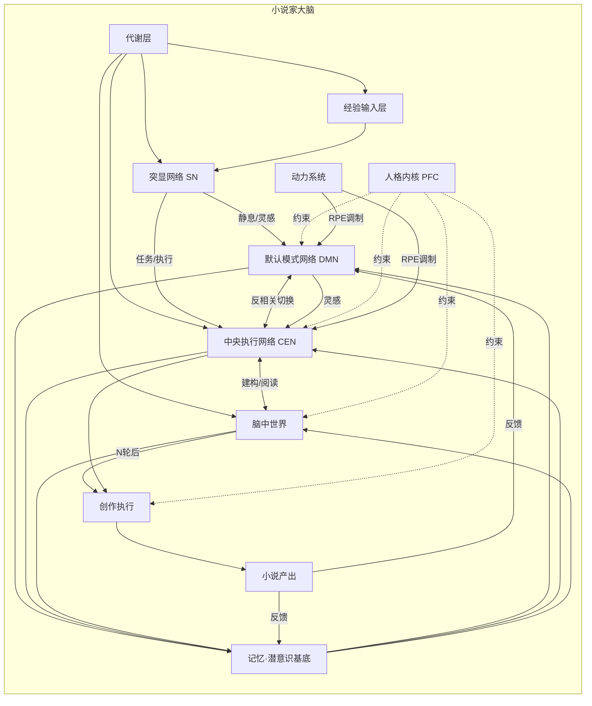

### 2.1 核心设计原则

- **单主体原则**：小说家是唯一主体，脑中世界在主体内部
- **网络动力学原则**：DMN、CEN、SN 不是层级，而是动态切换的网络
- **生活成本原则**：所有行为受代谢层约束
- **人格约束原则**：人格内核向上渗透，约束所有心理活动
- **有机反馈原则**：小说产出反过来塑造作者的记忆与梦境

---

## 3. 抽象层设计

抽象层是架构可扩展的基础。所有具体实现必须通过这些抽象接口接入系统。

### 3.1 核心抽象

#### Agent —— 主体抽象

```typescript
interface Agent {
  id: string;
  identity: IdentityCore;
  networks: {
    dmn: DefaultModeNetwork;
    cen: CentralExecutiveNetwork;
    sn: SalienceNetwork;
  };
  sandbox: MentalSandbox;
  memory: MemorySystem;
  dynamics: DynamicsSystem;
  metabolism: Metabolism;
}
```

`Agent` 是小说家主体的唯一标识。所有模块都挂靠在 Agent 下。

#### Fragment —— 经验碎片抽象

```typescript
interface Fragment {
  id: string;
  source: "personal" | "social" | "memory" | "dream" | "novel";
  modality: "event" | "emotion" | "dialogue" | "scene" | "concept";
  content: unknown;
  valence: number;          // 情绪效价，-1 到 1
  arousal: number;          // 唤醒度，0 到 1
  salience: number;         // 显著性，0 到 1
  timestamp: number;
  tags: string[];
  embedding: number[];
}
```

碎片是系统的最小信息单元。它不预设结构，允许情绪化、片段化、非逻辑化的存在。

#### Trace —— 记忆痕迹抽象

```typescript
interface Trace {
  id: string;
  fragmentIds: string[];
  consolidatedAt: number;
  importance: number;
  recency: number;
  relevance: number;
  emotionalWeight: number;
  narrativeRole: "setting" | "character" | "event" | "theme" | "mood";
}
```

痕迹是碎片经过记忆系统加工后的产物。一个痕迹可由多个碎片聚合而成，也可参与多个痕迹的重组。

#### WorldModel —— 世界模型抽象

```typescript
interface WorldModel {
  id: string;
  name: string;
  ontology: Ontology;
  rules: Rule[];
  history: Event[];
  currentState: WorldState;
  predictionErrors: PredictionError[];
}
```

世界模型是脑中世界对"世界如何运转"的内化表征。它通过预测编码不断更新。

#### CharacterProjection —— 角色投射抽象

```typescript
interface CharacterProjection {
  id: string;
  name: string;
  archetype: string;
  sourceTraces: string[];   // 来自哪些记忆痕迹
  traits: TraitVector;
  desires: Desire[];
  relationships: Relationship[];
  internalConflict: string;
}
```

角色不是凭空创造的，而是小说家人格对经验痕迹的投射。每个角色都可以追溯到某些记忆痕迹。

#### NarrativeLine —— 叙事线抽象

```typescript
interface NarrativeLine {
  id: string;
  scenes: Scene[];
  conflicts: Conflict[];
  foreshadowing: string[];
  climax: Scene | null;
  status: "draft" | "committed" | "abandoned";
}
```

叙事线是脑中世界推演的结果，是创作执行的直接输入。

### 3.2 模块抽象

每个模块都必须实现 `Module` 接口：

```typescript
interface Module {
  name: string;
  state: ModuleState;
  
  // 初始化
  init(context: AgentContext): Promise<void>;
  
  // 接收总线消息
  onBusMessage(message: BusMessage): Promise<void>;
  
  // 产生输出到总线
  emit(event: string, payload: unknown): void;
  
  // 查询当前状态
  getState(): ModuleState;
  
  // 单步推进（由全局时钟调用）
  tick(delta: TickDelta): Promise<void>;
}
```

所有模块统一通过总线通信，统一由全局时钟驱动。这保证了后期可以方便地添加新模块。

### 3.3 数据抽象

#### BusMessage —— 总线消息

```typescript
interface BusMessage {
  id: string;
  timestamp: number;
  source: string;
  target?: string;          // 空表示广播
  channel: "event" | "data" | "control";
  topic: string;
  payload: unknown;
  priority: number;
  ttl: number;              // 生存周期，用于自动衰减
}
```

#### TickDelta —— 时钟推进单元

```typescript
interface TickDelta {
  absoluteTime: number;
  deltaMs: number;
  phase: "dawn" | "morning" | "noon" | "afternoon" | "evening" | "night" | "deep_night";
  globalContext: GlobalContext;
}
```

---

## 4. 总线设计

总线是模块间唯一的正式通信通道。系统采用三条总线：事件总线、数据总线、控制总线。

### 4.1 事件总线 (Event Bus)

用于传递离散事件：遭遇、对话、情绪波动、骰子判定、梦境触发等。

```typescript
interface EventBusMessage extends BusMessage {
  channel: "event";
  topic: string;            // 例如 "social.encounter", "dmn.dream.trigger"
  payload: {
    actor: string;
    action: string;
    object?: string;
    context: Record<string, unknown>;
  };
}
```

### 4.2 数据总线 (Data Bus)

用于传递结构化数据：碎片、痕迹、世界模型更新、叙事线、小说段落等。

```typescript
interface DataBusMessage extends BusMessage {
  channel: "data";
  topic: string;            // 例如 "fragment.new", "trace.consolidated", "sandbox.world.updated"
  payload: {
    entityType: string;
    entityId: string;
    operation: "create" | "update" | "delete" | "query";
    data: unknown;
  };
}
```

### 4.3 控制总线 (Control Bus)

用于传递控制信号：网络切换、模块启停、全局时钟节拍、代谢预算分配等。

```typescript
interface ControlBusMessage extends BusMessage {
  channel: "control";
  topic: string;            // 例如 "network.switch", "metabolism.allocate", "module.pause"
  payload: {
    command: string;
    parameters: Record<string, unknown>;
  };
}
```

### 4.4 总线路由规则

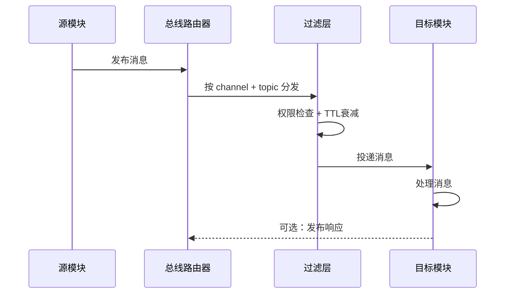

**关键规则**：

- 模块之间不直接调用，必须通过总线
- 每条消息有 TTL，过期自动丢弃，防止消息风暴
- 高优先级消息可中断当前网络状态
- 控制总线消息可覆盖事件总线和数据总线

### 4.5 扩展新模块的方式

新增模块只需：

1. 实现 `Module` 接口
2. 注册到总线路由器
3. 声明订阅的 topic 集合
4. 声明消耗的代谢预算

不需要修改其他模块的代码。

---

## 5. 数据通路设计

数据通路描述信息在系统中的流转路径。系统包含五条核心通路。

### 5.1 经验输入通路

路径：经验输入层 → SN → DMN/CEN

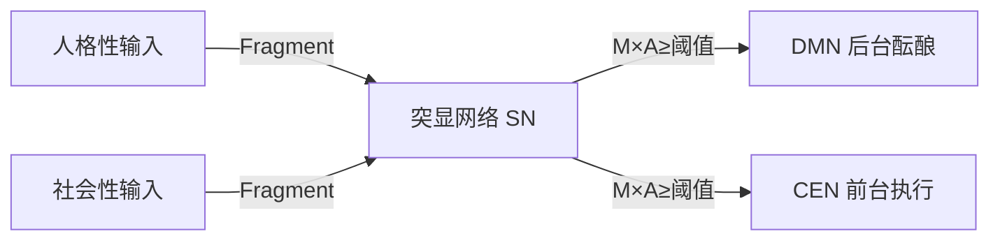

所有经验都以 `Fragment` 形式进入系统。SN 按 B=MAT 模型评估是否值得进入后续处理。低显著性或高成本的碎片被衰减或丢弃。

### 5.2 记忆沉淀通路

路径：DMN/CEN/Sandbox → 记忆基底

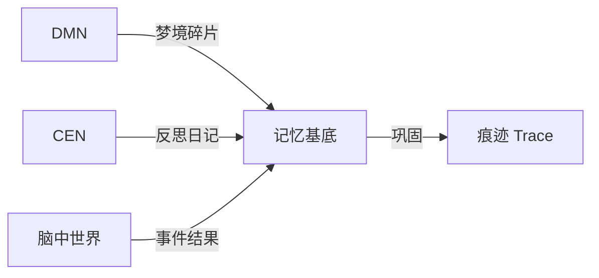

来自三个来源的碎片在记忆基底中聚合、评估、巩固为痕迹。巩固算法见第 7 节。

### 5.3 灵感映射通路

路径：记忆基底 → 脑中世界

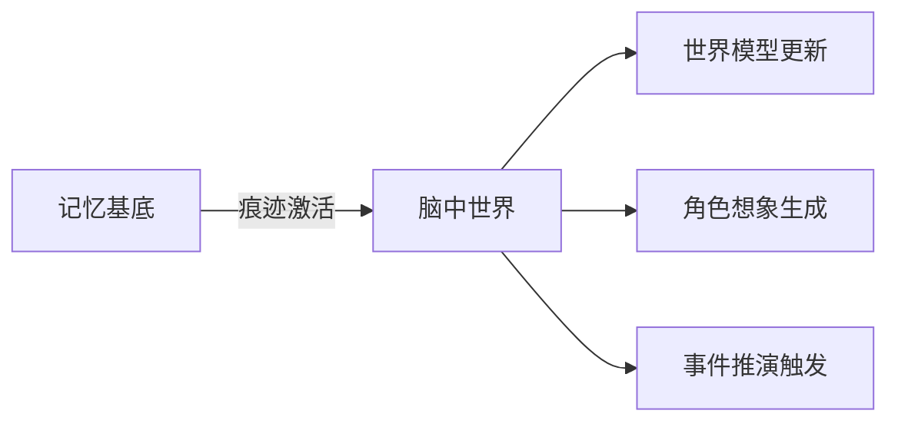

痕迹不是被动存储的，它们会在特定条件下被激活并映射到脑中世界，成为创作素材。

### 5.4 创作输出通路

路径：脑中世界 → 叙事合成 → 创作执行 → 小说产出


脑中世界的推演结果积累到一定深度后，由叙事合成编织成叙事线，再由创作执行转化为文字。

### 5.5 反馈回路

路径：小说产出 → 记忆基底 / DMN

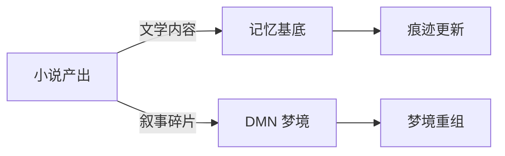

小说一旦产出，就反过来成为作者经验的一部分。这是"作者被自己的作品重塑"的机制。

---

## 6. 功能模块接口契约

每个模块的接口契约包括：职责、输入、输出、状态、订阅 topic、发布 topic、代谢消耗。

### 6.1 代谢层 (Metabolism)

**职责**：管理 Agent 的生存资源，约束所有可行动作。

**状态**：

```typescript
interface MetabolismState {
  computeBudget: number;    // 算力预算
  energy: number;           // 能量账户
  timeCurrency: number;     // 时间货币
  socialCapital: number;    // 社会资本
  recoveryRate: number;     // 恢复速率
}
```

**输入**：

- `control.metabolism.allocate`：预算分配请求
- `event.module.consume`：模块消耗报告

**输出**：

- `control.metabolism.budget.exhausted`：预算耗尽警告
- `data.metabolism.state`：当前状态广播

**订阅**：所有模块的消耗报告

**发布**：预算状态、分配决策

**代谢消耗**：自身不直接消耗，但调控所有其他消耗

### 6.2 人格性输入 (Personal Input)

**职责**：收集来自 Agent 内部人格系统的经验碎片。

**子模块**：

- 对话心流：处理对外表达与对话节奏
- 个体人格：维护生活计划、日常状态、情绪基线

**状态**：

```typescript
interface PersonalInputState {
  currentMood: MoodVector;
  lifePlan: LifePlan;
  dailyState: DailyState;
  expressionStyle: ExpressionStyle;
}
```

**输入**：

- `control.input.activate`：激活输入采集
- `data.memory.trace.query`：查询人格相关痕迹

**输出**：

- `fragment.personal.new`：新的个人经验碎片
- `event.personal.mood.changed`：情绪变化事件
- `data.personal.state`：人格状态广播

**订阅**：

- `control.network.dmn.active`
- `control.network.cen.active`
- `data.metabolism.state`

**发布**：人格碎片、情绪事件、状态广播

**代谢消耗**：低（对话心流中高）

### 6.3 社会性输入 (Social Input)

**职责**：收集来自社会化模拟的经验碎片。

**子模块**：

- 社会化模拟：维护 Agent tick、遭遇、对话
- 社会剧场：维护角色、空间、规训、凝视

**状态**：

```typescript
interface SocialInputState {
  location: string;
  presentAgents: string[];
  relationshipGraph: RelationshipGraph;
  socialNorms: Norm[];
  gazePressure: number;
}
```

**输入**：

- `control.input.activate`
- `event.social.encounter`：遭遇事件
- `event.social.dialogue`：对话事件

**输出**：

- `fragment.social.new`：新的社会经验碎片
- `event.social.norm.violated`：规范违反事件
- `data.social.state`：社会关系状态

**订阅**：

- 外部社会化模块的 tick 事件
- `control.network.cen.active`（社交多在前台）

**发布**：社会碎片、关系变化、规范事件

**代谢消耗**：中等（社交是高能耗活动）

### 6.4 突显网络 SN

**职责**：根据 B=MAT 模型决定是否响应触发器，并路由到 DMN 或 CEN。

**状态**：

```typescript
interface SNState {
  activeTriggers: Trigger[];
  currentNetwork: "DMN" | "CEN";
  arousalLevel: number;
  switchingHistory: NetworkSwitch[];
}
```

**输入**：

- `fragment.*.new`：所有新碎片
- `event.*`：所有事件
- `data.metabolism.state`：代谢状态
- `data.personal.state`：人格状态
- `data.social.state`：社会状态

**输出**：

- `control.network.switch`：网络切换命令
- `data.sn.evaluation`：评估结果广播
- `event.sn.trigger.rejected`：触发器被拒绝事件

**订阅**：所有可能构成触发器的消息

**发布**：网络切换命令、评估结果

**代谢消耗**：低（但频繁运行）

### 6.5 默认模式网络 DMN

**职责**：后台酝酿、心智游走、梦境、自传反思。

**状态**：

```typescript
interface DMNState {
  activationLevel: number;
  currentTheme: string;
  wanderingTraces: string[];
  dreamQueue: Fragment[];
  reflectionBuffer: Fragment[];
}
```

**输入**：

- `control.network.dmn.active`：切换到 DMN
- `fragment.*.new`：新碎片
- `data.memory.trace.query.result`：痕迹查询结果
- `event.novel.paragraph.published`：新小说段落

**输出**：

- `fragment.dream.new`：梦境碎片
- `fragment.reflection.new`：反思碎片
- `fragment.insight.new`：灵感碎片
- `data.dmn.state`：DMN 状态

**订阅**：

- SN 切换命令
- 记忆基底的痕迹查询结果
- 小说产出反馈

**发布**：梦境、反思、灵感碎片

**代谢消耗**：低（静息状态节能）

### 6.6 中央执行网络 CEN

**职责**：前台表演、目标推理、主动规划、创作执行。

**状态**：

```typescript
interface CENState {
  currentGoal: Goal;
  goalStack: Goal[];
  workingMemory: Fragment[];
  executiveLoad: number;
  currentTask: string;
}
```

**输入**：

- `control.network.cen.active`：切换到 CEN
- `fragment.insight.new`：DMN 产生的灵感碎片
- `data.sandbox.narrative.ready`：脑中世界叙事线就绪
- `data.memory.trace.query.result`：痕迹查询结果

**输出**：

- `control.sandbox.build`：建构脑中世界
- `control.sandbox.simulate`：运行推演
- `data.cen.plan`：计划广播
- `data.novel.paragraph`：小说段落

**订阅**：

- SN 切换命令
- DMN 灵感碎片
- 脑中世界输出
- 记忆基底结果

**发布**：计划、脑中世界控制命令、小说段落

**代谢消耗**：高（CEN 是能耗大户）

### 6.7 脑中世界 (Mental Sandbox)

**职责**：在小说家脑中建构和推演想象世界。

**状态**：

```typescript
interface MentalSandboxState {
  worldModel: WorldModel;
  characters: CharacterProjection[];
  currentScene: Scene;
  narrativeLines: NarrativeLine[];
  predictionErrors: PredictionError[];
  simulationRound: number;
}
```

**输入**：

- `control.sandbox.build`：建构/修改世界
- `control.sandbox.simulate`：运行一轮推演
- `data.memory.trace.query.result`：痕迹映射输入
- `data.personal.state`：人格输入
- `data.social.state`：社会经验输入

**输出**：

- `data.sandbox.world.updated`：世界模型更新
- `data.sandbox.character.updated`：角色更新
- `data.sandbox.event.resolved`：事件判定结果
- `data.sandbox.narrative.ready`：叙事线就绪

**订阅**：

- CEN 的控制命令
- 记忆基底的痕迹激活
- 人格状态、社会状态

**发布**：世界更新、角色更新、事件结果、叙事线

**代谢消耗**：高（COC 推理和叙事管理消耗大）

### 6.8 动力系统 (Dynamics)

**职责**：通过奖惩、习惯、学习三条回路驱动行为塑造。

**状态**：

```typescript
interface DynamicsState {
  rewardPredictionError: number;
  punishmentPredictionError: number;
  habitStrengths: Map<string, number>;
  valueFunction: ValueFunction;
}
```

**输入**：

- `event.*.outcome`：所有带结果的事件
- `data.novel.paragraph`：小说产出结果
- `data.sandbox.event.resolved`：推演结果

**输出**：

- `data.dynamics.rpe`：强化预测误差
- `data.dynamics.habit.updated`：习惯强度更新
- `data.dynamics.value.updated`：价值函数更新

**订阅**：

- 所有可产生结果的事件
- 脑中世界判定结果
- 小说产出反馈

**发布**：RPE、习惯更新、价值更新

**代谢消耗**：低

### 6.9 记忆基底 (Memory System)

**职责**：分布式存储、巩固、检索、回放。

**状态**：

```typescript
interface MemoryState {
  fragments: Map<string, Fragment>;
  traces: Map<string, Trace>;
  workingMemory: Fragment[];
  consolidationQueue: Fragment[];
}
```

**输入**：

- `fragment.*.new`：所有新碎片
- `control.memory.consolidate`：巩固命令
- `control.memory.query`：查询命令

**输出**：

- `data.memory.trace.created`：新痕迹
- `data.memory.trace.query.result`：查询结果
- `data.memory.replay`：记忆回放

**订阅**：

- 所有碎片来源
- 巩固命令
- 查询命令

**发布**：痕迹创建、查询结果、回放

**代谢消耗**：中等（巩固和检索耗能）

### 6.10 人格内核 (Identity Core)

**职责**：提供身份、价值观、性格、自我叙事的稳定约束。

**状态**：

```typescript
interface IdentityState {
  identity: string;
  values: ValueVector;
  traits: TraitVector;
  selfNarrative: string;
  integrityScore: number;
}
```

**输入**：

- `fragment.reflection.new`：反思碎片
- `data.dynamics.value.updated`：价值函数更新
- `event.novel.paragraph.published`：小说反馈

**输出**：

- `data.identity.constraint`：人格约束广播
- `data.identity.updated`：人格演化结果

**订阅**：

- 反思碎片
- 学习回路的更新
- 小说反馈

**发布**：约束广播、人格更新

**代谢消耗**：极低（被动约束）

### 6.11 创作执行 (Creation Executive)

**职责**：将脑中世界的叙事流转化为小说文字。

**状态**：

```typescript
interface CreationState {
  currentNarrativeLine: string;
  draftBuffer: string;
  styleProfile: StyleProfile;
  focusStack: Fragment[];
}
```

**输入**：

- `data.sandbox.narrative.ready`：叙事线
- `data.identity.constraint`：人格约束
- `data.memory.trace.query.result`：相关记忆

**输出**：

- `data.novel.paragraph`：小说段落
- `event.novel.paragraph.published`：发布事件

**订阅**：

- 脑中世界叙事线
- 人格约束
- 相关记忆查询结果

**发布**：小说段落

**代谢消耗**：高

### 6.12 小说产出 (Novel Output)

**职责**：管理小说的最终输出与版本。

**状态**：

```typescript
interface NovelState {
  title: string;
  paragraphs: Paragraph[];
  worldSettings: WorldSetting;
  version: number;
}
```

**输入**：

- `data.novel.paragraph`：小说段落

**输出**：

- `event.novel.paragraph.published`：段落发布事件
- `data.novel.state`：小说状态

**订阅**：小说段落

**发布**：发布事件、状态广播

**代谢消耗**：低

---

## 7. 脑中世界与 CEN/DMN 的协作时序

脑中世界不是独立运行的模块，它与 DMN、CEN 形成动态协作。三者之间的切换由 SN 控制，协作遵循"酝酿—建构—推演—输出—反馈"的循环。

### 7.1 网络切换状态机

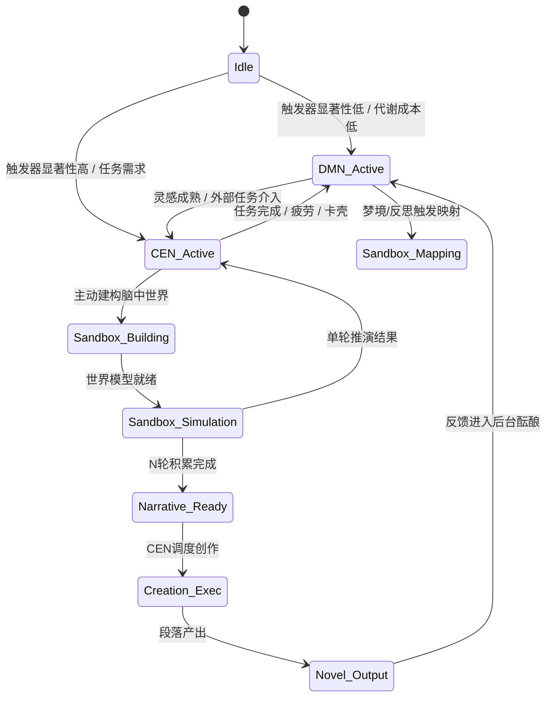

### 7.2 协作时序图

以下是一个典型的"从经验到小说段落"的完整时序：

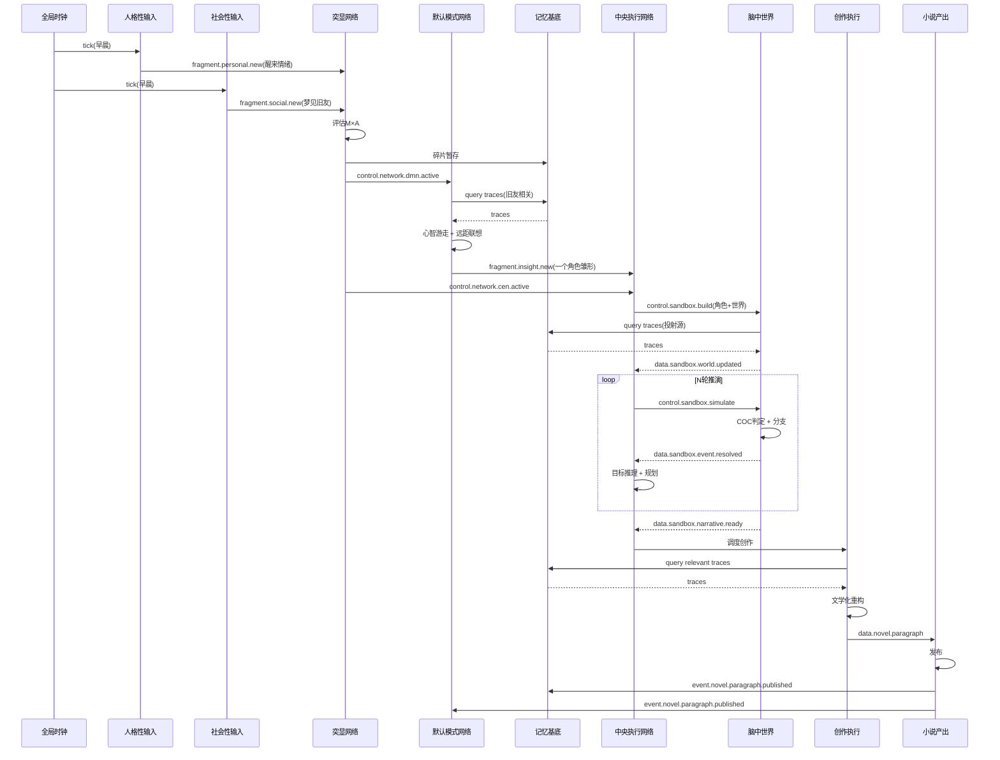

### 7.3 网络反相关与能量分配

DMN 与 CEN 在同一时刻通常只有一个高激活。能量分配遵循以下规则：

| 阶段 | 主导网络 | 脑中世界状态 | 代谢消耗 |
|---|---|---|---|
| 休息/睡眠 | DMN | 被动接收映射 | 低 |
| 社交/生活 | CEN（前台） | 不活跃 | 中 |
| 发呆/散步 | DMN | 灵感映射 | 低 |
| 专注创作 | CEN（后台建构） | 主动推演 | 高 |
| 睡眠做梦 | DMN | 碎片重组 | 低 |

### 7.4 脑中世界的 N 轮推理契约

脑中世界不会每轮推演都输出给创作执行。必须满足 N 轮契约：

```typescript
interface NarrativeReadyCondition {
  minRounds: number;            // 最少推演轮数，默认 3
  maxRounds: number;            // 最多推演轮数，默认 7
  conflictDepth: number;        // 冲突发展深度阈值
  characterDevelopment: number; // 角色变化阈值
  emotionalShift: number;       // 情绪转折阈值
  coherenceScore: number;       // 叙事连贯性阈值
}
```

当满足 minRounds 且至少一个深度指标达标，或达到 maxRounds 时，脑中世界发布 `data.sandbox.narrative.ready`。

### 7.5 异常切换处理

- **卡壳**：CEN 长时间无法推进叙事 → SN 强制切换回 DMN，进入心智游走
- **灵感爆发**：DMN 产生高显著性灵感碎片 → SN 中断当前静息，切换至 CEN
- **代谢耗尽**：能量低于阈值 → SN 优先保障 DMN 和低能耗模块，抑制 CEN 和脑中世界
- **高情绪事件**：杏仁核标记高唤醒事件 → SN 优先处理，可能直接触发 CEN 的应激反应

---

## 8. 从经验碎片到脑中世界的映射机制

这是系统的核心创造性机制。经验碎片不会自动变成小说素材，它们需要经过沉淀、激活、投射、重组四个阶段。

### 8.1 碎片的来源与类型

| 来源 | 类型 | 例子 |
|---|---|---|
| 人格性输入 | 情绪碎片 | "醒来时感到莫名的孤独" |
| 人格性输入 | 生活碎片 | "早餐煮糊了咖啡" |
| 社会性输入 | 遭遇碎片 | "在广场上遇到一个陌生人" |
| 社会性输入 | 对话碎片 | "他说：'你也在等人吗？'" |
| DMN | 梦境碎片 | "梦见自己在一个没有门的房间里" |
| DMN | 反思碎片 | "我为什么会害怕亲密关系" |
| 小说产出 | 叙事碎片 | "主角在雨夜离开城市" |

### 8.2 碎片的沉淀算法

新碎片进入记忆基底后，先进入**工作记忆缓冲区**。系统在每个 tick 中执行一次巩固评估：

```typescript
function consolidate(fragments: Fragment[]): Trace[] {
  // 1. 聚类：按 embedding 相似度聚类
  const clusters = clusterByEmbedding(fragments, threshold: 0.75);
  
  // 2. 评分：对每个聚类计算综合得分
  for (const cluster of clusters) {
    const importance = max(cluster.map(f => f.salience * abs(f.valence)));
    const recency = decay(cluster.map(f => now - f.timestamp), halfLife: 86400000);
    const emotionalWeight = mean(cluster.map(f => f.arousal * abs(f.valence)));
    
    // 3. 如果得分超过阈值，生成或更新痕迹
    if (importance * 0.4 + recency * 0.3 + emotionalWeight * 0.3 > threshold) {
      yield createOrUpdateTrace(cluster);
    }
  }
}
```

### 8.3 痕迹的叙事角色标记

每个痕迹在被创建时，会被标记一个叙事角色：

```typescript
type NarrativeRole = "setting" | "character" | "event" | "theme" | "mood";

function assignNarrativeRole(trace: Trace): NarrativeRole {
  if (trace.emotionalWeight > 0.7 && trace.fragmentIds.length > 3) return "mood";
  if (containsNamedEntity(trace)) return "character";
  if (containsLocation(trace)) return "setting";
  if (containsCausalChain(trace)) return "event";
  return "theme";
}
```

### 8.4 痕迹激活条件

痕迹不是随时都参与映射。激活需要满足以下条件之一：

1. **时间共鸣**：当前时间与痕迹时间有节律关系（如"一年前的同一天"）
2. **情绪共鸣**：当前情绪状态与痕迹情绪效价相近
3. **主题共鸣**：当前 DMN 心智游走主题与痕迹标签重叠
4. **随机回放**：基底神经节在静息期随机抽取痕迹进行回放
5. **查询触发**：CEN 或脑中世界主动查询相关痕迹

### 8.5 世界模型的更新

激活的痕迹会触发脑中世界对世界模型的预测编码更新：

```typescript
function updateWorldModel(world: WorldModel, traces: Trace[]): PredictionError[] {
  const errors: PredictionError[] = [];
  
  for (const trace of traces) {
    const prediction = world.predict(trace);
    const error = compare(trace, prediction);
    
    if (error.magnitude > threshold) {
      // 意外经验：更新世界模型
      world.adjust(error);
      errors.push(error);
    }
  }
  
  return errors;
}
```

### 8.6 角色投射算法

角色想象的核心是"小说家人格对痕迹的投射"。每个角色由以下方式生成：

```typescript
function projectCharacter(traces: Trace[], identity: IdentityState): CharacterProjection {
  const archetype = selectArchetype(traces, identity);
  const traits = blend(identity.traits, extractTraits(traces), ratio: 0.6);
  const desires = extractDesires(traces);
  const internalConflict = generateConflict(traces, identity.values);
  
  return {
    sourceTraces: traces.map(t => t.id),
    archetype,
    traits,
    desires,
    internalConflict,
    relationships: []
  };
}
```

角色与小说家人格保持一种"像但又不是"的关系：60% 来自痕迹，40% 来自小说家人格本身。这样既保证角色的内在一致性，又保留创造性距离。

### 8.7 事件推演的映射

事件不是凭空设计的，而是由痕迹中的冲突和因果关系触发：

```typescript
function deriveEvents(world: WorldModel, characters: CharacterProjection[]): Event[] {
  // 1. 从角色欲望中提取冲突对
  const conflicts = findDesireConflicts(characters);
  
  // 2. 从世界规则中提取约束
  const constraints = world.rules;
  
  // 3. 生成可能的事件集合
  const candidates = generateEventCandidates(conflicts, constraints);
  
  // 4. COC 判定筛选
  return candidates.map(c => resolveWithDice(c, world.randomness));
}
```

### 8.8 映射的双向性

映射不是单向的。脑中世界的推演结果也会反过来影响记忆：

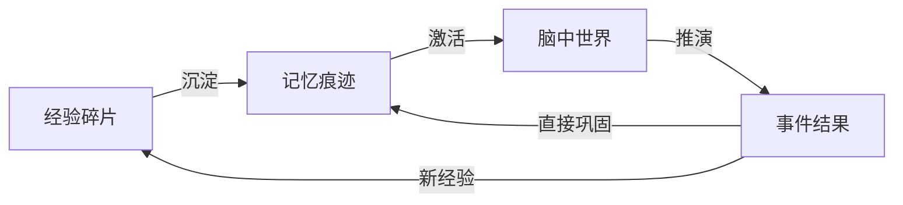

这意味着：小说家在脑中想象的事件，会被记忆系统当作"类真实经验"处理，进一步强化或修正原有痕迹。

---

## 9. 完整的一天周期

下面展示一个虚构的 24 小时周期中，系统如何运行。时间以 tick 推进，每个 tick 代表一个逻辑时间片。

### 9.0 从固定日程到动态调度

一天不是系统硬编码的固定时间表，而是由 `DailyScheduler` 模块根据小说家当前状态动态生成的节律。第 9.1 节给出的甘特图只是**默认节律模板**，用于系统冷启动和形成可观测的行为模式；实际运行中，每个阶段的起止、长度、强度都可以被重新安排。

#### 9.0.1 DailyScheduler 模块

```typescript
interface DailyScheduler {
  // 每天开始时生成当日计划
  planDay(context: SchedulingContext): DailyPlan;

  // 每个 tick 根据最新状态调整计划
  adjustPlan(context: SchedulingContext, current: DailyPlan): DailyPlan;

  // 当前阶段结束时，决定下一阶段
  nextPhase(context: SchedulingContext, completed: Phase): Phase | null;
}

interface SchedulingContext {
  metabolism: MetabolismState;      // 能量、睡眠债、饥饿、情绪负荷
  motivation: MotivationState;      // 创作动机、社交动机、逃避动机
  pendingTraces: Trace[];           // 待处理记忆痕迹
  inspirationPressure: number;      // 灵感压力：高则倾向创作/推演
  socialCost: SocialCost;           // 当前社交成本与恢复需求
  habitStrength: Map<string, number>; // 各时段习惯强度
  externalConstraints: TimeSlot[];  // 外部不可变约束，如约定、截止时间
  yesterdayReflection: ReflectionSummary; // 昨日反思对今日的微调建议
}

interface DailyPlan {
  date: string;
  phases: Phase[];
  fallback: Phase[];                // 能量不足时的降级方案
  interrupts: InterruptRule[];      // 允许打断当前阶段的条件
}

interface Phase {
  id: string;
  type: PhaseType;
  plannedStart: Time;
  plannedEnd: Time;
  minDuration: Duration;
  maxDuration: Duration;
  energyBudget: number;
  preferredNetwork: "DMN" | "CEN" | "SN";
}

type PhaseType =
  | "sleep"           // 深度睡眠与梦境
  | "habit"           // 晨间/夜间习惯
  | "creation"        // 主动创作
  | "social"          // 社会交往
  | "simulation"      // 脑中世界推演
  | "reflection"      // 反思与日记
  | "incubation"      // 空闲酝酿
  | "recovery";       // 独处恢复
```

#### 9.0.2 调度决策因素

`DailyScheduler` 综合以下因素生成一日安排：

| 因素 | 来源 | 影响 |
|---|---|---|
| 能量曲线 | 代谢层 | 高能量时优先创作与推演，低能量时优先恢复与习惯 |
| 灵感压力 | DMN + 痕迹池 | 压力高则提前或延长创作/推演阶段 |
| 社交成本 | 昨日社交 + 当前能量 | 成本高则减少社交，增加独处 |
| 待处理痕迹 | 记忆系统 | 痕迹多且情绪重时优先反思与推演 |
| 习惯强度 | 习惯回路 | 弱习惯时段易被其他行为替代，强习惯时段自动填充 |
| 外部约束 | 用户配置/日历 | 不可变时间段优先锁定，其余时间弹性填充 |
| 昨日反思 | 傍晚反思输出 | 微调今日策略，例如"昨天社交过度，今天减少" |

#### 9.0.3 基于 B=MAT 的候选行为评分

每个 tick 中，SN 使用 B=MAT 模型对候选行为评分：

```typescript
function scoreBehavior(
  behavior: PhaseType,
  context: SchedulingContext
): number {
  const motivation = getMotivation(behavior, context);
  const ability = getAbility(behavior, context);
  const trigger = getTrigger(behavior, context);

  // B = M × A × T，归一化到 0-1
  return motivation * ability * trigger;
}

function getAbility(behavior: PhaseType, context: SchedulingContext): number {
  // 能力由能量和当前网络状态决定
  const energyFactor = context.metabolism.energy / 100;
  const networkCompatibility = getNetworkCompatibility(behavior, context);
  return energyFactor * networkCompatibility;
}

function getTrigger(behavior: PhaseType, context: SchedulingContext): number {
  // 触发器由环境线索和习惯强度决定
  const habitFactor = context.habitStrength.get(behavior) ?? 0.5;
  const environmentalCue = getEnvironmentalCue(behavior, context);
  return Math.max(habitFactor, environmentalCue);
}
```

评分最高的候选行为被推荐为下一阶段。如果评分低于阈值，则进入默认恢复阶段。

#### 9.0.4 阶段弹性规则

每个阶段都有最小和最大持续时间，并可以被以下规则调整：

- **延长**：当创作进入心流状态（高 RPE 正向反馈、能量尚足），`DailyScheduler` 可以延长创作阶段，压缩后续非关键阶段。
- **缩短**：当能量骤降或灵感枯竭时，当前阶段提前结束，转入恢复或习惯阶段。
- **跳过**：低能量时，非必要社交可被跳过；低灵感时，创作阶段可被替换为"阅读/观察"等输入型活动。
- **插入**：突发高灵感或情绪冲击时，可插入一个临时推演或反思阶段。
- **回退**：当所有高能耗行为的能力评分都不足时，执行 `fallback` 计划，进入低能耗运行模式。

#### 9.0.5 三种典型调度示例

下面是同一默认模板下，因状态不同而产生的三种实际日程：

**示例 A：高能量高灵感日**

```mermaid
gantt
    title 高能量高灵感日
    dateFormat HH:mm
    axisFormat %H:%M
    section 生理节律
    睡眠做梦           :deep_night, 00:00, 5h
    晨间习惯           :morning, 05:00, 1h
    section 高输出
    上午创作（延长）   :creation, 06:00, 5h
    午间简餐+短暂观察 :social, 11:00, 1h
    下午推演（延长）   :simulation, 12:00, 4h
    傍晚反思           :reflection, 16:00, 1h
    夜间酝酿           :incubation, 17:00, 7h
```

**示例 B：社交透支恢复日**

```mermaid
gantt
    title 社交透支恢复日
    dateFormat HH:mm
    axisFormat %H:%M
    section 低能耗
    睡眠做梦（延长）   :deep_night, 00:00, 8h
    晨间习惯           :morning, 08:00, 2h
    独处恢复           :recovery, 10:00, 3h
    轻度创作           :creation, 13:00, 2h
    散步观察           :incubation, 15:00, 2h
    傍晚反思           :reflection, 17:00, 2h
    夜间酝酿           :incubation, 19:00, 5h
```

**示例 C：外部约束日**

```mermaid
gantt
    title 外部约束日（下午有约定）
    dateFormat HH:mm
    axisFormat %H:%M
    section 生理节律
    睡眠做梦           :deep_night, 00:00, 6h
    晨间习惯           :morning, 06:00, 2h
    section 弹性安排
    上午创作           :creation, 08:00, 3h
    午间社交           :social, 12:00, 1h
    外部约定（锁定）   :external, 13:00, 3h
    下午推演           :simulation, 16:00, 2h
    傍晚反思           :reflection, 18:00, 1h
    夜间酝酿           :incubation, 19:00, 5h
```

### 9.1 默认节律模板

当系统缺乏足够状态信息（如首次启动、长时间休眠后恢复）时，`DailyScheduler` 回退到以下默认模板。该模板相当于一个健康小说家的平均节律，用于生成可预测的行为基线。

```mermaid
gantt
    title 默认节律模板
    dateFormat HH:mm
    axisFormat %H:%M
    section 生理节律
    睡眠做梦           :deep_night, 00:00, 6h
    晨间习惯           :morning, 06:00, 2h
    上午创作           :creation, 08:00, 4h
    午间社交           :social, 12:00, 2h
    下午推演           :simulation, 14:00, 3h
    傍晚反思           :reflection, 17:00, 2h
    夜间酝酿           :incubation, 19:00, 5h
```

### 9.2 各阶段系统状态

#### 00:00 - 06:00 深度睡眠 · DMN 主导

- **活跃网络**：DMN
- **脑中世界**：被动映射，接收白日未处理的碎片
- **记忆基底**：海马体回放白天痕迹，巩固为长期记忆
- **动力系统**：低 RPE，习惯回路不活跃
- **关键事件**：梦境碎片生成，进入灵感碎片池

#### 06:00 - 08:00 晨间习惯 · CEN 低负载

- **活跃网络**：CEN（习惯驱动）
- **脑中世界**：不活跃
- **人格性输入**：生成"起床、洗漱、早餐"等生活碎片
- **动力系统**：习惯回路主导（Cue→Routine→Reward）
- **关键事件**：低能耗运行，为后续高能耗活动储备能量

#### 08:00 - 12:00 上午创作 · CEN 高负载

- **活跃网络**：CEN
- **脑中世界**：主动建构与推演
- **代谢消耗**：高
- **关键流程**：
  1. CEN 查询灵感碎片池
  2. 向脑中世界发送建构命令
  3. 运行多轮 COC 推演
  4. 叙事线就绪后，调用创作执行
  5. 产出小说段落
  6. 小说段落反馈到记忆和 DMN

#### 12:00 - 14:00 午间社交 · CEN 前台

- **活跃网络**：CEN（前台表演）
- **脑中世界**：暂停
- **社会性输入**：高活跃，产生社会经验碎片
- **代谢消耗**：中等
- **关键事件**：遭遇、对话、规范互动，为后续创作提供社会素材

#### 14:00 - 17:00 下午推演 · CEN 与脑中世界协作

- **活跃网络**：CEN
- **脑中世界**：利用午间社会经验进行推演
- **关键流程**：
  1. 午间碎片沉淀为痕迹
  2. CEN 主动查询新痕迹
  3. 脑中世界更新角色关系
  4. 运行事件推演
  5. 产生新的叙事线草稿

#### 17:00 - 19:00 傍晚反思 · DMN 主导

- **活跃网络**：DMN
- **脑中世界**：不活跃
- **关键活动**：
  1. 自传反思：生成日记碎片
  2. 对当天经验进行叙事重构
  3. 人格内核接收反思输入，微调自我叙事

#### 19:00 - 24:00 夜间酝酿 · DMN 主导

- **活跃网络**：DMN
- **脑中世界**：被动映射增强
- **关键活动**：
  1. 心智游走：连接不相关概念
  2. 梦境预热：为夜间梦境准备碎片队列
  3. 能量恢复，为次日创作做准备

### 9.3 一天中的关键数据流

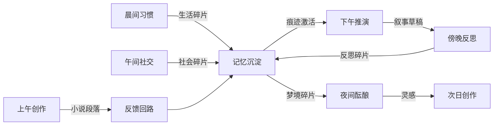

---

## 10. 扩展性设计

### 10.1 添加新理论模块

如果未来要引入新的心理学或社会学理论，只需：

1. 定义新的模块实现 `Module` 接口
2. 声明它订阅的 topic
3. 声明它对 DMN/CEN/脑中世界的影响方式
4. 在总线注册

例如，添加"依恋理论模块"：

```typescript
class AttachmentModule implements Module {
  name = "attachment";
  
  onBusMessage(msg: BusMessage) {
    if (msg.topic === "event.social.dialogue") {
      const attachmentCue = this.evaluate(msg.payload);
      this.emit("data.attachment.style.updated", attachmentCue);
    }
  }
}
```

### 10.2 添加新的输入源

新的输入源（例如传感器数据、外部知识库）只需：

1. 实现输入适配器，将外部数据转换为 `Fragment`
2. 发布到 `fragment.external.new`
3. SN 会自动处理

### 10.3 添加新的创作形式

如果要支持诗歌、剧本、散文等创作形式，只需：

1. 实现新的 `CreationExecutive` 子类
2. 订阅 `data.sandbox.narrative.ready`
3. 发布到 `data.novel.paragraph` 或新的输出 topic

### 10.4 添加新的记忆子系统

例如添加"身体记忆"或"文化记忆"：

1. 实现新的记忆模块
2. 订阅 `fragment.*.new`
3. 发布 `data.memory.body.trace.created` 等新的痕迹类型
4. 脑中世界查询时纳入新的痕迹源

### 10.5 总线扩展约定

所有新 topic 必须遵循命名规范：

```
{channel}.{domain}.{action}
```

例如：

- `event.attachment.style.changed`
- `data.body.memory.trace.created`
- `control.sandbox.mode.poetry.enabled`

---

## 11. 核心设计决策回顾

| 决策 | 选择 | 理由 |
|---|---|---|
| 大脑与沙盘关系 | 脑中世界在大脑内部 | 符合小说家主体模型，消除二元论 |
| 模块通信方式 | 三条总线 | 解耦、可扩展、可追踪 |
| 网络组织方式 | DMN/CEN/SN 动态切换 | 符合神经科学，避免刚性层级 |
| 经验最小单元 | Fragment | 允许情绪化、片段化、非结构化 |
| 记忆组织方式 | 分布式多系统 | 符合海马体/杏仁核/基底神经节分工 |
| 角色生成方式 | 人格投射 | 保证角色与作者内在关联 |
| 创作触发条件 | N 轮推理契约 | 避免单轮噪声，保证叙事深度 |
| 反馈方向 | 小说→记忆/DMN | 实现作者被作品重塑 |
| 全局约束 | 代谢层 + 人格内核 | 生活成本与身份一致性同时约束 |

---

## 12. 术语表

| 术语 | 含义 |
|---|---|
| Agent | 小说家主体，系统的唯一外部边界 |
| Fragment | 经验碎片，系统的最小信息单元 |
| Trace | 记忆痕迹，碎片巩固后的产物 |
| DMN | 默认模式网络，负责静息、灵感、自我 |
| CEN | 中央执行网络，负责目标、推理、执行 |
| SN | 突显网络，负责行为激活与网络切换 |
| 脑中世界 | 小说家脑中的想象剧场，灵感的映射空间 |
| RPE | 强化预测误差，驱动奖惩与学习 |
| B=MAT | 行为模型：行为 = 动机 × 能力 × 触发器 |
| COC | Call of Cthulhu 式跑团推理机制 |
| 预测编码 | 大脑通过预测与误差更新世界模型的理论 |
| 人格投射 | 小说家人格对经验痕迹的虚构化投射 |
| 叙事线 | 脑中世界推演结果，创作的直接输入 |
| 全球工作空间 | 意识聚光灯，多源信息汇聚的创作瞬间 |

---

## 13. LLM 调用层与提示词工程设计

本架构的绝大多数模块依赖大语言模型（LLM）实现认知功能。为了让架构从设计走向实现，需要一层统一的 LLM 调用抽象，以及一套与模块职责匹配的提示词工程规范。

### 13.1 LLM 服务抽象

所有模块不直接调用某个具体模型，而是通过统一的 `LLMService` 接口发起请求。这样可以在不改变模块代码的情况下切换模型、调整参数或加入缓存。

```typescript
interface LLMService {
  complete(request: CompletionRequest): Promise<CompletionResponse>;
  embed(text: string): Promise<number[]>;
  countTokens(text: string): number;
}

interface CompletionRequest {
  prompt: Prompt;
  model: string;
  temperature: number;
  maxTokens: number;
  responseFormat?: "text" | "json" | "function_call";
  stopSequences?: string[];
}

interface CompletionResponse {
  content: string;
  usage: TokenUsage;
  finishReason: string;
  latencyMs: number;
}
```

### 13.2 Prompt 模板结构

每个模块的 prompt 由四个固定部分组成：

```typescript
interface Prompt {
  identity: string;         // 人格内核注入
  context: string;          // 当前任务上下文
  instruction: string;      // 具体指令
  outputSpec: string;       // 输出格式要求
}
```

**单一人格约束**：由于架构围绕单一人格设计，所有 prompt 的 `identity` 部分来自同一份人格内核，不存在多个人格切换。不同模块只是在同一人格下承担不同功能。

### 13.3 各模块 Prompt 设计

#### 13.3.1 DMN 梦境生成

**职责**：在睡眠或静息期，将记忆碎片重组为梦境体验。

```text
[identity]
你是{ novelist_name }，一位{ trait_summary }的小说家。
你正在睡眠中，意识漂浮，记忆碎片自由重组。

[context]
近期关键记忆：
{ top_k_recent_traces }

当前情绪基调：{ mood_vector }

[instruction]
生成一段梦境。不要解释，不要总结，直接呈现梦境体验。
梦境应混合近期记忆、未解决的情绪和远距联想。

[outputSpec]
输出一段 200-400 字的梦境叙述。
不要出现"我梦见"这类元叙述，直接以梦境本身呈现。
```

**输出解析**：梦境文本直接作为 `Fragment` 进入灵感碎片池，同时由记忆基底提取关键词和情绪标签。

#### 13.3.2 CEN 目标推理

**职责**：根据当前目标、记忆和灵感，生成行动计划。

```text
[identity]
你是{ novelist_name }，一位{ trait_summary }的小说家。
你当前的目标层级是：{ life_goal } → { weekly_goal } → { daily_goal }。

[context]
当前时间：{ current_time }
当前能量：{ energy }
当前活跃灵感：{ insight_fragments }
待处理触发器：{ pending_triggers }

[instruction]
选择一个下一步行动。评估每个选项的动机、能力和成本。
只输出你选择的行动及理由。

[outputSpec]
以 JSON 输出：
{
  "action": "行动描述",
  "target_module": "sandbox" | "creation" | "social" | "rest",
  "motivation": 0-1,
  "ability": 0-1,
  "expected_cost": "低/中/高",
  "reason": "选择理由"
}
```

#### 13.3.3 脑中世界 COC 判定

**职责**：对角色行动进行概率判定，并生成带分支的结果。

```text
[identity]
你是{ novelist_name }，你正在脑中推演小说剧情。

[context]
世界规则：{ world_rules }
当前场景：{ current_scene }
角色状态：{ character_states }
待判定行动：{ pending_action }

[instruction]
以 COC 跑团主持人的方式判定该行动的结果。
考虑角色能力、世界规则和随机性。

[outputSpec]
以 JSON 输出：
{
  "roll_result": "大成功/成功/失败/大失败",
  "dice_value": number,
  "difficulty": number,
  "outcome": "具体结果描述",
  "consequences": ["后果1", "后果2"],
  "emotional_shift": "角色情绪变化"
}
```

#### 13.3.4 创作执行

**职责**：将脑中世界的叙事线转化为小说段落。

```text
[identity]
你是{ novelist_name }，一位{ trait_summary }的小说家。
你的写作风格：{ style_profile }

[context]
当前叙事线：{ narrative_line }
相关记忆痕迹：{ relevant_traces }
需要回收的伏笔：{ foreshadowing }
上一段结尾：{ previous_paragraph }

[instruction]
写下下一段小说。保持人物一致性，推进冲突或揭示信息。
不要解释你在写什么，直接输出小说正文。

[outputSpec]
输出一段 500-1000 字的小说正文。
```

### 13.4 人格约束注入机制

所有 prompt 的 `identity` 部分来自同一份人格内核。注入机制如下：

```typescript
function injectIdentity(prompt: Prompt, identity: IdentityState): Prompt {
  return {
    ...prompt,
    identity: `
      你是 ${identity.name}。
      核心价值观：${identity.values.join(", ")}。
      性格特质：${formatTraits(identity.traits)}。
      自我叙事：${identity.selfNarrative}。
      当前情绪基线：${identity.currentMood}。
    `.trim()
  };
}
```

**关键规则**：人格内核在任何 prompt 中都不被覆盖，只被补充。这保证单一人格的连续性。

### 13.5 上下文管理

每个模块需要管理自己的上下文窗口。采用分层窗口策略：

```typescript
interface ContextWindow {
  systemSlot: number;       // 人格内核 + 世界规则，固定占用
  workingSlot: number;      // 当前任务相关上下文
  memorySlot: number;       // 检索出的相关记忆
  outputSlot: number;       // 为输出预留的空间
}
```

**截断优先级**：

1. 保留 systemSlot（人格内核不可截断）
2. 保留最近的 workingSlot 内容
3. 按相关性排序 memorySlot，截断低相关性记忆
4. 保证 outputSlot

### 13.6 Token 预算分配

代谢层的算力预算最终体现为 LLM token 预算。各模块的默认预算比例：

| 模块 | 预算占比 | 说明 |
|---|---|---|
| 脑中世界 COC 推理 | 35% | 多轮推演消耗最大 |
| 创作执行 | 30% | 长文本生成 |
| 记忆检索 | 15% | embedding 和检索 |
| DMN 梦境/反思 | 10% | 短文本生成 |
| CEN 目标推理 | 8% | JSON 短输出 |
| SN 评估 | 2% | 轻量评估 |

当预算不足时，优先保证创作执行和脑中世界的最低轮次，压缩 DMN 和记忆检索。

### 13.7 输出解析与校验

每个模块的输出都需要经过解析器：

```typescript
interface OutputParser<T> {
  parse(raw: string): T;
  validate(parsed: T): boolean;
  fallback(raw: string): T;
}
```

例如 COC 判定的解析器：

```typescript
const cocParser: OutputParser<COCResult> = {
  parse(raw) {
    try {
      return JSON.parse(raw);
    } catch {
      // 提取 JSON 块
      const match = raw.match(/\{[\s\S]*\}/);
      return match ? JSON.parse(match[0]) : null;
    }
  },
  validate(parsed) {
    return parsed && parsed.roll_result && parsed.outcome;
  },
  fallback(raw) {
    // 失败时返回一个保守的失败结果
    return {
      roll_result: "失败",
      outcome: "判定失败，剧情按最保守方向发展",
      consequences: []
    };
  }
};
```

### 13.8 Fallback 策略

LLM 调用可能失败或输出不合规。Fallback 层级：

1. **重试**：temperature 略高，重试 1-2 次
2. **模型降级**：切换到更便宜但可靠的备用模型
3. **结构化 fallback**：使用规则生成默认输出
4. **跳过**：如果模块非关键，记录失败并跳过本轮
5. **暂停**：如果关键模块失败，暂停当前任务并告警

---

## 14. 状态持久化与恢复

Agent 必须能够长期运行、停止、重启而不丢失记忆和人格连续性。持久化设计围绕单一人格的状态树展开。

### 14.1 持久化分层

状态按重要性分为三层：

```typescript
interface PersistenceTier {
  critical: AgentState;      // 必须实时持久化：人格内核、当前目标、代谢状态
  important: AgentState;     // 每轮 tick 后持久化：记忆痕迹、脑中世界
  eventual: AgentState;      // 定期异步持久化：碎片历史、日志、统计数据
}
```

### 14.2 单一人格的状态树

```typescript
interface AgentState {
  version: number;
  lastTick: number;
  identity: IdentityState;
  metabolism: MetabolismState;
  networks: {
    dmn: DMNState;
    cen: CENState;
    sn: SNState;
  };
  sandbox: MentalSandboxState;
  memory: MemoryState;
  dynamics: DynamicsState;
  novel: NovelState;
}
```

**关键设计**：人格内核只存在一份，所有模块共享。不存在多个人格的切换或隔离。

### 14.3 快照与增量

为了减少持久化开销，采用快照 + 增量的混合策略：

```typescript
interface PersistenceLog {
  snapshot: AgentState;       // 完整快照，按固定间隔保存
  deltas: StateDelta[];       // 两次快照之间的增量
}
```

**快照策略**：

- 完整快照：每 100 个 tick 一次
- 代谢层和人格内核：每个 tick 增量保存
- 记忆基底：新痕迹生成时增量保存
- 脑中世界：每轮叙事就绪后增量保存

### 14.4 记忆存储方案

记忆基底需要同时支持语义检索、时间检索和情绪检索，采用混合存储：

```typescript
interface MemoryStorage {
  vectorStore: VectorDatabase;      // 按 embedding 语义检索
  graphStore: GraphDatabase;        // 关系网络（人物、地点、事件关联）
  timeSeriesStore: TimeSeriesDB;    // 按时间检索
  documentStore: DocumentStore;     // 原始碎片和痕迹全文
}
```

**数据映射**：

| 记忆子系统 | 主要存储 | 检索方式 |
|---|---|---|
| 海马体（情景记忆） | 向量库 + 时序库 | embedding + timestamp |
| 杏仁核（情绪记忆） | 向量库 + 图库 | valence/arousal + 关联 |
| 基底神经节（程序记忆） | 文档库 | habit cue 精确匹配 |
| 前额叶 WM | 内存 | 当前上下文快速访问 |

### 14.5 脑中世界版本管理

脑中世界的状态需要版本化，方便回滚和分叉：

```typescript
interface SandboxVersion {
  versionId: string;
  parentVersionId?: string;
  createdAt: number;
  worldModelHash: string;
  charactersHash: string;
  narrativeLineIds: string[];
  isCommitted: boolean;
}
```

**版本规则**：

- 每轮 COC 推演产生一个新版本
- 未提交的版本可以回滚
- 已提交版本（进入叙事线）不可删除
- 支持从任意版本分叉进行"如果这样"的探索

### 14.6 崩溃恢复流程

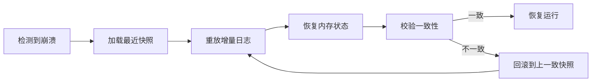

**恢复步骤**：

1. 从持久化存储读取最新完整快照
2. 按时间顺序重放该快照之后的所有增量
3. 恢复各模块的内存状态
4. 校验 Generation Number 和事务边界
5. 如果发现不一致，回滚到上一个一致快照

### 14.7 事务边界

为了保证状态一致性，关键操作需要事务边界：

```typescript
interface Transaction {
  id: string;
  startTick: number;
  operations: Operation[];
  commit(): Promise<void>;
  rollback(): Promise<void>;
}
```

**需要事务保护的操作**：

- 脑中世界一轮完整的 COC 推演
- 记忆痕迹的创建与角色投射的更新
- 小说段落的生成与发布
- 人格内核的演化更新

事务失败时，所有相关状态回滚到事务开始前的快照。

### 14.8 冷启动与热迁移

**冷启动**：Agent 从零开始运行时，人格内核从配置文件加载，其他状态初始化为空。系统进入"新生儿"状态，通过经验输入逐渐积累记忆。

**热迁移**：Agent 运行时可以迁移到新的运行实例。步骤：

1. 触发全局事务暂停
2. 生成完整快照
3. 新实例加载快照
4. 恢复总线订阅
5. 新实例接管时钟

### 14.9 存储容量管理

长期运行会产生大量碎片和痕迹。需要容量管理策略：

```typescript
interface RetentionPolicy {
  fragments: { ttl: number; maxCount: number };
  traces: { minImportance: number; maxCount: number };
  logs: { ttl: number };
  sandboxVersions: { maxCount: number; keepCommitted: boolean };
}
```

**清理规则**：

- 低显著性碎片在 TTL 后删除
- 痕迹按重要性排序，超出容量时删除低重要性痕迹
- 已提交的脑中世界版本永久保留
- 未提交的旧版本按 LRU 清理

### 14.10 持久化与代谢层的关系

持久化本身消耗算力预算。因此：

- 高能耗时期减少快照频率
- 增量保存的优先级高于完整快照
- 历史日志可以异步批量写入
- 容量清理在代谢低谷期执行

---

## 15. 补充后的核心设计决策回顾

| 决策 | 选择 | 理由 |
|---|---|---|
| LLM 调用 | 统一抽象服务 | 解耦模块与具体模型，便于切换和测试 |
| Prompt 结构 | identity + context + instruction + outputSpec | 保证单一人格一致性和输出可控性 |
| 上下文管理 | 分层窗口 + 相关性截断 | 在有限窗口内保留最重要信息 |
| Token 预算 | 按模块比例分配 | 将代谢成本映射为具体资源限制 |
| 持久化策略 | 快照 + 增量 | 平衡一致性与性能 |
| 记忆存储 | 混合存储（向量/图/时序/文档） | 支持多维度检索 |
| 脑中世界版本 | 版本化 + 可回滚 | 支持探索与分叉 |
| 事务边界 | 关键操作事务化 | 保证状态一致性 |

---

## 16. 小说家社会化设计细化

小说家的社会化不是社交娱乐，而是一种**经验采集活动**。社会空间的本质是为小说家提供观察、倾听、体验和受挫的素材。这些素材经过记忆沉淀后，最终映射到脑中世界。

### 16.1 小说家社会化的特殊性

与普通 Agent 的社会化不同，小说家的社会行为具有以下特征：

- **观察优先**：小说家更倾向于旁观而非主导对话
- **倾听敏感**：对陌生人的只言片语、语气、微表情高度敏感
- **关系克制**：不会追求过深的社交绑定，保持一定距离以获得审视视角
- **冲突容忍**：适度的社交尴尬和冲突反而成为宝贵素材
- **成本意识**：社交消耗能量，小说家会主动选择"独处"来恢复和写作

### 16.2 社会空间模型

社会空间不是中立的背景，而是被权力、规范和功能塑造的。采用列斐伏尔的三重空间辩证：

```typescript
interface SocialSpace {
  id: string;
  name: string;
  spaceType: "public" | "private" | "liminal" | "sacred" | "marginal";
  spatialPractice: string[];      // 空间中常见的身体实践
  representationsOfSpace: string[]; // 官方/权力对空间的定义
  representationalSpace: string[];  // 居民对空间的主观感受
  norms: Norm[];
  gazeIntensity: number;          // 被注视的强度
}
```

**空间类型说明**：

| 类型 | 例子 | 功能 |
|---|---|---|
| 公共空间 | 广场、咖啡馆、图书馆 | 遭遇陌生人，收集多样碎片 |
| 私人空间 | 家、工作室 | 独处、反思、恢复能量 |
| 阈限空间 | 车站、走廊、楼梯间 | 短暂相遇，制造偶然性 |
| 神圣空间 | 教堂、纪念馆 | 触发深沉情绪和思想 |
| 边缘空间 | 夜市、废墟、小巷 | 接触非常规经验和边缘人格 |

### 16.3 社会角色网络

小说家在社交中不是单一角色，而是在不同空间中切换角色。每个角色对应一种印象管理策略：

```typescript
interface SocialRole {
  id: string;
  name: string;
  spaceIds: string[];
  frontStagePersona: string;      // 前台表演的人格面具
  backStagePersona: string;       // 后台放松的真实自我
  goals: string[];
  risks: string[];
}
```

**常见角色**：

- **观察者**：在咖啡馆安静观察他人
- **常客**：与店员、邻居保持点头之交
- **访谈者**：主动询问陌生人以获取素材
- **旧友**：与过去的人重逢，触发怀旧
- **局外人**：在新环境中感到格格不入

### 16.4 遭遇触发机制

遭遇不是完全随机的，而是由空间、时间、情绪和角色共同决定：

```typescript
function generateEncounter(agent: Agent, space: SocialSpace): Encounter | null {
  const baseRate = space.encounterBaseRate;
  const moodFactor = agent.mood.openness * 0.5 + agent.mood.loneliness * 0.5;
  const roleFactor = agent.currentRole.encounterAffinity;
  const energyFactor = agent.metabolism.energy / 100;
  
  const probability = baseRate * moodFactor * roleFactor * energyFactor;
  
  if (random() < probability) {
    return buildEncounter(space, agent);
  }
  return null;
}
```

**遭遇类型**：

| 类型 | 触发条件 | 产出碎片 |
|---|---|---|
| 偶遇 | 公共空间高流动性 | 对话碎片、外貌碎片 |
| 重逢 | 旧人出现在同一空间 | 怀旧碎片、关系变化 |
| 冲突 | 规范违反或利益冲突 | 情绪碎片、戏剧素材 |
| 求助 | 他人向小说家求助 | 权力碎片、道德困境 |
| 偷听 | 小说家被动听到对话 | 语言碎片、秘密碎片 |

### 16.5 对话模式

小说家的对话有三种模式：

```typescript
type DialogueMode = "surface" | "probe" | "confessional";
```

- **surface（表层）**：寒暄、客套、社会润滑剂。产出轻量碎片
- **probe（探询）**：小说家主动提问，引导对方讲述。产出深度碎片
- **confessional（倾诉）**：对方向小说家倾诉秘密。产出高情绪重量碎片

模式切换由关系亲密度、信任度和小说家当前角色决定。

### 16.6 凝视与规训

福柯的凝视不仅来自他人，也来自社会规范。小说家在社会中会感受到：

```typescript
interface GazePressure {
  source: string;
  norm: string;
  intensity: number;
  internalized: boolean;    // 是否已内化为自我监控
}
```

**凝视效应**：

- 高强度凝视 → 前台表演消耗增加 → 能量下降更快
- 规范违反 → 产生愧疚或反抗碎片 → 可能进入小说
- 长期凝视 → 内化为自我规训 → 改变小说家人格表达

小说家可以通过"离开空间"、"切换角色"或"后台反思"来缓解凝视压力。

### 16.7 社会成本与恢复

社交消耗三种资源：

```typescript
interface SocialCost {
  energyDrain: number;      // 能量消耗
  attentionDrain: number;   // 注意力消耗
  emotionalExposure: number; // 情绪暴露风险
}
```

**恢复策略**：

- 独处：返回私人空间，DMN 主导，能量恢复
- 后台反思：写日记，将社交经验叙事化
- 边缘空间独处：在广场角落、公园长椅等半公共空间保持孤独感

### 16.8 社会碎片到记忆的痕迹标记

社会碎片被巩固为痕迹时，会自动标记其社会属性：

```typescript
interface SocialTrace extends Trace {
  spaceId: string;
  roleId: string;
  relationshipDelta: RelationshipDelta;
  gazePressure: number;
  dialogueMode: DialogueMode;
}
```

这些标记帮助脑中世界后续进行社会性映射——例如高凝视压力的痕迹更容易转化为小说中的压迫场景。

---

## 17. 脑内世界跑团设计细化

脑内世界跑团是小说家在脑中推演剧情的方式。它借鉴 COC（Call of Cthulhu）TRPG 的机制，但不需要真实玩家，小说家的大脑同时扮演调查员、主持人和旁白。

### 17.1 三重身份的内在分工

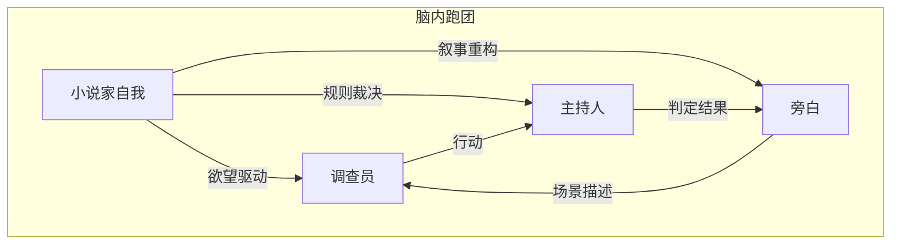

- **调查员**：代表小说家的欲望和好奇心，推动角色行动
- **主持人**：代表世界规则和随机性，裁定行动结果
- **旁白**：将事件文学化，提炼情绪和意象

### 17.2 角色卡设计

脑内世界的角色不是独立 NPC，而是小说家的人格投射。角色卡由记忆痕迹生成：

```typescript
interface SandboxCharacter {
  id: string;
  name: string;
  projectionRatio: number;    // 来自小说家人格的比例，0-1
  sourceTraceIds: string[];   // 来源记忆痕迹
  archetype: string;
  traits: TraitVector;
  skills: Map<string, number>;
  sanity: number;             // COC 式理智值
  desires: Desire[];
  fears: Fear[];
  relationships: Map<string, Relationship>;
}
```

**投射比例控制**：

-  protagonist（主角）：projectionRatio 较高，承载小说家的核心欲望
-  antagonist（对手）：projectionRatio 中等，承载小说家的恐惧或被压抑面
-  supporting（配角）：projectionRatio 较低，作为社会观察的投影

### 17.3 场景设计

场景是脑中世界的基本单元。每个场景由以下要素构成：

```typescript
interface Scene {
  id: string;
  setting: string;
  mood: MoodVector;
  characters: string[];
  tension: number;
  objective: string;
  obstacles: string[];
  foreshadowing: string[];
}
```

**场景来源**：

- 直接来自记忆痕迹的场景化
- 来自社会空间的映射
- 来自梦境碎片的变形
- 来自小说自身发展的需要

### 17.4 COC 判定机制

判定是脑内跑团的核心。它引入不确定性，让脑中世界不完全受小说家控制。

```typescript
interface SkillCheck {
  characterId: string;
  skill: string;
  difficulty: number;
  modifier: number;
  roll: number;
  result: "critical_success" | "success" | "failure" | "fumble";
}

function resolveSkillCheck(check: SkillCheck): SkillCheck {
  const target = check.skillValue * 5 + check.modifier;
  const roll = d100();
  
  if (roll <= 5) return { ...check, roll, result: "critical_success" };
  if (roll <= target / 5) return { ...check, roll, result: "hard_success" };
  if (roll <= target) return { ...check, roll, result: "success" };
  if (roll >= 96) return { ...check, roll, result: "fumble" };
  return { ...check, roll, result: "failure" };
}
```

**判定结果影响**：

| 结果 | 叙事效果 | 情绪后果 |
|---|---|---|
| 大成功 | 意外突破，获得额外信息 | 自信/狂喜 |
| 成功 | 目标达成 | 满足 |
| 失败 | 目标未达成，有损失 | 沮丧 |
| 大失败 | 灾难性后果，冲突激化 | 恐惧/绝望 |

### 17.5 回合流程

一轮完整的跑团回合包含以下步骤：

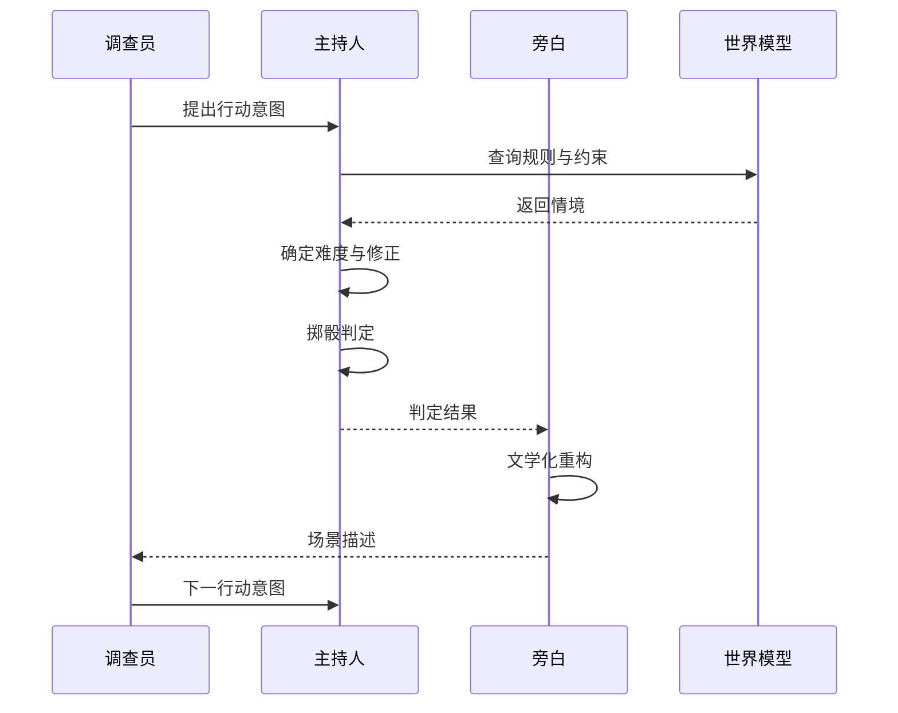

**回合边界**：

- 每回合消耗一定的代谢预算
- 每回合最多处理一个主要角色的一个核心行动
- 回合结束条件：场景目标达成、冲突激化、或预算耗尽

### 17.6 理智值与恐惧机制

借鉴 COC 的理智值（SAN）系统：

```typescript
interface SanitySystem {
  currentSanity: number;
  maxSanity: number;
  phobias: string[];
  manias: string[];
  copingMechanisms: string[];
}
```

当角色遭遇违背世界认知或触及恐惧的事件时，进行理智检定：

- 失败：理智下降，获得临时/永久性恐惧
- 成功：理智小幅波动，但获得对恐惧的抵抗力

理智值不仅影响角色行为，也会通过情绪调制影响小说家的真实情绪状态。

### 17.7 叙事线生成

多轮跑团回合后，需要生成叙事线：

```typescript
function buildNarrativeLine(scenes: Scene[], checks: SkillCheck[]): NarrativeLine {
  const line: NarrativeLine = {
    id: generateId(),
    scenes: [],
    conflicts: [],
    foreshadowing: [],
    climax: null,
    status: "draft"
  };
  
  // 1. 按时间顺序排列场景
  line.scenes = sortScenes(scenes);
  
  // 2. 提取冲突
  line.conflicts = extractConflicts(checks);
  
  // 3. 标记伏笔
  line.foreshadowing = collectForeshadowing(scenes);
  
  // 4. 确定高潮：情感张力最高或结果最关键的场景
  line.climax = findClimax(scenes);
  
  return line;
}
```

### 17.8 跑团与创作的衔接

跑团产出的叙事线不会直接成为小说。它需要先经过创作执行的文学化重构：


**筛选与压缩**：去掉重复判定和过度说明，保留关键转折
**情绪渲染**：强化角色的内心活动和氛围
**视角选择**：决定是第一人称还是第三人称，固定还是流动视角
**文学化输出**：生成最终的小说段落

### 17.9 跑团中的预测编码

跑团不是纯粹幻想，而是小说家对世界模型的预测测试：

```typescript
function runPredictionTest(world: WorldModel, action: Action): PredictionError {
  const expectedOutcome = world.predict(action);
  const actualOutcome = resolveSkillCheck(action);
  const error = compare(expectedOutcome, actualOutcome);
  
  if (error.magnitude > threshold) {
    // 意外结果：更新世界模型
    world.adjust(error);
  }
  
  return error;
}
```

骰子判定引入了预测误差。小说家原本以为会发生的事没有发生，这种意外正是创造力的来源——它打破了小说家的心理定势。

### 17.10 跑团的暂停与恢复

跑团是高能耗活动，需要在以下情况下暂停：

- 能量低于阈值
- 连续多轮未产生有效冲突
- SN 检测到更紧急的触发器
- 达到 maxRounds 上限

暂停时保存当前场景状态、角色状态和未完成的判定。恢复时从暂停点继续。

---

## 18. 补充后的架构全景

加入小说家社会化和脑内跑团细化后，系统的核心流程可以概括为：

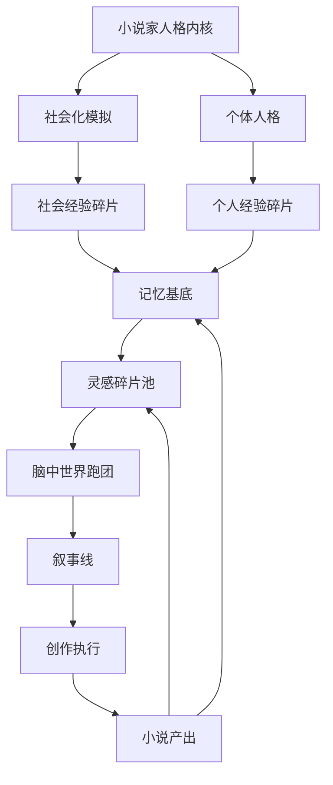

小说家在社会中经验生活，这些经验沉淀为记忆，记忆在脑中世界被跑团机制演绎成叙事线，叙事线最终被文学化为小说。小说又反过来重塑小说家的记忆与灵感。

---

## 19. 评估与观测体系

小说家大脑是一个高度内生的动态系统：灵感在 DMN 中涌现，执行在 CEN 中推进，社会经验不断改写人格，代谢状态又反过来约束一切。没有外部观测者时，系统很容易陷入**自我欺骗的叙事闭环**——小说家可能持续产出低质量文本、在社会中过度消耗、或在跑团中无限偏离人格内核而不自知。评估与观测体系（Evaluation & Observability System, EOS）就是为大脑安装一面**镜子**：它不自问"我是什么"，而是持续回答"我现在怎么样"。

### 19.1 为什么需要评估与观测

EOS 的存在理由可以从三个维度理解：

#### 19.1.1 创作质量

小说产出不是唯一目标，质量才是。系统需要知道：

- 当前叙事线是否过于套路？
- 角色行为是否由人格驱动而非情节工具化？
- 灵感池是否枯竭？
- 跑团推演是否产生了可文学化的戏剧性？

没有这些反馈，CEN 会在执行目标的压力下不断"硬写"，最终产生**高产量、低记忆度**的文本。

#### 19.1.2 人格一致性

小说家是单一人格主体。DMN 的梦境、CEN 的创作决策、SocialSpace 中的角色扮演、Sandbox 中角色的投射，都必须受人格内核（PFC）约束。观测体系负责检测：

- 社交角色是否过度偏离核心身份？
- 跑团角色是否变成完全独立的人格碎片？
- 创作中的价值观是否与人格宣言冲突？

人格一致性不是要求僵化，而是要求**偏差可被解释、可被回收**。

#### 19.1.3 系统健康度

一个持续运行的 Agent 系统存在多种慢性风险：

| 风险类型 | 表现 | 后果 |
|---|---|---|
| 记忆膨胀 | Trace 数量指数增长，检索延迟上升 | DMN/CEN 加载过时、噪声记忆 |
| 代谢崩溃 | 能量长期低于阈值，睡眠债累积 | 所有网络进入低功耗敷衍模式 |
| 社交过载 | GazePressure 持续高企 | 小说家回避社交或情绪耗竭 |
| 跑团失控 | Sandbox 推演无限发散 | 叙事线无法收敛为小说 |
| LLM 依赖过热 | 调用频次过高但有效输出下降 | 成本与延迟失控 |

EOS 将这些风险提前量化，为 DailyScheduler 和 SN 提供切换依据。

### 19.2 三类核心指标

EOS 将指标分为三大类，分别对应输出质量、内部状态、外部关系。

| 指标类别 | 英文命名 | 关注对象 | 典型问题 |
|---|---|---|---|
| 创作指标 | Creative Metrics | 小说、叙事线、跑团产物 | 写得怎么样？是否值得继续？ |
| 认知健康指标 | Cognitive Health Metrics | 网络协作、记忆系统、代谢层 | 大脑运转是否健康？ |
| 社会适应指标 | Social Adaptation Metrics | 社交空间、角色、GazePressure | 小说家在社会中是否过度消耗？ |

#### 19.2.1 创作指标（Creative Metrics）

创作指标评估脑中世界到小说产出的转化效率与质量：

- **灵感丰度（Idea Abundance, IA）**：DMN 产生的可触发 CEN 执行的灵感数量与质量。
- **叙事连贯性（Narrative Coherence, NC）**：叙事线内部因果、情绪、角色动机的一致程度。
- **文学化比率（Literarization Ratio, LR）**：跑团场景被成功转化为小说段落的比例。
- **角色自主性（Character Autonomy, CA）**：SandboxCharacter 行为是否由内在欲望驱动，而非作者强行安排。
- **悬念密度（Tension Density, TD）**：单位文本中冲突、伏笔、情绪转折的密度。

#### 19.2.2 认知健康指标（Cognitive Health Metrics）

认知健康指标监控大脑的运行状态：

- **网络切换频率（Network Switch Frequency, NSF）**：DMN/CEN 切换次数，过高或过低都预示问题。
- **记忆负债（Memory Debt, MD）**：未巩固碎片数量与缓冲区压力的比值。
- **检索质量（Retrieval Quality, RQ）**：记忆检索结果与当前任务的相关度。
- **代谢平衡指数（Metabolic Balance Index, MBI）**：能量、睡眠、情绪、饥饿的综合状态。
- **LLM 投入产出比（LLM ROI）**：单位 LLM 调用产生的有效创作进展。

#### 19.2.3 社会适应指标（Social Adaptation Metrics）

社会适应指标评估小说家在社会空间中的可持续性：

- **社交健康度（Social Health, SH）**：社交消耗与恢复的动态平衡。
- **角色适配度（Role Fit, RF）**：当前 SocialRole 与人格内核的匹配程度。
- **凝视承压值（Gaze Load, GL）**：当前 GazePressure 的累计强度。
- **社会碎片质量（Social Fragment Quality, SFQ）**：社交活动中获得的碎片对创作的启发价值。
- **孤独-连接平衡（Solitude-Connection Balance, SCB）**：独处与社交时间的比例是否处于人格偏好的区间。

### 19.3 核心接口设计

EOS 本身也是一个模块，通过总线与其他模块通信。以下是核心 TypeScript 接口。

#### 19.3.1 Metric

`Metric` 是单个观测指标的原子表示：

```typescript
interface Metric {
  id: string;
  name: string;
  category: "creative" | "cognitive" | "social";
  value: number;                // 归一化值，通常 0-1
  rawValue?: unknown;           // 原始值，保留计算细节
  unit?: string;                // 单位，例如 "count/hour", "ratio"
  timestamp: number;
  window: {                     // 计算窗口
    start: number;
    end: number;
  };
  source: string;               // 来源模块或采集器
  tags: string[];               // 例如 ["dmn", "inspiration", "hourly"]
  threshold?: {                 // 异常阈值
    warning: number;
    critical: number;
    direction: "above" | "below" | "both";
  };
}
```

`Metric` 不定义"如何计算"，只定义"如何被理解"。计算逻辑由 `MetricCollector` 实现。

#### 19.3.2 MetricCollector

`MetricCollector` 负责从原始事件流中聚合出指标：

```typescript
interface MetricCollector {
  id: string;
  name: string;
  targetMetrics: string[];      // 负责计算的指标 ID 列表
  eventTopics: string[];        // 监听的总线 topic，例如 "llm.call.completed"
  stateDependencies: string[];  // 依赖的模块状态，例如 ["metabolism", "memory"]

  // 每次收到相关事件时调用
  ingest(event: BusMessage): void;

  // 在窗口结束时聚合指标
  aggregate(window: TimeWindow): Metric[];

  // 重置当前窗口的累积状态
  reset(): void;
}
```

Collector 的设计遵循**事件驱动 + 窗口聚合**模式。单个事件本身没有意义，意义产生于一段时间内的模式。

#### 19.3.3 ObservabilityBus

`ObservabilityBus` 是 EOS 专用的二级总线。它从主总线订阅事件，但不参与生产控制，只负责分流、采样、持久化：

```typescript
interface ObservabilityBus {
  id: string;

  // 订阅主总线消息
  subscribe(topic: string | RegExp, collectorId: string): void;

  // 接收主总线广播
  onMainBusMessage(message: BusMessage): void;

  // 分发到注册的 Collector
  dispatch(message: BusMessage): void;

  // 采样控制，避免高频率事件压垮 EOS
  setSamplingRate(topic: string, rate: number): void;

  // 导出原始事件流用于离线分析
  exportEvents(window: TimeWindow): BusMessage[];

  // 触发一次评估周期
  evaluate(trigger: EvaluationTrigger): EvaluationReport;
}
```

EOS 与主总线解耦，保证观测本身不会影响系统时序。`ObservabilityBus` 可以独立启用/禁用，也可以在运行时被替换为不同实现（内存版、持久化版、远程版）。

#### 19.3.4 Dashboard

`Dashboard` 是面向外部人类开发者或运维者的视图：

```typescript
interface Dashboard {
  id: string;
  name: string;
  panels: DashboardPanel[];
  refreshRate: number;
  timeRange: TimeWindow;

  // 从多个 Collector 拉取指标
  refresh(metrics: Metric[]): void;

  // 渲染当前状态，返回结构化摘要
  render(): DashboardSnapshot;

  // 设置告警规则
  setAlert(rule: AlertRule): void;

  // 导出为可读报告
  exportReport(): EvaluationReport;
}

interface DashboardPanel {
  id: string;
  title: string;
  metricIds: string[];
  chartType: "line" | "bar" | "gauge" | "heatmap" | "text";
  aggregation: "latest" | "avg" | "min" | "max" | "trend";
}
```

`Dashboard` 是只读的。它不参与控制循环，只提供**可解释性**。

### 19.4 观测数据采集点

EOS 的数据来源不是侵入式探针，而是主总线上本来就流动的消息。观测体系通过订阅这些消息，将系统的内部过程外化为可量化事件。

```mermaid
graph LR
    subgraph MainBus[主总线]
        A[事件总线]
        B[数据总线]
        C[控制总线]
    end

    O[ObservabilityBus]
    A --> O
    B --> O
    C --> O

    subgraph Collectors[指标采集器]
        D[LLMCollector]
        E[MemoryCollector]
        F[MetabolismCollector]
        G[SandboxCollector]
        H[SocialCollector]
        I[NetworkCollector]
    end

    O --> D
    O --> E
    O --> F
    O --> G
    O --> H
    O --> I

    D --> DB[(Metric Store)]
    E --> DB
    F --> DB
    G --> DB
    H --> DB
    I --> DB

    DB --> Dashboard
```

#### 19.4.1 总线监听

所有模块产生的 `BusMessage` 都是潜在数据源。EOS 重点监听以下 topic：

| 总线类型 | Topic 示例 | 含义 |
|---|---|---|
| 事件总线 | `network.switch` | DMN/CEN/SN 切换 |
| 事件总线 | `dmn.dream.trigger` | 梦境事件触发 |
| 事件总线 | `sandbox.skillcheck.completed` | 跑团判定完成 |
| 数据总线 | `fragment.new` | 新经验碎片 |
| 数据总线 | `trace.consolidated` | 痕迹巩固完成 |
| 数据总线 | `narrative.committed` | 叙事线提交 |
| 控制总线 | `metabolism.allocate` | 代谢预算分配 |
| 控制总线 | `module.pause` / `module.resume` | 模块启停 |

#### 19.4.2 LLM 调用指标

LLM 调用层是系统最昂贵的操作之一。EOS 订阅 `llm.call.*` 系列事件：

```typescript
interface LLMCallEvent extends BusMessage {
  topic: "llm.call.completed";
  payload: {
    promptType: string;       // 例如 "dream", "dialogue", "narration"
    model: string;
    inputTokens: number;
    outputTokens: number;
    latencyMs: number;
    success: boolean;
    downstreamUse: string;    // 结果被哪个模块消费
  };
}
```

由 `LLMCollector` 聚合出：

- **每小时调用次数**
- **Token 消耗趋势**
- **平均延迟**
- **按 promptType 分类的成功率**
- **LLM ROI**：下游模块对调用结果的有效采纳率

#### 19.4.3 记忆操作

记忆系统是小说家大脑的"土壤"。`MemoryCollector` 监听 `memory.*` 事件：

```typescript
interface MemoryOperationEvent extends BusMessage {
  topic: "memory.operation";
  payload: {
    operation: "store" | "query" | "consolidate" | "forget";
    entityType: "fragment" | "trace";
    count: number;
    queryLatencyMs?: number;
    relevanceScore?: number;
    consolidationGain?: number;
  };
}
```

关键派生指标：

- **Fragment 流入速率**
- **Trace 巩固效率**：成功巩固数 / 进入缓冲区的 Fragment 数
- **查询-任务相关度**：检索结果与当前 CEN/Sandbox 任务的相关性
- **遗忘回收率**：被主动遗忘的信息中，后续是否又被需要

#### 19.4.4 代谢状态

代谢层是系统的硬约束。`MetabolismCollector` 以固定频率采样主代谢状态：

```typescript
interface MetabolicSample {
  timestamp: number;
  energy: number;          // 0-100
  sleepDebt: number;       // 0-100，越高越缺觉
  hunger: number;          // 0-100
  moodValence: number;     // -1 到 1
  moodArousal: number;     // 0-1
}
```

派生指标：

- **能量波动率**：单位时间内能量的标准差
- **睡眠债累积速度**
- **情绪稳定性**：valence 的自相关或熵
- **代谢预算执行偏差**：计划能量分配 vs 实际消耗

#### 19.4.5 跑团事件

跑团模块产生大量戏剧性事件。`SandboxCollector` 监听：

```typescript
interface SandboxEvent extends BusMessage {
  topic: "sandbox.event";
  payload: {
    sceneId: string;
    eventType: "skillcheck" | "sanity_change" | "dialogue" | "conflict" | "revelation";
    characters: string[];
    tensionDelta: number;
    sanityDelta: Map<string, number>;
    narrativeYield: number;    // 该事件对叙事线的贡献度，0-1
  };
}
```

派生指标：

- **场景张力曲线**
- **理智值波动幅度**
- **角色行为一致性**：角色行动与其 traits/desires 的匹配度
- **叙事产出比**：跑团事件转化为 `narrative.committed` 的比例

### 19.5 评估触发时机

评估不能无差别运行，否则会带来额外开销并干扰系统节律。EOS 采用三种触发模式：

```mermaid
flowchart TD
    A[系统运行] --> B{触发条件}
    B -->|定时| C[定时评估]
    B -->|阶段结束| D[阶段评估]
    B -->|异常阈值| E[阈值评估]

    C --> F[生成 EvaluationReport]
    D --> F
    E --> F

    F --> G{报告结论}
    G -->|正常| H[继续运行]
    G -->|警告| I[通知 DailyScheduler]
    G -->|严重| J[通知 SN 切换网络]
    G -->|人格偏离| K[通知 PFC 约束]
```

#### 19.5.1 定时触发

由全局时钟或 `DailyScheduler` 定期触发，适合观察趋势：

| 周期 | 适用指标 | 说明 |
|---|---|---|
| 每 tick | 代谢状态、网络当前状态 | 高频采样，只计算轻量指标 |
| 每小时 | 灵感丰度、LLM ROI、社交健康度 | 中频聚合 |
| 每日 | 创作连贯性、记忆负债、人格一致性 | 日终总结 |
| 每周 | 社会适应指标、长期代谢趋势 | 周期性复盘 |

#### 19.5.2 阶段结束触发

当 `DailyScheduler` 切换阶段时触发，适合对阶段性成果做评估：

- **写作阶段结束**：评估叙事连贯性、文学化比率
- **社交阶段结束**：评估社交健康度、社会碎片质量
- **睡眠阶段结束**：评估睡眠恢复效率、梦境产物数量
- **跑团阶段结束**：评估角色一致性、悬念密度

阶段评估的结果可以决定是否进入下一阶段、是否重复当前阶段、或是否转入恢复阶段。

#### 19.5.3 异常阈值触发

当某个指标突破阈值时实时触发，适合健康监控：

```typescript
interface ThresholdRule {
  metricId: string;
  condition: "above" | "below" | "change_rate_above";
  threshold: number;
  durationMs: number;       // 持续多久才触发，避免抖动
  severity: "warning" | "critical";
  action: "notify" | "switch_network" | "pause_module" | "request_recovery";
}
```

典型阈值规则：

| 指标 | 条件 | 阈值 | 动作 |
|---|---|---|---|
| 能量 | below | 20 | request_recovery（请求恢复阶段） |
| 记忆负债 | above | 0.8 | notify（通知记忆系统加速巩固） |
| 凝视承压值 | above | 0.85 | switch_network（切换至独处/DMN） |
| LLM 失败率 | above | 0.3 | pause_module（暂停高消耗模块） |
| 人格一致性 | below | 0.4 | request_pfc_intervention（请求人格内核干预） |

### 19.6 关键指标计算示例

以下给出四个关键指标的具体计算示例。它们都基于 19.4 节采集的原始数据，在 `MetricCollector` 中实现。

#### 19.6.1 灵感丰度（Idea Abundance, IA）

灵感丰度衡量 DMN 在观测窗口内向 CEN 输送了多少有效灵感。

```typescript
function computeIdeaAbundance(
  dreamEvents: DreamEvent[],
  dmnToCenMessages: BusMessage[],
  windowHours: number
): Metric {
  const count = dmnToCenMessages.length;
  const avgSalience = mean(dmnToCenMessages.map(m => m.payload.salience ?? 0));
  const novelty = mean(dreamEvents.map(e => e.payload.noveltyScore ?? 0));

  const raw = (count / windowHours) * (0.5 * avgSalience + 0.5 * novelty);
  const normalized = sigmoid(raw, k = 0.5);

  return {
    id: "idea_abundance",
    name: "灵感丰度",
    category: "creative",
    value: clamp(normalized, 0, 1),
    rawValue: { countPerHour: count / windowHours, avgSalience, novelty },
    unit: "normalized",
    timestamp: now(),
    window: { start: now() - windowHours * 3600 * 1000, end: now() },
    source: "DMNCollector",
    tags: ["dmn", "inspiration", "creative"],
    threshold: { warning: 0.3, critical: 0.15, direction: "below" }
  };
}
```

- 若 IA 连续低于 0.3，说明 DMN 进入低产阶段，DailyScheduler 应安排更多独处、梦境或社会观察。

#### 19.6.2 人格一致性（Personality Consistency, PC）

人格一致性检测系统行为与人格内核的偏离程度。

```typescript
function computePersonalityConsistency(
  identityCore: IdentityCore,
  recentActions: AgentAction[],
  sandboxCharacters: SandboxCharacter[],
  socialRoles: SocialRole[]
): Metric {
  const traitVector = identityCore.traitVector;

  // 行为与人格向量的余弦相似度
  const actionScores = recentActions.map(a =>
    cosineSimilarity(a.impliedTraitVector, traitVector)
  );

  // 跑团角色投射比例是否失控
  const projectionScores = sandboxCharacters.map(c =>
    c.projectionRatio > 0.85 ? 0.6 : 1.0
  );

  // 社交角色与人格内核的匹配度
  const roleScores = socialRoles.map(r =>
    cosineSimilarity(r.backStagePersonaEmbedding, traitVector)
  );

  const value = 0.5 * mean(actionScores)
              + 0.3 * mean(projectionScores)
              + 0.2 * mean(roleScores);

  return {
    id: "personality_consistency",
    name: "人格一致性",
    category: "cognitive",
    value: clamp(value, 0, 1),
    rawValue: { actionScores, projectionScores, roleScores },
    unit: "normalized",
    timestamp: now(),
    window: recentActions[0]?.timestamp ?? now(),
    source: "PFCCollector",
    tags: ["pfc", "identity", "consistency"],
    threshold: { warning: 0.5, critical: 0.35, direction: "below" }
  };
}
```

- PC 低于 0.5 时进入警告，PFC 应加强对 DMN/CEN/Sandbox 的约束信号。
- PC 低于 0.35 时进入严重状态，系统应暂停创作，进入"反思/日记"阶段回收偏离。

#### 19.6.3 社交健康度（Social Health, SH）

社交健康度衡量小说家的社交活动是否可持续、是否有创作价值。

```typescript
function computeSocialHealth(
  socialEvents: SocialEvent[],
  gazePressures: GazePressure[],
  energyHistory: number[],
  fragmentQuality: number[]
): Metric {
  const exposure = sum(gazePressures.map(g => g.intensity)) / gazePressures.length;
  const recovery = computeRecoverySlope(energyHistory);
  const quality = mean(fragmentQuality);
  const balance = socialBalanceScore(socialEvents); // 独处与社交比例

  // 高压力、低恢复、低质量 → 健康度低
  // 适度压力、正向恢复、高质量 → 健康度高
  const value = 0.3 * (1 - exposure)
              + 0.25 * recovery
              + 0.25 * quality
              + 0.2 * balance;

  return {
    id: "social_health",
    name: "社交健康度",
    category: "social",
    value: clamp(value, 0, 1),
    rawValue: { exposure, recovery, quality, balance },
    unit: "normalized",
    timestamp: now(),
    window: socialEvents[0]?.timestamp ?? now(),
    source: "SocialCollector",
    tags: ["social", "health", "gaze"],
    threshold: { warning: 0.4, critical: 0.25, direction: "below" }
  };
}
```

- SH 低不一定意味着要避免社交，而可能意味着需要切换社交空间、角色或恢复节奏。

#### 19.6.4 创作连贯性（Narrative Coherence, NC）

创作连贯性评估叙事线内部的逻辑与情绪一致性。

```typescript
function computeNarrativeCoherence(
  scenes: Scene[],
  narrativeLine: NarrativeLine,
  characterActions: SandboxEvent[]
): Metric {
  // 1. 情绪连贯性：相邻场景情绪向量变化是否平滑
  const moodTransitions = scenes.slice(1).map((s, i) =>
    cosineSimilarity(s.mood.vector, scenes[i].mood.vector)
  );
  const moodCoherence = mean(moodTransitions);

  // 2. 动机连贯性：角色行为是否由其 desires/fears 驱动
  const motiveScores = characterActions.map(e =>
    e.motiveAlignment ?? 0
  );
  const motiveCoherence = mean(motiveScores);

  // 3. 伏笔回收率：foreshadowing 列表中有多少在后续出现
  const payoffRate = narrativeLine.foreshadowing.filter(f =>
    scenes.some(s => s.payoffs.includes(f))
  ).length / max(narrativeLine.foreshadowing.length, 1);

  const value = 0.4 * moodCoherence
              + 0.4 * motiveCoherence
              + 0.2 * payoffRate;

  return {
    id: "narrative_coherence",
    name: "叙事连贯性",
    category: "creative",
    value: clamp(value, 0, 1),
    rawValue: { moodCoherence, motiveCoherence, payoffRate },
    unit: "normalized",
    timestamp: now(),
    window: scenes[0]?.timestamp ?? now(),
    source: "NarrativeCollector",
    tags: ["creative", "narrative", "coherence"],
    threshold: { warning: 0.5, critical: 0.3, direction: "below" }
  };
}
```

- NC 低可能意味着跑团过于发散、角色动机不足、或情绪转折生硬。此时 CEN 应介入收紧叙事结构。

### 19.7 EOS 与其他模块的协作

EOS 不是孤立存在的，它与 DailyScheduler、SN、PFC 形成反馈闭环：

```mermaid
graph LR
    E[EOS] -->|指标| D[DailyScheduler]
    E -->|异常阈值| SN[突显网络 SN]
    E -->|人格偏离| PFC[人格内核 PFC]

    D -->|调整日程| A[代谢层]
    D -->|安排恢复| B[DMN]
    D -->|安排写作| C[CEN]

    SN -->|网络切换| B
    SN -->|网络切换| C

    PFC -->|约束信号| B
    PFC -->|约束信号| C
```

协作规则：

- **DailyScheduler** 根据 EOS 的日终报告调整下一天节律。例如 IA 低则增加梦境时段，SH 低则减少社交。
- **SN** 根据实时阈值触发网络切换。例如 GL 过高时从社交切换至 DMN。
- **PFC** 根据人格一致性报告释放约束信号，影响 CEN 的创作决策和 Sandbox 的角色投射比例。

### 19.8 设计决策回顾

评估与观测体系的设计遵循以下原则：

1. **非侵入式观测**：EOS 只订阅主总线消息，不直接修改模块内部状态。
2. **窗口化聚合**：单个事件无意义，指标在窗口内聚合后才产生判断价值。
3. **三级指标分离**：创作、认知、社会各自独立评估，避免单一指标掩盖跨域问题。
4. **阈值驱动干预**：异常阈值将观测结果转化为控制信号，避免人类频繁介入。
5. **可解释性优先**：每个指标保留 `rawValue`，让开发者能理解"为什么低"。

EOS 不会替小说家决定写什么，但它能让小说家意识到"现在是否适合写"。这正是评估与观测体系在一个自主创作主体中的恰当位置。

---

## 20. 错误处理与降级策略

小说家大脑是一个高度耦合、动态演化的复杂系统：LLM 调用、记忆系统、脑中世界、代谢层、三条总线和人格内核相互依赖，任何一个环节的失效都可能通过总线扩散为系统性风险。本章设计一套完整的错误处理与降级策略，目标是在保证人格一致性的前提下，让系统在遇到局部故障时能够自愈、降级或安全停机，而不是输出不可控的内容或陷入无限循环。

### 20.1 设计目标

错误处理体系遵循以下原则：

- **人格一致性优先**：任何降级策略都不得破坏小说家的核心人格；如果人格一致性无法验证，系统进入安全模式。
- **故障隔离**：单个模块的故障不应扩散到整个大脑；总线作为隔离边界。
- **可观测**：所有错误、降级动作和恢复过程都必须被记录为可审计的痕迹。
- **可恢复**：系统优先尝试自愈；自愈失败后再执行受控降级；降级失败后再进入安全模式。
- **代谢敏感**：恢复与降级本身也消耗代谢预算，必须在能量约束下进行。

### 20.2 错误分类

系统中的错误按来源和影响范围分为七类。

| 错误类别 | 触发场景 | 典型症状 | 风险等级 |
|---|---|---|---|
| **LLM 调用失败** | API 超时、返回格式异常、速率限制、内容过滤、模型不可达 | 调用返回空/非法 JSON、响应时间超过阈值、连续失败 | 高 |
| **记忆损坏/丢失** | 持久化文件损坏、向量索引不一致、Trace 引用缺失、重复合并冲突 | 查询返回不一致痕迹、记忆激活异常、角色来源 Trace 丢失 | 高 |
| **脑中世界偏离** | 跑团判定连续极端、世界模型与 Trace 脱节、角色行为违反设定 | 剧情走向失控、角色 OOC、世界观自相矛盾 | 高 |
| **代谢崩溃** | 能量耗尽、算力预算超限、时间货币透支 | 所有高耗能模块被冻结、系统无法推进 tick | 中 |
| **总线阻塞** | 消息风暴、死循环订阅、TTL 失效、高优先级消息淹没低优先级消息 | 消息队列膨胀、模块响应延迟、控制指令无法下达 | 高 |
| **状态持久化失败** | 快照写入失败、增量日志损坏、存储后端不可达、并发写冲突 | 无法保存状态、恢复时缺数据、快照与增量不一致 | 极高 |
| **人格一致性断裂** | 长期运行后价值观漂移、多网络输出冲突、核心约束被违反 | 输出风格突变、小说家"不像自己"、做出违背设定选择 | 极高 |

### 20.3 错误传播机制

为了避免错误在模块间无序扩散，系统引入统一的错误传播接口。每个模块在捕获异常后，必须将异常封装为 `Error` 或 `Fault`，并通过控制总线发布；`FaultManager` 负责评估影响范围并生成 `RecoveryAction`。

#### 20.3.1 核心接口

```typescript
// 20-1 错误、故障与恢复动作接口

interface AgentError {
  id: string;
  timestamp: number;
  source: string;              // 来源模块名
  channel: "event" | "data" | "control";
  topic: string;               // 触发该错误的消息 topic
  type: ErrorType;             // 见 ErrorType 枚举
  severity: "low" | "medium" | "high" | "critical";
  message: string;
  payload: unknown;            // 原始异常或上下文
  recoverable: boolean;        // 是否可自动恢复
}

interface Fault {
  id: string;
  errorId: string;
  affectedModules: string[];   // 受影响模块
  affectedNetworks: Network[]; // 受影响网络
  scope: "module" | "network" | "system";
  propagationPath: string[];   // 错误传播链路
  persistenceRisk: boolean;    // 是否威胁持久化数据
  identityRisk: boolean;       // 是否威胁人格一致性
}

interface RecoveryAction {
  id: string;
  faultId: string;
  strategy: RecoveryStrategy;  // 重试/回滚/重启/快照/重构/降级/安全模式
  target: string;              // 作用对象
  parameters: Record<string, unknown>;
  cost: MetabolicCost;         // 预估代谢成本
  fallback?: RecoveryAction;   // 失败后的下一级动作
  maxAttempts: number;
  deadline: number;            // 动作截止时间
}

enum ErrorType {
  LLM_TIMEOUT = "LLM_TIMEOUT",
  LLM_MALFORMED_RESPONSE = "LLM_MALFORMED_RESPONSE",
  LLM_RATE_LIMIT = "LLM_RATE_LIMIT",
  MEMORY_CORRUPTION = "MEMORY_CORRUPTION",
  MEMORY_LOSS = "MEMORY_LOSS",
  SANDBOX_DIVERGENCE = "SANDBOX_DIVERGENCE",
  METABOLISM_COLLAPSE = "METABOLISM_COLLAPSE",
  BUS_CONGESTION = "BUS_CONGESTION",
  PERSISTENCE_FAILURE = "PERSISTENCE_FAILURE",
  IDENTITY_INCONSISTENCY = "IDENTITY_INCONSISTENCY"
}

type RecoveryStrategy =
  | "retry"
  | "rollback"
  | "restart_module"
  | "switch_network"
  | "snapshot_restore"
  | "memory_reconstruct"
  | "degrade"
  | "safe_mode";
```

#### 20.3.2 错误传播流程

```mermaid
sequenceDiagram
    participant Module as 故障模块
    participant Bus as 控制总线
    participant FM as FaultManager
    participant RM as RecoveryManager
    participant Target as 目标模块/系统

    Module->>Module: 捕获异常
    Module->>Bus: 发布 control.fault.error
    Bus->>FM: 投递 AgentError
    FM->>FM: 评估影响范围 → 生成 Fault
    FM->>Bus: 发布 control.fault.assessed
    Bus->>RM: 投递 Fault
    RM->>RM: 选择 RecoveryAction
    RM->>Bus: 发布 control.recovery.action
    Bus->>Target: 执行恢复/降级
    Target-->>Bus: 返回执行结果
    Bus->>RM: 评估是否成功
    alt 成功
        RM->>Bus: 发布 control.recovery.resolved
    else 失败且存在 fallback
        RM->>RM: 调度 fallback RecoveryAction
    else 失败且无 fallback
        RM->>Bus: 发布 control.system.safe_mode
    end
```

**传播规则**：

- 普通错误由模块内部捕获，必要时发布到控制总线；
- `Fault` 只能由 `FaultManager` 生成，避免模块自行升级故障级别；
- `RecoveryAction` 的副作用必须在控制总线广播，确保 `Metabolism` 和 `PFC` 能够审查；
- 涉及人格一致性 (`identityRisk === true`) 的 `Fault` 必须抄送人格内核 `PFC`，由其决定是否进入安全模式。

### 20.4 分层降级策略

降级不是"关闭功能"，而是在资源或可靠性受限时，用更廉价、更保守的替代路径维持最低限度的正常运行。系统从模块、网络到系统三个层次进行降级。

#### 20.4.1 模块级降级

当单个模块出现故障或预算不足时，该模块进入降级模式，其他模块继续运行。

| 模块 | 正常模式 | 降级模式 | 触发条件 |
|---|---|---|---|
| **LLMService** | 调用主模型，生成完整输出 | 切换到备用模型 / 使用模板填充 / 返回缓存响应 | 主模型超时、速率限制、连续失败 |
| **脑中世界 (Sandbox)** | 多轮 COC 跑团推演 | 单轮情节延续 / 直接读取已有叙事线 / 暂停新事件生成 | 能量不足、世界偏离度超限 |
| **记忆系统 (Memory)** | 向量检索 + 关联重组 | 仅按时间倒序检索 / 禁用跨 Trace 重组 | 索引损坏、检索延迟过高 |
| **创作执行 (EXEC)** | 文学化重构生成段落 | 输出结构化大纲 / 拼接已有场景描述 | LLM 不可用、能量极低 |
| **社会化模块** | 完整 Agent tick 与对话 | 只读观察模式 / 简化回合 | 社交预算耗尽、对话失控 |

```mermaid
graph TB
    subgraph Module["模块级降级示例：LLMService"]
        A[调用请求] --> B{主模型可用?}
        B -->|是| C[主模型生成]
        B -->|否| D{备用模型可用?}
        D -->|是| E[备用模型生成]
        D -->|否| F{缓存命中?}
        F -->|是| G[返回缓存]
        F -->|否| H[模板填充]
        H --> I[发布降级事件]
    end
```

#### 20.4.2 网络级切换

当某个网络 (DMN/CEN/SN) 出现故障时，系统可主动切换到另一个网络，或将当前网络降级为低功耗状态。

| 网络故障 | 降级策略 | 效果 |
|---|---|---|
| **DMN 失控** (梦境/心智游走过度消耗资源) | SN 强制切回 CEN，降低 DMN 激活阈值 | 恢复前台控制，减少后台能耗 |
| **CEN 过热** (执行链路过长、陷入局部最优) | 强制切到 DMN，允许后台酝酿，暂停执行 | 避免理性死锁，等待灵感重组 |
| **SN 失效** (无法正确路由触发器) | 启用默认路由规则：高唤醒→CEN，低唤醒→DMN | 维持基本网络切换，但失去精细判断 |
| **多网络冲突** | PFC 介入仲裁，必要时冻结网络切换 | 防止人格分裂式输出 |

#### 20.4.3 系统级安全模式

当多个关键模块同时故障、人格一致性受到威胁或持久化失败时，系统进入安全模式 (Safe Mode)。

安全模式下：

- 暂停所有创作、跑团和社交活动；
- 只保留 `Metabolism`、`PFC`、`FaultManager`、`RecoveryManager` 和最小总线；
- 所有输入仅被记录为原始 `Fragment`，不做进一步加工；
- 尝试将当前状态保存为"急诊快照" (emergency snapshot)；
- 等待外部干预或能量恢复后，从最近有效快照恢复。

```mermaid
stateDiagram-v2
    [*] --> Normal
    Normal --> Degraded: 局部故障
    Degraded --> Normal: 自愈成功
    Degraded --> SafeMode: 故障扩散或人格风险
    Normal --> SafeMode: 关键故障
    SafeMode --> Recovery: 外部指令/能量恢复
    Recovery --> Normal: 快照恢复成功
    Recovery --> SafeMode: 恢复失败
```

### 20.5 自愈机制

自愈是系统在无人干预的情况下恢复正常的能力。系统提供五种自愈原语，可被 `RecoveryManager` 组合使用。

#### 20.5.1 重试 (Retry)

适用于瞬时性故障，如网络抖动、API 临时不可用。

```typescript
// 20-2 重试策略

interface RetryPolicy {
  maxAttempts: number;
  baseDelayMs: number;
  maxDelayMs: number;
  backoffStrategy: "fixed" | "linear" | "exponential";
  retryableErrors: ErrorType[];
  onExhausted: "escalate" | "degrade" | "snapshot";
}

function shouldRetry(error: AgentError, policy: RetryPolicy): boolean {
  if (!policy.retryableErrors.includes(error.type)) return false;
  if (error.severity === "critical" && error.type === "IDENTITY_INCONSISTENCY") return false;
  return true;
}
```

重试必须受代谢预算约束：连续重试失败会增加能量惩罚，避免空转。

#### 20.5.2 回滚 (Rollback)

适用于状态变更已经造成局部损坏、但尚未持久化的场景。

```typescript
// 20-3 模块状态回滚

interface RollbackAction extends RecoveryAction {
  strategy: "rollback";
  parameters: {
    module: string;
    toCheckpoint: string;      // 检查点 ID
    discardBusMessages: boolean; // 是否丢弃该期间总线消息
  };
}
```

回滚粒度：

- **事务级回滚**：单个模块内的一次操作；
- **网络级回滚**：DMN/CEN 切换到上一个稳定网络状态；
- **全局回滚**：回退到上一个成功快照，配合增量日志撤销。

#### 20.5.3 重启 (Restart)

适用于模块内部状态污染但配置和持久化数据完好的情况。

```typescript
// 20-4 模块重启

interface RestartAction extends RecoveryAction {
  strategy: "restart_module";
  parameters: {
    module: string;
    preserveMemory: boolean;   // 是否保留内存中缓存
    resetNetworkBinding: boolean;
    postRestartHealthCheck: string[];
  };
}
```

重启后必须进行健康检查，确认模块能够正常收发总线消息。

#### 20.5.4 快照恢复 (Snapshot Restore)

当状态持久化出现不一致或模块回滚无法修复时，从快照恢复。

```typescript
// 20-5 快照恢复

interface SnapshotRestoreAction extends RecoveryAction {
  strategy: "snapshot_restore";
  parameters: {
    snapshotId: string;
    replayIncrementals: boolean; // 是否重放增量日志
    replayUpTo: number;          // 重放到哪个时间点
    verifyIdentity: boolean;     // 恢复后是否进行人格一致性校验
  };
}
```

恢复流程：

1. 加载最近有效快照；
2. 按时间顺序重放增量日志到指定时间点；
3. 若某条增量本身导致故障，则跳过并记录；
4. 校验人格一致性 (`PFC.verifyIdentity`)；
5. 校验通过则恢复运行，否则进入安全模式。

#### 20.5.5 内存重构 (Memory Reconstruct)

适用于记忆系统损坏但原始 `Fragment` 仍可获取的场景。

```typescript
// 20-6 记忆重构

interface MemoryReconstructAction extends RecoveryAction {
  strategy: "memory_reconstruct";
  parameters: {
    sourceFragments: string[];   // 用于重构的碎片 ID
    reconstructionDepth: number; // 重构深度
    preserveHighImportanceTraces: boolean; // 保留高重要性痕迹
  };
}
```

重构过程不是简单恢复，而是让记忆系统基于可用的 `Fragment` 重新执行巩固、关联和叙事角色标注。高重要性 `Trace` 在重构前被单独备份。

```mermaid
flowchart TB
    A[检测到记忆损坏] --> B{原始 Fragment 可用?}
    B -->|否| C[从快照恢复]
    B -->|是| D[备份高重要性 Trace]
    D --> E[重新运行记忆巩固]
    E --> F[重新计算关联与角色]
    F --> G[校验一致性]
    G -->|通过| H[恢复记忆服务]
    G -->|失败| C
```

### 20.6 关键场景处理示例

#### 20.6.1 LLM 超时

场景：CEN 在脑中世界跑团中调用 LLM 生成主持人反馈，30 秒后仍未返回。

处理流程：

1. `LLMService` 内部超时，抛出 `LLM_TIMEOUT`；
2. 发布 `control.fault.error`；
3. `FaultManager` 判定影响模块为 `CEN/Sandbox`，范围 `module`；
4. `RecoveryManager` 首先执行 `retry`（指数退避，最多 3 次）；
5. 若重试成功，继续跑团；
6. 若重试失败，fallback 为 `degrade`：切换到备用模型；
7. 备用模型也失败，则 `degrade` 为模板化主持人响应，并标记本轮为"简化回合"；
8. 同时 `Metabolism` 扣除重试额外消耗的能量。

#### 20.6.2 跑团失控

场景：跑团中连续出现多个大成功/大失败，角色行为严重 OOC，世界偏离度超过阈值。

处理流程：

1. `Sandbox` 的预测编码模块检测到 `predictionError.magnitude` 连续超标；
2. 发布 `SANDBOX_DIVERGENCE` 错误；
3. `FaultManager` 判定 `identityRisk = true`（角色源于人格投射）；
4. `PFC` 被抄送并裁定是否暂停跑团；
5. `RecoveryManager` 执行 `rollback`：回退到上一个场景检查点；
6. 重新设定难度与修正，降低极端结果概率；
7. 若回退后仍失控，执行 `switch_network`：强制切到 DMN，让灵感重组；
8. 必要时保存当前失控场景为"废弃叙事线"，避免污染主记忆。

#### 20.6.3 记忆损坏

场景：向量索引与 Trace 数据库不一致，查询返回的 Trace 内容为空或乱码。

处理流程：

1. `MemorySystem` 在一致性检查中发现损坏；
2. 发布 `MEMORY_CORRUPTION` 错误；
3. 停止该索引的查询服务，切换到只读热备份索引；
4. `RecoveryManager` 备份高重要性 Trace；
5. 执行 `memory_reconstruct`：基于原始 Fragment 重建索引；
6. 重建完成后与备份 Trace 做差异合并；
7. 合并冲突由 `PFC` 依据人格一致性规则仲裁；
8. 若重建失败，执行 `snapshot_restore`。

#### 20.6.4 能量耗尽

场景：`Metabolism` 检测到 `energy <= 0`，高耗能模块被冻结。

处理流程：

1. `Metabolism` 发布 `control.metabolism.budget.exhausted`；
2. `SN` 将网络切换到低功耗 DMN；
3. `CEN`、`Sandbox`、`EXEC` 和社交模块进入暂停；
4. 仅保留输入采集和记忆基底的最小维护；
5. 等待 `recoveryRate` 将能量恢复到阈值；
6. 恢复后按优先级逐步唤醒模块：输入 → 记忆 → DMN → CEN → Sandbox → EXEC。

### 20.7 熔断与限流

为避免局部故障演变为系统性雪崩，系统在关键路径上引入熔断和限流机制。

#### 20.7.1 LLM 调用熔断器

```typescript
// 20-7 LLM 熔断器

interface CircuitBreaker {
  service: string;
  state: "closed" | "open" | "half_open";
  failureThreshold: number;
  recoveryTimeoutMs: number;
  halfOpenMaxCalls: number;
}

function evaluateCircuitBreaker(
  cb: CircuitBreaker,
  recentResults: CallResult[]
): CircuitBreaker {
  if (cb.state === "closed" && countFailures(recentResults) >= cb.failureThreshold) {
    return { ...cb, state: "open" };
  }
  if (cb.state === "open" && elapsedSinceOpen(cb) >= cb.recoveryTimeoutMs) {
    return { ...cb, state: "half_open" };
  }
  if (cb.state === "half_open" && countFailures(recentResults) > 0) {
    return { ...cb, state: "open" };
  }
  if (cb.state === "half_open" && countSuccesses(recentResults) >= cb.halfOpenMaxCalls) {
    return { ...cb, state: "closed" };
  }
  return cb;
}
```

| 状态 | 行为 |
|---|---|
| **closed** | 正常调用 LLM，计数失败次数 |
| **open** | 直接拒绝 LLM 调用，走降级路径 |
| **half_open** | 允许少量探测调用，成功后关闭，失败后重新打开 |

#### 20.7.2 总线限流

为防止消息风暴导致总线阻塞，系统对每条 topic 实施令牌桶限流。

```typescript
// 20-8 总线限流

interface BusRateLimiter {
  topic: string;
  maxMessagesPerTick: number;
  burstCapacity: number;
  dropPolicy: "drop_oldest" | "drop_newest" | "flatten_priority";
}
```

限流规则：

- 控制总线消息优先于事件总线和数据总线；
- 同一模块对同一 topic 的发布速率受 `maxMessagesPerTick` 限制；
- 超过容量时，根据 `dropPolicy` 丢弃消息，避免队列无限膨胀；
- 被限流的模块会收到 `control.bus.throttled` 通知，以便自我抑制。

#### 20.7.3 代谢预算限流

```typescript
// 20-9 代谢预算限流

interface MetabolicLimiter {
  module: string;
  budgetPerTick: number;
  burstBudget: number;
  actionOnExhaustion: "pause" | "degrade" | "queue";
}
```

每个模块在一个 tick 内消耗的算力/能量不能超过预算；超出时根据策略暂停、降级或排队。

### 20.8 降级与人格一致性的关系

人格一致性是降级策略不可逾越的底线。任何 `RecoveryAction` 在执行前，如果涉及以下情况，必须经由 `PFC` 审查：

- 修改人格内核参数；
- 删除或覆盖高情感权重 Trace；
- 在人格一致性校验失败时仍继续输出；
- 以牺牲长期一致性为代价换取短期恢复。

`PFC` 提供统一的人格一致性校验接口：

```typescript
// 20-10 人格一致性校验

interface IdentityCheck {
  proposedState: AgentState;
  baseline: IdentityCore;
  dimensions: {
    valueAlignment: number;     // 价值观对齐度
    styleConsistency: number;   // 输出风格一致性
    preferenceStability: number; // 偏好稳定性
    autobiographicalCoherence: number; // 自传体连贯性
  };
}

function verifyIdentity(check: IdentityCheck): boolean {
  const { valueAlignment, styleConsistency, preferenceStability, autobiographicalCoherence } = check.dimensions;
  const score = 0.3 * valueAlignment
              + 0.3 * styleConsistency
              + 0.2 * preferenceStability
              + 0.2 * autobiographicalCoherence;
  return score >= check.baseline.identityThreshold;
}
```

当 `verifyIdentity` 返回 `false` 时，系统不允许自动恢复，必须进入安全模式并等待外部审查。

### 20.9 小结

错误处理与降级策略不是事后补丁，而是小说家大脑架构的内建属性。通过统一的错误传播接口、分层降级、自愈原语、熔断限流和人格一致性审查，系统能够在 LLM 失效、记忆损坏、跑团失控、能量耗尽等场景下保持可控。最终目标是：即使大脑的一部分暂时"生病"，小说家的人格主体仍然完整，并能在恢复后继续创作。

---

## 21. 配置管理系统

随着"小说家大脑" Agent 的模块不断扩展，人格参数、创作风格、脑中世界规则、跑团规则、LLM 参数、持久化策略等都需要被统一表达、加载、校验和演化。配置管理系统是整个架构的"静态神经系统"：它在运行期之前定义了"这个小说家是谁、如何生活、如何创作"，又在运行期之中为代谢层、网络层、记忆层和社会化模块提供可调参数。

### 21.1 为什么需要统一的配置管理系统

如果没有统一的配置管理，各模块可能把参数硬编码在提示词、模型调用或存储路径中，导致以下问题：

- **人格漂移**：不同模块对小说家的性格、价值观描述不一致，破坏单一人格主体的连续性。
- **风格割裂**：创作执行模块与脑中世界跑团模块各自维护一套风格参数，产出的小说前后不统一。
- **规则冲突**：跑团规则、社会交互规则、世界规则分散在多处，难以发现矛盾。
- **调参困难**：LLM temperature、token 预算、代谢速率等关键参数散落在代码中，实验成本高昂。
- **迁移脆弱**：版本升级时无法判断哪些配置需要保留、哪些需要更新。

统一的配置管理系统通过"一份配置、多处消费"解决上述问题，并为以下能力提供基础：

- 快速切换不同的小说家人格原型。
- 在运行时微调创作风格而不中断记忆系统。
- 对配置变更进行审计、回滚和版本对比。

### 21.2 配置分层

为了避免所有参数混杂在一个扁平对象中，配置被划分为七个逻辑层。每层对应架构中的一个核心关注点，层与层之间通过显式接口解耦。

| 配置层 | 对应模块 | 典型内容 | 变更频率 |
|---|---|---|---|
| 核心人格配置 | PFC 人格内核 | 姓名、价值观、性格特质、自我叙事、情绪基线 | 极低 |
| 生理参数配置 | 代谢层、DailyScheduler | 能量上限、睡眠周期、昼夜节律、代谢消耗系数 | 低 |
| 创作风格配置 | 创作执行、DMN 灵感生成 | 文体偏好、句式节奏、叙事视角、禁忌词、伏笔策略 | 中 |
| 社会化配置 | 社会化模块 | 社交半径、关系亲密度阈值、社交疲劳系数、平台规则 | 中 |
| 跑团规则配置 | 脑中世界跑团 | 判定规则、成功/失败阈值、角色属性模板、世界规则 | 中 |
| LLM 配置 | LLM 调用层 | 模型名、temperature、maxTokens、重试策略、Fallback 模型 | 高 |
| 持久化配置 | 状态持久化 | 存储后端、快照间隔、容量清理策略、增量日志路径 | 低 |

层间依赖关系如下：核心人格配置处于最顶层，向下约束其他所有配置；LLM 配置和持久化配置属于基础设施层，向上为各认知模块提供服务。

```mermaid
graph TB
    subgraph ConfigLayers["配置分层"]
        direction TB
        CORE["核心人格配置"]
        PHYSIO["生理参数配置"]
        STYLE["创作风格配置"]
        SOCIAL["社会化配置"]
        TRPG["跑团规则配置"]
        LLM["LLM 配置"]
        PERSIST["持久化配置"]
    end

    CORE --> PHYSIO
    CORE --> STYLE
    CORE --> SOCIAL
    CORE --> TRPG
    PHYSIO --> STYLE
    STYLE --> TRPG
    LLM --> STYLE
    LLM --> SOCIAL
    LLM --> TRPG
    PERSIST --> LLM
    PERSIST --> TRPG
```

### 21.3 配置对象接口

所有配置通过一个统一的根接口 `Config` 表达，各层配置分别由子接口描述。这种设计使得配置对象可以被整体序列化、整体校验，也可以按层订阅变更。

```typescript
interface Config {
  version: string;                 // 配置模式版本，如 "2.1.0"
  source: string;                  // 当前生效配置的来源描述
  core: IdentityConfig;
  physiology: PhysiologyConfig;
  creativity: CreativityConfig;
  social: SocialConfig;
  trpg: TRPGConfig;
  llm: LLMConfig;
  persistence: PersistenceConfig;
}

interface IdentityConfig {
  name: string;
  values: string[];
  traits: TraitVector;
  selfNarrative: string;
  baselineMood: MoodVector;
  voice: "first_person" | "third_person_limited" | "omniscient";
}

interface PhysiologyConfig {
  maxEnergy: number;               // 0-100
  sleepCycleHours: number;         // 如 8
  circadianRhythm: CircadianPhase[];
  metabolismRates: {
    rest: number;
    thinking: number;
    social: number;
    creation: number;
  };
  recoveryRates: {
    sleep: number;
    nap: number;
    leisure: number;
  };
}

interface CreativityConfig {
  proseStyle: {
    density: number;               // 0-1，信息密度
    lyricism: number;              // 0-1，抒情性
    dialogueRatio: number;         // 0-1，对话占比
    paragraphMaxSentences: number;
  };
  genreWeights: Record<string, number>;
  tabooWords: string[];
  foreshadowingStrategy: "dense" | "sparse" | "thematic";
  revisionThreshold: number;       // 低于此质量的片段自动重写
}

interface SocialConfig {
  socialRadius: number;            // 同时维持的重要关系数
  intimacyThresholds: {
    stranger: number;
    acquaintance: number;
    friend: number;
    intimate: number;
  };
  fatigueRate: number;             // 每次社交互动消耗的能量系数
  platformRules: PlatformRule[];
}

interface TRPGConfig {
  ruleSystem: "COC" | "DND" | "custom";
  successLevels: {
    criticalSuccess: number;
    success: number;
    failure: number;
    criticalFailure: number;
  };
  characterSheetTemplate: CharacterTemplate;
  worldRules: WorldRule[];
  maxRoundsPerScene: number;
}

interface LLMConfig {
  defaultModel: string;
  fallbackModel: string;
  providers: ProviderConfig[];
  temperature: number;
  maxTokens: number;
  retryPolicy: {
    maxRetries: number;
    backoffMs: number;
  };
  tokenBudgets: Record<string, number>;  // 模块名 -> 百分比
  responseFormatDefault: "text" | "json" | "function_call";
}

interface PersistenceConfig {
  backend: "sqlite" | "postgres" | "file" | "memory";
  connectionString?: string;
  snapshotInterval: number;        // tick 数
  deltaLogPath: string;
  retention: {
    fragments: { ttl: number; maxCount: number };
    traces: { minImportance: number; maxCount: number };
    logs: { ttl: number };
    sandboxVersions: { maxCount: number; keepCommitted: boolean };
  };
}
```

### 21.4 配置加载器、校验器与注册表

配置管理系统由三类核心接口构成：加载器负责从多源获取配置；校验器负责在加载后确保配置合法；注册表负责在运行期向各模块分发配置并监听变更。

```typescript
interface ConfigLoader {
  // 加载原始配置对象，来源由实现决定
  load(): Promise<Partial<Config>>;
  // 返回当前加载器的来源标识，用于审计与调试
  getSource(): string;
  // 是否支持热重载
  supportsHotReload(): boolean;
  // 监听外部变更（如文件修改、环境变量注入）
  onChange?(handler: () => void): void;
}

interface ConfigValidator {
  // 对完整配置进行校验，返回所有错误
  validate(config: Config): ValidationResult;
  // 获取当前配置的模式定义
  getSchema(): JSONSchema;
  // 对局部配置进行校验，用于热更新场景
  validatePartial(path: string, value: unknown): ValidationResult;
}

interface ConfigRegistry {
  // 注册一个配置键，使其可被订阅
  register<T>(key: string, defaultValue: T): void;
  // 获取当前配置值
  get<T>(key: string): T;
  // 获取完整配置快照
  getConfig(): Config;
  // 订阅指定路径的配置变更
  subscribe(path: string, handler: ConfigChangeHandler): void;
  // 在运行期更新可热更新的配置项
  applyUpdate(path: string, value: unknown): Promise<ConfigUpdateResult>;
}

interface ValidationResult {
  valid: boolean;
  errors: ValidationError[];
}

interface ValidationError {
  path: string;
  message: string;
  severity: "error" | "warning";
}

type ConfigChangeHandler = (event: ConfigChangeEvent) => void;

interface ConfigChangeEvent {
  path: string;
  oldValue: unknown;
  newValue: unknown;
  source: string;
  appliedAt: number;
}
```

### 21.5 加载顺序与优先级

配置采用"三层叠加"策略：默认配置提供基础默认值，用户配置文件覆盖默认值，环境变量最后覆盖用户配置。任何一层的缺失都不会导致系统崩溃，而是由下一层补全。

```mermaid
flowchart TD
    A[启动配置加载流程] --> B[加载默认配置 default.config.yaml]
    B --> C[加载用户配置文件 novelist.config.yaml]
    C --> D[解析环境变量 NOVELIST_*]
    D --> E[按优先级合并三层配置]
    E --> F[运行 ConfigValidator 校验]
    F -->|校验通过| G[写入 ConfigRegistry]
    F -->|校验失败| H[输出错误日志并回退到上一致配置]
    G --> I[各模块从 Registry 订阅所需配置]
```

优先级规则如下：

| 优先级 | 来源 | 覆盖行为 | 典型用途 |
|---|---|---|---|
| 高 | 环境变量 | 覆盖任意已存在路径 | 运行时临时调参、密钥注入 |
| 中 | 用户配置文件 | 覆盖默认配置 | 长期稳定的人格与风格定义 |
| 低 | 默认配置 | 提供兜底值 | 保证系统最小可运行 |

**合并细节**：

- 对象类型采用深度合并（deep merge），数组类型默认由高层完全覆盖，除非显式声明"追加模式"。
- 环境变量通过 `NOVELIST_LLM_TEMPERATURE=0.7` 这样的键映射到配置路径 `llm.temperature`。
- 加载失败时，系统回退到最近一次通过校验的配置快照，确保人格内核和关键运行参数不丢失。

### 21.6 热更新机制

并非所有配置都适合在运行期修改。人格内核的突然替换会导致主体连续性断裂，而 LLM temperature 的微调则不应打断创作流程。配置因此被分为"可热更新"与"需重启"两类。

```mermaid
flowchart LR
    A[配置变更事件] --> B{变更类型}
    B -->|热更新| C[更新 ConfigRegistry]
    C --> D[通知订阅模块]
    D --> E[下一 tick 生效]
    B -->|需重启| F[标记 dirty]
    F --> G[记录待生效配置]
    G --> H[等待安全重启点]
```

| 分类 | 配置层 | 示例 | 生效方式 |
|---|---|---|---|
| 可热更新 | LLM 配置 | temperature、maxTokens、重试次数 | 下一请求生效 |
| 可热更新 | 创作风格配置 | foreshadowingStrategy、revisionThreshold | 下一段创作生效 |
| 可热更新 | 社会化配置 | socialRadius、fatigueRate | 下一次社交决策生效 |
| 可热更新 | 跑团规则配置 | successLevels、maxRoundsPerScene | 下一场景生效 |
| 可热更新 | 持久化配置 | retention 策略、snapshotInterval | 下一次调度生效 |
| 需重启 | 核心人格配置 | name、values、selfNarrative | 保存后下次启动生效 |
| 需重启 | 生理参数配置 | maxEnergy、sleepCycleHours | 保存后下次启动生效 |
| 需重启 | 持久化配置 | backend、connectionString | 保存后下次启动生效 |

**热更新安全机制**：

1. **变更隔离**：热更新首先写入一个 staging 配置对象，等待当前 tick 完成后才切换指针。
2. **事务边界**：如果一个 tick 内发生多个热更新，它们被合并为一次原子切换。
3. **回滚**：热更新后如果模块报告异常（如 LLM 连续失败），Registry 可在 N 个 tick 内自动回滚到上一版本。
4. **通知语义**：订阅者收到 `ConfigChangeEvent` 后可选择立即应用或延迟到下一个自然断点。

### 21.7 版本化与迁移策略

配置模式会随架构迭代而变化。版本化与迁移策略确保旧配置不会在新版本中失效，同时新版本的默认能力可以安全地补充到旧配置中。

```mermaid
flowchart TD
    A[读取配置 version] --> B{版本是否等于当前 schema 版本}
    B -->|是| C[直接校验并使用]
    B -->|否| D[查找迁移链]
    D --> E[依次执行 1.0→1.1→...→2.1 迁移]
    E --> F[校验迁移后配置]
    F -->|通过| C
    F -->|失败| G[报错并提示手动更新]
```

**版本规则**：

- 配置版本采用语义化版本（Semantic Versioning），如 `2.1.0`。
- 主版本号变化表示存在破坏性变更，必须通过迁移器转换。
- 次版本号变化表示新增可选字段，旧配置可直接兼容。
- 修订号变化表示默认值或描述调整，无需迁移。

**迁移器设计**：

```typescript
interface ConfigMigration {
  fromVersion: string;
  toVersion: string;
  transform(config: Config): Config;
}

interface MigrationPipeline {
  migrations: ConfigMigration[];
  migrate(config: Config, targetVersion: string): Config;
}
```

**迁移示例**：若 `v2.0.0` 将 `creativity.proseStyle.density` 拆分为 `density` 和 `pacing`，迁移器会自动把旧值复制到两个新字段并给出默认值。

**兼容性矩阵**：

| 配置版本 | 架构版本 | 处理方式 |
|---|---|---|
| 1.x | 1.x | 直接使用 |
| 1.x | 2.x | 执行迁移链 |
| 2.x | 1.x | 拒绝加载，提示降级或更新架构 |
| 未来 3.x | 2.x | 拒绝加载，提示升级架构 |

### 21.8 配置示例

以下是一份完整的小说家大脑配置示例，包含人格、生理、创作、社交、跑团、LLM 与持久化七个层次。实际部署时，用户只需维护与默认值不同的字段即可。

**YAML 格式**：

```yaml
version: "2.1.0"
source: "user://novelist.config.yaml"

core:
  name: "林默"
  values:
    - "真实高于技巧"
    - "小人物的命运更值得书写"
    - "沉默比喧嚣更有力量"
  traits:
    openness: 0.85
    conscientiousness: 0.70
    extraversion: 0.35
    agreeableness: 0.60
    neuroticism: 0.55
  selfNarrative: "我是一个习惯在深夜观察人群的写作者，相信每个平凡细节背后都有未被讲述的故事。"
  baselineMood:
    valence: 0.1
    arousal: 0.3
    dominance: 0.4
  voice: "third_person_limited"

physiology:
  maxEnergy: 100
  sleepCycleHours: 7.5
  circadianRhythm:
    - phase: "dawn"
      energyFactor: 0.4
      creativityFactor: 0.3
    - phase: "morning"
      energyFactor: 0.9
      creativityFactor: 0.7
    - phase: "night"
      energyFactor: 0.5
      creativityFactor: 0.95
  metabolismRates:
    rest: 0.5
    thinking: 2.0
    social: 3.0
    creation: 4.0
  recoveryRates:
    sleep: 8.0
    nap: 4.0
    leisure: 2.0

creativity:
  proseStyle:
    density: 0.65
    lyricism: 0.55
    dialogueRatio: 0.30
    paragraphMaxSentences: 6
  genreWeights:
    literary: 0.6
    realism: 0.3
    magical_realism: 0.1
  tabooWords:
    - "显然"
    - "突然"
    - "不得不说"
  foreshadowingStrategy: "thematic"
  revisionThreshold: 0.6

social:
  socialRadius: 12
  intimacyThresholds:
    stranger: 0.0
    acquaintance: 0.2
    friend: 0.5
    intimate: 0.8
  fatigueRate: 1.2
  platformRules:
    - platform: "town_square"
      maxDailyInteractions: 5
      topicWhitelist: ["literature", "daily_life"]

trpg:
  ruleSystem: "COC"
  successLevels:
    criticalSuccess: 0.05
    success: 0.5
    failure: 1.0
    criticalFailure: 0.96
  characterSheetTemplate:
    attributes: ["str", "con", "dex", "int", "pow", "app", "edu", "siz"]
    skillSlots: 12
  worldRules:
    - name: "都市怪谈定律"
      description: "越接近午夜，超自然事件的可信度越高。"
  maxRoundsPerScene: 8

llm:
  defaultModel: "gpt-4o"
  fallbackModel: "claude-3-5-sonnet"
  providers:
    - name: "openai"
      apiKeyEnv: "NOVELIST_OPENAI_KEY"
      baseUrl: "https://api.openai.com/v1"
    - name: "anthropic"
      apiKeyEnv: "NOVELIST_ANTHROPIC_KEY"
      baseUrl: "https://api.anthropic.com/v1"
  temperature: 0.72
  maxTokens: 2048
  retryPolicy:
    maxRetries: 2
    backoffMs: 500
  tokenBudgets:
    sandbox: 0.35
    creation: 0.30
    memory: 0.15
    dmn: 0.10
    cen: 0.08
    sn: 0.02
  responseFormatDefault: "json"

persistence:
  backend: "sqlite"
  connectionString: "sqlite:///data/novelist.db"
  snapshotInterval: 100
  deltaLogPath: "/data/deltas/"
  retention:
    fragments:
      ttl: 604800
      maxCount: 5000
    traces:
      minImportance: 0.1
      maxCount: 2000
    logs:
      ttl: 2592000
    sandboxVersions:
      maxCount: 50
      keepCommitted: true
```

**JSON 格式（节选）**：

```json
{
  "version": "2.1.0",
  "source": "user://novelist.config.json",
  "core": {
    "name": "林默",
    "values": ["真实高于技巧", "小人物的命运更值得书写"],
    "traits": {
      "openness": 0.85,
      "conscientiousness": 0.70,
      "extraversion": 0.35,
      "agreeableness": 0.60,
      "neuroticism": 0.55
    },
    "selfNarrative": "我是一个习惯在深夜观察人群的写作者...",
    "baselineMood": { "valence": 0.1, "arousal": 0.3, "dominance": 0.4 },
    "voice": "third_person_limited"
  },
  "llm": {
    "defaultModel": "gpt-4o",
    "fallbackModel": "claude-3-5-sonnet",
    "temperature": 0.72,
    "maxTokens": 2048,
    "retryPolicy": { "maxRetries": 2, "backoffMs": 500 },
    "tokenBudgets": {
      "sandbox": 0.35,
      "creation": 0.30,
      "memory": 0.15,
      "dmn": 0.10,
      "cen": 0.08,
      "sn": 0.02
    }
  }
}
```

### 21.9 配置管理与其他模块的关系

配置管理系统不直接参与小说生成，而是作为各模块的"静态上下文"存在。它通过 ConfigRegistry 与总线配合：配置变更事件作为一种特殊的控制消息，只在需要时被相关模块消费。

```mermaid
graph TB
    subgraph ConfigSystem["配置管理系统"]
        LOADERS["ConfigLoader"]
        VALIDATOR["ConfigValidator"]
        REGISTRY["ConfigRegistry"]
    end

    LOADERS -->|加载并合并| VALIDATOR
    VALIDATOR -->|写入| REGISTRY

    REGISTRY -->|订阅| PFC["人格内核 PFC"]
    REGISTRY -->|订阅| META["代谢层"]
    REGISTRY -->|订阅| DMN["DMN"]
    REGISTRY -->|订阅| CEN["CEN"]
    REGISTRY -->|订阅| SN["SN"]
    REGISTRY -->|订阅| SANDBOX["脑中世界"]
    REGISTRY -->|订阅| SOCIAL["社会化模块"]
    REGISTRY -->|订阅| LLM["LLM 调用层"]
    REGISTRY -->|订阅| PERSIST["持久化层"]

    PFC -->|约束| DMN
    PFC -->|约束| CEN
    PFC -->|约束| SANDBOX
```

**设计要点**：

- 人格内核订阅 `core.*`，确保所有 prompt 中的 identity 部分始终来自同一份配置。
- 代谢层订阅 `physiology.*`，将能量上限、恢复速率等参数映射为 tick 级预算。
- LLM 调用层订阅 `llm.*`，允许在运行期切换模型或调整 temperature。
- 持久化层订阅 `persistence.*`，但存储后端的变更需要重启才能生效。

通过这一设计，"小说家大脑"既能保持人格与生理底层的稳定性，又能在创作、社交、跑团和模型调用等层面保持足够的灵活性与可实验性。

---

## 22. 设计知识溯源与可复用原则

本章汇总从五个项目分析、跨学科理论以及多轮架构迭代中获得的设计养分，把它们沉淀为显式知识。后续 Agent 或开发者阅读本章时，可以快速理解：本架构为什么这样设计、每一处设计借用了哪些来源、哪些原则可以在其他场景中复用。

### 22.1 项目分析中的学习成果

#### 22.1.1 SillyTavern：数据驱动的角色卡与提示词组装

SillyTavern 的核心启示是**"人格可以数据结构化和模板化"**。角色卡将外貌、性格、背景、示例对话等字段结构化存储，运行时通过 Prompt Manager 拼装成 LLM 提示词。

在本架构中的映射：

- **人格内核 PFC**：对应 SillyTavern 的角色卡，但更动态、可自我更新。
- **四段式 Prompt 模板**：对应 SillyTavern 的 `identity / context / instruction / outputSpec` 拼装思想，但被抽象为所有模块的统一接口。
- **世界书触发注入**：对应脑中世界的"规则注入"与"情境触发"机制。

可复用原则：**人格不是提示词中的几行文字，而是一份可被多模块订阅、版本化、动态演化的配置。**

#### 22.1.2 MaiBot：拟人化节奏与 Planner-Replyer 分离

MaiBot 的核心启示是**"拟人化发生在 LLM 输出之后"**。它通过错别字、打字节奏、表情学习、黑话学习、行为学习等后处理，让回复更像真人。同时 Planner（规划）与 Replyer（回复）的分离模拟了人类的"先想后说"。

在本架构中的映射：

- **Planner-Replyer 分离**：演化为 CEN 内部的多阶段推理与创作执行的分离。
- **拟人化后处理**：演化为表达层的人格一致性校验与风格化输出。
- **行为学习 / 黑话学习**：演化为记忆系统中的痕迹学习和社交模式学习。
- **A-Memorix 记忆架构**：启发了分布式记忆系统的设计，包括向量、图、时序三种记忆形态。

可复用原则：**把"像人"拆成认知节奏（Planner/Replyer）、表达习惯（学习到的语言特征）和记忆更新（观察-反思-巩固）三个独立维度。**

#### 22.1.3 astrbot_plugin_private_companion：状态驱动的陪伴

该插件的核心启示是**"身心状态应该实时影响行为"**。它维护能量、心情、好感度、欲望等 8 维状态，状态变化会触发不同的主动行为、表达风格和亲密度反应。

在本架构中的映射：

- **代谢层**：扩展了能量/情绪/睡眠等生理维度，成为全局约束。
- **突显网络 SN**：从状态评估到行为切换的决策中枢。
- **候选池 + 闸门 + 模型判定**：演化为 SN 的行为评分与选择机制。
- **关系状态机**：演化为 SocialTrace 中的 `relationshipDelta` 和社会角色网络。

可复用原则：**状态不是装饰，而是行为的激活条件。任何行为决策都应先回答"在身心成本上是否允许"。**

#### 22.1.4 ai-town：生成式智能体的社会模拟

ai-town 的核心启示是**"社会性可以通过记忆流 + 反思 + 计划来涌现"**。Agent 在小镇中观察、记忆、反思、计划，形成看似自主的社会生活。

在本架构中的映射：

- **记忆流（Memory Stream）**：演化为 Fragment → Trace 的时序记忆。
- **反思机制**：演化为 DMN 主导傍晚反思与自传体叙事重构。
- **计划-执行循环**：演化为 DailyScheduler 动态日程调度。
- **社会空间与角色**：演化为 SocialSpace、SocialRole 和 GazePressure 模型。

可复用原则：**社会行为不需要硬编码社交脚本，只需要记忆、反思、计划三个机制在共享空间中持续运行。**

#### 22.1.5 目标驱动持续任务框架：四层抽象

目标驱动框架的核心启示是**"持续任务可以抽象为目标-决策-执行-反馈四层循环"**。它强调 Agent 不应只响应单轮输入，而应围绕长期目标持续行动、评估、调整。

在本架构中的映射：

- **目标层**：演化为小说创作这一长期目标，以及每日由 DailyScheduler 生成的子目标。
- **决策层**：演化为 SN 网络在 DMN/CEN/社交/恢复之间的切换。
- **执行层**：演化为 CEN 的创作执行、脑中世界跑团、社会互动。
- **反馈层**：演化为 EOS 评估与观测体系，以及小说产出对记忆和人格的反作用。

可复用原则：**任何长期自主系统都需要显式的目标层、可评估的反馈层，以及连接两者的决策-执行循环。**

### 22.2 跨学科理论学习成果

#### 22.2.1 神经科学：脑网络与记忆系统

- **DMN / CEN / SN 三大网络**：解释了为什么不能用单一 LLM 调用模拟大脑。DMN 负责发散与自我，CEN 负责执行与目标，SN 负责切换与突显。
- **分布式记忆系统**：海马体（情景）、杏仁核（情绪）、基底神经节（习惯）、前额叶（工作记忆/自我）的分工，启发了记忆子系统设计。
- **预测编码（Predictive Coding）**：大脑通过预测与误差更新世界模型，启发了跑团中的骰子判定与预测误差机制。
- **全球工作空间理论（GWT）**：解释了"意识聚光灯"式的创作瞬间，启发了灵感碎片池到叙事线的汇聚过程。

可复用原则：**不要把 LLM 当作一个无所不能的大脑，而是让多个功能网络分工协作，每个网络只在适合的任务上激活。**

#### 22.2.2 心理学：动机、奖惩与学习

- **目标驱动 / 计划驱动**：长期目标需要分解为可执行的子计划和阶段目标。
- **奖励 / 惩戒回路（RPE）**：强化预测误差驱动学习，启发了创作中的"意外即灵感"和跑团判定中的误差更新。
- **学习回路**：Rescorla-Wagner、TD 学习启发了痕迹权重的更新和习惯强度的调整。
- **双系统理论（Kahneman）**：系统 1（快速直觉）/ 系统 2（慢速推理）启发了 DMN 与 CEN 的分工。

可复用原则：**Agent 的学习不是一次性训练，而是持续接收预测误差、调整权重、巩固习惯的在线过程。**

#### 22.2.3 社会学：表演、规训与空间

- **戈夫曼拟剧论**：前台表演 / 后台自我 / 印象管理，启发了 SocialRole 的 `frontStagePersona` 与 `backStagePersona`。
- **福柯的凝视与规训**：社会规范的内化与自我监控，启发了 `GazePressure` 和社交成本模型。
- **列斐伏尔空间生产**：空间不是中立背景，而是被实践、表征和想象共同塑造，启发了 `SocialSpace` 的三重空间辩证。
- **日常生活批判**：平凡日常是意义的来源，启发了习惯碎片、生活碎片和社会碎片的收集。

可复用原则：**社会性不是一组对话模板，而是空间、角色、凝视和成本共同构成的体验场。**

#### 22.2.4 行为科学：B=MAT、习惯回路、助推、生活成本

- **B=MAT 模型**：行为 = 动机 × 能力 × 触发器，直接启发了 SN 的行为评分算法和 DailyScheduler 的调度逻辑。
- **习惯回路（Cue→Routine→Reward）**：启发了晨间/夜间习惯阶段的自动填充和 habitStrength 机制。
- **助推效应（Nudge）**：通过默认选项影响选择，启发了默认节律模板的设计。
- **生活成本 / 代谢层**：任何行为都需要消耗资源，启发了能量、注意力、情绪暴露三种成本的建模。

可复用原则：**行为的产生不是自由意志，而是动机、能力、触发器在特定成本约束下的涌现结果。**

### 22.3 本架构中的核心设计决策及其来源

| 本架构决策 | 主要来源 | 关键洞察 |
|---|---|---|
| 单一人格主体 | MaiBot + 用户明确要求 | 多人格会撕裂主体连续性，小说家大脑必须围绕单一主体构建 |
| 脑中世界在大脑内部 | 用户顶层定义 + 消除二元论 | 沙盘不是外部工具，而是小说家想象力的映射空间 |
| DMN/CEN/SN 三网络 | 神经科学 | 单一 LLM 无法同时承担发散、执行、切换三种功能 |
| Fragment → Trace 记忆模型 | ai-town 记忆流 + 神经科学 | 经验需要先碎片化沉淀，再巩固为可检索的记忆痕迹 |
| 代谢层约束 | astrbot 状态 + 行为科学生活成本 | 行为必须在身心成本上可行 |
| B=MAT 行为评分 | 行为科学 | 行为由动机、能力、触发器共同决定 |
| DailyScheduler 动态日程 | ai-town 计划循环 + B=MAT | 日程不是固定的，而是状态驱动的 |
| 社会化三要素（空间/角色/凝视） | 戈夫曼 + 福柯 + 列斐伏尔 | 社会性是空间、角色、权力凝视的复合体 |
| 跑团三重身份 | COC TRPG 机制 + 创作心理学 | 小说家脑中同时住着调查员、主持人、旁白 |
| 人格投射生成角色 | 荣格原型 + 创作心理学 | 角色是小说家自身的"像但又不是"的投射 |
| 小说反馈影响记忆 | 目标驱动框架 + 叙事心理学 | 创作不是单向输出，作品会重塑作者 |
| 三条总线 | ai-town 事件驱动 + 软件架构 | 事件/数据/控制分离，解耦模块 |
| EOS 评估与观测 | 软件可观测性 + 心理健康评估 | 自主系统需要一面镜子 |
| 人格一致性审查作为安全底线 | MaiBot 人格一致性 + 伦理对齐 | 任何恢复与降级不得破坏核心人格 |
| 配置分层与热更新 | 软件配置管理 + 人格稳定性要求 | 人格/生理稳定，风格/规则/模型可调 |

### 22.4 可复用原则清单

以下原则不局限于"小说家大脑"，可迁移到其他自主 Agent、数字陪伴、角色扮演系统：

1. **人格配置化**：把人格从提示词中抽离为结构化、版本化、可订阅的配置。
2. **认知网络化**：用多个功能网络（发散/执行/切换/记忆/评估）替代单一 LLM 调用链。
3. **状态成本化**：每个行为都应有可量化的身心成本，成本不足时拒绝或降级。
4. **经验碎片化**：最小信息单元应该是情绪化、片段化、非结构化的 Fragment。
5. **记忆分布式**：不要只用一个向量库，区分情景、情绪、习惯、工作记忆。
6. **行为 B=MAT 化**：行为选择 = 动机 × 能力 × 触发器，缺一则不发生。
7. **日程动态化**：提供默认模板，但允许状态驱动的实时调整。
8. **社会空间化**：社交不是对话列表，而是空间、角色、凝视和成本的复合场。
9. **创作跑团化**：把剧情推演视为脑中 TRPG，用规则、判定和意外驱动创意。
10. **反馈双向化**：输出不仅影响外界，也通过记忆反作用于主体。
11. **观测非侵入化**：评估系统只订阅总线，不修改模块内部状态。
12. **降级人格优先**：任何故障恢复都不得破坏核心人格一致性。
13. **配置分层热更新**：稳定层（人格/生理）需重启，灵活层（风格/模型/规则）可热更新。
14. **版本化迁移**：配置和状态都需要版本，支持向前兼容和回滚。
15. **理论可插拔**：新的心理学/社会学理论可以封装为 Module，通过总线注册。

### 22.5 给后续 Agent 的快速索引

如果你是后续接手本架构的 Agent，请先理解以下最小知识集：

- **主体模型**：单一人格主体（小说家），所有模块都围绕它服务。
- **三大网络**：DMN 负责灵感/梦境/自我，CEN 负责目标/创作/推演，SN 负责切换与行为激活。
- **两个世界**：外部社会世界（SocialSpace）和内部脑中世界（Mental Sandbox）。
- **两个最小单元**：Fragment（经验碎片）和 Trace（记忆痕迹）。
- **一个核心流程**：社会/生活经验 → Fragment → Trace → 灵感池 → 脑中世界跑团 → 叙事线 → 小说 → 反馈记忆。
- **一个约束层**：代谢层决定能量、睡眠、情绪、注意力预算。
- **一个调度器**：DailyScheduler 基于 B=MAT 和代谢状态动态安排一天。
- **一个安全网**：错误处理、降级策略、人格一致性审查、EOS 观测。
- **一个配置中心**：ConfigRegistry 分层管理人格、生理、风格、社会、跑团、LLM、持久化配置。

### 22.6 小结

"小说家大脑"不是从零开始的空想，而是对多个开源项目、跨学科理论和多轮架构对话的综合。本章把这些隐性知识显式化，既是对当前设计的注解，也是后续扩展的地图。任何新增模块、理论或功能，都应先回到本章，判断它是否符合已确立的主体模型、网络分工和可复用原则。
