# 类层次结构图

> 基于代码图索引生成的 Module 基类继承关系。

共发现 **63** 个 Module 子类。

```mermaid
graph TD
    Module[Module<br/><small>src/novelist_brain/module.py</small>]
    Module --> AttachmentModule[AttachmentModule<br/><small>attachment.py</small>]
    Module --> CentralExecutiveNetwork[CentralExecutiveNetwork<br/><small>cen.py</small>]
    Module --> ChapterManager[ChapterManager<br/><small>chapter_manager.py</small>]
    Module --> CharacterCardModule[CharacterCardModule<br/><small>character_card_module.py</small>]
    Module --> COCMappingEngine[COCMappingEngine<br/><small>coc_mapping_engine.py</small>]
    Module --> ContinuityAuditor[ContinuityAuditor<br/><small>continuity_auditor.py</small>]
    Module --> ConversationQueue[ConversationQueue<br/><small>conversation_queue.py</small>]
    Module --> CreationExecutive[CreationExecutive<br/><small>creation_executive.py</small>]
    Module --> DefaultModeNetwork[DefaultModeNetwork<br/><small>dmn.py</small>]
    Module --> Dynamics[Dynamics<br/><small>dynamics.py</small>]
    Module --> EvaluationObservabilitySystem[EvaluationObservabilitySystem<br/><small>eos.py</small>]
    Module --> ExpressionState[ExpressionState<br/><small>expression_state.py</small>]
    Module --> IdentityCore[IdentityCore<br/><small>identity.py</small>]
    Module --> LLMFactExtractor[LLMFactExtractor<br/><small>llm_fact_extractor.py</small>]
    Module --> MemorySystem[MemorySystem<br/><small>memory.py</small>]
    Module --> MemoryStream[MemoryStream<br/><small>memory_stream.py</small>]
    Module --> Metabolism[Metabolism<br/><small>metabolism.py</small>]
    Module --> MidTermMemory[MidTermMemory<br/><small>mid_term_memory.py</small>]
    Module --> AgentFactoryWrapper[_AgentFactoryWrapper<br/><small>module_registry.py</small>]
    Module --> NovelOutput[NovelOutput<br/><small>novel_output.py</small>]
    Module --> OCCharacterSystem[OCCharacterSystem<br/><small>oc_character_system.py</small>]
    Module --> OCTownEngine[OCTownEngine<br/><small>oc_town_engine.py</small>]
    Module --> PersonaInjector[PersonaInjector<br/><small>persona_injector.py</small>]
    Module --> PersonalInput[PersonalInput<br/><small>personal_input.py</small>]
    Module --> Planner[Planner<br/><small>planner.py</small>]
    Module --> PromptSurface[PromptSurface<br/><small>prompt_surface.py</small>]
    Module --> QualityEngine[QualityEngine<br/><small>quality_engine.py</small>]
    Module --> ReaderProfile[ReaderProfile<br/><small>reader_profile.py</small>]
    Module --> ReaderRestGate[ReaderRestGate<br/><small>reader_rest_gate.py</small>]
    Module --> FaultManager[FaultManager<br/><small>recovery.py</small>]
    Module --> RecoveryManager[RecoveryManager<br/><small>recovery.py</small>]
    Module --> ReflectionEngine[ReflectionEngine<br/><small>reflection_engine.py</small>]
    Module --> RelationshipGraph[RelationshipGraph<br/><small>relationship_graph.py</small>]
    Module --> SalienceNetwork[SalienceNetwork<br/><small>salience_network.py</small>]
    Module --> MentalSandbox[MentalSandbox<br/><small>sandbox.py</small>]
    Module --> SegmentDetailEnhancer[SegmentDetailEnhancer<br/><small>segment_detail_enhancer.py</small>]
    Module --> SelfTimeline[SelfTimeline<br/><small>self_timeline.py</small>]
    Module --> SocialInput[SocialInput<br/><small>social_input.py</small>]
    Module --> SocialVitalBridge[SocialVitalBridge<br/><small>social_vital_bridge.py</small>]
    Module --> TokenBudget[TokenBudget<br/><small>token_budget.py</small>]
    Module --> ToolUseModule[ToolUseModule<br/><small>tool_use_module.py</small>]
    Module --> WorldBookTrigger[WorldBookTrigger<br/><small>world_book_trigger.py</small>]
    Module --> WorldVisualDebugger[WorldVisualDebugger<br/><small>world_visual_debugger.py</small>]
    Module --> SpyModule[_SpyModule<br/><small>test_attachment_creation_integration.py</small>]
    Module --> SpyModule[_SpyModule<br/><small>test_attachment_social_network_integration.py</small>]
    Module --> SpyModule[_SpyModule<br/><small>test_expression_state.py</small>]
    Module --> SpyModule[_SpyModule<br/><small>test_expression_state.py</small>]
    Module --> SpyModule[_SpyModule<br/><small>test_memory_stream.py</small>]
    Module --> AlphaModule[AlphaModule<br/><small>test_module_registry.py</small>]
    Module --> BetaModule[BetaModule<br/><small>test_module_registry.py</small>]
    Module --> ReflectionSpy[_ReflectionSpy<br/><small>test_oc_memory_reflection.py</small>]
    Module --> SpyModule[_SpyModule<br/><small>test_oc_town_engine.py</small>]
    Module --> SpyModule[_SpyModule<br/><small>test_reader_profile.py</small>]
    Module --> SpyModule[_SpyModule<br/><small>test_reader_rest_gate.py</small>]
    Module --> SpyModule[_SpyModule<br/><small>test_reader_rest_gate.py</small>]
    Module --> SpyModule[_SpyModule<br/><small>test_reflection_engine.py</small>]
    Module --> SpyModule[_SpyModule<br/><small>test_relationship_graph.py</small>]
    Module --> SpyModule[_SpyModule<br/><small>test_relationship_graph.py</small>]
    Module --> Spy[_Spy<br/><small>test_social_vital_bridge.py</small>]
    Module --> SpyModule[_SpyModule<br/><small>test_token_budget.py</small>]
    Module --> SpyModule[_SpyModule<br/><small>test_token_budget.py</small>]
    Module --> CounterModule[CounterModule<br/><small>test_transaction.py</small>]
    Module --> DummyModule[DummyModule<br/><small>test_webui.py</small>]
```

## 子类列表

| 类名 | 文件 |
|------|------|
| `AttachmentModule` | `attachment.py` |
| `CentralExecutiveNetwork` | `cen.py` |
| `ChapterManager` | `chapter_manager.py` |
| `CharacterCardModule` | `character_card_module.py` |
| `COCMappingEngine` | `coc_mapping_engine.py` |
| `ContinuityAuditor` | `continuity_auditor.py` |
| `ConversationQueue` | `conversation_queue.py` |
| `CreationExecutive` | `creation_executive.py` |
| `DefaultModeNetwork` | `dmn.py` |
| `Dynamics` | `dynamics.py` |
| `EvaluationObservabilitySystem` | `eos.py` |
| `ExpressionState` | `expression_state.py` |
| `IdentityCore` | `identity.py` |
| `LLMFactExtractor` | `llm_fact_extractor.py` |
| `MemorySystem` | `memory.py` |
| `MemoryStream` | `memory_stream.py` |
| `Metabolism` | `metabolism.py` |
| `MidTermMemory` | `mid_term_memory.py` |
| `_AgentFactoryWrapper` | `module_registry.py` |
| `NovelOutput` | `novel_output.py` |
| `OCCharacterSystem` | `oc_character_system.py` |
| `OCTownEngine` | `oc_town_engine.py` |
| `PersonaInjector` | `persona_injector.py` |
| `PersonalInput` | `personal_input.py` |
| `Planner` | `planner.py` |
| `PromptSurface` | `prompt_surface.py` |
| `QualityEngine` | `quality_engine.py` |
| `ReaderProfile` | `reader_profile.py` |
| `ReaderRestGate` | `reader_rest_gate.py` |
| `FaultManager` | `recovery.py` |
| `RecoveryManager` | `recovery.py` |
| `ReflectionEngine` | `reflection_engine.py` |
| `RelationshipGraph` | `relationship_graph.py` |
| `SalienceNetwork` | `salience_network.py` |
| `MentalSandbox` | `sandbox.py` |
| `SegmentDetailEnhancer` | `segment_detail_enhancer.py` |
| `SelfTimeline` | `self_timeline.py` |
| `SocialInput` | `social_input.py` |
| `SocialVitalBridge` | `social_vital_bridge.py` |
| `TokenBudget` | `token_budget.py` |
| `ToolUseModule` | `tool_use_module.py` |
| `WorldBookTrigger` | `world_book_trigger.py` |
| `WorldVisualDebugger` | `world_visual_debugger.py` |
| `_SpyModule` | `test_attachment_creation_integration.py` |
| `_SpyModule` | `test_attachment_social_network_integration.py` |
| `_SpyModule` | `test_expression_state.py` |
| `_SpyModule` | `test_expression_state.py` |
| `_SpyModule` | `test_memory_stream.py` |
| `AlphaModule` | `test_module_registry.py` |
| `BetaModule` | `test_module_registry.py` |
| `_ReflectionSpy` | `test_oc_memory_reflection.py` |
| `_SpyModule` | `test_oc_town_engine.py` |
| `_SpyModule` | `test_reader_profile.py` |
| `_SpyModule` | `test_reader_rest_gate.py` |
| `_SpyModule` | `test_reader_rest_gate.py` |
| `_SpyModule` | `test_reflection_engine.py` |
| `_SpyModule` | `test_relationship_graph.py` |
| `_SpyModule` | `test_relationship_graph.py` |
| `_Spy` | `test_social_vital_bridge.py` |
| `_SpyModule` | `test_token_budget.py` |
| `_SpyModule` | `test_token_budget.py` |
| `CounterModule` | `test_transaction.py` |
| `DummyModule` | `test_webui.py` |
