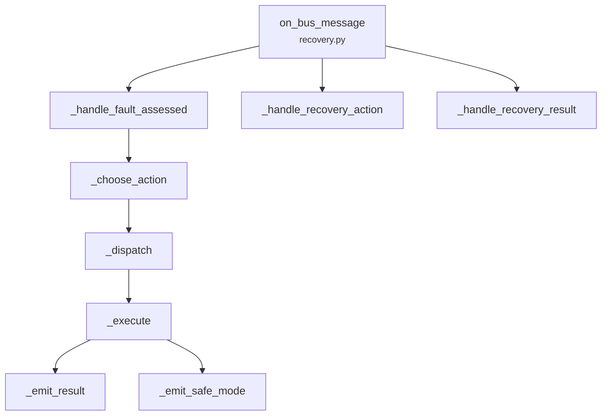

# 方法调用关系图

> 基于执行流检测生成的关键方法调用链。

## ExpressionState._recalculate 调用链

```mermaid
flowchart TD
    expression_state_py__recalculate["_recalculate<br/><small>expression_state.py</small>"]
    expression_state_py__map_legacy_expression_to_emotion["_map_legacy_expression_to_emotion<br/><small>expression_state.py</small>"]
    expression_state_py__compute_body_state["_compute_body_state<br/><small>expression_state.py</small>"]
    expression_state_py__compute_reset_at["_compute_reset_at<br/><small>expression_state.py</small>"]
    expression_state_py_init["init<br/><small>expression_state.py</small>"]
    expression_state_py_on_bus_message["on_bus_message<br/><small>expression_state.py</small>"]
    expression_state_py_ExpressionState["ExpressionState<br/><small>expression_state.py</small>"]
    expression_state_py__compute_pose["_compute_pose<br/><small>expression_state.py</small>"]
    expression_state_py_BodyState["BodyState<br/><small>expression_state.py</small>"]
    expression_state_py___init["__init__<br/><small>expression_state.py</small>"]
    expression_state_py_metadata["metadata<br/><small>expression_state.py</small>"]
    expression_state_py__initial_state["_initial_state<br/><small>expression_state.py</small>"]
    expression_state_py_expression["expression<br/><small>expression_state.py</small>"]
    expression_state_py_intensity["intensity<br/><small>expression_state.py</small>"]
    expression_state_py_emotion["emotion<br/><small>expression_state.py</small>"]
    expression_state_py_blend_duration["blend_duration<br/><small>expression_state.py</small>"]
    expression_state_py_expression_targets["expression_targets<br/><small>expression_state.py</small>"]
    expression_state_py_action["action<br/><small>expression_state.py</small>"]
    expression_state_py_mood_bias["mood_bias<br/><small>expression_state.py</small>"]
    expression_state_py_arousal["arousal<br/><small>expression_state.py</small>"]
    expression_state_py_reader_temperature["reader_temperature<br/><small>expression_state.py</small>"]
    expression_state_py_body_state["body_state<br/><small>expression_state.py</small>"]
    expression_state_py_reset_at["reset_at<br/><small>expression_state.py</small>"]
    expression_state_py_tick["tick<br/><small>expression_state.py</small>"]
    expression_state_py_to_dict["to_dict<br/><small>expression_state.py</small>"]
    expression_state_py_from_dict["from_dict<br/><small>expression_state.py</small>"]
    test_expression_state_py_test_default_expression_is_neutral["test_default_expression_is_neutral<br/><small>test_expression_state.py</small>"]
    test_expression_state_py_test_mood_bias_changes_expression["test_mood_bias_changes_expression<br/><small>test_expression_state.py</small>"]
    test_expression_state_py_test_low_arousal_calm_maps_to_relax["test_low_arousal_calm_maps_to_relaxed<br/><small>test_expression_state.py</small>"]
    test_expression_state_py_test_relaxed_mood_bias_maps_to_rela["test_relaxed_mood_bias_maps_to_relaxed<br/><small>test_expression_state.py</small>"]
    test_expression_state_py_test_expression_change_emits_event["test_expression_change_emits_event<br/><small>test_expression_state.py</small>"]
    test_expression_state_py_test_serialization_roundtrip["test_serialization_roundtrip<br/><small>test_expression_state.py</small>"]
    test_expression_state_py_test_emotion_profile_includes_airi_["test_emotion_profile_includes_airi_params<br/><small>test_expression_state.py</small>"]
    test_expression_state_py_test_expression_changed_payload_has["test_expression_changed_payload_has_airi_fields<br/><small>test_expression_state.py</small>"]
    test_expression_state_py_test_worried_maps_to_think_or_quest["test_worried_maps_to_think_or_question<br/><small>test_expression_state.py</small>"]
    test_expression_state_py_test_body_state_reflects_arousal["test_body_state_reflects_arousal<br/><small>test_expression_state.py</small>"]
    test_expression_state_py_test_transient_emotion_has_reset_at["test_transient_emotion_has_reset_at<br/><small>test_expression_state.py</small>"]
    test_expression_state_py_test_neutral_has_no_reset_at["test_neutral_has_no_reset_at<br/><small>test_expression_state.py</small>"]
    test_expression_state_py_test_body_state_pose_by_emotion["test_body_state_pose_by_emotion<br/><small>test_expression_state.py</small>"]
    main_py_create_modules["create_modules<br/><small>main.py</small>"]
    expression_state_py__home_hedaas____project_LinYi_src_noveli["/home/hedaas/文档/project/LinYi/src/novelist_brain/expression_state.py<br/><small>expression_state.py</small>"]
    test_social_to_expression_py__setup["_setup<br/><small>test_social_to_expression.py</small>"]
    models_py_ModuleState["ModuleState<br/><small>models.py</small>"]
    test_expression_state_py__home_hedaas____project_LinYi_tests["/home/hedaas/文档/project/LinYi/tests/test_expression_state.py<br/><small>test_expression_state.py</small>"]
    bus_py_BusRouter["BusRouter<br/><small>bus.py</small>"]
    module_py_register["register<br/><small>module.py</small>"]
    expression_state_py__recalculate --> expression_state_py__map_legacy_expression_to_emotion
    expression_state_py__recalculate --> expression_state_py__compute_body_state
    expression_state_py__recalculate --> expression_state_py__compute_reset_at
    expression_state_py__recalculate --> expression_state_py_init
    expression_state_py__recalculate --> expression_state_py_on_bus_message
    expression_state_py__recalculate --> expression_state_py_ExpressionState
    expression_state_py_ExpressionState --> expression_state_py__compute_pose
    expression_state_py_ExpressionState --> expression_state_py_BodyState
    expression_state_py_ExpressionState --> expression_state_py___init
    expression_state_py_ExpressionState --> expression_state_py_metadata
    expression_state_py_ExpressionState --> expression_state_py__initial_state
    expression_state_py_ExpressionState --> expression_state_py_expression
    expression_state_py_ExpressionState --> expression_state_py_intensity
    expression_state_py_ExpressionState --> expression_state_py_emotion
    expression_state_py_ExpressionState --> expression_state_py_blend_duration
    expression_state_py_ExpressionState --> expression_state_py_expression_targets
    expression_state_py_ExpressionState --> expression_state_py_action
    expression_state_py_ExpressionState --> expression_state_py_mood_bias
    expression_state_py_ExpressionState --> expression_state_py_arousal
    expression_state_py_ExpressionState --> expression_state_py_reader_temperature
    expression_state_py_ExpressionState --> expression_state_py_body_state
    expression_state_py_ExpressionState --> expression_state_py_reset_at
    expression_state_py_ExpressionState --> expression_state_py_tick
    expression_state_py_ExpressionState --> expression_state_py_to_dict
    expression_state_py_ExpressionState --> expression_state_py_from_dict
    expression_state_py_ExpressionState --> test_expression_state_py_test_default_expression_is_neutral
    expression_state_py_ExpressionState --> test_expression_state_py_test_mood_bias_changes_expression
    expression_state_py_ExpressionState --> test_expression_state_py_test_low_arousal_calm_maps_to_relax
    expression_state_py_ExpressionState --> test_expression_state_py_test_relaxed_mood_bias_maps_to_rela
    expression_state_py_ExpressionState --> test_expression_state_py_test_expression_change_emits_event
    expression_state_py_ExpressionState --> test_expression_state_py_test_serialization_roundtrip
    expression_state_py_ExpressionState --> test_expression_state_py_test_emotion_profile_includes_airi_
    expression_state_py_ExpressionState --> test_expression_state_py_test_expression_changed_payload_has
    expression_state_py_ExpressionState --> test_expression_state_py_test_worried_maps_to_think_or_quest
    expression_state_py_ExpressionState --> test_expression_state_py_test_body_state_reflects_arousal
    expression_state_py_ExpressionState --> test_expression_state_py_test_transient_emotion_has_reset_at
    expression_state_py_ExpressionState --> test_expression_state_py_test_neutral_has_no_reset_at
    expression_state_py_ExpressionState --> test_expression_state_py_test_body_state_pose_by_emotion
    expression_state_py_ExpressionState --> main_py_create_modules
    expression_state_py_ExpressionState --> expression_state_py__home_hedaas____project_LinYi_src_noveli
    expression_state_py_ExpressionState --> test_social_to_expression_py__setup
    test_social_to_expression_py__setup --> expression_state_py_to_dict
    test_social_to_expression_py__setup --> models_py_ModuleState
    test_social_to_expression_py__setup --> test_expression_state_py__home_hedaas____project_LinYi_tests
    test_social_to_expression_py__setup --> bus_py_BusRouter
    test_social_to_expression_py__setup --> module_py_register
```

## SocialVitalBridge.on_bus_message 调用链

```mermaid
flowchart TD
    social_vital_bridge_py_on_bus_message["on_bus_message<br/><small>social_vital_bridge.py</small>"]
    social_vital_bridge_py__handle_town_event["_handle_town_event<br/><small>social_vital_bridge.py</small>"]
    social_vital_bridge_py__handle_reader_interaction["_handle_reader_interaction<br/><small>social_vital_bridge.py</small>"]
    social_vital_bridge_py__handle_relationship_update["_handle_relationship_update<br/><small>social_vital_bridge.py</small>"]
    social_vital_bridge_py__handle_reader_profile_update["_handle_reader_profile_update<br/><small>social_vital_bridge.py</small>"]
    social_vital_bridge_py_SocialVitalBridge["SocialVitalBridge<br/><small>social_vital_bridge.py</small>"]
    social_vital_bridge_py__nudge["_nudge<br/><small>social_vital_bridge.py</small>"]
    social_vital_bridge_py__quick_sentiment["_quick_sentiment<br/><small>social_vital_bridge.py</small>"]
    social_vital_bridge_py___init["__init__<br/><small>social_vital_bridge.py</small>"]
    social_vital_bridge_py_metadata["metadata<br/><small>social_vital_bridge.py</small>"]
    social_vital_bridge_py__initial_state["_initial_state<br/><small>social_vital_bridge.py</small>"]
    social_vital_bridge_py_mood_bias["mood_bias<br/><small>social_vital_bridge.py</small>"]
    social_vital_bridge_py_arousal["arousal<br/><small>social_vital_bridge.py</small>"]
    social_vital_bridge_py_reader_temperature["reader_temperature<br/><small>social_vital_bridge.py</small>"]
    social_vital_bridge_py_creative_drive["creative_drive<br/><small>social_vital_bridge.py</small>"]
    social_vital_bridge_py_init["init<br/><small>social_vital_bridge.py</small>"]
    social_vital_bridge_py_tick["tick<br/><small>social_vital_bridge.py</small>"]
    social_vital_bridge_py__drift["_drift<br/><small>social_vital_bridge.py</small>"]
    social_vital_bridge_py__sync_state["_sync_state<br/><small>social_vital_bridge.py</small>"]
    social_vital_bridge_py__broadcast["_broadcast<br/><small>social_vital_bridge.py</small>"]
    social_vital_bridge_py_to_dict["to_dict<br/><small>social_vital_bridge.py</small>"]
    social_vital_bridge_py_from_dict["from_dict<br/><small>social_vital_bridge.py</small>"]
    test_social_vital_bridge_py_test_serialization_roundtrip["test_serialization_roundtrip<br/><small>test_social_vital_bridge.py</small>"]
    main_py_create_modules["create_modules<br/><small>main.py</small>"]
    social_vital_bridge_py__home_hedaas____project_LinYi_src_nov["/home/hedaas/文档/project/LinYi/src/novelist_brain/social_vital_bridge.py<br/><small>social_vital_bridge.py</small>"]
    test_social_to_expression_py__setup["_setup<br/><small>test_social_to_expression.py</small>"]
    test_social_vital_bridge_py__bridge["_bridge<br/><small>test_social_vital_bridge.py</small>"]
    models_py_ModuleState["ModuleState<br/><small>models.py</small>"]
    test_social_vital_bridge_py__home_hedaas____project_LinYi_te["/home/hedaas/文档/project/LinYi/tests/test_social_vital_bridge.py<br/><small>test_social_vital_bridge.py</small>"]
    identity_py_IdentityCore["IdentityCore<br/><small>identity.py</small>"]
    config_py_FaultConfig["FaultConfig<br/><small>config.py</small>"]
    module_registry_py_ModuleRegistry["ModuleRegistry<br/><small>module_registry.py</small>"]
    module_registry_py_register["register<br/><small>module_registry.py</small>"]
    metabolism_py_Metabolism["Metabolism<br/><small>metabolism.py</small>"]
    dynamics_py_Dynamics["Dynamics<br/><small>dynamics.py</small>"]
    memory_py_MemorySystem["MemorySystem<br/><small>memory.py</small>"]
    conversation_queue_py_ConversationQueue["ConversationQueue<br/><small>conversation_queue.py</small>"]
    memory_stream_py_MemoryStream["MemoryStream<br/><small>memory_stream.py</small>"]
    mid_term_memory_py_MidTermMemory["MidTermMemory<br/><small>mid_term_memory.py</small>"]
    self_timeline_py_SelfTimeline["SelfTimeline<br/><small>self_timeline.py</small>"]
    reflection_engine_py_ReflectionEngine["ReflectionEngine<br/><small>reflection_engine.py</small>"]
    segment_detail_enhancer_py_SegmentDetailEnhancer["SegmentDetailEnhancer<br/><small>segment_detail_enhancer.py</small>"]
    reader_profile_py_ReaderProfile["ReaderProfile<br/><small>reader_profile.py</small>"]
    reader_rest_gate_py_ReaderRestGate["ReaderRestGate<br/><small>reader_rest_gate.py</small>"]
    token_budget_py_TokenBudget["TokenBudget<br/><small>token_budget.py</small>"]
    personal_input_py_PersonalInput["PersonalInput<br/><small>personal_input.py</small>"]
    social_input_py_SocialInput["SocialInput<br/><small>social_input.py</small>"]
    expression_state_py_ExpressionState["ExpressionState<br/><small>expression_state.py</small>"]
    social_vital_bridge_py_on_bus_message --> social_vital_bridge_py__handle_town_event
    social_vital_bridge_py_on_bus_message --> social_vital_bridge_py__handle_reader_interaction
    social_vital_bridge_py_on_bus_message --> social_vital_bridge_py__handle_relationship_update
    social_vital_bridge_py_on_bus_message --> social_vital_bridge_py__handle_reader_profile_update
    social_vital_bridge_py_on_bus_message --> social_vital_bridge_py_SocialVitalBridge
    social_vital_bridge_py_SocialVitalBridge --> social_vital_bridge_py__nudge
    social_vital_bridge_py_SocialVitalBridge --> social_vital_bridge_py__quick_sentiment
    social_vital_bridge_py_SocialVitalBridge --> social_vital_bridge_py___init
    social_vital_bridge_py_SocialVitalBridge --> social_vital_bridge_py_metadata
    social_vital_bridge_py_SocialVitalBridge --> social_vital_bridge_py__initial_state
    social_vital_bridge_py_SocialVitalBridge --> social_vital_bridge_py_mood_bias
    social_vital_bridge_py_SocialVitalBridge --> social_vital_bridge_py_arousal
    social_vital_bridge_py_SocialVitalBridge --> social_vital_bridge_py_reader_temperature
    social_vital_bridge_py_SocialVitalBridge --> social_vital_bridge_py_creative_drive
    social_vital_bridge_py_SocialVitalBridge --> social_vital_bridge_py_init
    social_vital_bridge_py_SocialVitalBridge --> social_vital_bridge_py_tick
    social_vital_bridge_py_SocialVitalBridge --> social_vital_bridge_py__drift
    social_vital_bridge_py_SocialVitalBridge --> social_vital_bridge_py__sync_state
    social_vital_bridge_py_SocialVitalBridge --> social_vital_bridge_py__broadcast
    social_vital_bridge_py_SocialVitalBridge --> social_vital_bridge_py_to_dict
    social_vital_bridge_py_SocialVitalBridge --> social_vital_bridge_py_from_dict
    social_vital_bridge_py_SocialVitalBridge --> test_social_vital_bridge_py_test_serialization_roundtrip
    social_vital_bridge_py_SocialVitalBridge --> main_py_create_modules
    social_vital_bridge_py_SocialVitalBridge --> social_vital_bridge_py__home_hedaas____project_LinYi_src_nov
    social_vital_bridge_py_SocialVitalBridge --> test_social_to_expression_py__setup
    social_vital_bridge_py_SocialVitalBridge --> test_social_vital_bridge_py__bridge
    test_social_vital_bridge_py__bridge --> models_py_ModuleState
    test_social_vital_bridge_py__bridge --> test_social_vital_bridge_py__home_hedaas____project_LinYi_te
    test_social_vital_bridge_py__bridge --> identity_py_IdentityCore
    test_social_vital_bridge_py__bridge --> config_py_FaultConfig
    test_social_vital_bridge_py__bridge --> module_registry_py_ModuleRegistry
    test_social_vital_bridge_py__bridge --> module_registry_py_register
    test_social_vital_bridge_py__bridge --> metabolism_py_Metabolism
    test_social_vital_bridge_py__bridge --> dynamics_py_Dynamics
    test_social_vital_bridge_py__bridge --> memory_py_MemorySystem
    test_social_vital_bridge_py__bridge --> conversation_queue_py_ConversationQueue
    test_social_vital_bridge_py__bridge --> memory_stream_py_MemoryStream
    test_social_vital_bridge_py__bridge --> mid_term_memory_py_MidTermMemory
    test_social_vital_bridge_py__bridge --> self_timeline_py_SelfTimeline
    test_social_vital_bridge_py__bridge --> reflection_engine_py_ReflectionEngine
    test_social_vital_bridge_py__bridge --> segment_detail_enhancer_py_SegmentDetailEnhancer
    test_social_vital_bridge_py__bridge --> reader_profile_py_ReaderProfile
    test_social_vital_bridge_py__bridge --> reader_rest_gate_py_ReaderRestGate
    test_social_vital_bridge_py__bridge --> token_budget_py_TokenBudget
    test_social_vital_bridge_py__bridge --> personal_input_py_PersonalInput
    test_social_vital_bridge_py__bridge --> social_input_py_SocialInput
    test_social_vital_bridge_py__bridge --> expression_state_py_ExpressionState
```

## RecoveryManager.on_bus_message 调用链（高关键性流）

```mermaid
flowchart TD
    obm["on_bus_message<br/><small>recovery.py</small>"]
    obm --> hfa["_handle_fault_assessed"]
    obm --> hra["_handle_recovery_action"]
    obm --> hrr["_handle_recovery_result"]
    hfa --> ca["_choose_action"]
    ca --> disp["_dispatch"]
    disp --> exec["_execute"]
    exec --> emitr["_emit_result"]
    exec --> emits["_emit_safe_mode"]
```
