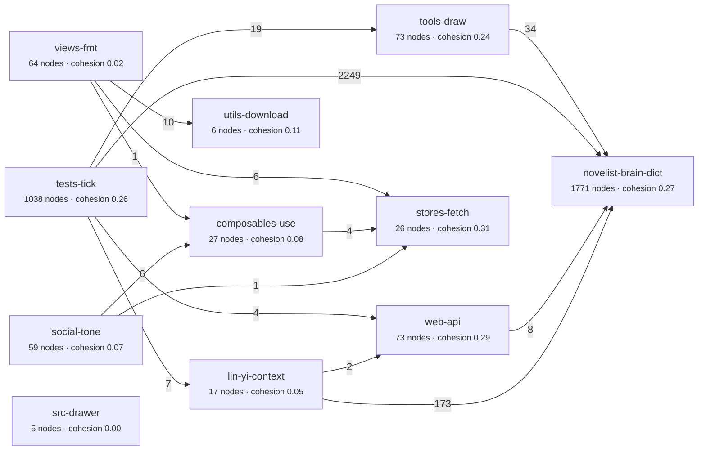

# 模块依赖关系图

> 基于社区检测与跨社区边生成的模块依赖关系。

共 **12** 个社区，**2524** 条跨社区边。

> 注：为保持可读性，隐藏了庞大的 `assets-constructor`（前端静态资源）社区。

## 社区列表

| 社区 | 大小 | 内聚度 | 主导语言 | 描述 |
|------|------|--------|----------|------|
| `assets-constructor` | 3579 | 0.532 | javascript | Directory-based community: src/novelist_brain/web/static |
| `novelist-brain-dict` | 1771 | 0.271 | python | Directory-based community: src/novelist_brain |
| `tests-tick` | 1038 | 0.261 | python | Directory-based community: tests |
| `web-api` | 73 | 0.289 | python | Directory-based community: src/novelist_brain/web |
| `tools-draw` | 73 | 0.241 | python | Directory-based community: tools |
| `views-fmt` | 64 | 0.019 | vue | Directory-based community: src/webui/src/views |
| `social-tone` | 59 | 0.074 | vue | Directory-based community: src/webui/src/components |
| `composables-use` | 27 | 0.084 | typescript | Directory-based community: src/webui/src/composables |
| `stores-fetch` | 26 | 0.315 | typescript | Directory-based community: src/webui/src/stores |
| `lin-yi-context` | 17 | 0.054 | python | Directory-based community: main |
| `utils-download` | 6 | 0.106 | typescript | Directory-based community: src/webui/src/utils |
| `src-drawer` | 5 | 0.000 | vue | Directory-based community: src/webui/src |

## 高耦合警告

- ⚠️ High coupling (2249 edges) between 'novelist-brain-dict' and 'tests-tick'
- ⚠️ High coupling (173 edges) between 'lin-yi-context' and 'novelist-brain-dict'
- ⚠️ High coupling (34 edges) between 'novelist-brain-dict' and 'tools-draw'
- ⚠️ High coupling (19 edges) between 'tests-tick' and 'tools-draw'
