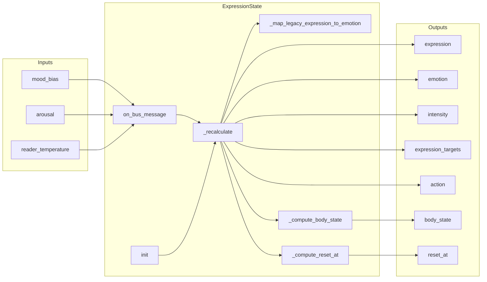
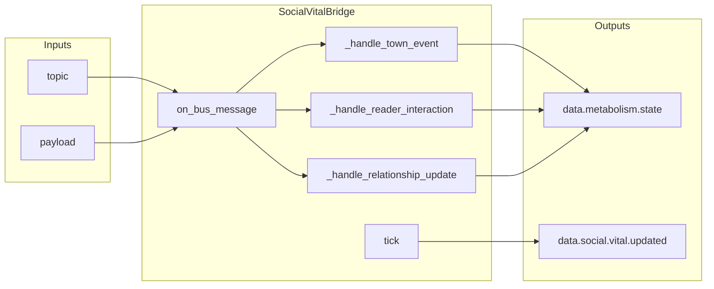

# 函数参数流程图

> 展示关键函数的输入参数如何流动并影响输出。

## ExpressionState 情绪计算参数流

```mermaid
flowchart LR
    subgraph Inputs
        mood[mood_bias]
        arousal[arousal]
        rt[reader_temperature]
    end
    subgraph ExpressionState
        init[init]
        obm[on_bus_message]
        recalc[_recalculate]
        map[_map_legacy_expression_to_emotion]
        body[_compute_body_state]
        reset[_compute_reset_at]
    end
    subgraph Outputs
        expr[expression]
        emo[emotion]
        intensity[intensity]
        targets[expression_targets]
        action[action]
        bs[body_state]
        ra[reset_at]
    end
    mood --> obm
    arousal --> obm
    rt --> obm
    obm --> recalc
    init --> recalc
    recalc --> map
    recalc --> body
    recalc --> reset
    recalc --> expr
    recalc --> emo
    recalc --> intensity
    recalc --> targets
    recalc --> action
    body --> bs
    reset --> ra
```

## SocialVitalBridge 事件处理参数流

```mermaid
flowchart LR
    subgraph Inputs
        topic[topic]
        payload[payload]
    end
    subgraph SocialVitalBridge
        obm[on_bus_message]
        hte[_handle_town_event]
        hri[_handle_reader_interaction]
        hru[_handle_relationship_update]
        tick[tick]
    end
    subgraph Outputs
        mbs[data.metabolism.state]
        svu[data.social.vital.updated]
    end
    topic --> obm
    payload --> obm
    obm --> hte
    obm --> hri
    obm --> hru
    hte --> mbs
    hri --> mbs
    hru --> mbs
    tick --> svu
```
