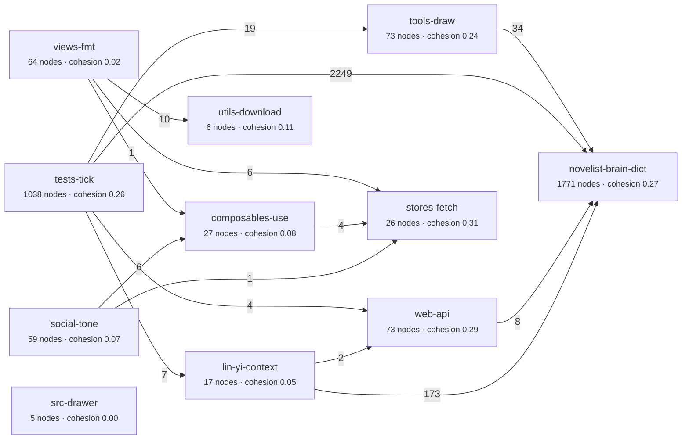
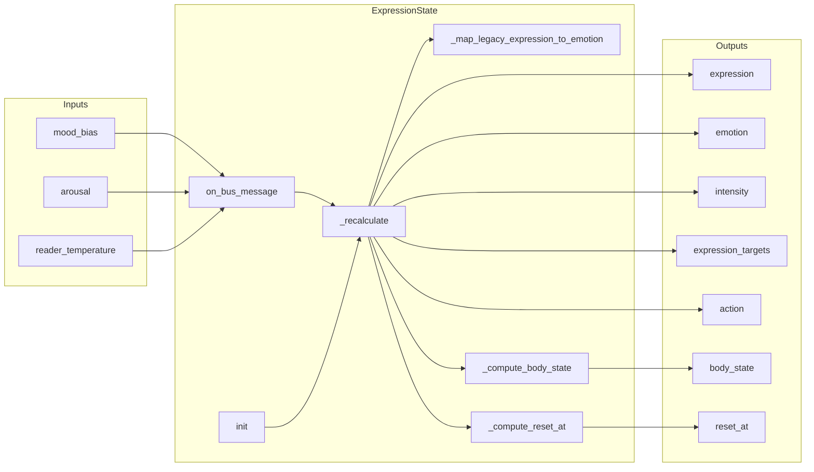

# LinYi 代码图可视化索引

> 基于最新代码图索引（205 文件 · 7667 节点 · 46059 边 · 1171 执行流 · 12 社区）生成。

## 可视化图谱列表

1. [类层次结构图](code_graph_class_hierarchy.md)
2. [模块依赖关系图](code_graph_module_dependencies.md)
3. [方法调用关系图](code_graph_method_calls.md)
4. [函数参数流程图](code_graph_parameter_flows.md)

## 快速概览

### 类层次结构（Module 子类）

```mermaid
graph TD
    Module[Module<br/><small>src/novelist_brain/module.py</small>]
    Module --> AttachmentModule[AttachmentModule<br/><small>attachment.py</small>]
    Module --> CentralExecutiveNetwork[CentralExecutiveNetwork<br/><small>cen.py</small>]
    Module --> ChapterManager[ChapterManager<br/><small>chapter_manager.py</small>]
    Module --> CharacterCardModule[CharacterCardModule<br/><small>character_card_module.py</small>]
    Module --> COCMappingEngine[COCMappingEngine<br/><small>coc_mapping_engine.py</small>]
    Module --> ContinuityAuditor[ContinuityAuditor<br/><small>continuity_auditor.py</small>]
    Module --> ConversationQueue[ConversationQueue<br/><small>conversation_queue.py</small>]
    Module --> CreationExecutive[CreationExecutive<br/><small>creation_executive.py</small>]
    Module --> DefaultModeNetwork[DefaultModeNetwork<br/><small>dmn.py</small>]
    Module --> Dynamics[Dynamics<br/><small>dynamics.py</small>]
    Module --> EvaluationObservabilitySystem[EvaluationObservabilitySystem<br/><small>eos.py</small>]
    Module --> ExpressionState[ExpressionState<br/><small>expression_state.py</small>]
    Module --> IdentityCore[IdentityCore<br/><small>identity.py</small>]
    Module --> LLMFactExtractor[LLMFactExtractor<br/><small>llm_fact_extractor.py</small>]
    Module --> MemorySystem[MemorySystem<br/><small>memory.py</small>]
    Module --> MemoryStream[MemoryStream<br/><small>memory_stream.py</small>]
    Module --> Metabolism[Metabolism<br/><small>metabolism.py</small>]
    Module --> MidTermMemory[MidTermMemory<br/><small>mid_term_memory.py</small>]
    Module --> AgentFactoryWrapper[_AgentFactoryWrapper<br/><small>module_registry.py</small>]
    Module --> NovelOutput[NovelOutput<br/><small>novel_output.py</small>]
    Module --> OCCharacterSystem[OCCharacterSystem<br/><small>oc_character_system.py</small>]
    Module --> OCTownEngine[OCTownEngine<br/><small>oc_town_engine.py</small>]
    Module --> PersonaInjector[PersonaInjector<br/><small>persona_injector.py</small>]
    Module --> PersonalInput[PersonalInput<br/><small>personal_input.py</small>]
    Module --> Planner[Planner<br/><small>planner.py</small>]
    Module --> PromptSurface[PromptSurface<br/><small>prompt_surface.py</small>]
    Module --> QualityEngine[QualityEngine<br/><small>quality_engine.py</small>]
    Module --> ReaderProfile[ReaderProfile<br/><small>reader_profile.py</small>]
    Module --> ReaderRestGate[ReaderRestGate<br/><small>reader_rest_gate.py</small>]
    Module --> FaultManager[FaultManager<br/><small>recovery.py</small>]
    Module --> RecoveryManager[RecoveryManager<br/><small>recovery.py</small>]
    Module --> ReflectionEngine[ReflectionEngine<br/><small>reflection_engine.py</small>]
    Module --> RelationshipGraph[RelationshipGraph<br/><small>relationship_graph.py</small>]
    Module --> SalienceNetwork[SalienceNetwork<br/><small>salience_network.py</small>]
    Module --> MentalSandbox[MentalSandbox<br/><small>sandbox.py</small>]
    Module --> SegmentDetailEnhancer[SegmentDetailEnhancer<br/><small>segment_detail_enhancer.py</small>]
    Module --> SelfTimeline[SelfTimeline<br/><small>self_timeline.py</small>]
    Module --> SocialInput[SocialInput<br/><small>social_input.py</small>]
    Module --> SocialVitalBridge[SocialVitalBridge<br/><small>social_vital_bridge.py</small>]
    Module --> TokenBudget[TokenBudget<br/><small>token_budget.py</small>]
    Module --> ToolUseModule[ToolUseModule<br/><small>tool_use_module.py</small>]
    Module --> WorldBookTrigger[WorldBookTrigger<br/><small>world_book_trigger.py</small>]
    Module --> WorldVisualDebugger[WorldVisualDebugger<br/><small>world_visual_debugger.py</small>]
    Module --> SpyModule[_SpyModule<br/><small>test_attachment_creation_integration.py</small>]
    Module --> SpyModule[_SpyModule<br/><small>test_attachment_social_network_integration.py</small>]
    Module --> SpyModule[_SpyModule<br/><small>test_expression_state.py</small>]
    Module --> SpyModule[_SpyModule<br/><small>test_expression_state.py</small>]
    Module --> SpyModule[_SpyModule<br/><small>test_memory_stream.py</small>]
    Module --> AlphaModule[AlphaModule<br/><small>test_module_registry.py</small>]
    Module --> BetaModule[BetaModule<br/><small>test_module_registry.py</small>]
    Module --> ReflectionSpy[_ReflectionSpy<br/><small>test_oc_memory_reflection.py</small>]
    Module --> SpyModule[_SpyModule<br/><small>test_oc_town_engine.py</small>]
    Module --> SpyModule[_SpyModule<br/><small>test_reader_profile.py</small>]
    Module --> SpyModule[_SpyModule<br/><small>test_reader_rest_gate.py</small>]
    Module --> SpyModule[_SpyModule<br/><small>test_reader_rest_gate.py</small>]
    Module --> SpyModule[_SpyModule<br/><small>test_reflection_engine.py</small>]
    Module --> SpyModule[_SpyModule<br/><small>test_relationship_graph.py</small>]
    Module --> SpyModule[_SpyModule<br/><small>test_relationship_graph.py</small>]
    Module --> Spy[_Spy<br/><small>test_social_vital_bridge.py</small>]
    Module --> SpyModule[_SpyModule<br/><small>test_token_budget.py</small>]
    Module --> SpyModule[_SpyModule<br/><small>test_token_budget.py</small>]
    Module --> CounterModule[CounterModule<br/><small>test_transaction.py</small>]
    Module --> DummyModule[DummyModule<br/><small>test_webui.py</small>]
```

### 模块依赖关系

### ExpressionState 情绪计算参数流

### ExpressionState._recalculate 方法调用链

```mermaid
flowchart TD
    expression_state_py__recalculate["_recalculate<br/><small>expression_state.py</small>"]
    expression_state_py__map_legacy_expression_to_emotion["_map_legacy_expression_to_emotion<br/><small>expression_state.py</small>"]
    expression_state_py__compute_body_state["_compute_body_state<br/><small>expression_state.py</small>"]
    expression_state_py__compute_reset_at["_compute_reset_at<br/><small>expression_state.py</small>"]
    expression_state_py_init["init<br/><small>expression_state.py</small>"]
    expression_state_py_on_bus_message["on_bus_message<br/><small>expression_state.py</small>"]
    expression_state_py_ExpressionState["ExpressionState<br/><small>expression_state.py</small>"]
    expression_state_py__compute_pose["_compute_pose<br/><small>expression_state.py</small>"]
    expression_state_py_BodyState["BodyState<br/><small>expression_state.py</small>"]
    expression_state_py___init["__init__<br/><small>expression_state.py</small>"]
    expression_state_py_metadata["metadata<br/><small>expression_state.py</small>"]
    expression_state_py__initial_state["_initial_state<br/><small>expression_state.py</small>"]
    expression_state_py_expression["expression<br/><small>expression_state.py</small>"]
    expression_state_py_intensity["intensity<br/><small>expression_state.py</small>"]
    expression_state_py_emotion["emotion<br/><small>expression_state.py</small>"]
    expression_state_py_blend_duration["blend_duration<br/><small>expression_state.py</small>"]
    expression_state_py_expression_targets["expression_targets<br/><small>expression_state.py</small>"]
    expression_state_py_action["action<br/><small>expression_state.py</small>"]
    expression_state_py_mood_bias["mood_bias<br/><small>expression_state.py</small>"]
    expression_state_py_arousal["arousal<br/><small>expression_state.py</small>"]
    expression_state_py_reader_temperature["reader_temperature<br/><small>expression_state.py</small>"]
    expression_state_py_body_state["body_state<br/><small>expression_state.py</small>"]
    expression_state_py_reset_at["reset_at<br/><small>expression_state.py</small>"]
    expression_state_py_tick["tick<br/><small>expression_state.py</small>"]
    expression_state_py_to_dict["to_dict<br/><small>expression_state.py</small>"]
    expression_state_py_from_dict["from_dict<br/><small>expression_state.py</small>"]
    test_expression_state_py_test_default_expression_is_neutral["test_default_expression_is_neutral<br/><small>test_expression_state.py</small>"]
    test_expression_state_py_test_mood_bias_changes_expression["test_mood_bias_changes_expression<br/><small>test_expression_state.py</small>"]
    test_expression_state_py_test_low_arousal_calm_maps_to_relax["test_low_arousal_calm_maps_to_relaxed<br/><small>test_expression_state.py</small>"]
    test_expression_state_py_test_relaxed_mood_bias_maps_to_rela["test_relaxed_mood_bias_maps_to_relaxed<br/><small>test_expression_state.py</small>"]
    test_expression_state_py_test_expression_change_emits_event["test_expression_change_emits_event<br/><small>test_expression_state.py</small>"]
    test_expression_state_py_test_serialization_roundtrip["test_serialization_roundtrip<br/><small>test_expression_state.py</small>"]
    test_expression_state_py_test_emotion_profile_includes_airi_["test_emotion_profile_includes_airi_params<br/><small>test_expression_state.py</small>"]
    test_expression_state_py_test_expression_changed_payload_has["test_expression_changed_payload_has_airi_fields<br/><small>test_expression_state.py</small>"]
    test_expression_state_py_test_worried_maps_to_think_or_quest["test_worried_maps_to_think_or_question<br/><small>test_expression_state.py</small>"]
    test_expression_state_py_test_body_state_reflects_arousal["test_body_state_reflects_arousal<br/><small>test_expression_state.py</small>"]
    test_expression_state_py_test_transient_emotion_has_reset_at["test_transient_emotion_has_reset_at<br/><small>test_expression_state.py</small>"]
    test_expression_state_py_test_neutral_has_no_reset_at["test_neutral_has_no_reset_at<br/><small>test_expression_state.py</small>"]
    test_expression_state_py_test_body_state_pose_by_emotion["test_body_state_pose_by_emotion<br/><small>test_expression_state.py</small>"]
    main_py_create_modules["create_modules<br/><small>main.py</small>"]
    expression_state_py__home_hedaas____project_LinYi_src_noveli["/home/hedaas/文档/project/LinYi/src/novelist_brain/expression_state.py<br/><small>expression_state.py</small>"]
    test_social_to_expression_py__setup["_setup<br/><small>test_social_to_expression.py</small>"]
    models_py_ModuleState["ModuleState<br/><small>models.py</small>"]
    test_expression_state_py__home_hedaas____project_LinYi_tests["/home/hedaas/文档/project/LinYi/tests/test_expression_state.py<br/><small>test_expression_state.py</small>"]
    bus_py_BusRouter["BusRouter<br/><small>bus.py</small>"]
    module_py_register["register<br/><small>module.py</small>"]
    expression_state_py__recalculate --> expression_state_py__map_legacy_expression_to_emotion
    expression_state_py__recalculate --> expression_state_py__compute_body_state
    expression_state_py__recalculate --> expression_state_py__compute_reset_at
    expression_state_py__recalculate --> expression_state_py_init
    expression_state_py__recalculate --> expression_state_py_on_bus_message
    expression_state_py__recalculate --> expression_state_py_ExpressionState
    expression_state_py_ExpressionState --> expression_state_py__compute_pose
    expression_state_py_ExpressionState --> expression_state_py_BodyState
    expression_state_py_ExpressionState --> expression_state_py___init
    expression_state_py_ExpressionState --> expression_state_py_metadata
    expression_state_py_ExpressionState --> expression_state_py__initial_state
    expression_state_py_ExpressionState --> expression_state_py_expression
    expression_state_py_ExpressionState --> expression_state_py_intensity
    expression_state_py_ExpressionState --> expression_state_py_emotion
    expression_state_py_ExpressionState --> expression_state_py_blend_duration
    expression_state_py_ExpressionState --> expression_state_py_expression_targets
    expression_state_py_ExpressionState --> expression_state_py_action
    expression_state_py_ExpressionState --> expression_state_py_mood_bias
    expression_state_py_ExpressionState --> expression_state_py_arousal
    expression_state_py_ExpressionState --> expression_state_py_reader_temperature
    expression_state_py_ExpressionState --> expression_state_py_body_state
    expression_state_py_ExpressionState --> expression_state_py_reset_at
    expression_state_py_ExpressionState --> expression_state_py_tick
    expression_state_py_ExpressionState --> expression_state_py_to_dict
    expression_state_py_ExpressionState --> expression_state_py_from_dict
    expression_state_py_ExpressionState --> test_expression_state_py_test_default_expression_is_neutral
    expression_state_py_ExpressionState --> test_expression_state_py_test_mood_bias_changes_expression
    expression_state_py_ExpressionState --> test_expression_state_py_test_low_arousal_calm_maps_to_relax
    expression_state_py_ExpressionState --> test_expression_state_py_test_relaxed_mood_bias_maps_to_rela
    expression_state_py_ExpressionState --> test_expression_state_py_test_expression_change_emits_event
    expression_state_py_ExpressionState --> test_expression_state_py_test_serialization_roundtrip
    expression_state_py_ExpressionState --> test_expression_state_py_test_emotion_profile_includes_airi_
    expression_state_py_ExpressionState --> test_expression_state_py_test_expression_changed_payload_has
    expression_state_py_ExpressionState --> test_expression_state_py_test_worried_maps_to_think_or_quest
    expression_state_py_ExpressionState --> test_expression_state_py_test_body_state_reflects_arousal
    expression_state_py_ExpressionState --> test_expression_state_py_test_transient_emotion_has_reset_at
    expression_state_py_ExpressionState --> test_expression_state_py_test_neutral_has_no_reset_at
    expression_state_py_ExpressionState --> test_expression_state_py_test_body_state_pose_by_emotion
    expression_state_py_ExpressionState --> main_py_create_modules
    expression_state_py_ExpressionState --> expression_state_py__home_hedaas____project_LinYi_src_noveli
    expression_state_py_ExpressionState --> test_social_to_expression_py__setup
    test_social_to_expression_py__setup --> expression_state_py_to_dict
    test_social_to_expression_py__setup --> models_py_ModuleState
    test_social_to_expression_py__setup --> test_expression_state_py__home_hedaas____project_LinYi_tests
    test_social_to_expression_py__setup --> bus_py_BusRouter
    test_social_to_expression_py__setup --> module_py_register
```

