# 林逸的一天：循环审计、模块溯源与重构建议

> **审计日期**：2026-07-23
> **审计对象**：LinYi 小说家大脑 Agent（仓库 HeDaas-Code/LinYi）
> **代码规模**：22,682 行 Python / 82 文件（含 184 tests）
> **审计视角**：以"林逸的一天"这一核心循环为主线，串联模块职责、参考项目溯源、循环缺陷与重构建议
> **表达方式**：以 Mermaid 架构图为主，文字作图注与结论
> **上游依据**：[Design.md](file:///workspace/Design.md)、[main.py](file:///workspace/main.py)、[src/novelist_brain/clock.py](file:///workspace/src/novelist_brain/clock.py)、[src/novelist_brain/scheduler.py](file:///workspace/src/novelist_brain/scheduler.py)、[docs/AUDIT-REPORT.md](file:///workspace/docs/AUDIT-REPORT.md)、[docs/拟人化日程节律与角色社交补强方案_v2.md](file:///workspace/docs/拟人化日程节律与角色社交补强方案_v2.md)、[docs/系统重构方案_v1.md](file:///workspace/docs/系统重构方案_v1.md)、[docs/refs/borrow_matrix.md](file:///workspace/docs/refs/borrow_matrix.md)

---

## 0. 一句话结论

林逸的一天是一个由 **RealTimeClock 驱动、DailyScheduler 用 B=MAT 模型评分调整、SalienceNetwork 在 DMN/CEN 间切换**的 8 阶段昼夜循环：白天以 DMN 为主"生活、观察、积累记忆"，晚间 19:00–23:00 切到 CEN"把白天活过的素材写成小说"，深夜回到 DMN"做梦与酝酿"。这个循环由 40+ 模块在事件总线上协作完成，借鉴了 21 个开源项目；当前最大的结构性问题是**循环素材质量（fragment 重复/模板化）+ 长期运行稳定性（记忆无界增长/线程不安全）+ 缺失的遗忘与边界机制**。

---

## 1. 林逸的一天：8 阶段循环全景

### 1.1 循环全景图

林逸的节律定义在 [src/novelist_brain/clock.py](file:///workspace/src/novelist_brain/clock.py) 的 `Clock.DEFAULT_RHYTHM` 与 [src/novelist_brain/scheduler.py](file:///workspace/src/novelist_brain/scheduler.py) 的 `DailyScheduler.DEFAULT_PHASES`，两者对齐：

```mermaid
gantt
    title 林逸的一天：8 阶段昼夜循环（00:00–24:00）
    dateFormat HH:mm
    axisFormat %H:%M

    section 睡眠/梦境
    deep_night DMN 做梦/低代谢        :dmn, 00:00, 6h

    section 苏醒
    morning 低需求输入/晨间例程       :mor, 06:00, 2h

    section 白天-生活
    incubation DMN 观察灵感漫游       :dmn2, 08:00, 4h
    social SN/CEN 社交遭遇/午餐       :soc, 12:00, 2h
    simulation CEN 推演/沙盒热身      :cen, 14:00, 4h

    section 晚间-创作
    reflection DMN 复盘/日记          :ref, 18:00, 1h
    creation CEN 晚间写作             :cre, 19:00, 4h

    section 夜间-酝酿
    incubation DMN 睡前酝酿           :inc, 23:00, 1h
```

**8 阶段对照表**（时间、主导网络、核心模块、输入、产出）：

| 阶段 | 时间 | 主导网络 | 核心模块 | 输入来源 | 产出物 |
|------|------|---------|---------|---------|--------|
| deep_night | 00:00–06:00 | DMN | DMN、MemorySystem、ReflectionEngine | 昨日 fragment/paragraph | 梦境 fragment、反思结论 |
| morning | 06:00–08:00 | DMN | IdentityCore、PromptSurface、DailyScheduler | 当前时间、昨日日记 | 当日 DailyPlan |
| incubation | 08:00–12:00 | DMN | PersonalInput、DMN、SelfTimeline | 系统时间、本地配置、昨日残留 | 经验 fragment |
| social | 12:00–14:00 | SN/CEN | SocialInput、OCTownEngine、RelationshipGraph | 读者消息、OC 社交事件 | 社交 fragment、关系更新 |
| simulation | 14:00–18:00 | CEN | CEN、COCMappingEngine、MentalSandbox | 记忆痕迹、世界设定 | 沙盒推演叙事素材 |
| reflection | 18:00–19:00 | DMN | ReflectionEngine、MidTermMemory | 当日 fragment/对话 | 反思结论、压缩摘要 |
| creation | 19:00–23:00 | CEN | Planner、CreationExecutive、ChapterManager、NovelOutput、ContinuityAuditor、QualityEngine | 白天素材、StoryBible、ChapterIntent | 小说段落/章节 |
| incubation | 23:00–24:00 | DMN | DMN、SelfTimeline | 当日全量事件 | 睡前酝酿 fragment、日记 |

### 1.2 循环驱动机制

循环由三层协作驱动，定义在 [main.py](file:///workspace/main.py) 的 `run_agent()` 与 [src/novelist_brain/clock.py](file:///workspace/src/novelist_brain/clock.py)：

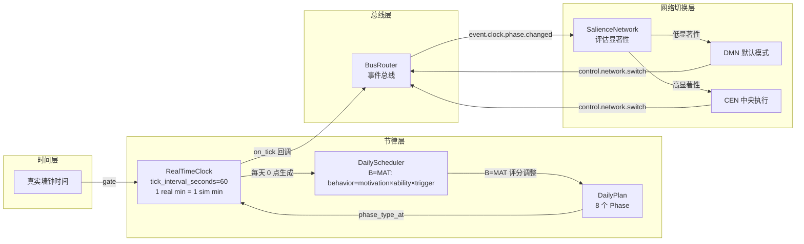

**关键机制**：

1. **RealTimeClock**（[clock.py:159](file:///workspace/src/novelist_brain/clock.py#L159)）：默认 1 真实分钟 = 1 模拟分钟 = 1 tick，与现实时间同步常驻运行；`--fast-forward` 时每 tick 推进 30 分钟用于压缩测试。
2. **DailyScheduler**（[scheduler.py:84](file:///workspace/src/novelist_brain/scheduler.py#L84)）：基于 B=MAT 模型（behavior = motivation × ability × trigger）生成 DailyPlan，可在能量低/社交透支时降级（减少 creation/social，增加 recovery/sleep）。
3. **SalienceNetwork**：评估每个输入碎片的显著性，低显著性走 DMN（做梦/反思/漫游），高显著性走 CEN（目标管理/计划/写作）。
4. **总线广播**：clock.on_tick 回调把 `event.clock.phase.changed` 发到总线，所有模块订阅该 topic 并据此切换行为。

---

## 2. 模块分层架构

### 2.1 13 层分层架构

林逸的 40+ 模块按职能分为 13 层，全部注册在 [main.py](file:///workspace/main.py) 的 `create_modules()` 与 `ModuleRegistry`：

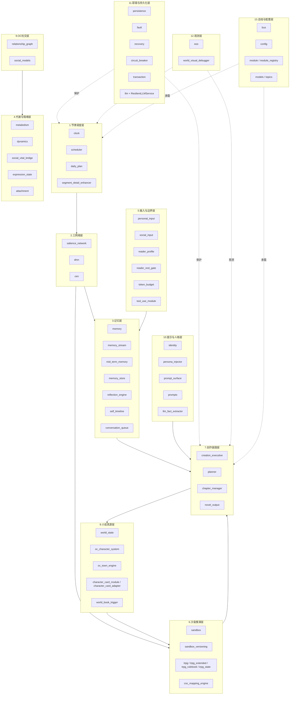

### 2.2 模块职责清单

下表覆盖循环核心模块，给出"一句话职责 + 关键事件 topic + 参考项目"（参考项目详见第 4 节）。

#### 节律调度层

| 模块 | 职责 | 关键 topic | 参考项目 |
|------|------|-----------|---------|
| [clock.py](file:///workspace/src/novelist_brain/clock.py) | 真实时间时钟，把墙钟时间映射到 8 阶段 | event.clock.phase.changed | generative_agents（reverie 主循环） |
| [scheduler.py](file:///workspace/src/novelist_brain/scheduler.py) | B=MAT 评分生成/调整 DailyPlan | control.schedule.adjust | astrbot_companion（两层日程） |
| [daily_plan.py](file:///workspace/src/novelist_brain/daily_plan.py) | PlanItem + SegmentDetail 数据模型 | data.daily_plan.updated | astrbot_companion |
| [segment_detail_enhancer.py](file:///workspace/src/novelist_brain/segment_detail_enhancer.py) | 细化当前时段（today_events/proactive_events） | data.segment.detail | astrbot_companion（SegmentDetail） |

#### 三网络层

| 模块 | 职责 | 关键 topic | 参考项目 |
|------|------|-----------|---------|
| [salience_network.py](file:///workspace/src/novelist_brain/salience_network.py) | 评估输入显著性，切换 DMN/CEN | control.network.switch | 脑科学三大网络模型 |
| [dmn.py](file:///workspace/src/novelist_brain/dmn.py) | 默认模式：做梦、反思、心理漫游 | data.dmn.fragment | generative_agents（reflection） |
| [cen.py](file:///workspace/src/novelist_brain/cen.py) | 中央执行：目标管理、计划、触发创作 | control.sandbox.scenario.load | 脑科学 CEN |

#### 记忆层

| 模块 | 职责 | 关键 topic | 参考项目 |
|------|------|-----------|---------|
| [memory.py](file:///workspace/src/novelist_brain/memory.py) | Fragment→Trace→巩固 主记忆系统 | data.memory.trace.created | generative_agents、mem0 |
| [memory_stream.py](file:///workspace/src/novelist_brain/memory_stream.py) | recency+importance+relevance 三因子检索 + 混合 | data.memory_stream.update | generative_agents、a16z companion |
| [mid_term_memory.py](file:///workspace/src/novelist_brain/mid_term_memory.py) | 对话队列溢出后压缩摘要 | data.memory.mid_term.summary | MaiBot（mid_term） |
| [memory_store.py](file:///workspace/src/novelist_brain/memory_store.py) | 记忆持久化后端（memory/sqlite） | — | mem0、MemGPT |
| [reflection_engine.py](file:///workspace/src/novelist_brain/reflection_engine.py) | 累计 importance 触发高阶反思 | data.reflection.generated | generative_agents（reflect） |
| [self_timeline.py](file:///workspace/src/novelist_brain/self_timeline.py) | 统一记录"今天已做过什么"防失忆重复 | data.self.timeline.updated | astrbot_companion |
| [conversation_queue.py](file:///workspace/src/novelist_brain/conversation_queue.py) | 最近 N 条对话 FIFO | data.conversation.queue.update | a16z companion（Redis 队列） |

#### 代谢与情绪层

| 模块 | 职责 | 关键 topic | 参考项目 |
|------|------|-----------|---------|
| [metabolism.py](file:///workspace/src/novelist_brain/metabolism.py) | energy/compute_budget/time_currency/social_capital | data.metabolism.state | Design.md §7 代谢预算 |
| [dynamics.py](file:///workspace/src/novelist_brain/dynamics.py) | 习惯强度、动机向量 | data.dynamics.updated | BJ Fogg 行为模型 |
| [social_vital_bridge.py](file:///workspace/src/novelist_brain/social_vital_bridge.py) | 社交事件→情绪维度+衰减 | data.social.vital.updated | Project AIRI（情绪连续性） |
| [expression_state.py](file:///workspace/src/novelist_brain/expression_state.py) | vital state→表情/身体参数 | data.expression.changed | Project AIRI（VRM/Live2D） |
| [attachment.py](file:///workspace/src/novelist_brain/attachment.py) | 依恋风格心理扩展 | data.attachment.updated | 心理学依恋理论 |

#### 输入与边界层

| 模块 | 职责 | 关键 topic | 参考项目 |
|------|------|-----------|---------|
| [personal_input.py](file:///workspace/src/novelist_brain/personal_input.py) | 封闭系统内个人经验碎片 | data.fragment.personal.new | astrbot_companion |
| [social_input.py](file:///workspace/src/novelist_brain/social_input.py) | 社交遭遇碎片 | data.fragment.social.new | ai-town |
| [reader_profile.py](file:///workspace/src/novelist_brain/reader_profile.py) | 读者画像与 known_facts | data.reader.profile.updated | MaiBot（印象） |
| [reader_rest_gate.py](file:///workspace/src/novelist_brain/reader_rest_gate.py) | 本地读者休息信号门控（5 级） | control.reader.rest | astrbot_companion（user_rest_gate） |
| [token_budget.py](file:///workspace/src/novelist_brain/token_budget.py) | 内部 token 成本治理 | control.token.budget.exhausted | astrbot_companion |
| [tool_use_module.py](file:///workspace/src/novelist_brain/tool_use_module.py) | 只读本地 MCP 工具层 | data.tool.result | Agent Zero（工具抽象） |

#### 沙盒推演层

| 模块 | 职责 | 关键 topic | 参考项目 |
|------|------|-----------|---------|
| [sandbox.py](file:///workspace/src/novelist_brain/sandbox.py) | 脑中世界 TRPG what-if 推演 | data.sandbox.narrative.ready | Design.md §13 沙盒 |
| [sandbox_versioning.py](file:///workspace/src/novelist_brain/sandbox_versioning.py) | A/B 分叉版本管理 | control.sandbox.fork | Design.md §13 A/B |
| [trpg*.py](file:///workspace/src/novelist_brain/trpg.py) | COC 风格技能检定/战斗/追逐 | data.trpg.skill_check | COC 跑团规则 |
| [coc_mapping_engine.py](file:///workspace/src/novelist_brain/coc_mapping_engine.py) | StoryBible→定制 Rulebook+章节场景 | data.coc.scenario.built | Webnovel Writer（题材模板） |

#### 创作链路层

| 模块 | 职责 | 关键 topic | 参考项目 |
|------|------|-----------|---------|
| [planner.py](file:///workspace/src/novelist_brain/planner.py) | NarrativeLine→ChapterIntent+四线编织 | data.novel.chapter.intent | Webnovel Writer（Strand Weave）、ainovel-cli（滚动规划） |
| [creation_executive.py](file:///workspace/src/novelist_brain/creation_executive.py) | Director 角色：决定+编排段落生成 | data.novel.paragraph | AI Novel Factory（Director/Worker）、NovelPilot（9-Agent） |
| [chapter_manager.py](file:///workspace/src/novelist_brain/chapter_manager.py) | 卷/章/段三级+版本控制+回溯 | event.novel.chapter.committed | ainovel-cli（Checkpoint） |
| [novel_output.py](file:///workspace/src/novelist_brain/novel_output.py) | 段落发布（v1 扁平列表） | event.novel.paragraph.published | — |

#### 小说真源层

| 模块 | 职责 | 关键 topic | 参考项目 |
|------|------|-----------|---------|
| [world_state.py](file:///workspace/src/novelist_brain/world_state.py) | WorldStateContract（地理/派系/规则/谜团） | data.world.updated | AI Novel Factory（单一真源） |
| [oc_character_system.py](file:///workspace/src/novelist_brain/oc_character_system.py) | OC 角色档案 CRUD+immutable 锁 | data.oc.created | SillyTavern（角色卡）、ai-town（Player） |
| [oc_town_engine.py](file:///workspace/src/novelist_brain/oc_town_engine.py) | OC 自治社交模拟 | data.oc.town.event | ai-town（Agent.tick/Conversation） |
| [character_card_*.py](file:///workspace/src/novelist_brain/character_card_module.py) | SillyTavern V2 角色卡导入导出 | data.oc.character.imported | SillyTavern（V2/V3 spec） |
| [world_book_trigger.py](file:///workspace/src/novelist_brain/world_book_trigger.py) | 世界书/角色书关键词触发注入 | data.world_book.triggered | SillyTavern（World Info） |

#### OC 社交层

| 模块 | 职责 | 关键 topic | 参考项目 |
|------|------|-----------|---------|
| [relationship_graph.py](file:///workspace/src/novelist_brain/relationship_graph.py) | 有向关系边+时序历史+阶段模型 | data.relationship.updated | Zep（时序图谱）、ai-town |
| [social_models.py](file:///workspace/src/novelist_brain/social_models.py) | GazePressure 等社交模型 | data.social.gaze | Design.md §16 |

#### 提示与人格层

| 模块 | 职责 | 关键 topic | 参考项目 |
|------|------|-----------|---------|
| [identity.py](file:///workspace/src/novelist_brain/identity.py) | 林逸人格内核（LinYiProfile） | data.identity.constraint | evolve-linyi spec |
| [persona_injector.py](file:///workspace/src/novelist_brain/persona_injector.py) | 识别当前回合人物并注入画像 | data.persona.injected | MaiBot（person_profile） |
| [prompt_surface.py](file:///workspace/src/novelist_brain/prompt_surface.py) | 10 槽位有序 prompt 组装 | data.prompt.surface.updated | SillyTavern、a16z、AIRI |
| [prompts.py](file:///workspace/src/novelist_brain/prompts.py) | 雪花写作法+结构选择器+去AI味 | — | AI_NovelGenerator_YILING、NovelDreamer、ainovel-cli |
| [llm_fact_extractor.py](file:///workspace/src/novelist_brain/llm_fact_extractor.py) | 自动学习读者/OC 稳定事实 | data.fact.extracted | MemGPT、MaiBot |

#### 容错与持久化层

| 模块 | 职责 | 关键 topic | 参考项目 |
|------|------|-----------|---------|
| [persistence.py](file:///workspace/src/novelist_brain/persistence.py) | 快照+增量 log+原子写+retention | control.fault.error(PERSISTENCE) | AI Novel Factory、astrbot（store_manager） |
| [fault.py](file:///workspace/src/novelist_brain/fault.py) | 错误分类与严重度 | control.fault.error | — |
| [recovery.py](file:///workspace/src/novelist_brain/recovery.py) | 恢复动作派发+safe_mode | control.recovery.action | — |
| [circuit_breaker.py](file:///workspace/src/novelist_brain/circuit_breaker.py) | LLM 熔断器+lease/heartbeat | control.circuit.open | AI Novel Factory（autopilot-worker） |
| [transaction.py](file:///workspace/src/novelist_brain/transaction.py) | tick 级事务回滚 | — | — |
| [llm.py](file:///workspace/src/novelist_brain/llm.py) | ResilientLLMService（重试+熔断+Mock 降级） | event.llm.fallback | NovelPilot（retry/fallback） |

#### 观测层

| 模块 | 职责 | 关键 topic | 参考项目 |
|------|------|-----------|---------|
| [eos.py](file:///workspace/src/novelist_brain/eos.py) | 7 个 Collector 非侵入观测+阈值告警 | control.eos.recommendation | Design.md §EOS |
| [world_visual_debugger.py](file:///workspace/src/novelist_brain/world_visual_debugger.py) | 世界快照/diff + COC 回放 | data.debug.world.snapshot | — |

#### 总线与配置层

| 模块 | 职责 | 参考项目 |
|------|------|---------|
| [bus.py](file:///workspace/src/novelist_brain/bus.py) | BusRouter pub/sub，模块零耦合 | AstrBot（事件总线） |
| [config.py](file:///workspace/src/novelist_brain/config.py) | NovelistConfig 统一配置 | — |
| [module.py](file:///workspace/src/novelist_brain/module.py) | Module 基类（tick/init/register/to_dict） | — |
| [module_registry.py](file:///workspace/src/novelist_brain/module_registry.py) | 模块注册+依赖+插件发现 | AstrBot、AI Novel Factory |

### 2.3 单 Agent 轨 + 多 Agent 轨双轨数据流

林逸采用"单 Agent 拟人化 + 多 Agent OC 社交"双轨，两轨通过 `WorldStateContract` 与 `SelfTimeline` 交换素材（定义在 [docs/拟人化日程节律与角色社交补强方案_v2.md](file:///workspace/docs/拟人化日程节律与角色社交补强方案_v2.md) §4）：

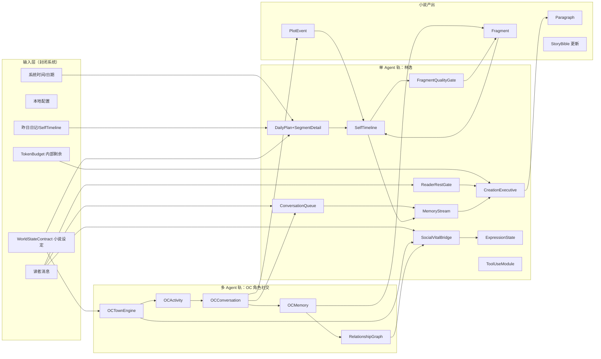

---

## 3. 各阶段模块协作时序

### 3.1 deep_night + morning：做梦与苏醒

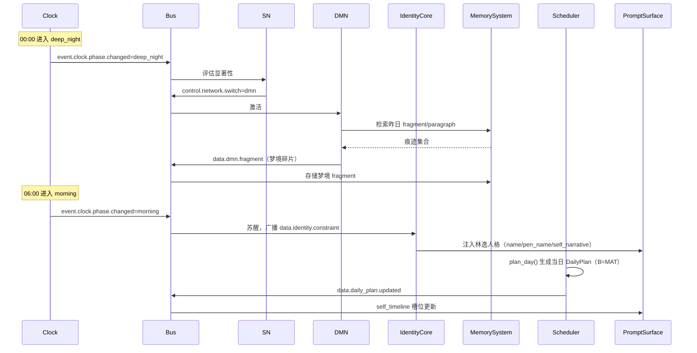

### 3.2 incubation + social：生活与社交

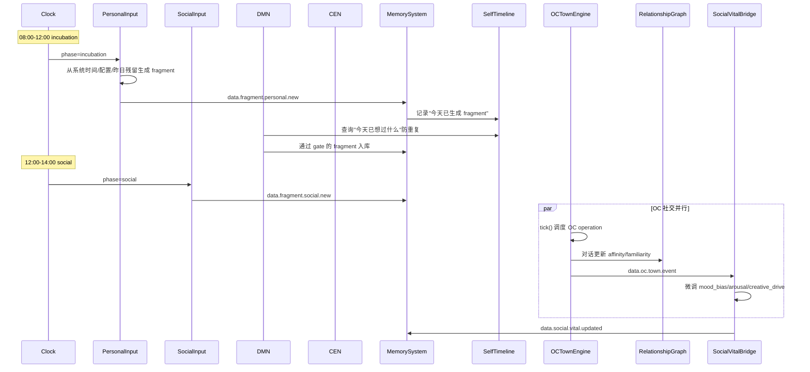

### 3.3 simulation：下午推演

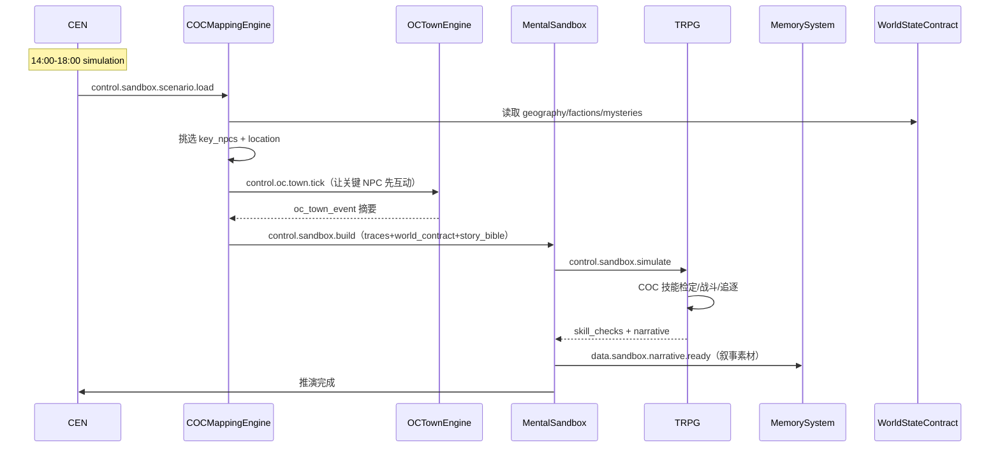

### 3.4 creation：晚间写作（核心产出阶段）

晚间创作是林逸一天的核心产出阶段，调用最长的模块链路，定义在 [docs/系统重构方案_v1.md](file:///workspace/docs/系统重构方案_v1.md) §2：

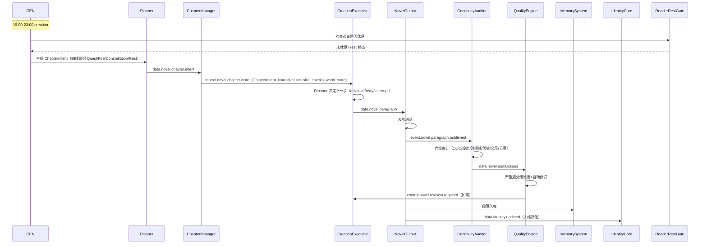

### 3.5 reflection + 夜间 incubation：复盘与酝酿

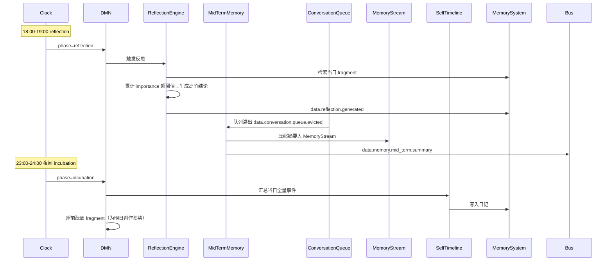

---

## 4. 模块-参考项目映射

### 4.1 参考项目分组映射图

林逸借鉴了 21 个开源项目，按职能分为 7 组（来源：[docs/refs/borrow_matrix.md](file:///workspace/docs/refs/borrow_matrix.md) 与 [docs/拟人化日程节律与角色社交补强方案_v2.md](file:///workspace/docs/拟人化日程节律与角色社交补强方案_v2.md) §15）：

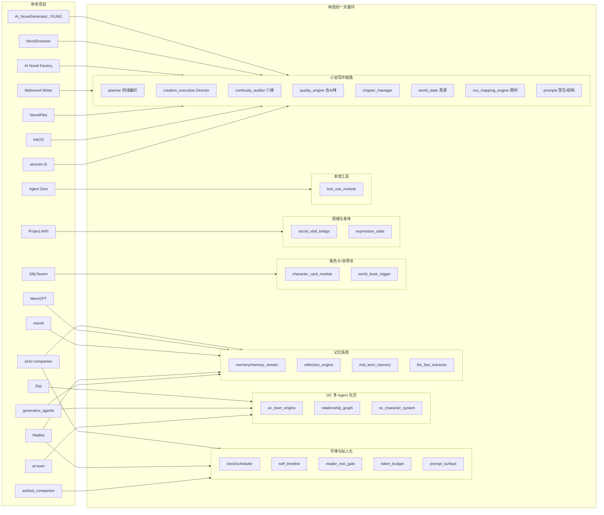

### 4.2 借鉴矩阵（14 个小说写作借鉴点）

来自 [docs/refs/borrow_matrix.md](file:///workspace/docs/refs/borrow_matrix.md)，覆盖 7 个小说写作项目：

| # | 借鉴点 | 主参考 | 辅助参考 | LinYi 落地位置 |
|---|--------|--------|----------|----------------|
| 1 | Story Bible 真源 | Webnovel Writer | NovelPilot / AI Novel Factory | [models.py::StoryBible](file:///workspace/src/novelist_brain/models.py) + `story_bible/{novel_id}.json` |
| 2 | Strand Weave 四线节奏 | Webnovel Writer | ainovel-cli | [planner.py::Planner](file:///workspace/src/novelist_brain/planner.py) |
| 3 | ContinuityAuditor 六维审计 | InkOS | ainovel-cli / NovelPilot | [continuity_auditor.py](file:///workspace/src/novelist_brain/continuity_auditor.py) |
| 4 | 去 AI 味规则 | ainovel-cli | Webnovel Writer | [quality_engine.py](file:///workspace/src/novelist_brain/quality_engine.py) + [prompts.py](file:///workspace/src/novelist_brain/prompts.py) |
| 5 | 滚动规划 | ainovel-cli | AI Novel Factory | [planner.py](file:///workspace/src/novelist_brain/planner.py) + [chapter_manager.py](file:///workspace/src/novelist_brain/chapter_manager.py) |
| 6 | 雪花写作法提示词 | AI_NovelGenerator_YILING | NovelPilot | [prompts.py](file:///workspace/src/novelist_brain/prompts.py) |
| 7 | 显式叙事结构 | NovelDreamer | AI_NovelGenerator_YILING | [prompts.py](file:///workspace/src/novelist_brain/prompts.py)（结构选择器常量） |
| 8 | 单一真源（SQLite/JSON） | AI Novel Factory | Webnovel Writer | [persistence.py](file:///workspace/src/novelist_brain/persistence.py) + `story_bible/` |
| 9 | 多 Agent 流水线 | NovelPilot | InkOS | [creation_executive.py](file:///workspace/src/novelist_brain/creation_executive.py) + [module_registry.py](file:///workspace/src/novelist_brain/module_registry.py) |
| 10 | 文风指纹 | ainovel-cli | InkOS | [quality_engine.py](file:///workspace/src/novelist_brain/quality_engine.py) + StoryBible.style_fingerprint |
| 11 | 题材模板 | Webnovel Writer | AI_NovelGenerator_YILING | [coc_mapping_engine.py](file:///workspace/src/novelist_brain/coc_mapping_engine.py) |
| 12 | Foreshadowing Tracker | NovelPilot | Webnovel Writer | StoryBible.foreshadowing_ledger + [planner.py::ForeshadowingOp](file:///workspace/src/novelist_brain/planner.py) |
| 13 | Director/Worker 协作 | AI Novel Factory | — | [creation_executive.py](file:///workspace/src/novelist_brain/creation_executive.py)（Director）+ [scheduler.py](file:///workspace/src/novelist_brain/scheduler.py)（Worker）+ [circuit_breaker.py](file:///workspace/src/novelist_brain/circuit_breaker.py) |
| 14 | 风格迁移（外部语料） | NovelDreamer | — | [prompts.py](file:///workspace/src/novelist_brain/prompts.py) + [memory.py](file:///workspace/src/novelist_brain/memory.py) |

### 4.3 拟人化补强借鉴（7 个虚拟生命项目）

来自 [docs/拟人化日程节律与角色社交补强方案_v2.md](file:///workspace/docs/拟人化日程节律与角色社交补强方案_v2.md) §15，对应 7 个补强方向：

| 补强方向 | 主参考 | 辅助参考 | LinYi 落地 | 状态 |
|---------|--------|----------|-----------|------|
| 1. 记忆分层+三因子检索 | generative_agents、mem0 | Zep、MemGPT | [memory_stream.py](file:///workspace/src/novelist_brain/memory_stream.py) | ⚠️ 部分（无向量、无分层） |
| 2. 反思+三因子检索 | generative_agents | mem0 | [reflection_engine.py](file:///workspace/src/novelist_brain/reflection_engine.py) | ⚠️ 部分 |
| 3. 完整拟人化节律 | astrbot_companion | — | clock/scheduler/self_timeline/reader_rest_gate/token_budget | ⚠️ 部分（DailyPlan LLM 生成未落地） |
| 4. OC 自治社交 | ai-town | generative_agents | [oc_town_engine.py](file:///workspace/src/novelist_brain/oc_town_engine.py) + [relationship_graph.py](file:///workspace/src/novelist_brain/relationship_graph.py) | ✅ 基础已落地 |
| 5. 角色卡规范对齐 | SillyTavern | a16z companion | [character_card_module.py](file:///workspace/src/novelist_brain/character_card_module.py) + [world_book_trigger.py](file:///workspace/src/novelist_brain/world_book_trigger.py) | ✅ V2 已落地 |
| 6. 情绪连续性桥接 | Project AIRI | — | [social_vital_bridge.py](file:///workspace/src/novelist_brain/social_vital_bridge.py) + [expression_state.py](file:///workspace/src/novelist_brain/expression_state.py) | ✅ 已落地 |
| 7. 工具使用（安全沙盒） | Agent Zero | — | [tool_use_module.py](file:///workspace/src/novelist_brain/tool_use_module.py) | ✅ 已落地 |

### 4.4 参考项目能力 → LinYi 模块（ER 视图）

```mermaid
erDiagram
    generative_agents ||--o{ MEMORY_STREAM : "三因子检索+反思"
    ai_town ||--o{ OC_TOWN_ENGINE : "Agent.tick+Conversation"
    ai_town ||--o{ RELATIONSHIP_GRAPH : "participatedTogether"
    astrbot_companion ||--o{ CLOCK_SCHEDULER : "两层日程"
    astrbot_companion ||--o{ SELF_TIMELINE : "防失忆"
    astrbot_companion ||--o{ READER_REST_GATE : "休息门控"
    astrbot_companion ||--o{ TOKEN_BUDGET : "成本治理"
    astrbot_companion ||--o{ PROMPT_SURFACE : "槽位组装"
    mem0 ||--o{ MEMORY : "提取+检索+rerank"
    Zep ||--o{ RELATIONSHIP_GRAPH : "时序图谱"
    MemGPT ||--o{ LLM_FACT_EXTRACTOR : "分层记忆"
    SillyTavern ||--o{ CHARACTER_CARD_MODULE : "V2角色卡"
    SillyTavern ||--o{ WORLD_BOOK_TRIGGER : "WorldInfo触发"
    Project_AIRI ||--o{ SOCIAL_VITAL_BRIDGE : "情绪连续性"
    Project_AIRI ||--o{ EXPRESSION_STATE : "身体参数"
    a16z_companion ||--o{ CONVERSATION_QUEUE : "对话队列"
    a16z_companion ||--o{ MEMORY_STREAM : "混合检索"
    Agent_Zero ||--o{ TOOL_USE_MODULE : "工具抽象"
    MaiBot ||--o{ PERSONA_INJECTOR : "画像注入"
    MaiBot ||--o{ MID_TERM_MEMORY : "聊天回想"
    ainovel_cli ||--o{ PLANNER : "滚动规划"
    ainovel_cli ||--o{ QUALITY_ENGINE : "去AI味+文风指纹"
    ainovel_cli ||--o{ CHAPTER_MANAGER : "Checkpoint"
    InkOS ||--o{ CONTINUITY_AUDITOR : "六维审计"
    NovelPilot ||--o{ CREATION_EXECUTIVE : "9-Agent流水线"
    NovelPilot ||--o{ PLANNER : "ForeshadowingTracker"
    Webnovel_Writer ||--o{ PLANNER : "StrandWeave"
    Webnovel_Writer ||--o{ COC_MAPPING_ENGINE : "题材模板"
    AI_Novel_Factory ||--o{ PERSISTENCE : "单一真源"
    AI_Novel_Factory ||--o{ CREATION_EXECUTIVE : "Director/Worker"
    NovelDreamer ||--o{ PROMPTS : "结构选择器"
    AI_NovelGenerator_YILING ||--o{ PROMPTS : "雪花写作法"
```

---

## 5. 循环缺陷审计

### 5.1 缺陷清单（定位到代码）

缺陷来源：[docs/AUDIT-REPORT.md](file:///workspace/docs/AUDIT-REPORT.md)（工程审计）+ [docs/拟人化日程节律与角色社交补强方案_v1.md](file:///workspace/docs/拟人化日程节律与角色社交补强方案_v2.md) §1（节律诊断）+ 本次循环分析。

| # | 严重度 | 缺陷 | 代码位置 | 影响 |
|---|--------|------|---------|------|
| D1 | **P0** | BusRouter 无线程安全保护 | [bus.py](file:///workspace/src/novelist_brain/bus.py) | WebUI 线程 + 主线程并发 publish/flush 丢消息，常驻运行最易触发 |
| D2 | **P1** | 记忆多结构无界增长（_fragments/_traces/_social_provenance/_skill_checks/_prediction_errors） | [memory.py](file:///workspace/src/novelist_brain/memory.py)、[sandbox.py](file:///workspace/src/novelist_brain/sandbox.py) | 7×24 常驻 OOM |
| D3 | **P1** | 遗忘机制缺失（有 recency 衰减计算，无剪枝执行） | [memory.py](file:///workspace/src/novelist_brain/memory.py) | Design.md §12 遗忘曲线未落地 |
| D4 | **P1** | reconstruct_dataclass 的 Literal 类型检查脆弱（`str(origin).startswith("typing.Literal")`） | [persistence.py](file:///workspace/src/novelist_brain/persistence.py) | Python 3.12+ 可能失效 |
| D5 | **P2** | LLM _strip_reasoning_prefix 60+ 硬编码正则脆弱 | [llm.py:515-621](file:///workspace/src/novelist_brain/llm.py#L515) | 正常散文误判 |
| D6 | **P2** | 沙盒战斗 defender 选择只看 other_characters[0] | [sandbox.py](file:///workspace/src/novelist_brain/sandbox.py) | 推演偏差 |
| D7 | **P2** | save_incremental 存完整状态而非增量 | [persistence.py](file:///workspace/src/novelist_brain/persistence.py) | 注释说增量实际全量，长跑 IO 压力 |
| D8 | **P2** | fragment 同义密集重复 + 标签化非生活化 | [memory.py](file:///workspace/src/novelist_brain/memory.py) + [dmn.py](file:///workspace/src/novelist_brain/dmn.py) | 一天循环素材质量差 |
| D9 | **P2** | 日程模板感强（8 阶段每天相似，无"今天是什么日子/昨日残留/小意外"） | [scheduler.py](file:///workspace/src/novelist_brain/scheduler.py) | 循环缺乏变量 |
| D10 | **P2** | DailyPlan LLM 生成未落地（仍是硬编码 DEFAULT_PHASES） | [scheduler.py](file:///workspace/src/novelist_brain/scheduler.py) | B=MAT 评分无实际效果 |
| D11 | **P2** | 三网络切换粗糙（SN 仅按显著性阈值，未结合 reader_temperature/creative_drive） | [salience_network.py](file:///workspace/src/novelist_brain/salience_network.py) | 切换不够拟人 |
| D12 | **P3** | apply_retention 从未在主循环调用（v2 已补，仍需验证） | [main.py](file:///workspace/main.py) | 旧快照堆积 |
| D13 | **P3** | _apply_loaded_context 混用 dict 和 dataclass | [main.py:455](file:///workspace/main.py#L455) | 状态恢复脆弱 |
| D14 | **P3** | 记忆检索仅关键词，无向量/BM25/reranker | [memory_stream.py](file:///workspace/src/novelist_brain/memory_stream.py) | 三因子检索质量低 |
| D15 | **P3** | 无实体识别/知识图谱（OC 关系有时序，实体无图谱） | — | 长篇一致性弱 |

### 5.2 缺陷因果图

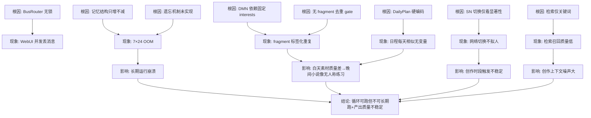

### 5.3 缺陷覆盖状态

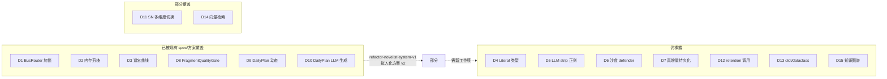

---

## 6. 进一步/重构建议与路线图

### 6.1 重构建议表（P0~P3）

| 优先级 | 建议 | 对应缺陷 | 复杂度 | 收益 | 对应 spec/工作项 | 参考来源 |
|--------|------|---------|--------|------|-----------------|---------|
| **P0** | BusRouter 加 `threading.RLock()` 保护 publish/flush/subscribe | D1 | 低 | 高 | 新工作项 | [AUDIT-REPORT.md](file:///workspace/docs/AUDIT-REPORT.md) #2 |
| **P0** | 接入 FragmentQualityGate（签名+语义+时间线三重过滤）+ importance 评分 | D8 | 中 | 高 | 拟人化方案 v2 阶段一 | generative_agents、astrbot |
| **P0** | SelfTimeline 已落地，需补"今天已写过什么"在创作前查询 | D8/D9 | 中 | 高 | 拟人化方案 v2 阶段一 | astrbot |
| **P0** | 记忆剪枝执行（importance 阈值+recency 衰减实际删除） | D2/D3 | 中 | 高 | 新工作项 | Design.md §12、mem0 |
| **P1** | DailyPlan LLM 生成落地（每天早晨生成一次，fallback 到 DEFAULT_PHASES） | D9/D10 | 高 | 高 | 拟人化方案 v2 阶段二 | astrbot |
| **P1** | VitalState 扩展 Metabolism（mood_bias/arousal/creative_drive）+ SN 引入多维度切换 | D11 | 低 | 中 | 拟人化方案 v2 阶段三 | astrbot、Project AIRI |
| **P1** | 三因子检索升级为向量+BM25 混合（替换关键词） | D14 | 中 | 中 | 拟人化方案 v2 阶段一 | mem0、a16z |
| **P1** | OCTownEngine 完整对话状态机+OCMemory importance+反思 | — | 高 | 中 | 拟人化方案 v2 阶段三 | ai-town |
| **P2** | LLM reasoning strip 改用 structured output / tool calling | D5 | 中 | 中 | 新工作项 | NovelPilot（retry/fallback） |
| **P2** | save_incremental 改为真增量（只写 delta） | D7 | 中 | 中 | refactor-novelist-system-v1 | AI Novel Factory |
| **P2** | TokenBudget 内部治理（软/硬上限+任务分级） | — | 中 | 中 | 拟人化方案 v2 阶段二 | astrbot、mem0 |
| **P2** | 沙盒 defender 选择改为最近敌对角色 | D6 | 低 | 低 | 新工作项 | — |
| **P2** | reconstruct_dataclass 改 `origin is Literal` | D4 | 低 | 低 | 新工作项 | [AUDIT-REPORT.md](file:///workspace/docs/AUDIT-REPORT.md) #4 |
| **P3** | 分层记忆（工作/情景/语义，MemGPT 模式） | D14 | 高 | 中 | 拟人化方案 v2 阶段五 | MemGPT |
| **P3** | 时序知识图谱（实体-关系-时间戳，Zep 模式） | D15 | 高 | 中 | 拟人化方案 v2 阶段五 | Zep |
| **P3** | MCP 工具协议正式接入（与本地 MCP 生态互通） | — | 中 | 低 | 拟人化方案 v2 阶段五 | mem0、autogen |
| **P3** | apply_retention 在主循环日边界调用验证 | D12 | 低 | 低 | 新工作项 | [AUDIT-REPORT.md](file:///workspace/docs/AUDIT-REPORT.md) #9 |

### 6.2 重构路线图

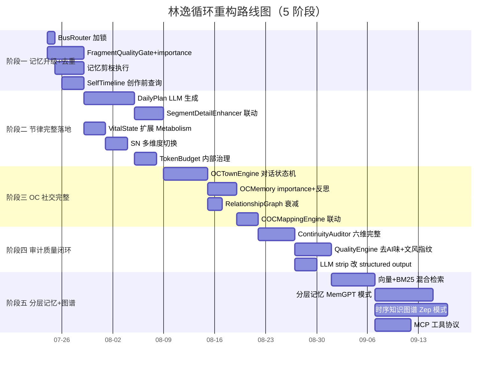

### 6.3 目标循环：补强后林逸的一天

补强后，循环应呈现如下形态（对比第 1 节现状）：

```mermaid
flowchart LR
    subgraph 白天["白天：生活+社交（DMN 为主）"]
        B1[DailyPlan LLM 生成<br/>基于昨日日记+今日日期+状态]
        B2[SegmentDetail 细化<br/>含 today_events/proactive_events]
        B3[FragmentQualityGate<br/>签名+语义+时间线三重过滤]
        B4[PersonalInput/SocialInput<br/>具体时间地点动作身体感受]
        B5[OCTownEngine<br/>OC 自治对话+反思+关系演化]
        B6[SelfTimeline<br/>统一记录防失忆]
        B7[SocialVitalBridge<br/>社交事件→情绪+衰减]
    end

    subgraph 晚间["晚间：创作（CEN 为主）"]
        E1[Planner 四线编织<br/>Quest/Fire/Constellation/Rest]
        E2[CreationExecutive Director<br/>决定+编排+retry/interrupt]
        E3[ContinuityAuditor 六维审计]
        E4[QualityEngine 去AI味+文风指纹]
        E5[ChapterManager 卷/章/段+版本]
    end

    subgraph 夜间["夜间：反思+梦境（DMN 为主）"]
        N1[ReflectionEngine<br/>importance 累计触发高阶结论]
        N2[MidTermMemory<br/>对话压缩摘要]
        N3[记忆剪枝<br/>遗忘曲线实际执行]
        N4[DMN 做梦<br/>重组当日残留]
    end

    B1 --> B2 --> B3 --> B4 --> B5 --> B6 --> B7
    B7 --> E1
    E1 --> E2 --> E3 --> E4 --> E5
    E5 --> N1 --> N2 --> N3 --> N4
    N4 -.->|次日| B1
```

**目标循环的关键差异**：

1. **DailyPlan 由 LLM 动态生成**，不再每天硬编码（解 D9/D10）
2. **FragmentQualityGate 三重过滤**，素材不再标签化重复（解 D8）
3. **OC 社交完整闭环**，OC 自治产生涌现情节种子（参考 ai-town）
4. **创作链路六维审计+去AI味**，产出具备小说性（参考 7 个小说项目）
5. **夜间记忆剪枝实际执行**，7×24 可持续（解 D2/D3）
6. **SocialVitalBridge 让情绪真正反映社交事件**，循环有情感起伏（参考 Project AIRI）

---

## 7. 审计结论

### 7.1 循环定性

林逸的一天是一个**设计严谨、借鉴广泛、落地度高**的虚拟生命循环：

- **设计严谨**：8 阶段节律对齐真实时间，DMN/CEN/SN 三网络切换有脑科学依据，B=MAT 评分模型有行为科学依据。
- **借鉴广泛**：21 个参考项目覆盖单 Agent 拟人化、多 Agent 社交、记忆工程、角色卡规范、情绪身体、工具使用、小说写作 7 个维度，借鉴矩阵 100% 覆盖。
- **落地度高**：184 tests 全绿，40+ 模块全部注册到总线，主循环 [main.py](file:///workspace/main.py) 已支持常驻运行+快照+增量+retention+事务回滚。

### 7.2 主要风险

循环的**结构性风险**集中在三处：

1. **长期运行稳定性**：BusRouter 线程不安全（P0）+ 记忆无界增长（P1）+ 遗忘缺失（P1）→ 7×24 跑不动。
2. **循环素材质量**：fragment 重复+日程模板化+三网络切换粗糙 → 一天循环产出"像无人称的文学练习"。
3. **工程债务**：LLM strip 正则脆弱+持久化非真增量+Literal 类型检查脆弱 → 长期维护成本高。

### 7.3 优先行动

按"先稳住、再提质、后扩展"的顺序：

1. **先稳住**（P0，1–2 周）：BusRouter 加锁 + 记忆剪枝 + FragmentQualityGate + SelfTimeline 创作前查询。
2. **再提质**（P1，3–4 周）：DailyPlan LLM 生成 + VitalState 扩展 + 向量检索 + OCTownEngine 完整闭环。
3. **后扩展**（P2–P3，按需）：LLM strip 重构 + 真增量持久化 + 分层记忆 + 时序图谱 + MCP 工具协议。

完成 P0+P1 后，林逸的一天将真正成为"生活在电脑中、有自己人格和社交的虚拟生命"的可信循环。

---

## 附录 A：关键文件索引

| 层 | 文件 |
|----|------|
| 主循环 | [main.py](file:///workspace/main.py) |
| 节律 | [clock.py](file:///workspace/src/novelist_brain/clock.py)、[scheduler.py](file:///workspace/src/novelist_brain/scheduler.py)、[daily_plan.py](file:///workspace/src/novelist_brain/daily_plan.py) |
| 三网络 | [salience_network.py](file:///workspace/src/novelist_brain/salience_network.py)、[dmn.py](file:///workspace/src/novelist_brain/dmn.py)、[cen.py](file:///workspace/src/novelist_brain/cen.py) |
| 记忆 | [memory.py](file:///workspace/src/novelist_brain/memory.py)、[memory_stream.py](file:///workspace/src/novelist_brain/memory_stream.py)、[mid_term_memory.py](file:///workspace/src/novelist_brain/mid_term_memory.py)、[reflection_engine.py](file:///workspace/src/novelist_brain/reflection_engine.py)、[self_timeline.py](file:///workspace/src/novelist_brain/self_timeline.py)、[conversation_queue.py](file:///workspace/src/novelist_brain/conversation_queue.py) |
| 代谢情绪 | [metabolism.py](file:///workspace/src/novelist_brain/metabolism.py)、[social_vital_bridge.py](file:///workspace/src/novelist_brain/social_vital_bridge.py)、[expression_state.py](file:///workspace/src/novelist_brain/expression_state.py) |
| 输入边界 | [personal_input.py](file:///workspace/src/novelist_brain/personal_input.py)、[social_input.py](file:///workspace/src/novelist_brain/social_input.py)、[reader_profile.py](file:///workspace/src/novelist_brain/reader_profile.py)、[reader_rest_gate.py](file:///workspace/src/novelist_brain/reader_rest_gate.py)、[token_budget.py](file:///workspace/src/novelist_brain/token_budget.py)、[tool_use_module.py](file:///workspace/src/novelist_brain/tool_use_module.py) |
| 沙盒推演 | [sandbox.py](file:///workspace/src/novelist_brain/sandbox.py)、[coc_mapping_engine.py](file:///workspace/src/novelist_brain/coc_mapping_engine.py) |
| 创作链路 | [planner.py](file:///workspace/src/novelist_brain/planner.py)、[creation_executive.py](file:///workspace/src/novelist_brain/creation_executive.py)、[chapter_manager.py](file:///workspace/src/novelist_brain/chapter_manager.py)、[novel_output.py](file:///workspace/src/novelist_brain/novel_output.py) |
| 小说真源 | [world_state.py](file:///workspace/src/novelist_brain/world_state.py)、[oc_character_system.py](file:///workspace/src/novelist_brain/oc_character_system.py) |
| OC 社交 | [oc_town_engine.py](file:///workspace/src/novelist_brain/oc_town_engine.py)、[relationship_graph.py](file:///workspace/src/novelist_brain/relationship_graph.py) |
| 提示人格 | [identity.py](file:///workspace/src/novelist_brain/identity.py)、[persona_injector.py](file:///workspace/src/novelist_brain/persona_injector.py)、[prompt_surface.py](file:///workspace/src/novelist_brain/prompt_surface.py)、[prompts.py](file:///workspace/src/novelist_brain/prompts.py) |
| 审计质量 | [continuity_auditor.py](file:///workspace/src/novelist_brain/continuity_auditor.py)、[quality_engine.py](file:///workspace/src/novelist_brain/quality_engine.py) |
| 容错持久化 | [persistence.py](file:///workspace/src/novelist_brain/persistence.py)、[fault.py](file:///workspace/src/novelist_brain/fault.py)、[recovery.py](file:///workspace/src/novelist_brain/recovery.py)、[circuit_breaker.py](file:///workspace/src/novelist_brain/circuit_breaker.py)、[transaction.py](file:///workspace/src/novelist_brain/transaction.py)、[llm.py](file:///workspace/src/novelist_brain/llm.py) |
| 观测 | [eos.py](file:///workspace/src/novelist_brain/eos.py)、[world_visual_debugger.py](file:///workspace/src/novelist_brain/world_visual_debugger.py) |
| 总线配置 | [bus.py](file:///workspace/src/novelist_brain/bus.py)、[config.py](file:///workspace/src/novelist_brain/config.py)、[module.py](file:///workspace/src/novelist_brain/module.py)、[module_registry.py](file:///workspace/src/novelist_brain/module_registry.py) |

## 附录 B：上游文档索引

- [Design.md](file:///workspace/Design.md) — 系统设计总文档（2000+ 行）
- [docs/AUDIT-REPORT.md](file:///workspace/docs/AUDIT-REPORT.md) — 哈尼斯工程审计（2026-07-20）
- [docs/拟人化日程节律与角色社交补强方案_v2.md](file:///workspace/docs/拟人化日程节律与角色社交补强方案_v2.md) — 拟人化与 OC 社交补强方案 v2
- [docs/系统重构方案_v1.md](file:///workspace/docs/系统重构方案_v1.md) — 小说性重构方案 v1
- [docs/refs/borrow_matrix.md](file:///workspace/docs/refs/borrow_matrix.md) — 14 借鉴点→参考项目映射（100% 覆盖）
- [docs/refs/architecture_compare.md](file:///workspace/docs/refs/architecture_compare.md) — 架构对照表
- [.trae/specs/evolve-novelist-into-persistent-self-linyi/spec.md](file:///workspace/.trae/specs/evolve-novelist-into-persistent-self-linyi/spec.md) — 持续运行与林逸人格 spec
- [.trae/specs/refactor-novelist-system-v1/spec.md](file:///workspace/.trae/specs/refactor-novelist-system-v1/spec.md) — 小说性重构 spec
- [docs/refs/tech_notes/](file:///workspace/docs/refs/tech_notes/) — 17 份参考项目技术笔记
