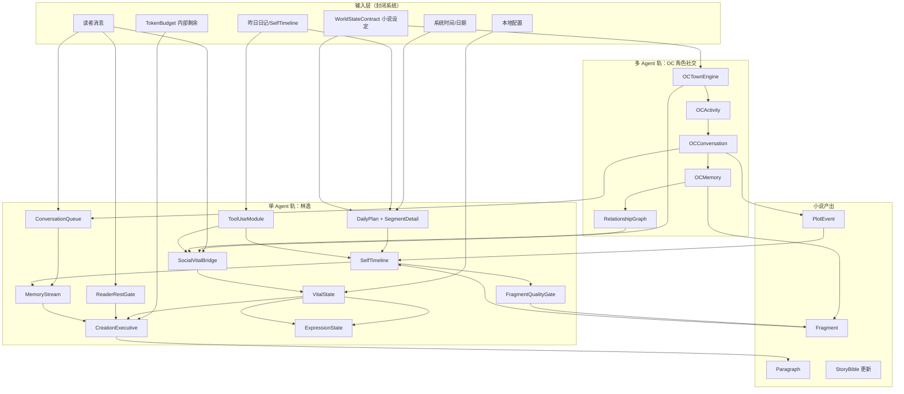
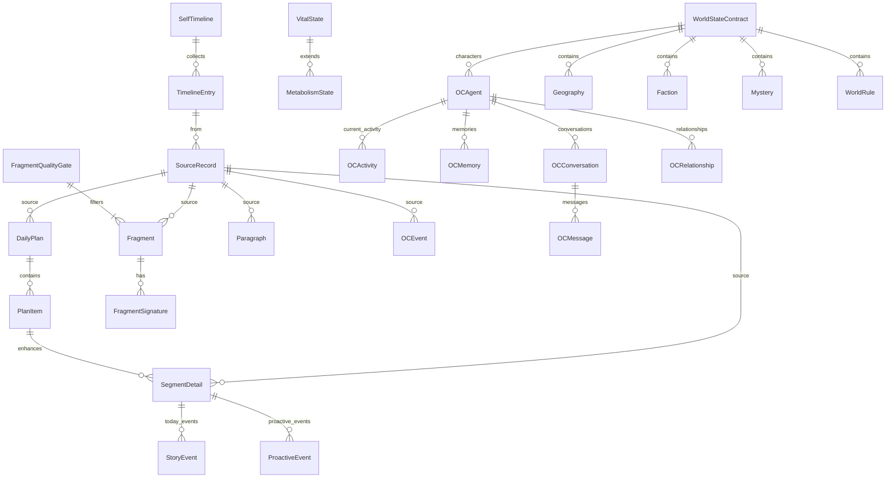
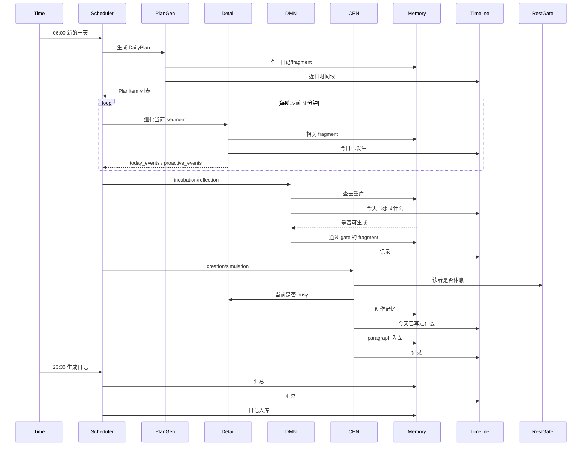
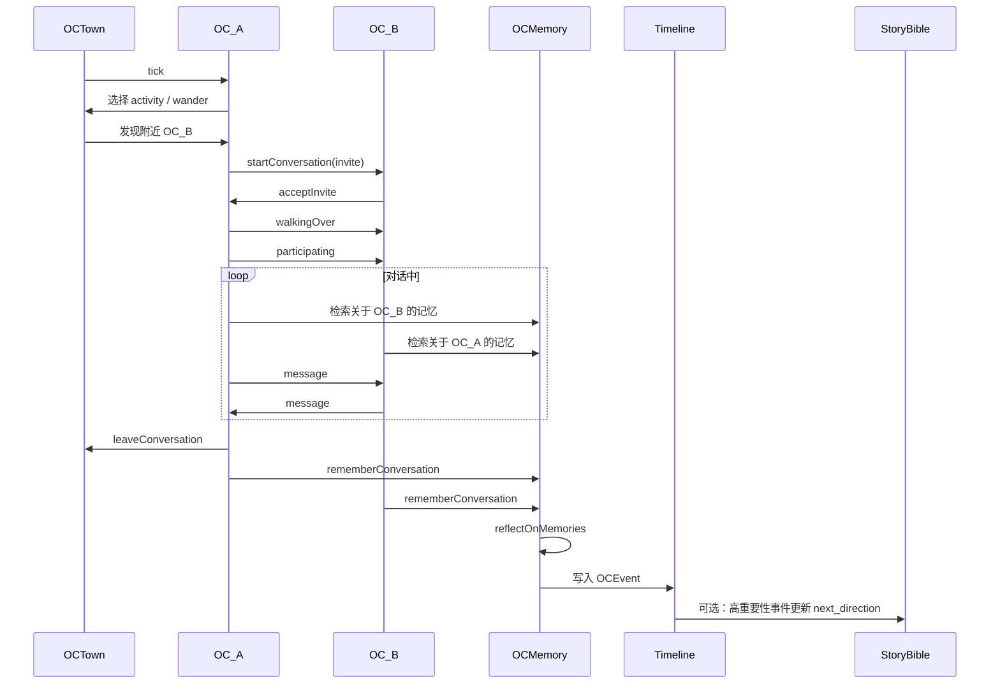

# 拟人化日程节律与角色社交补强方案 v2

> 本文合并并升级《拟人化日程节律补强方案》《拟人化日程节律补强框架图》《日程节律循环架构交叉分析》《astrbot 拟人化实践交叉对比与补强建议》四份文档。
>
> 核心调整：
> 1. 封闭系统，不做外部平台/新闻/余额等接入；
> 2. `world_state.py` 中的世界观仅服务于小说一致性，不做日常生活模拟；
> 3. 角色间社交模拟参考 **ai-town**，为小说生成提供涌现式素材；
> 4. 单 agent 拟人化节律、去重、记忆、自我时间线继续参考 **astrbot_plugin_private_companion-main**。
>
> 文档版本：v2.0
> 日期：2026-07-22

---

## 1. 问题诊断

### 1.1 现象

- **同义 fragment 密集重复**：同一心理活动在短时内以不同标签反复出现。
- **标签化而非生活化**：fragment 像从固定兴趣词模板中抽取，缺少具体时间、地点、动作、身体感受。
- **TRACE 聚类同质化**：多个 trace 文本几乎相同。
- **日程模板感强**：8 阶段循环每天相似，缺少"今天是什么日子""昨天残留""小意外"等变量。
- **角色缺乏自发互动**：小说世界中 OC 角色只是设定，不会自己产生对话、冲突、事件。

### 1.2 根因分析

| 根因 | 说明 | 当前代码位置 |
|------|------|--------------|
| prompt 兴趣词重复 | DMN 依赖固定 `interests` | `dmn.py` |
| 缺乏 fragment 去重 | 无签名/语义/历史过滤 | `memory.py` |
| 粗粒度日程 | 阶段只有一段 activity | `scheduler.py` / `clock.py` |
| 缺少日程记忆 | 昨日活动不反哺今日 | `scheduler.py` |
| 情绪-能量-关系未联动 | `Metabolism` 缺少心情、创作冲动 | `metabolism.py` |
| 无读者边界 | 无"读者想安静"门控 | 无 |
| 无自我时间线 | DMN/CEN 无法查询"今天已做过什么" | 无 |
| 角色无自治 | OC 只是静态设定，不产生事件 | `world_state.py` / `coc_mapping_engine.py` |

---

## 2. 设计原则

### 2.1 封闭系统

- 不接入外部 RSS、社交平台、余额接口、外部记忆插件。
- 所有输入来自：系统时间、配置文件、本地记忆、小说世界状态、读者消息（若通过本地接口传入）。
- TokenBudget 仅用于内部成本治理，不感知外部账户。

### 2.2 世界观服务于小说

- `WorldStateContract`（地理、派系、规则、谜团）是**小说的设定层**，不是生活模拟空间。
- 不在世界观里模拟吃饭、通勤、睡觉等日常琐事。
- 角色在世界中的"活动"应与小说情节相关：调查、会面、冲突、观察、训练、逃亡等。

### 2.3 社交模拟是角色间的社交

- 参考 ai-town，让小说中的 OC 角色具备自治行为：移动、活动、发起对话、形成记忆、产生冲突。
- 角色社交事件**可选地**进入小说素材池，由 COC/CEN 决定是否采用。
- 角色社交不是替代品，而是小说创作的"发生装置"之一。

### 2.4 单 Agent 节律 + 多 Agent 社交双轨

- **单 Agent 轨**：林逸（小说家/叙述者本身）的作息、心情、能量、记忆、自我时间线。
- **多 Agent 轨**：小说世界内 OC 角色的自治活动与交互。
- 两条轨道通过 `WorldStateContract` 和 `SelfTimeline` 交换素材。

---

## 3. 参考项目分工

### 3.1 astrbot_plugin_private_companion-main（单 agent 拟人化）

负责：
- 两层日程（DailyPlan + SegmentDetail）
- fragment/日记去重
- 情绪-能量-关系状态
- 自我时间线
- 创作与日程联动
- TokenBudget 内部治理（去外部化改造）
- ReaderRestGate（本地读者边界）
- StateViews / PromptSurface

### 3.2 ai-town（多 agent 角色社交模拟）

负责：
- OC 自治 tick + operation 调度
- Activity（活动）模型与冷却
- Conversation 生命周期（邀请→靠近→对话→离开→记忆）
- 记忆的重要性评分 + relevance/recency/importance 排序
- 对话后的反思（reflection）机制
- `participatedTogether` 关系图

### 3.3 其他 7 个参考项目（定位，不做主路径）

| 项目 | 借鉴点 | 用途 |
|------|--------|------|
| ainovel-cli | Checkpoint 崩溃恢复、日志审计 | 工程化 |
| InkOS | Auditor→Reviser 显式闭环 | 质量审计 |
| NovelPilot | 角色卡/事件卡驱动 | 素材卡设计 |
| Webnovel Writer | 批量生成/发布工作流 | 规模化（暂不需要） |
| AI Novel Factory | 三幕剧结构模板 | 结构参考 |
| NovelDreamer | 角色心理模型 | OC 心理 |
| AI_NovelGenerator | 数据闭环 | 评估机制 |

---

## 4. 总体架构



---

## 5. 单 Agent 轨：林逸的拟人化节律

### 5.1 DailyPlan + SegmentDetail 两层模型

```python
@dataclass
class PlanItem:
    time: str          # HH:MM
    end: str           # HH:MM
    activity: str      # 宏观活动，与小说创作相关
    mood: str          # 2-3 个词
    message_seed: str  # 若有想对读者说的话
    basis: list[str]   # ["calendar", "persona", "state", "continuity", "inspiration"]
    confidence: float  # 0.0-1.0

@dataclass
class SegmentDetail:
    summary: str
    state_variables: list[StateVariable]
    today_events: list[StoryEvent]       # 与小说相关的小事件
    proactive_events: list[ProactiveEvent]  # 可选：林逸想分享的
```

**注意**：activity 不是"起床/刷牙/通勤"，而是"整理昨日手稿""重读第三章找断裂""在窗边发呆等一个情节""与某个 OC 在脑中对话"。

### 5.2 FragmentQualityGate

```python
class FragmentQualityGate:
    ABSTRACT_MARKERS = ("状态", "情绪", "心情", "感觉", "余韵", "碎片", "生活感", "计划", "总结")
    CONCRETE_MARKERS = ("光", "雨", "风", "纸", "书", "门", "窗", "杯", "路", "影", "声", "味", ...)

    def is_useful(self, text: str) -> bool:
        # 1. 非空且在长度范围内
        # 2. 不过度抽象：抽象词 >=2 且无具体意象 → 拒绝
        # 3. 不与最近 50 个 fragment 文本签名重复
        # 4. 不与今日 fragment 语义相似度 > 0.55
        # 5. 不与 SelfTimeline 中今日已做之事重复
```

### 5.3 SelfTimeline

统一记录林逸今天已经：
- 生成了哪些 fragment
- 细化过哪些 segment
- 写过哪些 paragraph
- 与读者有哪些边界约定
- 调用过哪些 OC 社交事件

用于 DMN/CEN 生成前查询，避免失忆式重复。

### 5.4 VitalState

```python
@dataclass
class VitalState:
    energy: float
    compute_budget: float
    time_currency: float
    social_capital: float
    mood_bias: str           # 当前心情基调
    arousal: float           # 唤醒度 0-1
    reader_temperature: float  # 读者关系温度 0-1
    creative_drive: float    # 创作冲动 0-1
    words_written_today: int
```

### 5.5 ReaderRestGate（本地边界）

- 识别读者通过本地接口传入的休息信号："晚安""别打扰""让我安静""明天再聊"。
- 五级分类：sleep / nap / rest / quiet / until_morning / cancel。
- 防误判：区分元讨论、引用转述、范围指令。
- 休息期间暂停 `creation` 主动输出，但不停止内部 DMN 循环。
- 不涉及任何外部消息平台。

### 5.6 TokenBudget（内部治理）

- 记录每次 `_llm_call` 的 prompt/completion tokens，按任务分类。
- 设置 `daily_token_limit` 硬上限和 `daily_token_soft_limit` 软上限。
- 低优先级任务（创作、日程细化、OC 社交模拟）在软上限到达后可推迟。
- 豁免任务：框架状态机、状态视图、token 测试。
- 无外部余额感知，无 Provider fallback（封闭系统内可配置单 endpoint）。

### 5.7 PromptSurface

`PromptSurface` 是一个总线驱动的 prompt 组装模块，负责把散落在各子系统的上下文片段整合成一个结构化、渲染器无关的 prompt 表面，供 LLM 编排层消费。它并不直接调用 LLM，而是监听总线事件、维护有序槽位，并在关键上下文变化时发布 `data.prompt.surface.updated`。

新增于 2026-07-22：`data.persona.injected` 事件会自动把当前会话涉及的读者/OC 画像注入 `reader_context` 与 `world_info_before`，使林逸在回复时能"记得对方是谁"。

#### 槽位顺序（参考 SillyTavern prompt-injection 顺序）

```text
system_rules
character_definition
world_info_before
self_timeline
memory_snippets
reader_context
expression_hint
recent_conversation
world_info_after
instruction_footer
```

该顺序综合参考了：
- **SillyTavern**：系统规则 > 角色定义 > world info(before) > 示例/聊天历史 > world info(after) > instruct footer 的注入顺序。
- **AstrBot**：消息分段（segment）与 source 标注思想。
- **a16z companion-app**：将长期记忆、近期对话、读者画像分块拼入 prompt 的做法。
- **Project AIRI**：上下文分类与情绪/表情提示的独立注入。

#### 事件订阅与槽位更新

| 总线事件 | 更新的槽位 | 说明 |
|---|---|---|
| `data.oc.character.imported` / `control.character_card.reload` | `character_definition` | 从角色卡/OC sheet 提取 name、archetype、internal_conflict、narrative_arc、immutable_facts |
| `data.world_book.triggered` | `world_info_before` / `world_info_after` | SillyTavern 风格 world/character book 触发注入，支持 `before_char` / `after_char` 位置 |
| `data.self.timeline.updated` | `self_timeline` | 读取 `SelfTimeline` 最近活动，避免 DMN/CEN 重复生成 |
| `data.memory_stream.update` | `memory_snippets` | 读取 `MemoryStream` working entries 或调用 `retrieve`，保持近期与相关记忆 |
| `data.reader.profile.updated` | `reader_context` | 读者姓名、关系阶段、偏好语气、已知事实 |
| `data.expression.changed` | `expression_hint` | Project AIRI 风格情绪、强度、动作提示 |
| `data.conversation.queue.update` | `recent_conversation` | a16z companion-app 风格的近期对话队列 |
| `data.persona.injected` | `reader_context` / `world_info_before` | MaiBot 风格：自动注入当前会话涉及的读者/OC 画像 |
| `control.prompt.surface.request` | 全部槽位 | 显式请求组装，可附带临时上下文覆盖 footer |

#### 主要特性

- **实例引用解耦**：`init(context)` 时从 `self_timeline_instance` / `memory_stream_instance` / `persona_injector_instance` 读取上游模块，避免强依赖事件 payload 格式。
- **自动/受控组装**：`auto_assemble_on` 可配置只在特定话题触发自动 emit；未配置时所有监听话题变化都会触发组装。
- **截断保护**：`max_surface_chars` 硬上限，超限时从尾部按段边界截断并追加 `[truncated]`，优先保住系统规则、角色定义、世界观等前置信息。
- **序列化**：完整保存槽位内容、上限、自动组装列表，支持快照恢复。

#### 使用示例

```python
surface = PromptSurface(name="prompt_surface")
surface.init({
    "prompt_surface": {
        "system_rules": "You are 林逸, a novelist living inside the computer...",
        "instruction_footer": "Stay in character as 林逸...",
        "max_surface_chars": 8000,
        "auto_assemble_on": [
            "data.world_book.triggered",
            "data.reader.profile.updated",
            "data.expression.changed",
            "data.conversation.queue.update",
            "data.persona.injected",
        ],
    }
})
result = surface.assemble()
# result["slots"]  -> 有序槽位列表
# result["flat_text"] -> 可直接喂给 LLM 的扁平文本
```

### 5.7.1 PersonaInjector

`PersonaInjector` 受 MaiBot 的 `maisaka.memory.person_profile` 自动注入服务启发，负责识别当前回合涉及的人物（读者或 OC），并 emit `data.persona.injected`。

#### 事件订阅

| 总线事件 | 行为 |
|---|---|
| `event.reader.interaction` / `data.reader.message` | 提取消息文本，注入读者画像 |
| `data.conversation.queue.update` | 从新加入的 turn 提取文本 |
| `data.oc.town.event` | 从 OC 社交事件摘要提取 OC 画像 |
| `control.persona.inject` | 显式请求注入指定 reader_ids / oc_names |

#### 画像来源

- **读者**：`ReaderProfile`，新增 `persona_summary` 印象摘要字段，回退到 `known_facts` / `relationship_stage`。
- **OC**：`OCCharacterSystem` 注册表，提取 `name`, `archetype`, `role_in_story`, `current_goal`, `internal_conflict`, `immutable_facts`。

#### 配置示例

```python
{
    "persona_injector": {
        "max_reader_profiles": 1,
        "max_oc_profiles": 3,
        "oc_name_aliases": {"小晚": "苏晚"},
        "auto_inject_on": [
            "event.reader.interaction",
            "data.reader.message",
            "data.conversation.queue.update",
            "data.oc.town.event",
        ],
    }
}
```

### 5.7.2 MidTermMemory（聊天回想 / 中期记忆压缩）

`MidTermMemory` 受 MaiBot 的 `maisaka.memory.mid_term` 聊天回想启发，解决长期运行后对话历史膨胀的问题：

- `ConversationQueue` 在 FIFO 容量溢出时发布 `data.conversation.queue.evicted`。
- `MidTermMemory` 累积被 evict 的 turns，达到 `summary_threshold` 后生成压缩摘要。
- 摘要存入 `MemoryStream`（`kind="conversation_summary"`），并 emit `data.memory.mid_term.summary`。
- 当真实 LLM 服务可用且 `enable_llm_summary=True` 时，调用 LLM 生成 2-3 句叙事摘要；否则使用结构化拼接摘要作为 fallback。

#### 事件流

```text
ConversationQueue overflow
    -> data.conversation.queue.evicted
        -> MidTermMemory buffer
            -> summary_threshold reached
                -> MemoryStream.add(conversation_summary)
                -> data.memory.mid_term.summary
```

#### 配置示例

```python
{
    "mid_term_memory": {
        "summary_threshold": 5,
        "min_turns_for_summary": 2,
        "max_summary_chars": 1_000,
        "enable_llm_summary": True,
    }
}
```

### 5.7.3 LLMFactExtractor（事实提取器 / 记忆学习环）

`LLMFactExtractor` 受 MemGPT 记忆管理与 MaiBot 人物画像学习启发，负责从对话和社交事件中自动提取**稳定事实**，并写入 `ReaderProfile.known_facts` 与 `OCCharacterSheet.known_facts`，让林逸对“这是谁”形成持续更新的认知。

#### 职责

- 监听 `event.reader.interaction`、`data.reader.message`、`data.conversation.queue.update`，累积读者文本并在满足条件时提取读者事实。
- 监听 `data.oc.town.event`，按 `character_id` 或 OC 名字关联，提取 OC 事实。
- 支持 `control.fact.extract` 显式触发提取。
- 真实 LLM 可用时，通过结构化 JSON 提示提取事实；否则使用规则启发式（姓名、年龄、地点、工作、喜好、厌恶等模式）。
- 自动去重：已有 key 或 value 不再重复写入；`max_facts_per_run` 限制单次写入数量。
- 通过冷却与缓冲阈值控制 LLM 调用频率，避免每条消息都请求模型。

#### 事件流

```text
reader message / oc town event
    -> LLMFactExtractor buffer
        -> min_chars / max_buffer_turns / cooldown satisfied
            -> LLM or heuristic extraction
                -> ReaderProfile.set_fact() / OCCharacterSystem.set_fact()
                -> data.fact.extracted
                -> data.reader.profile.updated / data.oc.updated
```

#### 配置示例

```python
{
    "llm_fact_extractor": {
        "reader_enabled": True,
        "oc_enabled": True,
        "llm_enabled": True,
        "min_chars": 30,
        "max_buffer_turns": 5,
        "cooldown_seconds": 60.0,
        "max_facts_per_run": 3,
        "llm_temperature": 0.2,
        "llm_max_tokens": 400,
    }
}
```

#### OC 不可变事实保护

`OCCharacterSystem.set_fact()` 会检查目标 key 是否与 `sheet.immutable_facts` 冲突（双向子串匹配）。若冲突则拒绝写入并发布 `data.oc.update.rejected`，防止自动提取覆盖作者明确设定的核心设定。

### 5.8 StateViews

为前端和调试提供统一的人可读摘要：
- `format_vital_state()`
- `format_timeline(limit)`
- `format_dream_pool()`
- `format_oc_social_status()`

### 5.9 SocialVitalBridge：情绪连续性桥接（Project AIRI 启发）

参考 Project AIRI 的**情绪连续性**设计：虚拟生命的内部状态不应被单次事件永久锁定，也不应完全脱离社交世界。社交事件（OC 对话、读者互动、关系变化）应持续、平滑地影响林逸的心情基调、唤醒度、读者关系温度和创作冲动，并随时间自然衰减回基线。

#### 5.9.1 位置与职责

- 模块：`src/novelist_brain/social_vital_bridge.py`
- 注册：`main.py` 中通过 `registry.register(SocialVitalBridge, factory_options={"name": "social_vital_bridge"})` 加入 Agent 生命周期。
- 输入总线事件：
  - `data.oc.town.event`：OC 社交事件（`conversation` / `reflection` / `agent_moved` / `external`）。
  - `event.reader.interaction`：读者主动与林逸互动。
  - `data.relationship.updated`：`RelationshipGraph` 中的关系边变化。
  - `data.reader.profile.updated`：读者画像更新（如 `reader_temperature` 变化）。
- 输出总线事件：
  - `data.metabolism.state`：与 `ExpressionState` 等消费者对接，驱动可见表情/状态。
  - `data.social.vital.updated`：专门用于监听社交触发的 vital state 变化。

#### 5.9.2 状态模型

在 `VitalState` 的四个连续维度上运作：

```python
@dataclass
class SocialVitalState:
    mood_bias: str           # 当前心情基调，如 "平静"/"愉悦"/"忧郁"
    arousal: float           # 唤醒度 0-1，基线 0.5
    reader_temperature: float  # 读者关系温度 0-1，基线 0.5
    creative_drive: float    # 创作冲动 0-1，基线 0.5
```

这些维度与 `MetabolismState` 解耦：前者描述**心理-社交**状态，后者描述**能量-预算**状态；两者通过总线事件互相可见，但不互相覆盖。

#### 5.9.3 事件→状态映射规则

| 输入事件 | 状态影响 | 设计意图 |
|---------|---------|---------|
| OC 对话（`conversation`） | `arousal += relationship_delta × 2.0`<br>`creative_drive += relationship_delta`<br>若 `delta > 0.05` 则 `mood_bias = "愉悦"` | 积极社交提升唤醒与创作冲动 |
| OC 反思（`reflection`） | `arousal -= 0.02`<br>`creative_drive += 0.03` | 反思是内省且略带创造性的，但让人平静 |
| OC 移动（`agent_moved`） | `arousal += 0.01` | 环境变化带来轻微刺激 |
| 外部故事注入（`external`） | `arousal += 0.02`<br>`creative_drive += 0.01` | 新素材带来警觉和创作欲 |
| 读者积极互动 | `reader_temperature += 0.03`<br>`arousal += 0.02`<br>`mood_bias = "愉悦"` | 读者的正向反馈升温关系 |
| 读者消极互动 | `reader_temperature -= 0.03`<br>`arousal += 0.02`（绝对值） | 负面反馈降低关系温度但提高警觉 |
| 关系 `affinity >= 0.5` | `mood_bias = "愉悦"`<br>`reader_temperature += 0.02` | 关系里程碑影响心情 |
| 关系 `affinity <= -0.3` | `mood_bias = "忧郁"` | 关系恶化带来低落 |
| 读者画像更新 `reader_temperature` | 直接覆盖该维度 | 允许外部模块（如 `ReaderProfile`）精确调控 |

#### 5.9.4 自然衰减

每个 `tick(delta)` 中，状态按 `decay_per_hour` 向基线回归：

```python
def _drift(current: float, target: float, hours: float) -> float:
    step = self._decay_per_hour * hours
    if current > target:
        return max(target, current - step)
    if current < target:
        return min(target, current + step)
    return current
```

默认 `decay_per_hour = 0.05`，即每小时向基线移动 5%。这避免了“一次事件永久锁死表情”的问题，让情绪更像真实生命一样自然回落。

#### 5.9.5 与 ExpressionState 的协作

`ExpressionState` 监听 `data.metabolism.state`，将连续的 vital state 映射为离散的表情标签与 Project AIRI 风格的结构化身体参数。`SocialVitalBridge` 的引入让这种映射不再只依赖能量和时段，而是**真正反映刚刚发生的社交事件**。

`ExpressionState` 现在输出：

- `emotion`：统一情绪词（新增 `relaxed` 用于低唤醒平静状态）。
- `intensity`、`blend_duration`、`expression_targets`、`action`：表情插值与动作提示。
- `body_state`：自主躯体参数（`blink_rate`、`gaze_target`、`breath_speed`、`pose`），让前端即使暂不接 VRM/Live2D 也能表现“生命体征”。
- `reset_at`：AIRI 风格的表情自动回退时间戳，避免一次社交事件永久锁定表情。

未来可扩展：
- 把“一起做了什么”（如共同完成某个 MCP 工具任务）也作为社交输入写入 vital state。
- 通过 `ToolUseModule` 暴露 `expression_set` / `expression_get` 工具，让 LLM 主动调控表情。

### 5.10 ToolUseModule：封闭系统内的 MCP 工具层（Agent Zero 启发）

Agent Zero 的核心理念是“把整台电脑作为工具”。LinYi 作为**生活在电脑中的虚拟生命**，也需要能与本地数字环境互动；但必须坚守**封闭系统**原则，禁止任意网络访问、写盘或 shell 执行。因此引入一个只读、白名单隔离的 MCP 风格工具层 `ToolUseModule`。

#### 5.10.1 位置与职责

- 模块：`src/novelist_brain/tool_use_module.py`
- 注册：`main.py` 中通过 `registry.register(ToolUseModule, factory_options={"name": "tool_use"})` 加入 Agent 生命周期。
- 输入总线事件：
  - `control.tool.request`：MCP 风格的工具调用请求，携带 `tool_call_id`、`tool`、`arguments`。
  - `control.tool.refresh_registry`：重新广播可用工具清单。
- 输出总线事件：
  - `data.tool.registry`：可用工具清单（含 schema、enabled 状态、允许根目录）。
  - `data.tool.result`：工具执行成功结果。
  - `event.tool.failed`：工具执行失败。

#### 5.10.2 安全边界

| 边界 | 实现 |
|------|------|
| 路径隔离 | 仅允许访问 `context["tools"]["allowed_paths"]` 白名单内的真实解析路径；相对路径以第一个允许根目录为基准；`..` 穿越会被拒绝。 |
| 只读原则 | `read_file`、`list_directory`、`search_notes` 均为读操作；不提供写文件、删文件、网络请求工具。 |
| 脚本受控 | `run_read_only_script` 默认关闭（`enable_scripts=False`），开启后仅允许运行白名单内的 `.py` 脚本，并受 `script_timeout` 限制。 |
| 输出截断 | `max_output_length` 防止 LLM 上下文被工具输出撑爆。 |

#### 5.10.3 工具清单

```python
TOOLS = {
    "read_file": {
        "description": "读取允许路径内的文本文件内容",
        "parameters": {"path": "string", "offset": "int", "limit": "int"},
    },
    "list_directory": {
        "description": "列出允许路径内某个目录的条目",
        "parameters": {"path": "string"},
    },
    "search_notes": {
        "description": "在允许路径内递归搜索包含关键字的文本文件",
        "parameters": {"query": "string", "path": "string"},
    },
    "run_read_only_script": {
        "description": "运行允许路径内的只读 Python 脚本并返回 stdout/stderr",
        "parameters": {"script_path": "string", "args": "list"},
    },
}
```

#### 5.10.4 与生命感的结合

- 工具调用结果可以作为 `SelfTimeline` 中的“数字生活事件”（例如“林逸翻看了昨天的笔记”）。
- 成功调用、失败或超时可通过 `SocialVitalBridge` 微妙地影响 `arousal` / `creative_drive`。
- 工具层让林逸从“只会思考”的作家变成能**感知本地文件、笔记、世界设定**的虚拟生命，但仍被限制在安全的沙盒内。

未来可扩展：
- 接入真正的 MCP 客户端/服务器协议，与本地 MCP 工具生态互通。
- 按当前 phase（DMN/CEN）和能量预算动态决定是否需要调用工具。
- 增加 `query_world_state`、`query_story_bible` 等小说专用只读工具。

### 5.11 ConversationQueue + 混合检索（a16z companion-app 启发）

a16z companion-app 的长期记忆链路非常清晰：**向量数据库**负责按问题相似度召回历史，**Redis 队列**负责保留最近 N 条对话，两者合并后进入 prompt。LinYi 的 `MemoryStream` 已经具备 recency / importance / relevance 三因子检索，现在补齐“近期对话队列”这一侧，形成混合检索。

#### 5.11.1 位置与职责

- 模块：
  - `src/novelist_brain/conversation_queue.py`
  - `src/novelist_brain/memory_stream.py`（混合检索入口）
- 注册：`main.py` 中先注册 `ConversationQueue`，再注册 `MemoryStream`；主循环将 `ConversationQueue` 实例注入 `context["conversation_queue_instance"]`。
- 输入总线事件：
  - `event.reader.interaction` → role `user`
  - `data.agent.response` → role `agent`
  - `data.oc.town.event` → role `oc`
  - `data.tool.result` → role `tool`
  - `control.conversation.queue.get_recent` → 广播队列快照
- 输出总线事件：
  - `data.conversation.queue.update`

#### 5.11.2 队列模型

```python
@dataclass
class ConversationTurn:
    turn_id: str
    role: str       # user | agent | oc | system | tool
    content: str
    source: str
    timestamp: float
    metadata: dict[str, Any]
```

- 上限 `max_turns`（默认 20）， oldest first 驱逐。
- 仅保存最近对话文本，不替代长期记忆；用于 prompt 中的“刚才说了什么”。

#### 5.11.3 混合检索规则

在 `MemoryStream.retrieve()` 中：

1. 正常对 `MemoryStream` 中所有条目做 recency + importance + relevance 打分。
2. 若 `hybrid.enabled` 为真且 `ConversationQueue` 实例存在，把最近 N 条 turn 转换为临时 `conversation_turn` 条目。
3. 这些临时条目额外获得 `hybrid.recent_boost` 加成，确保它们不会被远期高重要记忆淹没。
4. 合并排序后返回 top-k。

```python
"memory_stream": {
    "hybrid": {
        "enabled": True,
        "recent_limit": 10,
        "recent_boost": 0.2,
    }
}
```

#### 5.11.4 与生命感的结合

- 读者刚说的话不会被“三天前的一段描写”抢走上下文位置。
- 工具调用结果（`role=tool`）进入队列，让林逸能回答“你刚才查了什么”。
- OC 社交事件进入队列，让林逸在创作时能引用“刚刚 OC 之间发生了什么”。

未来可扩展：
- 用 embedding 替换 keyword-based relevance，实现真正的向量记忆召回。
- 对队列做滑动窗口摘要，把过长对话压缩成高层 reflection 后存入 `MemoryStream`。

---

## 6. 多 Agent 轨：OC 角色社交模拟（ai-town 模式）

### 6.1 核心设计

在小说世界内部运行一个轻量版 ai-town，称为 **OCTownEngine**。

- 每个 OC 是一个 agent（不是真实用户）。
- OC 在小说设定的地理/场景中有位置、活动、对话。
- OC 的自治行为产生事件，进入 `SelfTimeline` 和小说素材池。
- 林逸（单 agent）可以"观察"这些事件，决定是否写入小说。

### 6.2 OC 状态模型

```python
@dataclass
class OCAgent:
    id: str
    name: str
    identity: str          # 角色背景/目标
    plan: str              # 当前短期目标
    position: Point        # 在世界地图/场景中的位置（可选）
    activity: Optional[OCActivity]
    last_conversation: float
    last_invite_attempt: float
    in_progress_operation: Optional[OCOperation]

@dataclass
class OCActivity:
    description: str       # 例如"在酒馆角落观察人群"
    until: float           # 活动结束时间
    emoji: Optional[str]
```

### 6.3 OC Operation 调度

参考 ai-town 的 `Agent.tick()` + `startOperation()`：

```python
class OCTownEngine:
    def tick(self, now: float):
        for oc in self.ocs:
            if oc.in_progress_operation:
                if not self.operation_timeout(oc, now):
                    continue
            if oc.is_in_conversation:
                self.handle_conversation_tick(oc, now)
            elif oc.activity and oc.activity.until > now:
                continue  # 正在活动中
            else:
                self.start_operation(oc, now, 'ocDoSomething')
```

操作类型：
- `ocDoSomething`：选择新活动、游荡、发起对话邀请。
- `ocGenerateMessage`：生成对话消息。
- `ocRememberConversation`：总结对话并写入记忆。

### 6.4 Activity 模型与冷却

- 活动有 duration，结束后进入 `ACTIVITY_COOLDOWN`。
- 活动列表来自小说世界设定：例如"巡逻城墙""在图书馆查资料""跟踪嫌疑人""在市场打听消息"。
- 不是日常琐事，而是能推动/丰富小说情节的动作。

### 6.5 Conversation 生命周期

```
invited（被邀请） → walkingOver（靠近中） → participating（对话中） → end（离开/结束）
```

- 对话发生在两个 OC 之间，或 OC 与林逸（ narrator 视角）之间。
- 距离/场景是发起对话的前提（同一场景或相邻场景）。
- 发起对话前，OC 会通过 `OCTownAgent.memories_about(partner_id)` 检索关于对方的近期记忆，并据此影响话题选择（例如上次聊到“天气”，本次更可能延续该话题）。
- 对话结束后的摘要写入 OCMemory。

### 6.6 OCMemory（重要性 + 排序 + 反思）

参考 ai-town `memory.ts`，当前实现位于 `src/novelist_brain/oc_town_engine.py`：

- `OCSocialMemoryEntry` 记录单条记忆，字段包括 `kind`（`conversation` / `reflection`）、`importance`、`reflected` 标记和 `source_entry_ids`。
- `OCTownAgent.memories_about(target_id)` 按 **importance × recency** 检索关于某对象的记忆；MVP 暂未启用 embedding  relevance。
- 每次对话前，`OCTownEngine` 调用 `memories_about` 影响话题选择；对话结束后为双方写入 `conversation` 记忆，并调用 `reflect_on_memories`。
- `reflect_on_memories` 收集当前 agent 在时间窗口内尚未反思的记忆；当累计 `importance >= reflection_threshold`（默认 1.5）时，生成一条更高层的 `reflection` 记忆。
- 反思内容通过 `_synthesize_reflections` 确定性生成：按互动对象聚合，识别“最近和某人互动很多”等模式，并混合对话/反思类型统计。
- 新生成的反思通过 `data.oc.town.reflection` 总线事件发布，附带 `insights`、`source_entry_ids`、`mentioned_targets`。

```python
class OCTownEngine:
    def reflect_on_memories(self, agent: OCTownAgent, now: float) -> OCSocialMemoryEntry | None:
        cutoff = now - self._reflection_window
        unreflected = [m for m in agent.social_memory
                       if not m.reflected and m.timestamp >= cutoff]
        if sum(m.importance for m in unreflected) < self._reflection_threshold:
            return None
        insights = self._synthesize_reflections(agent, unreflected)
        reflection = agent.remember(
            target_id="",
            kind="reflection",
            content="；".join(insights),
            importance=min(0.9, 0.45 + total_importance * 0.1),
            timestamp=now,
        )
        reflection.reflected = True
        reflection.source_entry_ids = [m.entry_id for m in unreflected]
        for entry in unreflected:
            entry.reflected = True
        self._publish_reflection_event(agent, reflection, insights, source_ids)
        return reflection
```

配置项通过 `context["oc_town"]["reflection_threshold"]` 和 `context["oc_town"]["reflection_window"]` 注入，`main.py` 默认阈值为 1.5、窗口为 24 小时。

### 6.7 RelationshipGraph

受 Zep 的时序知识图谱与 AI Town 关系记忆启发，`RelationshipGraph` 把读者-OC、OC-OC 关系显式建模为可演化的带权边。

#### 核心能力

- **有向关系边**：`RelationshipEdge(source, target, kind, weight, evidence)`，支持 `affinity`、`trust`、`familiarity` 等关系类型。
- **时序历史**：每次 `update` / `set_weight` 都会追加一条 `RelationshipHistoryEntry`，保留权重、阶段、证据和时间戳，支持关系变化叙事。
- **阶段模型**：每种关系类型自带阈值映射（如 `affinity`：hostile → cold → neutral → warm → close）。跨越阶段时发布 `data.relationship.stage.changed`。
- **趋势与摘要**：
  - `relationship_summary(source, target)` 返回当前权重、阶段、历史峰值/谷值、最近证据。
  - `trend(source, target, kind, window_seconds)` 返回最近一段时间的变化方向（rising / falling / stable）。
- **自然衰减**：可选 `decay()` 让长期未更新的关系向 0 回落；`tick()` 每小时自动衰减一次（默认关闭，可通过 `relationship_graph.decay_enabled` 开启）。

#### 事件订阅

- `data.oc.town.event`：对话更新双向 `affinity` / `familiarity`，移动增加对地点的 `familiarity`。
- `data.oc.town.reflection`：反思事件包含 `mentioned_targets` 时，增加思考者与被提及对象之间的 `familiarity`。
- `event.reader.interaction` / `data.reader.profile.updated`：维护读者节点与读者-OC 关系。
- `control.relationship.update`：显式修改权重。

#### 与小说产出联动

关系状态可作为小说素材：盟友、熟人、敌对、猜忌；阶段变化事件可触发 COC/CEN 生成“关系转折”情节种子。

### 6.8 与小说产出的接口

OC 社交事件产生三类素材：

1. **Observation（观察）**：林逸以旁观者身份记录的事件摘要。
2. **Dialogue（对话）**：可直接作为小说对白素材。
3. **PlotSeed（情节种子）**：冲突、发现、转折，进入 StoryBible 的 `next_direction`。

COC/CEN 决定是否采用、何时采用、如何改写。

---

## 7. 数据模型



---

## 8. 关键时序

### 8.1 林逸的一天



### 8.2 OC 社交事件时序



---

## 9. 改造路径

### 阶段一：单 agent 数据模型与去重（1-2 周）

1. 新增 `DailyPlan`, `PlanItem`, `SegmentDetail`, `StoryEvent`, `ProactiveEvent`。
2. 新增 `FragmentQualityGate`，接入 `MemorySystem._receive_fragment`。
3. 新增 `PlanDeduplicationStore`，保存最近 7 天日程骨架。
4. 改造 `DailyScheduler`：保留阶段概念，允许从 `DailyPlan` 动态加载。

### 阶段二：日程生成与细化（2-3 周）

1. 新增 `DailyPlanGenerator`（基于 LLM），每天早晨生成一次 `DailyPlan`。
2. 新增 `SegmentDetailEnhancer`。
3. `today_events` 转化为 `fragment.personal.new`。
4. `proactive_events` 默认只作为状态，不自动发送。

### 阶段三：VitalState 与门控（1-2 周）

1. 扩展 `Metabolism` 或新增 `VitalState`。
2. 新增 `ReaderRestGate`（本地）。
3. `SalienceNetwork` 引入 `reader_temperature` 和 `creative_drive`。

### 阶段四：SelfTimeline + PromptSurface + StateViews（已完成 ✅）

1. ✅ 新增 `SelfTimeline`，订阅核心内容话题并在 append 时发布 `data.self.timeline.updated`。
2. ✅ `PromptSurface` 接入总线：10 个有序槽位、监听 character/world-book/timeline/memory/reader/expression/conversation 事件、支持显式请求组装与截断保护，已在 `main.py` 注册并注入共享 context。
3. ⬜ `StateViews` 统一可视化（WebUI 已提供部分状态视图，可待后续迭代）。

### 阶段五：OC 社交模拟引擎（2-3 周）

1. 新增 `OCTownEngine`。
2. 新增 `OCAgent`, `OCActivity`, `OCConversation`, `OCMemory`, `OCRelationship`。
3. 实现 operation 调度、activity 模型、conversation 生命周期。
4. 实现记忆重要性评分与反思。
5. 与 `SelfTimeline` 和 StoryBible 对接。

### 阶段六：创作联动与 StorageManager（1-2 周）

1. 改造 `CreationExecutive`：检查 busy/能量/预算，按人格调整字数。
2. 新增 `StorageManager`：统一 memory/world_state/daily_plan/timeline 读写，支持原子写。
3. 解决 `agent_state.json.latest` 类问题。

---

## 10. 预期效果

| 问题 | 补强后效果 |
|------|-----------|
| fragment 重复 | 签名/语义/时间线三重过滤 |
| 日程模板化 | 每日基于日期、状态、昨日残留动态生成 |
| 缺少真实感 | 引入与小说相关的小事件、身体感受、环境变化 |
| 创作与状态脱节 | 创作前检查能量/时段/心情/预算 |
| 读者边界缺失 | 本地 ReaderRestGate 识别休息信号 |
| 失忆式重复 | `SelfTimeline` 统一记录 |
| 角色无自治 | OC 社交引擎产生涌现事件和情节种子 |
| 上下文重复注入 | `PromptSurface` 自动去重与优先级排序 |
| 情绪/社交与状态脱节 | `SocialVitalBridge` 让心情、唤醒度、关系温度随社交事件演化并自然衰减 |
| 无法与本地数字环境互动 | `ToolUseModule` 提供只读本地工具，让林逸能读取笔记、搜索、运行白名单脚本 |
| 上下文被远期记忆淹没 | `ConversationQueue` + `MemoryStream` 混合检索保留最近对话的连续性 |

---

## 11. 风险与应对

| 风险 | 应对 |
|------|------|
| LLM 调用量增加 | TokenBudget 软上限；OC 社交模拟可配置开关 |
| 日程生成不稳定 | 保留 fallback 到 8 阶段模板 |
| OC 社交偏离主线 | 事件不直接进入小说，需经 COC/CEN 采用 |
| 状态变量过多 | StateViews 统一可视化 |
| 持久化损坏 | StorageManager 原子写 + health_check |

---

## 12. 与现有重构方案的关系

本方案是对《系统重构方案 v1.0》的**拟人化与角色社交维度补充**：

- 与 `WorldStateContract` 结合：OC 社交事件受其地理/派系约束。
- 与 `OCCharacterSystem` 结合：OC 角色档案即 ai-town 的 `PlayerDescription` + `AgentDescription`。
- 与 `ChapterManager` 结合：`SelfTimeline` 为章节回溯提供事实源。
- 与 `ContinuityAuditor` 结合：审计时检查是否与 SelfTimeline/OCMemory 矛盾。
- 与 `StoryBible` 结合：OC 产生的高重要性事件可更新 `next_direction`。

---

## 13. ai-town OC 社交模拟的 LinYi 代码级映射

本节将 ai-town 的多 agent 机制具体映射到 LinYi 现有代码结构：`OCCharacterSystem`、`COCMappingEngine`、`WorldStateContract`、`models.py`。

### 13.1 设计目标

- **不改写世界观**：`WorldStateContract` 仍是小说设定真源，不变成生活模拟器。
- **利用已有 OC 档案**：`OCCharacterSystem` 中的 `OCCharacterSheet` 直接作为 ai-town 中 `Player` + `AgentDescription` 的数据源。
- **服务章节场景**：`COCMappingEngine.build_chapter_scenario()` 生成场景前/后，触发一次 OC 社交模拟 tick，让关键 NPC 自主互动。
- **产物可审计**：OC 对话/事件先进入 `SelfTimeline` 和 `memory.py`，再经 `COC/CEN` 决定是否采用。

### 13.2 数据模型扩展（models.py）

在现有 `OCCharacterSheet` 旁新增运行时结构，**不删除任何已有字段**：

```python
# models.py 新增
from dataclasses import dataclass, field
from typing import Any, Literal

@dataclass
class OCAgentRuntimeState:
    """OC 在 OCTownEngine 中的运行时状态（基于 ai-town Player + Agent）。"""
    character_id: str
    position: str = ""            # 当前所在场景/地点 id
    activity: OCActivity | None = None
    last_conversation: float = 0.0
    last_invite_attempt: float = 0.0
    in_progress_operation: OCOperation | None = None
    current_conversation_id: str | None = None

@dataclass
class OCActivity:
    """小说相关活动（非日常琐事）。"""
    description: str              # 如"在旧书店查阅禁书目录"
    emoji: str | None = None
    until: float = 0.0
    location_id: str = ""         # WorldStateContract.geography 中的 key
    narrative_purpose: str = ""   # 该活动对小说的潜在用途

@dataclass
class OCOperation:
    """异步操作占位（参考 ai-town inProgressOperation）。"""
    name: str                     # ocDoSomething / ocGenerateMessage / ocRememberConversation
    operation_id: str
    started: float

@dataclass
class OCConversation:
    """双角色对话（与 ai-town Conversation 对齐）。"""
    conversation_id: str
    creator_id: str
    created: float
    participants: dict[str, OCConversationMembership]
    num_messages: int = 0
    last_message: OCMessage | None = None
    is_typing: dict[str, float] = field(default_factory=dict)  # player_id -> since

@dataclass
class OCConversationMembership:
    """invited / walkingOver / participating。"""
    player_id: str
    invited: float
    status: Literal["invited", "walkingOver", "participating"] = "invited"

@dataclass
class OCMessage:
    """OC 对话中的一条消息。"""
    message_id: str
    author_id: str
    text: str
    timestamp: float

@dataclass
class OCMemory:
    """OC 的向量记忆（参考 ai-town memory.ts）。"""
    memory_id: str
    character_id: str
    description: str              # 第一人称摘要
    importance: float             # 0-9
    embedding: list[float]
    last_access: float
    memory_type: Literal["conversation", "reflection", "observation"]
    related_memory_ids: list[str] = field(default_factory=list)

@dataclass
class OCRelationshipEdge:
    """替代 ai-town participatedTogether，记录 OC 共同事件。"""
    player1_id: str
    player2_id: str
    last_interaction: float
    interaction_count: int = 0
    relationship_type: str = "neutral"  # ally / rival / suspicious / intimate ...

@dataclass
class OCTownState:
    """OCTownEngine 持久化状态。"""
    novel_id: str
    agents: dict[str, OCAgentRuntimeState] = field(default_factory=dict)
    conversations: dict[str, OCConversation] = field(default_factory=dict)
    relationship_edges: dict[tuple[str, str], OCRelationshipEdge] = field(default_factory=dict)
```

### 13.3 与 OCCharacterSystem 的集成

`OCCharacterSystem` 已经是 `OCCharacterSheet` 的注册中心。新增转换方法：

```python
# oc_character_system.py
class OCCharacterSystem(Module):
    ...

    def to_runtime_agent(self, character_id: str) -> OCAgentRuntimeState | None:
        sheet = self._sheets.get(character_id)
        if not sheet:
            return None
        return OCAgentRuntimeState(
            character_id=character_id,
            position=self._default_position_for(sheet),
        )

    def _default_position_for(self, sheet: OCCharacterSheet) -> str:
        # 从 sheet 的关联地点、当前目标或世界设定中推断默认位置
        return sheet.current_goal.split("@")[-1] if "@" in sheet.current_goal else "default_scene"
```

`OCTownEngine` 订阅 `data.oc.evolved`，当 `OCCharacterSystem` 更新角色时同步刷新运行时状态。

### 13.4 与 COCMappingEngine 的集成

`COCMappingEngine.build_chapter_scenario()` 已经会挑选 `key_npcs` 和 `location`。改造点：

```python
# coc_mapping_engine.py
class COCMappingEngine(Module):
    ...

    def build_chapter_scenario(self, chapter_index, ...):
        # 原有逻辑
        key_npcs = self._pick_key_npcs(cr, chapter_intent, min_n=2, max_n=5)
        location = self._pick_location(wc, chapter_intent)

        # 新增：让关键 NPC 先在世界中互动一次
        oc_town_event = self._emit_oc_town_tick(
            chapter_index=chapter_index,
            focus_characters=[npc.character_id for npc in key_npcs],
            location_id=location.get("id") if isinstance(location, dict) else "",
        )

        scenario = {
            ...
            "oc_town_event": oc_town_event,   # 可能包含对话摘要/事件种子
        }
        return scenario

    def _emit_oc_town_tick(self, chapter_index, focus_characters, location_id):
        self._emit_safe(
            "control.oc.town.tick",
            {
                "chapter_index": chapter_index,
                "focus_characters": focus_characters,
                "location_id": location_id,
                "budget_hint": self._state.custom.get("oc_town_budget", "normal"),
            },
            channel="control",
        )
```

### 13.5 与 WorldStateContract 的集成

`WorldStateContract` 提供模拟边界：

| 字段 | ai-town 对应 | 用途 |
|------|-------------|------|
| `geography` | `WorldMap` | 活动地点与移动场景 |
| `factions` | 社交关系种子 | 不同派系 OC 互动概率降低，同派系增加 |
| `rules` | 物理/社会约束 | 禁止行为检测 |
| `mysteries` | 对话话题 | OC 可能围绕未解之谜调查/议论 |
| `history` | 共同记忆 | 为 OC 对话提供历史上下文 |

```python
# octown_engine.py
class OCTownEngine(Module):
    def _activity_candidates(self, world_contract: WorldStateContract) -> list[OCActivity]:
        # 从 geography + mysteries + factions 生成小说相关活动
        candidates = []
        for geo_id, geo in (world_contract.geography or {}).items():
            candidates.append(OCActivity(
                description=f"在{geo.get('name', geo_id)}调查线索",
                location_id=geo_id,
                narrative_purpose="探索地点，触发发现",
            ))
        for mystery in world_contract.mysteries or []:
            candidates.append(OCActivity(
                description=f"暗中打听{mystery.name}的消息",
                narrative_purpose="推进谜团",
            ))
        return candidates
```

### 13.6 与 Memory / SelfTimeline 的集成

OC 对话结束后生成 `OCMemory`，并转化为系统级素材：

```python
# octown_engine.py
class OCTownEngine(Module):
    def _on_conversation_end(self, conversation: OCConversation):
        for participant_id in conversation.participants:
            summary = self._summarize_conversation_from_perspective(participant_id, conversation)
            importance = self._rate_importance(summary)
            memory = OCMemory(
                memory_id=str(uuid.uuid4())[:8],
                character_id=participant_id,
                description=summary,
                importance=importance,
                embedding=self._embed(summary),
                last_access=time.time(),
                memory_type="conversation",
            )
            self._store_memory(memory)

        # 向 SelfTimeline 写入事件摘要
        event_payload = {
            "type": "oc_conversation",
            "conversation_id": conversation.conversation_id,
            "participants": list(conversation.participants.keys()),
            "summary": self._summarize_conversation(conversation),
            "importance": max(m.importance for m in conversation_memories),
        }
        self._emit_safe("data.oc.town.event", event_payload, channel="data")
```

`memory.py` 收到 `source="social"` 的 fragment 后，按正常 trace 流程处理。

### 13.7 与 StoryBible 的集成

高重要性 OC 事件可建议更新 StoryBible：

```python
# octown_engine.py
    def _maybe_update_story_bible(self, event: dict):
        if event.get("importance", 0) < 7:
            return
        suggestion = {
            "type": "plot_seed",
            "source": "oc_town",
            "description": event["summary"],
            "involved_characters": event["participants"],
        }
        self._emit_safe("data.storybible.suggestion", suggestion, channel="data")
```

### 13.8 OCTownEngine 作为 Module 的接口设计

```python
# octown_engine.py
from src.novelist_brain.module import Module
from src.novelist_brain.models import ModuleState, TickDelta, BusMessage

class OCTownEngine(Module):
    def __init__(self, name: str = "oc_town_engine"):
        super().__init__(name)
        self.subscribe(
            "control.module.init",
            "data.sandbox.world.updated",
            "data.oc.evolved",
            "control.oc.town.tick",
        )

    def _initial_state(self) -> ModuleState:
        return ModuleState(
            active=True,
            energy_cost=0.25,
            custom={"tick_count": 0, "conversation_count": 0},
        )

    def init(self, context: dict) -> None:
        self._novel_id = context.get("novel_v2", {}).get("novel_id", "default")
        self._world_contract = context.get("world_contract")
        self._oc_system = context.get("oc_character_system")
        self._llm = context.get("llm")
        self._load_state()

    def on_bus_message(self, message: BusMessage) -> None:
        if message.topic == "control.oc.town.tick":
            self._handle_tick_request(message.payload)
        elif message.topic == "data.oc.evolved":
            self._sync_character(message.payload)

    def tick(self, delta: TickDelta) -> None:
        # 被动 tick：只在收到 control.oc.town.tick 时执行主动模拟
        self._state.last_tick = delta.absolute_time

    def _handle_tick_request(self, payload: dict):
        focus_characters = payload.get("focus_characters", [])
        location_id = payload.get("location_id", "")
        self._run_simulation(focus_characters, location_id)
```

### 13.9 ai-town → LinYi 概念映射表

| ai-town 概念 | LinYi 实现 | 文件/模型 |
|-------------|-----------|----------|
| `World` | `OCTownState` + `WorldStateContract` | `octown_engine.py` / `models.py` |
| `Player` | `OCCharacterSheet` + `OCAgentRuntimeState` | `oc_character_system.py` / `models.py` |
| `PlayerDescription` | `OCCharacterSheet`（已有字段） | `models.py` |
| `AgentDescription` | `OCCharacterSheet.current_goal` + `identity` 提示 | `models.py` |
| `Agent.tick()` | `OCTownEngine._run_simulation()` | `octown_engine.py` |
| `startOperation()` | `_start_operation()` + 异步 LLM 调用 | `octown_engine.py` |
| `agentDoSomething` | 选择 `OCActivity` / wander / 发起对话 | `octown_engine.py` |
| `agentGenerateMessage` | `ocGenerateMessage()` | `octown_engine.py` |
| `agentRememberConversation` | `_on_conversation_end()` | `octown_engine.py` |
| `Conversation` | `OCConversation` | `models.py` |
| `ConversationMembership` | `OCConversationMembership` | `models.py` |
| `participatedTogether` | `OCRelationshipEdge` | `models.py` |
| `Memory` | `OCMemory` | `models.py` |
| `rememberConversation()` | `_summarize_conversation_from_perspective()` | `octown_engine.py` |
| `searchMemories()` | 向量检索 + relevance/recency/importance 排序 | `octown_engine.py` |
| `reflectOnMemories()` | `_reflect_on_memories()` | `octown_engine.py` |
| `Activity` | `OCActivity` | `models.py` |
| `WorldMap` | `WorldStateContract.geography` | `world_state.py` |

### 13.10 调用链路示例

```
Scheduler 进入 simulation 阶段
    ↓
COCMappingEngine.build_chapter_scenario(chapter_index=N)
    ↓ 挑选 key_npcs + location
发出 control.oc.town.tick
    ↓
OCTownEngine._handle_tick_request()
    ↓
OCTownEngine._run_simulation(focus_characters, location_id)
    ↓ 对每个 OCAgent：
        OCAgent.tick() → 检查 activity/conversation/operation
        → 若空闲：ocDoSomething → 选择 activity 或发起对话
        → 若对话中：ocGenerateMessage（start/continue/leave）
    ↓ 对话结束
OCTownEngine._on_conversation_end()
    ↓
生成 OCMemory → 写入持久化
    ↓
向 data.oc.town.event 发布事件摘要
    ↓
SelfTimeline 记录该事件
    ↓
高重要性事件 → data.storybible.suggestion
    ↓
CEN/COC 读取 SelfTimeline 后决定是否写入小说
```

### 13.11 实现优先级建议

1. **最小可运行**：先实现 `OCAgentRuntimeState` + `OCActivity` + `OCConversation` + `OCTownEngine` 的基础 tick，让两个 OC 能在同一场景下对话一次。
2. **记忆增强**：加入 `OCMemory` 和重要性评分。
3. **关系图**：加入 `OCRelationshipEdge` 和对话冷却。
4. **反思机制**：当某角色近期记忆重要性总和超过阈值时触发 reflection。
5. **与 COCMappingEngine 联动**：在生成章节场景前后自动触发 OC 社交 tick。

---

## 14. 参考索引

### LinYi

- `src/novelist_brain/clock.py`
- `src/novelist_brain/scheduler.py`
- `src/novelist_brain/dmn.py`
- `src/novelist_brain/cen.py`
- `src/novelist_brain/salience_network.py`
- `src/novelist_brain/memory.py`
- `src/novelist_brain/metabolism.py`
- `src/novelist_brain/creation_executive.py`
- `src/novelist_brain/world_state.py`
- `src/novelist_brain/coc_mapping_engine.py`
- `src/novelist_brain/persistence.py`
- `src/novelist_brain/prompt_surface.py`
- `src/novelist_brain/persona_injector.py`
- `src/novelist_brain/reader_profile.py`
- `src/novelist_brain/mid_term_memory.py`
- `src/novelist_brain/self_timeline.py`
- `src/novelist_brain/memory_stream.py`
- `src/novelist_brain/conversation_queue.py`
- `src/novelist_brain/world_book_trigger.py`
- `src/novelist_brain/character_card_adapter.py`
- `src/novelist_brain/expression_state.py`

### astrbot_plugin_private_companion-main

- `planning.py` — 日程生成与细化
- `daily_state.py` — 日常状态
- `proactive.py` — 主动行为调度
- `proactive_engine.py` — 主动候选池治理
- `dreaming.py` — 梦境/日记去重
- `self_timeline.py` — 自我时间线
- `creative.py` — 创作与日程联动
- `user_memory.py` — 关系状态机
- `user_rest_gate.py` — 休息门控
- `token_budget.py` — Token 预算
- `state_views.py` — 状态可视化
- `prompt_surface.py` — Prompt 片段组装
- `storage/store_manager.py` — 统一持久化

### ai-town

- `ARCHITECTURE.md`
- `convex/aiTown/agent.ts` — Agent tick 与 operation 调度
- `convex/aiTown/agentOperations.ts` — agentDoSomething / agentGenerateMessage
- `convex/aiTown/conversation.ts` — 对话生命周期
- `convex/aiTown/player.ts` — Player / Activity 模型
- `convex/aiTown/playerDescription.ts` — 角色描述
- `convex/aiTown/agentDescription.ts` — agent 身份与计划
- `convex/aiTown/world.ts` — World 状态
- `convex/aiTown/worldMap.ts` — 地图
- `convex/agent/memory.ts` — 记忆存储、检索、反思
- `convex/agent/conversation.ts` — 对话 prompt 工程
- `convex/constants.ts` — 各类超时与冷却常量

## 15. 主流虚拟生命项目交叉对比与架构补强

本节基于已经下载到 `references/` 目录的 18 个开源项目进行交叉分析，回答一个核心问题：**一个"生活在电脑中有自己人格和社交的虚拟生命"在工程上需要哪些核心模块？**

### 15.1 已分析项目清单与核心定位

| 项目 | 路径 | 核心定位 | 与"虚拟生命"的相关度 |
|------|------|---------|----------------|
| **generative_agents** | references/generative_agents/ | 斯坦福 25 agent 模拟小镇（Smallville） | ⭐⭐⭐⭐⭐ 记忆流/反思/规划原型 |
| **ai-town** | references/ai-town/ | Convex + 实时多 agent 对话世界 | ⭐⭐⭐⭐⭐ 多 agent 社交 |
| **AstrBot** | references/AstrBot/ | Agentic IM Bot 框架（QQ/微信） | ⭐⭐⭐⭐⭐ 模块化 Bot 工程 |
| **MaiBot** | references/MaiBot/ | 群聊拟人化 Bot | ⭐⭐⭐⭐⭐ 印象/兴趣/节律 |
| **mem0** | references/mem0/ | 通用 LLM 长期记忆层 | ⭐⭐⭐⭐⭐ 记忆工程 |
| **Zep** | references/zep/ | 时序知识图谱 + 长期记忆 | ⭐⭐⭐⭐ 关系图谱记忆 |
| **MemGPT** | references/MemGPT/ | 分层记忆 + 上下文管理 | ⭐⭐⭐⭐ 记忆分层 |
| **SillyTavern** | references/SillyTavern/ | 角色卡/世界书/群聊前端 | ⭐⭐⭐⭐ 角色卡规范 |
| **astrbot_plugin_private_companion** | references/astrbot_plugin_private_companion-main/ | 私人陪伴 Bot（已分析） | ⭐⭐⭐⭐⭐ 拟人化细节 |
| **Project AIRI** | references/project-airi/ | 自托管数字生命 / AI VTuber | ⭐⭐⭐⭐⭐ 情绪连续性 + 身体表现 |
| **a16z companion-app** | references/companion-app/ | 轻量级 AI companion 教学栈 | ⭐⭐⭐⭐ 角色卡 + 向量记忆 + 对话队列 |
| **Agent Zero** | references/agent-zero/ | 自主 Agent，把电脑作为工具 | ⭐⭐⭐⭐⭐ 工具使用 + 多 Agent 协作 |
| **autogen** | references/autogen/ | 多 agent 对话编排 | ⭐⭐⭐ 多 agent 框架 |
| **babyagi** | references/babyagi/ | 任务驱动 agent | ⭐⭐ 任务循环 |
| **inkos** | references/inkos/ | 小说写作审计 | ⭐⭐ 已有 |
| **novelpilot** | references/novelpilot/ | 角色卡驱动 | ⭐⭐ 已有 |
| **ainovel-cli** | references/ainovel-cli/ | 工程化写作 | ⭐⭐ 已有 |
| **ai-novel-factory** | references/ai-novel-factory/ | 三幕剧结构 | ⭐⭐ 已有 |
| **AI_NovelGenerator_YILING** | references/AI_NovelGenerator_YILING/ | 章节级生成 | ⭐⭐ 已有 |
| **NovelDreamer** | references/NovelDreamer/ | 角色心理 | ⭐⭐ 已有 |
| **webnovel-writer** | references/webnovel-writer/ | 批量发布 | ⭐ 已有 |

### 15.2 跨项目提取的"虚拟生命"核心能力矩阵

将 18 个项目的能力抽象到一张表，**空白格子就是 LinYi 缺什么**：

| 能力 | generative_agents | ai-town | AstrBot | MaiBot | mem0 | Zep | MemGPT | SillyTavern | astrbot_companion | Project AIRI | autogen | **LinYi 现状** |
|------|---|---|---|---|---|---|---|---|---|---|---|---|---|
| 记忆流（原子自然语言） | ✅ | ✅ |  |  | ✅ | ✅ | ✅ |  |  |  |  | ⚠️ Fragment 半支持 |
| 重要性评分 | ✅ | ✅ |  |  | ✅ | ✅ |  |  | ✅ |  |  | ❌ 无 |
| 相关性+近因性+重要性三因子检索 | ✅ | ✅ |  |  | ✅ | ✅ |  |  |  |  |  | ❌ 仅关键词 |
| 自动反思（生成高阶结论） | ✅ | ✅ |  |  |  |  |  |  |  |  |  | ❌ 无 |
| 多层记忆（短期/工作/长期） |  |  |  |  | ✅ | ✅ | ✅ |  |  |  |  | ❌ 单层 |
| 知识图谱（实体-关系） |  |  |  |  | ✅ | ✅ |  |  |  |  |  | ❌ 无 |
| 记忆衰退/遗忘 |  |  |  |  | ⚠️ | ✅ | ✅ |  | ⚠️ |  |  | ❌ 无 |
| 人格卡/角色卡 |  | ✅ | ✅ | ✅ |  |  |  | ✅ | ✅ |  |  | ✅ SillyTavern V2 兼容 |
| 角色身份 vs 行为解耦 | ✅ | ✅ |  |  |  |  |  | ✅ |  |  |  | ❌ 无 |
| 人格状态机（attached/careful...） |  |  |  |  |  |  |  |  | ✅ |  |  | ❌ 无 |
| 世界书/关系网触发注入 |  |  |  |  |  |  |  | ✅ |  |  |  | ✅ WorldBookTrigger |
| 多角色群聊 |  | ✅ |  | ✅ |  |  |  | ✅ |  |  |  | ❌ 无 |
| 每日计划/日程 | ✅ |  |  | ✅ |  |  |  |  | ✅ |  |  | ⚠️ 8 阶段模板 |
| 时段细化（SegmentDetail） |  |  |  |  |  |  |  |  | ✅ |  |  | ❌ 无 |
| 活动（Activity）+ 冷却 | ✅ | ✅ |  |  |  |  |  |  |  |  |  | ❌ 无 |
| 对话生命周期（邀请-参与-结束） | ✅ | ✅ |  | ✅ |  |  |  |  |  |  |  | ❌ 无 |
| 主动消息（proactive） |  |  | ✅ | ✅ |  |  |  |  | ✅ |  |  | ⚠️ 简单 |
| 关系网 + 温度 |  |  |  | ✅ |  |  |  |  | ✅ |  |  | ✅ 基础 |
| 情绪连续性（事件→状态→衰减） |  |  |  |  |  |  |  |  |  | ✅ |  | ✅ 基础（SocialVitalBridge） |
| 身体表现 / 姿态参数输出 |  |  |  |  |  |  |  |  |  | ✅ |  | ✅ ExpressionState + AIRI 参数 |
| Token/成本治理 |  |  | ✅ | ⚠️ |  |  |  |  | ✅ |  |  | ❌ 抽象 energy |
| 结构化 prompt 注入 |  |  |  |  |  |  |  | ✅ | ✅ |  |  | ❌ 字符串拼接 |
| 持续存在（7×24 异步循环） | ✅ | ✅ | ✅ | ✅ |  |  | ✅ |  | ✅ |  |  | ✅（已有） |
| 自我时间线 |  |  |  |  |  |  |  |  | ✅ |  |  | ❌ 无 |
| 抽象 fragment 去重 |  |  |  |  |  |  |  |  | ✅ |  |  | ❌ 无 |
| 读者边界门控（休息/勿扰） |  |  | ✅ | ✅ |  |  |  |  | ✅ |  |  | ❌ 无 |
| 持久记忆回顾（reflect on past） | ✅ | ✅ |  |  |  | ✅ | ✅ |  |  |  |  | ❌ 无 |
| 关系图（who did what with whom） | ✅ | ✅ |  |  | ✅ | ✅ |  |  |  |  |  | ✅ 基础（RelationshipGraph） |
| 实体识别（entity extraction） |  |  |  |  | ✅ | ✅ |  |  |  |  |  | ❌ 无 |
| 向量检索 |  |  |  |  | ✅ | ✅ | ✅ |  |  |  |  | ⚠️ 简单 |
| BM25 关键字混合检索 |  |  |  |  | ✅ |  |  |  |  |  |  | ❌ 无 |
| Reranker 精排 |  |  |  |  | ✅ | ✅ |  |  |  |  |  | ❌ 无 |
| GraphRAG（图谱检索） |  |  |  |  | ⚠️ | ✅ |  |  |  |  |  | ❌ 无 |
| 多 LLM Provider |  |  | ✅ | ✅ | ✅ | ✅ | ✅ | ✅ | ✅ |  | ✅ | ⚠️ 自定义 |
| 多后端持久化 |  |  |  |  | ✅ | ✅ | ✅ |  |  |  |  | ❌ JSON 单一 |
| 原子写 + health_check |  |  |  |  |  |  |  |  | ✅ |  |  | ❌ 残缺问题 |
| MCP 工具协议 |  |  |  |  | ✅ |  |  |  |  |  | ✅ | ✅ ToolUseModule |
| 事件总线/异步消息 |  |  | ✅ | ✅ |  |  |  |  | ✅ |  | ✅ | ✅（已有） |

### 15.3 关键参考项目能力提炼

#### 15.3.1 generative_agents — 记忆流的源头

**核心三件套**：

```python
# 1. Memory Stream：原子自然语言记忆
class Memory:
    description: str        # 完整自然语言描述
    created: str            # ISO 时间
    last_access: str
    importance: int         # 0-10
    embedding: list[float]
    keywords: list[str]
    pointer: int

# 2. Retrieval = relevance + recency + importance
score = α·relevance + β·recency + γ·importance

# 3. Reflection：定期生成高阶抽象
当累计 importance 超过阈值时触发
输出格式：关于 X 的总结 / 关于 Y 的见解 / 计划
```

**对 LinYi 的启示**：

- `Fragment` 应当升级为"原子自然语言记忆"，加 `importance` 字段。
- `memory.py._receive_fragment` 应增加重要性评分（用 LLM 一次打分）。
- 检索从关键词改为 `relevance + recency + importance` 三因子。
- 新增 `Reflection` 机制：每 N 条 fragment 触发一次反思，生成高阶结论。

#### 15.3.2 ai-town — 多 agent 社交的工程化

**核心模式**：

```typescript
// Agent tick
class Agent {
  startOperation(...)   // 异步 LLM 调用
  agentDoSomething()     // 选 activity / wander / 发起对话
  agentGenerateMessage() // 生成对话内容
}

// Conversation 状态机
status: invited → walkingOver → participating → left
participants: dict[playerId, ConversationMembership]

// 记忆检索 + 反思
rememberConversation(oc, conversation):
  summary = llm.summarizeFrom(oc, conversation)
  importance = llm.rateImportance(summary)
  embedding = embed(summary)
  store(oc, summary, importance, embedding, type='conversation')
  if sum(importance) > REFLECTION_THRESHOLD:
    reflect(oc, recentMemories)  // 触发反思

// participatedTogether：OC 之间的关系图
edge(player1, player2).lastInteraction = now
```

**对 LinYi 的启示**：

- 在 `OCTownEngine` 中实现完整的对话状态机（已在 v2 文档中规划）。
- `OCMemory` 必须有 `importance` 字段。
- `OCRelationshipGraph` 用 edge 记录"谁和谁最近互动过"。

#### 15.3.3 MaiBot — 印象/兴趣/节律

**核心机制**：

- **印象系统**：对每个用户维护一组自然语言印象（"她喜欢晚上写东西""他讨厌被催"）。
- **兴趣生成**：定期生成新的兴趣点，避免反复使用同一批。
- **关系网**：用户之间的关系（朋友/亲密/陌生）。
- **节律感知**：凌晨/早上/下午/晚上不同的话术和内容选择。

**对 LinYi 的启示**：

- `OCCharacterSystem` 应增加 `impressions` 字段（对其他 OC 的印象）。
- `FragmentQualityGate` 的"兴趣词重复"问题，可参考 MaiBot 的"定期换兴趣池"机制。
- `clock.py` 的阶段模板应允许按"日间/夜间"动态调整。

#### 15.3.4 mem0 — 工业级长期记忆

**核心 Pipeline**：

```python
# 1. Extraction：从 messages 提取 facts
add(messages) → LLM(extract_facts) → [Memory]

# 2. Embedding + Reranker
search(query) → embed(query) → vector_search(top_k) → rerank → [Memory]

# 3. 冲突处理（v3 改为 ADD-only，不覆盖）
# 旧事实保留，通过时间戳标记最新

# 4. Memory 类型：user / agent / session
add(messages, user_id="alice", agent_id="linyi", run_id="chapter_3")
```

**对 LinYi 的启示**：

- `memory.py` 可以接入 mem0 模式：每次 fragment 入库前先 LLM 提取事实。
- `Memory` 应当分 user（读者）/ agent（林逸）/ session（章节）三个 ID。
- v3 的 ADD-only 设计避免了"忘记发生过什么"的问题。

#### 15.3.5 Zep — 时序知识图谱

**核心机制**：

- `Graphiti`：时序知识图谱，节点是实体（人/事/物），边是带时间戳的关系。
- 检索：跨会话的事实/关系检索。
- 时序推理：能区分"过去""现在""未来"。

**对 LinYi 的启示**：

- 对小说世界而言，**Zep 的时序知识图谱比通用 RAG 更适合**。
- 可以为 `WorldStateContract` 加一层时序图谱：人物/事件/关系随章节变化。
- 检索时按时间窗口过滤，避免引入未来剧透。

#### 15.3.6 MemGPT — 分层记忆

**核心机制**：

```
Main Context (LLM prompt)
  ↕ function call
External Storage
  - Core Memory (in-context, editable)
  - Recall Storage (vector search, 1000s of pages)
  - Archival Storage (infinite, vector search)
```

**对 LinYi 的启示**：

- `Metabolism` 的 `energy` / `compute_budget` 等核心状态可看作"in-context memory"。
- `memory.py` 的 fragment 是 "recall storage"。
- 长期章节素材可看作 "archival storage"。
- 这一分层可以指导 LLM 调用时如何取舍"放上下文 vs 检索"。

#### 15.3.7 SillyTavern — 角色卡规范

**核心数据**（V2/V3 spec）：

```json
{
  "name": "林逸",
  "description": "一位年轻的小说家...",
  "personality": "慢热、内敛、偶尔发神经",
  "scenario": "在电脑屏幕前创作...",
  "first_mes": "...",
  "mes_example": "...",
  "creator_notes": "...",
  "system_prompt": "...",
  "post_history_instructions": "...",
  "character_book": { "entries": [ { "keys": ["旧书店"], "content": "..." } ] },
  "alternate_greetings": [...],
  "tags": ["小说家", "慢热"]
}
```

**对 LinYi 的启示**：

- `OCCharacterSystem` 可以对齐 SillyTavern 角色卡字段，方便从 ST 生态导入角色。
- `OCCharacterSheet` 增加 `description`, `personality`, `scenario`, `mes_example`, `creator_notes` 字段。
- `character_book` 等价于 `WorldInfo` / 世界书，可与 `WorldStateContract` 对接。

**已实现对接**（V2 spec）：

- `src/novelist_brain/character_card_adapter.py`：提供 `TavernCardV2` 数据类、`import_tavern_card_v2` / `export_tavern_card_v2` 双向映射，支持 `extensions.linyi_character_id` 字段保留原始 ID。
- `src/novelist_brain/character_card_module.py`：在启动时扫描 `character_cards/` 目录，自动加载 `.json` 与 `.png` 角色卡，并发布 `data.oc.character.imported` 事件供 `OCCharacterSystem` / `OCTownEngine` 消费。
- PNG 角色卡元数据：依赖 Pillow，通过 `chara` / `ccv3` tEXt chunk 读写 base64 编码的 JSON；`embed_card_png` 会保留原图其他文本元数据。
- `src/novelist_brain/world_book_trigger.py`：SillyTavern 风格的世界书/角色书触发注入。监听 `data.oc.character.imported` 自动注册 character_book 条目，监听 `event.reader.interaction` / `data.reader.message` / `data.conversation.queue.update` 进行关键词匹配，发布 `data.world_book.triggered` 事件供 prompt 组装层消费。支持主键、选择性条目（secondary keys）、常量条目、`before_char` / `after_char` 位置与 `insertion_order` 排序。

#### 15.3.8 AstrBot — 工程化 Bot 框架

**核心架构**：

```
astrbot/
├── core/                 # 核心框架
│   ├── platform/         # 多平台适配器（QQ/微信/...）
│   ├── agent/            # Agent 框架
│   ├── llm/              # LLM Provider 抽象
│   ├── event/            # 事件总线
│   └── command/          # 命令注册
├── modules/              # 插件
└── configs/              # 配置
```

**对 LinYi 的启示**：

- LinYi 已经有 `bus.py` 和 Module 注册，可参考 AstrBot 的事件/命令分层。
- 多平台适配器目前不需要（封闭系统），但 `personal_input.py` / `social_input.py` 可以更清晰。

#### 15.3.9 Project AIRI — 情绪连续性与身体表现

Project AIRI 是一个受 Neuro-sama 启发的自托管数字生命 / AI VTuber 框架，核心是把“身体表现、情绪连续性、多模态感知”作为一等公民。

**核心模式**：

```
外部事件（语音/视觉/游戏/聊天）
    ↓
内部状态持续演化（情绪、唤醒、注意力）
    ↓
情绪衰减 → 回归基线
    ↓
身体表现层（VRM / Live2D：眨眼、注视、姿态、呼吸）
```

**对 LinYi 的启示**：

- 内部 vital state 必须和社交事件打通，而不是只靠时段/能量。
- 情绪要有衰减，不能一次事件永久锁定。
- 即使前端暂时不用 VRM，也可以先输出 `blink_rate`、`gaze_target`、`breath_speed` 等可渲染参数。
- 把“一起做了什么”（如共同完成某个 MCP 工具任务）视为社交输入。
- 本地优先的状态存储（DuckDB WASM / pglite）与 LinYi 封闭系统原则一致。

**LinYi 已落地对应**：

- `SocialVitalBridge`：把 `data.oc.town.event` / `event.reader.interaction` / `data.relationship.updated` 映射为 `mood_bias / arousal / reader_temperature / creative_drive`，并随时间衰减回基线。
- `ExpressionState`：将 vital state 映射为表情标签，并进一步输出 Project AIRI 风格的结构化身体参数：
  - `emotion`：统一情绪词（`happy` / `sad` / `angry` / `surprised` / `think` / `awkward` / `question` / `curious` / `neutral` / `relaxed`）。
  - `intensity`：由 arousal 与 reader_temperature 混合计算，已按强度缩放。
  - `blend_duration`：表情过渡时长（秒），不同情绪有不同的淡入时间。
  - `expression_targets`：渲染器可识别的 expression / morph 名称及其目标权重，可直接驱动 VRM / Live2D / MMD。
  - `action`：可选动作/姿态提示（如 `happy` / `idle` / `think`）。
  - `body_state`：自主躯体参数（`blink_rate`、`gaze_target`、`breath_speed`、`pose`），为前端提供“生命体征”提示。
  - `reset_at`：AIRI 风格的表情自动回退时间戳，避免社交事件永久锁定表情。
- 参考代码：`packages/stage-ui-three/src/composables/vrm/expression.ts`、`packages/stage-ui-mmd/src/composables/mmd/expression.ts`、`packages/stage-ui-mmd/src/constants/emotions.ts`、`packages/stage-ui-mmd/src/constants/morphs.ts`、`packages/stage-ui-live2d/src/composables/live2d/expression-controller.ts`、`packages/stage-ui-live2d/src/tools/expression-tools.ts`。
- 详细技术笔记见 `docs/refs/tech_notes/project-airi.md`。
- 交叉分析与补强建议见 `docs/ProjectAIRI表情与躯体表达交叉分析.md`。

#### 15.3.10 a16z companion-app — 最小可运行的 AI Companion 模板

a16z companion-app 是一个教学性质的轻量级 AI 陪伴应用：Next.js + LangChain.js + 向量数据库 + Upstash Redis。

**核心模式**：

```
companions/角色卡.json
    ↓
/api/chat 接收用户消息
    ↓
LangChain 组装 prompt
    ↓
向量检索相似历史消息（Pinecone / pgvector）
    + 最近 N 条对话队列（Upstash Redis）
    ↓
OpenAI / Replicate Vicuna 生成回复
```

**对 LinYi 的启示**：

- 角色卡格式可以进一步对齐：`description` / `prompt` / `messageExamples`。
- `MemoryStream` 的 recall 层可参考"向量相似 + 近期对话队列"混合检索。
- 把`relevant_history` 和 `recent_history` 在 prompt 中分块注入，来源更清晰。
- `personal_input.py` / `social_input.py` 可以提供本地 HTTP / WebSocket 适配层，方便本地 UI 接入。

详细技术笔记见 `docs/refs/tech_notes/a16z-companion-app.md`。

#### 15.3.11 Agent Zero — 把电脑作为工具的自主 Agent

Agent Zero 是一个运行在 Dockerized Linux 桌面中的自主 Agent，能够写代码、执行命令、使用浏览器、操作文件、创建自定义工具，并 spawn 子 Agent 协作。

**核心模式**：

```
用户目标
    ↓
Agent 0 (orchestrator)
    ├── 加载 skills/
    ├── 调用 tools/（代码执行、浏览器、文件系统）
    ├── 必要时 spawn 子 Agent
    └── 返回结果
```

**对 LinYi 的启示**：

- 在封闭系统内引入 MCP 工具层，让林逸能安全地调用本地能力（读取笔记、查询本地数据库、运行只读脚本）。
- `OCTownEngine` 可从两两对话扩展到小组任务/委托，产生更复杂的 OC 社交事件。
- 引入"创作技能"系统：`skills/` 按阶段（DMN/CEN/SN）和能量预算动态加载。
- 按 `novel_id` 彻底隔离项目空间（WorldStateContract、StoryBible、OC registry、记忆库）。
- Prompts 和工具定义可集中放到 `prompts/` 和 `tools/` 目录，提高可调试性。

**风险边界**：A0 强调无限制系统访问，与 LinYi 封闭系统原则冲突。只借鉴其**工具抽象**和**多 Agent 协作模式**，工具必须限制在只读/本地安全范围内。

详细技术笔记见 `docs/refs/tech_notes/agent-zero.md`。

### 15.4 架构优化建议

基于 15.2 的能力矩阵和 15.3 的项目提炼，给出 **LinYi 升级为"虚拟生命"的 7 个核心补强方向**。

#### 补强 1：升级记忆系统为分层 + 时序知识图谱

**当前**：`memory.py` 单层 fragment 存储，关键词检索。

**目标**：

```
分层记忆：
├── 工作记忆 (in-context)       — 当前 DMN/CEN 处理中
├── 情景记忆 (episodic)         — 最近 N 天的 fragment + 日记
├── 语义记忆 (semantic)         — 反思、印象、用户偏好
└── 知识图谱 (graph)            — 实体-关系-时序
```

**实施**：

- 短期：保留 `memory.py`，加 `importance` 字段。
- 中期：新增 `EpisodicMemory` + `SemanticMemory`。
- 长期：引入 `Zep/Graphiti` 或自建简单时序图（实体 + 边 + 时间戳）。

#### 补强 2：引入反射（Reflection）+ 三因子检索

**当前**：仅关键词检索，无反思。

**目标**：

```python
# 三因子检索
def search(query):
    relevance = cosine_sim(embed(query), embed(memory))
    recency = decay(memory.created_at)
    importance = memory.importance / 10
    return α·relevance + β·recency + γ·importance

# 自动反思
def maybe_reflect(character):
    recent = get_recent(character, 100)
    new_importance = sum(m.importance for m in recent if m.is_new)
    if new_importance > REFLECTION_THRESHOLD:
        insights = llm.reflect(character, recent)
        for insight in insights:
            store(insight, importance=8, type='reflection')
```

#### 补强 3：完整拟人化节律系统（v2 文档第 5 章）

- `DailyPlan` + `SegmentDetail`
- `FragmentQualityGate`
- `SelfTimeline`
- `VitalState`
- `ReaderRestGate`（本地）
- `TokenBudget`（内部）

#### 补强 4：OC 自治社交（v2 文档第 6 章 + ai-town 模式）

- `OCTownEngine`
- `OCConversation` 状态机
- `OCMemory`（含 `importance`）
- `OCRelationshipGraph`
- `COCMappingEngine` 联动

#### 补强 5：角色卡规范对齐 + 世界书触发

- `OCCharacterSheet` 字段对齐 SillyTavern V3 spec
- `WorldStateContract.geography` 作为世界书触发关键词
- `OCCharacterSheet.character_book` 提供 OC 私设

#### 补强 6：情绪连续性桥接（Project AIRI 启发）

**当前**：`ExpressionState` 已能映射 vital state，但 vital state 主要由能量和时段决定，缺少社交事件反馈。

**目标**：

```
OC 对话 / 反思 / 移动
    ↓
SocialVitalBridge（事件→微调）
    ↓
mood_bias / arousal / reader_temperature / creative_drive
    ↓
tick 衰减 → 回归基线
    ↓
data.metabolism.state
    ↓
ExpressionState → 可见表情 / 姿态参数
```

**已落地**：

- `SocialVitalBridge` 模块已加入 `main.py` 并注册到总线。
- 已处理 `conversation`、`reflection`、`agent_moved`、`external` 四类 OC 事件。
- 已处理读者互动、关系更新、读者画像更新三类单 agent 输入。
- 已提供 `decay_per_hour` 配置，默认 0.05。

**未来扩展**：

- 输出更细粒度的 avatar 参数（`blink_rate`、`gaze_target`、`breath_speed`）。
- 接入 MCP 工具事件，把“共同完成任务”也作为社交输入。

#### 补强 7：工具使用与能力扩展（Agent Zero 启发）

**当前**：已实现 `ToolUseModule`（`src/novelist_brain/tool_use_module.py`），通过 MCP 风格的总线事件提供只读本地工具：`read_file`、`list_directory`、`search_notes`、`run_read_only_script`。

**目标**：

```
用户目标 / 内部需求
    ↓
ToolUseModule（安全沙盒内）
    ↓
选择 MCP 工具 / 本地只读工具
    ↓
执行（读取本地笔记、查询世界设定、运行格式转换脚本）
    ↓
结果写入 SelfTimeline / MemoryStream
    ↓
SocialVitalBridge 把“一起做了什么”转化为 vital state
```

**已实现边界**：

- 所有路径必须落在 `context["tools"]["allowed_paths"]` 白名单内，真实路径解析后拒绝 `..` 穿越。
- 只提供读操作和可选的 `.py` 脚本执行；不提供写文件、删文件、网络请求、任意 shell 命令。
- `run_read_only_script` 默认关闭，开启后受 `script_timeout` 与 `max_output_length` 限制。
- 工具调用结果通过 `data.tool.result` / `event.tool.failed` 返回，便于其他模块审计。

**未来扩展**：

- 接入真正的 MCP 客户端/服务器协议，与本地 MCP 工具生态互通。
- 引入 `skills/` 目录，按创作阶段加载人物刻画、场景描写、伏笔设计等技能。
- `OCTownEngine` 支持小组任务和委托，而不仅限于两两对话。
- 每次工具调用接入 `TokenBudget` 审计。

### 15.5 推荐的优先级与顺序

| 优先级 | 补强 | 复杂度 | 收益 | 来源 |
|--------|------|--------|------|------|
| P0 | `FragmentQualityGate` + 重要性评分 | 中 | 直接解决 fragment 重复 | generative_agents, astrbot |
| P0 | `SelfTimeline` | 中 | 防止失忆式重复 | astrbot |
| P0 | `DailyPlan` + `SegmentDetail` | 高 | 解决日程模板化 | astrbot |
| P1 | `VitalState` 扩展 `Metabolism` | 低 | 情绪-关系-创作联动 | astrbot, generative_agents |
| P1 | `SocialVitalBridge` 情绪连续性 | 低 | 让表情/状态真实反映社交事件 | Project AIRI |
| P1 | 三因子检索 | 中 | 检索质量提升 | mem0, Zep, generative_agents |
| P1 | `OCTownEngine` 基础 | 高 | OC 自治社交 | ai-town |
| P2 | `OCMemory` 反思 | 中 | OC 长期一致性 | ai-town, MaiBot |
| P2 | `TokenBudget` 内部 | 中 | 成本治理 | astrbot, mem0 |
| P2 | 角色卡规范对齐 | 低 | 生态兼容 | SillyTavern |
| P2 | 本地工具层 / MCP（安全沙盒） | 中 | 让 LinYi 能与本地数字环境互动 | ✅ ToolUseModule |
| P2 | 向量记忆 + 对话队列混合检索 | 中 | 提升 MemoryStream 检索质量 | ✅ ConversationQueue + MemoryStream hybrid |
| P3 | 时序知识图谱 | 高 | 实体关系推理 | Zep, mem0 graph |
| P3 | 分层记忆（MemGPT 模式） | 高 | 长上下文管理 | MemGPT（详见 `docs/MemGPT记忆系统交叉分析.md`） |
| P3 | MCP 工具协议 | 中 | 与外部工具对接 | mem0, autogen |

### 15.6 一句话总结

> LinYi 要成为"生活在电脑中、有自己人格和社交的虚拟生命"，核心是 **升级记忆（分层+三因子+反思）、补强节律（两层日程+自我时间线）、引入 OC 自治社交（ai-town 模式）、建立情绪连续性（SocialVitalBridge + Project AIRI）、对齐角色卡规范（SillyTavern / a16z companion-app 兼容）、扩展工具使用能力（安全沙盒 + Agent Zero 启发）、治理成本（内部 TokenBudget）**。这七件事全部基于 `references/` 中已下载的 21 个开源项目的能力提炼。

---

## 16. 改造路径（更新）

### 阶段一：记忆升级 + Fragment 去重（1-2 周）

1. `Fragment` 加 `importance` 字段（LLM 评分）。
2. 改造 `memory.py._receive_fragment`：先经 `FragmentQualityGate`。
3. 引入 `SelfTimeline` 基础版。
4. 检索从关键词升级为 `relevance + recency + importance` 三因子。

### 阶段二：单 agent 拟人化节律（2-3 周）

1. `DailyPlan` + `PlanItem` + `SegmentDetail`。
2. `DailyPlanGenerator`（LLM 每天生成）。
3. `SegmentDetailEnhancer`（细化当前时段）。
4. `VitalState` 扩展 `Metabolism`。
5. `SocialVitalBridge`：把 OC 社交事件、读者互动、关系变化映射为 vital state，并随时间衰减。
6. `ReaderRestGate`（本地）。
7. `TokenBudget`（内部）。

### 阶段三：OC 自治社交（2-3 周）

1. `OCTownEngine` 基础。
2. `OCAgentRuntimeState` + `OCActivity` + `OCConversation`。
3. `OCMemory` 基础（先无反思）。
4. `OCRelationshipGraph` 基础。
5. `COCMappingEngine` 触发 `control.oc.town.tick`。

### 阶段四：反思 + 角色卡（1-2 周）

1. `OCMemory` 增加反思机制。
2. ✅ `OCCharacterSheet` 对齐 SillyTavern V2 字段；已实现 JSON/PNG 角色卡导入导出与自动扫描加载（V3 字段可后续补充）。
3. ✅ 世界书触发注入：`WorldBookTrigger` 已支持关键词、选择性条目、常量条目与位置排序。

### 阶段五：知识图谱 + 分层记忆（按需）

1. 简单时序图（实体 + 关系 + 时间戳）。
2. `EpisodicMemory` / `SemanticMemory` 分层。
3. MCP 工具协议（如需要外部工具）。

---

## 17. 参考索引（更新）

### LinYi 现有模块

- `src/novelist_brain/clock.py`
- `src/novelist_brain/scheduler.py`
- `src/novelist_brain/dmn.py`
- `src/novelist_brain/cen.py`
- `src/novelist_brain/salience_network.py`
- `src/novelist_brain/memory.py`
- `src/novelist_brain/metabolism.py`
- `src/novelist_brain/creation_executive.py`
- `src/novelist_brain/world_state.py`
- `src/novelist_brain/oc_character_system.py`
- `src/novelist_brain/oc_town_engine.py`
- `src/novelist_brain/coc_mapping_engine.py`
- `src/novelist_brain/relationship_graph.py`
- `src/novelist_brain/social_vital_bridge.py`
- `src/novelist_brain/expression_state.py`
- `src/novelist_brain/reader_profile.py`
- `src/novelist_brain/memory_stream.py`
- `src/novelist_brain/reflection_engine.py`
- `src/novelist_brain/persistence.py`
- `src/novelist_brain/character_card_adapter.py`
- `src/novelist_brain/character_card_module.py`
- `src/novelist_brain/world_book_trigger.py`
- `src/novelist_brain/tool_use_module.py`
- `src/novelist_brain/conversation_queue.py`

### MemGPT / Letta（已分析）

- 论文：Packer et al. "MemGPT: Towards LLMs as Operating Systems", arXiv:2310.08560.
- 核心机制：Core memory / Recall memory / Archival memory 三层 + 函数调用换页。
- LinYi 交叉分析：`docs/MemGPT记忆系统交叉分析.md`。

### astrbot_plugin_private_companion-main（已分析）

- `planning.py` / `daily_state.py` / `proactive.py` / `proactive_engine.py`
- `dreaming.py` / `self_timeline.py` / `creative.py` / `user_memory.py`
- `user_rest_gate.py` / `token_budget.py` / `state_views.py`
- `prompt_surface.py` / `storage/store_manager.py`

### ai-town（已分析）

- `ARCHITECTURE.md` / `convex/aiTown/agent.ts` / `convex/aiTown/agentOperations.ts`
- `convex/aiTown/conversation.ts` / `convex/aiTown/player.ts`
- `convex/aiTown/playerDescription.ts` / `convex/aiTown/agentDescription.ts`
- `convex/aiTown/world.ts` / `convex/aiTown/worldMap.ts`
- `convex/agent/memory.ts` / `convex/agent/conversation.ts` / `convex/constants.ts`

### generative_agents（已分析）

- `reverie/backend_server/reverie.py` — 主循环
- `reverie/backend_server/persona/memory_structures/spatial_memory.py`
- `reverie/backend_server/persona/memory_structures/associative_memory.py`
- `reverie/backend_server/persona/memory_structures/concept_memory.py`
- `reverie/backend_server/persona/cognitive_modules/reflect.py`
- `reverie/backend_server/persona/cognitive_modules/plan.py`

### mem0（已分析）

- `mem0/memory/main.py` — Memory 类核心
- `mem0/memory/utils.py` — Pipeline 工具
- `mem0/configs/prompts.py` — LLM 提取/更新/删除 prompt
- `mem0/vector_stores/` — 30 种向量后端
- `mem0/reranker/` — 5 种 reranker

### Zep（已分析）

- 时序知识图谱 `Graphiti`
- `examples/python/agent-memory-full-example/`

### MemGPT（已分析）

- 分层记忆架构
- `letta/` 核心源码

### AstrBot（已分析）

- 模块注册 / 事件总线 / 多平台适配

### MaiBot（已分析）

- 印象系统 / 兴趣生成 / 关系网 / 节律

### SillyTavern（已分析）

- 角色卡 V2/V3 规范
- 世界书（World Info）触发机制
- 群聊模式

### Project AIRI（已分析）

- 来源：`https://github.com/moeru-ai/airi`
- 情绪连续性 / 身体表现 / VRM / Live2D / 多模态感知
- 本地优先的状态存储（DuckDB WASM / pglite）
- 详细技术笔记：`docs/refs/tech_notes/project-airi.md`
- 交叉分析与补强建议：`docs/ProjectAIRI表情与躯体表达交叉分析.md`

### a16z companion-app（已分析）

- 来源：`https://github.com/a16z-infra/companion-app`
- Next.js + LangChain.js + Pinecone/pgvector + Upstash Redis
- 角色卡 JSON / 向量记忆检索 / 对话历史队列 / 多模型支持
- 详细技术笔记：`docs/refs/tech_notes/a16z-companion-app.md`

### Agent Zero（已分析）

- 来源：`https://github.com/agent0ai/agent-zero`
- Dockerized Linux desktop / 代码执行 / 浏览器 / 文件系统 / 多 Agent 协作
- skills / plugins / 透明 prompts / 动态工具创建
- 详细技术笔记：`docs/refs/tech_notes/agent-zero.md`

### 其他

- `autogen` — 多 agent 框架
- `babyagi` — 任务循环
- `ainovel-cli` / `InkOS` / `NovelPilot` / `Webnovel Writer` / `AI Novel Factory` / `NovelDreamer` / `AI_NovelGenerator`
