# LinYi 小说家大脑系统重构方案 v1.0

**目标**：在完整保留现有核心创意引擎的前提下，通过参考业界先进的小说 Agent 项目实践，对小说连载生成系统、脑内世界、人物投影、COC 循环进行系统性重构，使生成内容具备更强的“小说性”、连载连贯性与可扩展性。

**参考项目**：`.trae/references/` 下已拉取的 `ainovel-cli`、`inkos`、`novelpilot`、`webnovel-writer`、`ai-novel-factory`、`NovelDreamer`、`AI_NovelGenerator_YILING`。

---

## 1. 重构目标与范围

### 1.1 总体目标

1. **保留核心创意引擎**：事件总线、模块生命周期、DMN/CEN/SN 协同、代谢约束、LLM 调用层保持不动。
2. **提升小说性**：引入故事圣经、节奏控制、连续性审计、去 AI 味规则，使输出更像网文/小说。
3. **动态世界构建**：移除 `sandbox.py` 中硬编码的 default world，让世界观随林逸经验数据动态演进。
4. **OC 化角色系统**：将真人投影改造为原创角色（OC），建立符合 COC 规则的角色卡与适配机制。
5. **COC 循环小说化**：把单一写死剧本改造为“小说架构 → COC 规则映射 → 章节推演 → 小说内容”的联动闭环。
6. **连载工程化**：建立章节管理、版本控制、内容回溯、质量评估与自动修正机制。

### 1.2 非目标

- 不替换 LLM 后端与模型配置（仍使用 `MiniMax-M3`）。
- 不改写前端 Web 框架，仅在数据层和事件层新增接口。
- 不删除现有模块，只扩展或替换模块内部子系统。

### 1.3 重构边界

```text
保留（只优化）
  ├── Bus / Module / ModuleState 抽象
  ├── IdentityCore（扩展字段，不改核心）
  ├── MemorySystem（扩展检索与召回）
  ├── Metabolism / EOS / Clock
  └── LLMService / 配置加载

重构（替换内部实现）
  ├── MentalSandbox：WorldModel / CharacterProjection / Scene
  ├── TRPG 规则层：Rulebook / GameMaster / COC 循环
  ├── CreationExecutive：增加 Planner + Auditor + Reviser
  ├── NovelOutput：章节管理 + 版本控制 + 回溯
  └── Prompts：新增网文/小说性提示词模板

新增
  ├── WorldStateContract（世界状态契约）
  ├── OCCharacterSystem（OC 角色库）
  ├── StoryBible（故事圣经）
  ├── ChapterManager（连载章节管理）
  ├── ContinuityAuditor（连续性审计）
  ├── QualityEngine（质量评估与自动修正）
  └── WorldVisualDebugger（世界可视化调试）
```

---

## 2. 现状诊断

### 2.1 当前核心架构

系统基于事件总线运行，核心小说回路如下：

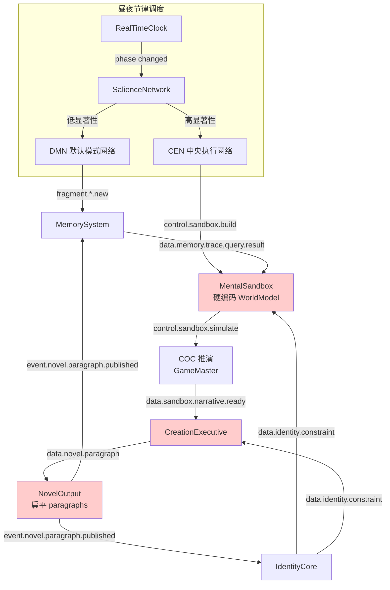

> 图中红色模块为本次重构重点改造对象：世界观硬编码、段落扁平无章节、缺少节奏与审计。

### 2.2 关键问题

| 问题 | 位置 | 影响 |
|------|------|------|
| 世界观硬编码 | [sandbox.py:144-152](file:///home/hedaas/文档/project/LinYi/src/novelist_brain/sandbox.py#L144-L152) `WorldModel(name="default", ontology={...})` | 每个新小说都复用同一套默认世界，缺乏多样性 |
| 角色投影来源不明 | [models.py:140-155](file:///home/hedaas/文档/project/LinYi/src/novelist_brain/models.py#L140-L155) `CharacterProjection` 只有 `name/archetype/source_trace_ids` | 无法区分 OC 与真人投影，难以做角色一致性审计 |
| COC 与小说脱节 | [trpg.py:396-400](file:///home/hedaas/文档/project/LinYi/src/novelist_brain/trpg.py#L396-L400) `_narrate()` 只输出简短判定描述 | 推演结果到小说正文之间跳跃过大 |
| 缺少节奏控制 | [creation_executive.py](file:///home/hedaas/文档/project/LinYi/src/novelist_brain/creation_executive.py) 直接由 narrative line 生成段落 | 没有 Hook、爽点、伏笔回收等网文节奏设计 |
| 无连续性审计 | [eos.py](file:///home/hedaas/文档/project/LinYi/src/novelist_brain/eos.py) 只监控资源与 LLM | 不检查人物 OOC、设定冲突、伏笔断裂 |
| 章节管理缺失 | [novel_output.py:128-150](file:///home/hedaas/文档/project/LinYi/src/novelist_brain/novel_output.py#L128-L150) 只追加 paragraph | 没有章节、卷、版本、回溯能力 |
| 提示词偏文学散文化 | [prompts.py:297-304](file:///home/hedaas/文档/project/LinYi/src/novelist_brain/prompts.py#L297-L304) | 缺少网文结构、节奏、类型场景指令 |

### 2.3 重构后整体架构预览

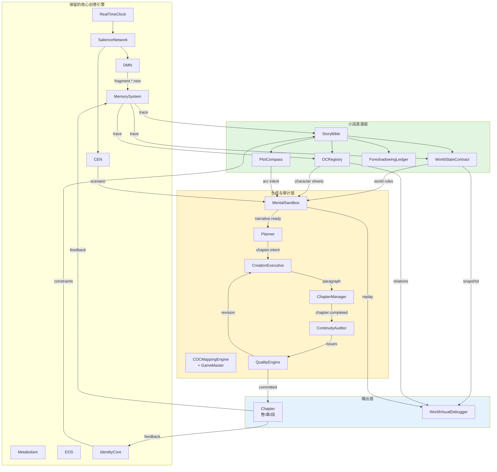

> 绿色为新增“小说真源层”，黄色为改造后的“生成与审计层”，蓝色为输出与可视化层。核心创意引擎（灰色）保持不动。

---

## 3. 核心创意引擎保留与优化

### 3.1 保留范围

以下模块作为“核心创意引擎”完整保留，只进行内部性能与扩展性优化：

1. **事件总线**：[bus.py](file:///home/hedaas/文档/project/LinYi/src/novelist_brain/bus.py) 的 `BusRouter`、topic 路由、优先级、TTL。
2. **模块抽象**：[module.py](file:///home/hedaas/文档/project/LinYi/src/novelist_brain/module.py) 的 `Module` 生命周期、`on_bus_message`、`tick`。
3. **创意网络**：[dmn.py](file:///home/hedaas/文档/project/LinYi/src/novelist_brain/dmn.py)、[cen.py](file:///home/hedaas/文档/project/LinYi/src/novelist_brain/cen.py)、[salience_network.py](file:///home/hedaas/文档/project/LinYi/src/novelist_brain/salience_network.py)。
4. **代谢与评估**：[metabolism.py](file:///home/hedaas/文档/project/LinYi/src/novelist_brain/metabolism.py)、[eos.py](file:///home/hedaas/文档/project/LinYi/src/novelist_brain/eos.py)。
5. **LLM 服务层**：[llm.py](file:///home/hedaas/文档/project/LinYi/src/novelist_brain/llm.py)。
6. **人格内核**：[identity.py](file:///home/hedaas/文档/project/LinYi/src/novelist_brain/identity.py) 的核心结构与约束广播。
7. **记忆基底**：[memory.py](file:///home/hedaas/文档/project/LinYi/src/novelist_brain/memory.py) 的 fragment/trace 模型。

### 3.2 性能与稳定性优化

#### 3.2.1 LLM 调用缓存与去重

当前 `CreationExecutive` 和 `MentalSandbox` 每次生成都会调用 LLM，缺少 prompt 级缓存。建议：

- 在 `LLMService` 中增加 `prompt_hash → response` 缓存（TTL=300s），对相同 identity + world + narrative line 的重复请求直接返回。
- 对 `control.sandbox.simulate` 增加幂等性 key，避免同一 tick 内重复推演。

#### 3.2.2 状态序列化稳定性

当前 `agent_state.json.latest` 指针文件在异常退出后可能指向不存在快照（参见项目 memory）。建议：

- 写入快照时先写 `.tmp`，再原子重命名。
- 启动时校验 `.latest` 指向的文件存在性，缺失时自动以最新快照初始化或空白启动。

#### 3.2.3 模块加载超时保护

为每个模块的 `init()` 增加可配置超时（默认 30s），避免单个模块阻塞整个系统启动。

#### 3.2.4 扩展性：插件式 Agent 注册

在 `module_registry.py` 中增加 `register_agent(name, factory)` 接口，使新增 `ContinuityAuditor`、`QualityEngine` 等 Agent 无需修改 `main.py` 即可注册。

---

## 4. 小说连载与生成系统优化

### 4.1 目标

- 建立“卷 → 章 → 段”三级结构。
- 引入 Story Bible 作为小说真源。
- 增加网文节奏控制（Hook、爽点、伏笔、感情线、世界观线）。
- 实现生成内容的连续性审计与自动修正。
- 支持版本控制与人工回溯。

### 4.1.1 小说生成流程前后对比

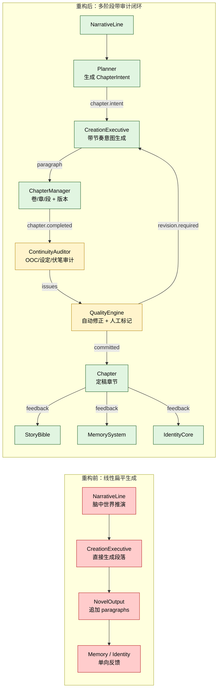

> 重构前是“NarrativeLine → 段落 → 追加”的单向扁平流；重构后引入 Planner（节奏意图）、ChapterManager（章节与版本）、ContinuityAuditor（一致性审计）、QualityEngine（自动修正）四个新阶段，并形成“生成 → 审计 → 修订 → 反馈”的闭环。审计类节点以黄色高亮。

### 4.1.2 重构前后关键变化点

| 维度 | 重构前 | 重构后 | 提升点 |
|------|--------|--------|--------|
| 规划阶段 | 无 | Planner 生成 ChapterIntent | 节奏可控、类型明确 |
| 输出结构 | 扁平 paragraphs | 卷 / 章 / 段 + 版本 | 支持回溯与并发 |
| 审计 | 无 | ContinuityAuditor 六维审计 | 减少 OOC/设定冲突 |
| 修正 | 人工 | QualityEngine 自动 + 人工 | 闭环质量提升 |
| 反馈 | 一次性单向 | 多回路持续反馈 | 人物与世界共同演化 |

### 4.2 新增/改造模块

#### 4.2.1 StoryBible（故事圣经）

作为每部小说的唯一真源，取代 `NovelOutput` 中的 `worldSettings` 和 `sandbox.py` 中硬编码 world。

数据结构：

```python
@dataclass
class StoryBible:
    novel_id: str
    title: str
    genre: str                       # 题材：都市、玄幻、悬疑、克苏鲁等
    theme: str                       # 主题一句话
    premise: str                     # 核心冲突公式
    world_contract: WorldStateContract
    character_registry: dict[str, OCCharacterSheet]
    plot_compass: PlotCompass        # 指南针：终局 + 活跃长线 + 规模
    foreshadowing_ledger: list[ForeshadowingEntry]
    chapter_blueprint: list[ChapterIntent]
    style_fingerprint: StyleFingerprint
    continuity_rules: list[str]
```

#### 4.2.2 ChapterManager（章节管理）

替换 `NovelOutput` 的扁平 paragraph 列表，管理：

```python
@dataclass
class Chapter:
    chapter_id: str
    volume_id: str
    index: int
    title: str
    intent: ChapterIntent
    paragraphs: list[Paragraph]
    status: Literal["draft", "audited", "revised", "committed"]
    versions: list[ChapterVersion]
    created_at: float
    committed_at: float | None
```

关键行为：

- `data.novel.paragraph` 到达时，根据 `chapter_id` 归属到对应 Chapter。
- 每章完成后触发 `control.novel.chapter.completed`。
- 支持 `control.novel.chapter.rollback` 回退到任一版本。

#### 4.2.3 Planner（创作规划器）

在 `CreationExecutive` 之前插入 `Planner`，将 narrative line 转换为写作意图：

```python
@dataclass
class ChapterIntent:
    chapter_index: int
    scene_type: Literal["dialogue", "action", "psychological", "environment", "transition"]
    narrative_beats: list[str]
    rhythm: RhythmProfile          # 钩子、爽点、感情、世界、悬念密度
    foreshadowing_ops: list[ForeshadowingOp]  # 引入/回收/强化
    required_characters: list[str]
    required_settings: list[str]
    emotional_arc: tuple[float, float]  # 起 → 终情感值
```

Planner 订阅 `data.sandbox.narrative.ready`，输出 `data.novel.chapter.intent`。

#### 4.2.4 ContinuityAuditor（连续性审计）

订阅 `event.novel.paragraph.published`，对每段/每章进行结构化审计：

```python
@dataclass
class ContinuityIssue:
    category: Literal["ooc", "setting_conflict", "timeline", "foreshadowing", "tone", "style"]
    severity: Literal["info", "warning", "critical"]
    evidence: str
    suggested_fix: str
```

审计维度（参考 InkOS 37 维与 ainovel-cli 七维）：

1. 人物 OOC：行为与角色卡冲突。
2. 设定冲突：违反世界契约。
3. 时间线：事件顺序矛盾。
4. 伏笔：引入未回收或提前兑现。
5. 文风：偏离声音签名。
6. 节奏：章内缺少钩子或高潮。

#### 4.2.5 QualityEngine（质量评估与自动修正）

基于审计结果：

- 自动修正：对 low-risk issue 直接生成修订提示，调用 `CreationExecutive` 重写。
- 人工标记：对 critical issue 触发 `control.novel.revision.human_required`。
- 评分：输出 `data.novel.quality.score`（0-1）。

### 4.3 事件总线扩展

新增 topic：

```textndata.novel.chapter.intent           # Planner 输出
control.novel.chapter.write          # 触发正文生成
event.novel.chapter.completed        # 章节完成
event.novel.chapter.committed        # 章节定稿
control.novel.audit                  # 触发审计
data.novel.quality.report            # 质量报告
control.novel.revision.required      # 需要修订
data.novel.revision.applied          # 修订已应用
control.novel.chapter.rollback       # 回退版本
event.novel.paragraph.published      # 已存在，保留
```

### 4.4 节奏控制模型

参考 Webnovel Writer 的 Strand Weave 与 ainovel-cli 的弧型模板，定义每章的“四线编织”：

| 线 | 占比（可配置） | 作用 | 检查点 |
|---|---------------|------|--------|
| Quest（主线） | 50-70% | 推动核心冲突 | 是否有关键进展/挫败 |
| Fire（情感线） | 10-30% | 人物关系/情绪张力 | 是否有关系变化 |
| Constellation（世界观线） | 10-30% | 揭示设定/神秘感 | 是否有新信息或禁忌 |
| Rest（过渡/节奏） | 0-20% | 缓冲、铺垫 | 是否控制疲劳度 |

Planner 在生成意图时计算四线得分，低于阈值时提示补全。

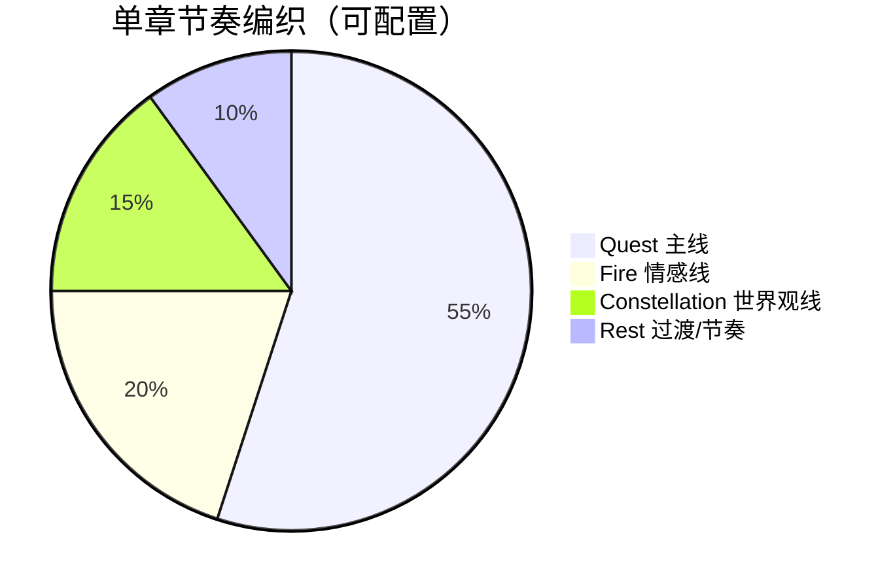


> 上图展示了一章的节拍曲线：Hook 抓人、主线推进、情感升温、世界观扩展、爽点兑现、末尾留钩。Planner 据此生成 `ChapterIntent`。

---

## 5. 脑内世界系统重构

### 5.1 目标

- 移除 `sandbox.py` 中硬编码的 default world。
- 建立动态世界构建框架，世界观从 Story Bible + 林逸经验数据中生成并演化。
- 实现世界状态持久化与自洽演进规则。
- 提供可视化调试工具。

### 5.1.1 脑内世界重构前后对比

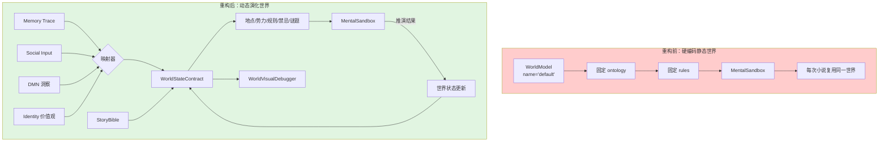

> 重构前世界模型是启动时写死的静态模板；重构后世界从林逸经验数据中动态生成，并随 COC 推演结果持续演化，同时可被可视化调试。

### 5.2 动态世界构建框架

#### 5.2.1 WorldStateContract（世界状态契约）

作为世界真源，结构化存储：

```python
@dataclass
class WorldStateContract:
    novel_id: str
    genre: str
    tone: str
    geography: dict[str, Any]          # 地点图谱
    factions: dict[str, Any]           # 势力/组织
    rules: list[WorldRule]             # 物理/社会/神秘规则
    history: list[HistoricalEvent]     # 正史时间线
    forbidden: list[Forbidden]         # 禁忌与后果
    mysteries: list[Mystery]           # 未解之谜
    current_state: dict[str, Any]      # 当前世界状态
    version: int
```

每条 `WorldRule` 包含：

```python
@dataclass
class WorldRule:
    rule_id: str
    domain: Literal["physical", "social", "mystical", "narrative"]
    statement: str
    breakable: bool
    consequences: list[str]
    introduced_in: str
    status: Literal["active", "broken", "evolved"]
```

#### 5.2.2 世界与林逸经验的关联

世界构建不是凭空生成，而是从以下经验数据中抽取：

1. **记忆 Trace**：地点、人物、事件、情绪主题被映射为世界地点、OC 原型、历史事件。
2. **社交输入**：SocialInput 中的 space/role/encounter 映射为社会规则与势力结构。
3. **DMN 输出**：梦境与洞察映射为神秘规则、禁忌、未解之谜。
4. **IdentityCore**：价值观与冲突映射为世界主题与核心矛盾。

映射规则示例：

```text
Trace tag="便利店" + valence<0 → World geography: "凌晨便利店"（边缘空间）
Trace narrative_role="character" + high arousal → OC character seed
Social space="旧书店" + gaze_pressure>0.5 → Faction: 旧书收藏家同盟
DMN insight about "雨是天空在写字" → Mystical rule: 雨水携带信息
```

#### 5.2.3 世界演进规则

世界随小说进程和经验输入按以下规则演化：

1. **稳定规则**：物理与社会基础规则只有在重大剧情转折时才可被打破。
2. **禁忌代价**：任何角色打破 `forbidden` 规则，必须触发 `consequences` 中至少一条。
3. **神秘感管理**：`mysteries` 中的谜题必须按 Story Bible 的回收计划逐步揭晓。
4. **地点活化**：随着故事推进，地点状态从“未探索”→“熟悉”→“危险”→“改变”。
5. **势力变化**：Faction 的 power/influence 随角色行动和事件结果更新。

#### 5.2.4 世界状态持久化

- `WorldStateContract` 随 `agent_state.json` 一起序列化。
- 每次 `data.sandbox.world.updated` 触发世界版本快照。
- 提供 `world_state.json` 人类可读投影，便于调试。

### 5.3 MentalSandbox 改造

#### 5.3.1 移除硬编码世界

将 [sandbox.py:144-152](file:///home/hedaas/文档/project/LinYi/src/novelist_brain/sandbox.py#L144-L152) 的 default world 改为：

```python
if self._world_model is None:
    self._world_model = WorldModel(
        name=story_bible.title or "untitled",
        ontology=world_contract.to_ontology(),
        rules=[r.statement for r in world_contract.rules],
        current_state={"time": story_bible.timeline.current_period},
    )
```

`sandbox` 的 `init()` 接收 `story_bible` 和 `world_contract` 作为上下文，而不是 `world_data`。

#### 5.3.2 动态场景生成

`_create_default_scene()` 不再写死，而是从 `WorldStateContract.geography` 中按当前情节选择地点，并注入：

- 当前时间/天气/氛围
- 在场角色状态
- 未回收伏笔列表
- 当前冲突张力

### 5.4 可视化调试工具

新增 `WorldVisualDebugger` 模块（Web 端或 CLI）：

- **世界图谱**：地点、势力、角色关系图（基于现有 PixiJS SocialView 扩展）。
- **时间线**：历史事件、伏笔引入/回收、规则被打破记录。
- **状态对比**：对比两个世界版本之间的差异。
- **推演回放**：回放 COC 推演过程，查看骰子结果与叙事影响。

事件 topic：

```text
data.debug.world.snapshot
data.debug.world.diff
data.debug.narrative.replay
```

---

## 6. 人物投影系统改造

### 6.1 目标

- 将“真人投影”全面改造为“原创角色（OC）投影”。
- 设计 OC 创建、管理、存储方案。
- 确保所有 OC 符合 COC 规则要求。
- 建立 OC 与世界观的适配机制。

### 6.1.1 人物投影系统改造前后对比

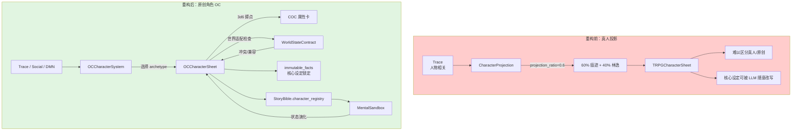

> 重构前角色是“痕迹 + 林逸”的混合投影，来源模糊、设定可被随意改写；重构后角色是完全原创的 OC，有独立的 COC 规则卡、不可变事实，并与世界观做适配检查。

### 6.2 OC 数据模型

替换/扩展现有 `CharacterProjection`：

```python
@dataclass
class OCCharacterSheet:
    character_id: str
    name: str
    archetype: str
    role_in_story: Literal["protagonist", "antagonist", "supporting", "walk-on"]
    source_traces: list[str]

    # 人格
    traits: TraitVector
    values: list[str]
    desires: list[Desire]
    fears: list[Fear]
    internal_conflict: str

    # COC 规则卡
    coc_attributes: dict[str, int]       # str/con/dex/int/pow/app/edu/siz
    coc_skills: dict[str, float]
    sanity: SanitySystem
    luck: LuckPool
    hit_points: float
    magic_points: float
    inventory: Inventory
    conditions: list[Condition]
    improvement_marks: SkillImprovement

    # 叙事状态
    relationships: dict[str, Relationship]
    current_goal: str
    current_emotional_state: dict[str, float]
    narrative_arc: list[str]
    immutable_facts: list[str]           # 不可被 LLM 改写的核心设定

    projection_ratio: float = 0.0        # OC 为 0，表示完全原创
```

> 注：`projection_ratio` 仍保留但固定为 0，以兼容现有 `CharacterProjection` 序列化。

### 6.3 OC 创建流程

1. **种子提取**：从记忆 trace、社交输入、DMN 洞察中提取人物种子。
2. **原型选择**：由 LLM 根据种子选择 archetype（参考雪花写作法的角色动力学三角）。
3. **COC 规则卡生成**：调用 `build_oc_sheet()`，掷 3d6 生成属性，分配技能点。
4. **世界适配**：检查 OC 是否与 `WorldStateContract` 冲突（如出现时代错位的物品/技能）。
5. **Story Bible 注册**：写入 `StoryBible.character_registry`。
6. **不可变事实锁定**：用户/系统可标记核心设定为 immutable。

### 6.4 OC 管理系统

新增 `OCCharacterSystem` 模块：

- 订阅 `data.memory.trace.query.result`：发现新角色种子。
- 订阅 `control.oc.create`：显式创建 OC。
- 订阅 `control.oc.update`：更新角色状态（仅允许非 immutable 字段）。
- 发布 `data.oc.created`、`data.oc.updated`。
- 提供 `get_sheet(id)`、`query_by_archetype()`、`query_by_relationship()`。

### 6.5 与 COC 循环的集成

`MentalSandbox._rebuild_character_sheets()` 改为从 `StoryBible.character_registry` 读取 OC 数据，生成 `TRPGCharacterSheet`。

`GameMaster` 在裁决时：

- 检查行动是否符合 OC 的 `immutable_facts`。
- 行动导致的属性/技能变化写回 `OCCharacterSheet`。
- 重大变化触发 `data.oc.evolved`。

---

## 7. COC 循环系统重构

### 7.1 目标

- 彻底移除单一写死剧本。
- 建立“小说架构 → COC 规则映射 → 章节推演 → 小说内容”的动态框架。
- 明确 COC 沙盒作为“小说血肉完善工具”的定位：它生成具体场景、动作、对话和情绪细节，但不替代小说结构设计。

### 7.1.1 COC 循环系统重构前后对比

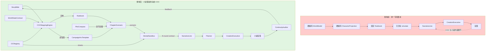

> 重构前 COC 循环基于写死的模板运行，推演与小说正文之间跳跃大；重构后 COC 规则由 Story Bible 动态映射，每章有独立 Scenario，推演结果经 Planner 转化为带节奏意图的小说段落，并受审计反馈修正。

### 7.2 动态 COC 循环框架

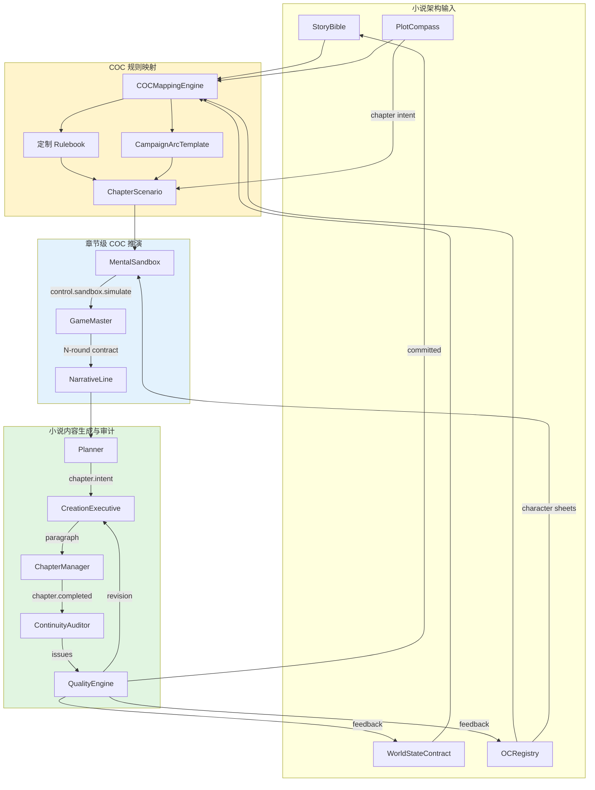

> 上图展示小说架构如何驱动 COC 规则生成，规则又如何约束章节推演，推演结果最终转化为小说段落并反馈回真源层。

### 7.3 小说架构完成后的自动映射

#### 7.3.1 架构输入

`COCMappingEngine` 接收：

- `StoryBible.premise`
- `StoryBible.plot_compass`
- `StoryBible.chapter_blueprint`
- `WorldStateContract.rules`
- `StoryBible.character_registry`

#### 7.3.2 映射输出

1. **Rulebook 定制**：
   - 根据世界观生成 `skills`（如克苏鲁题材增加“神话知识”）。
   - 根据题材生成 `actions`（如都市题材增加“社交博弈”）。
   - 设置 `sanity` 规则（ horror 题材启用，日常题材弱化）。

2. **Campaign Arc Template**：
   - 将小说整体结构映射为 COC 战役弧：引入 → 上升 → 转折 → 高潮 → 余韵。
   - 每个阶段绑定关键场景类型与难度曲线。

3. **章节级 Scenario**：
   - 每章对应一个 COC scenario，包含：目标、关键 NPC、地点、冲突、可能的检定。

### 7.4 基于小说人物/世界/提纲的规则适配

示例映射：

| 小说元素 | COC 规则映射 |
|----------|-------------|
| 主角是图书管理员 | 技能：图书馆使用 +30，侦察 +20 |
| 世界观：雨水携带信息 | 规则：雨天进行“聆听/侦察”获得奖励骰 |
| 禁忌：不可直视镜子 | 规则：违反则 SAN 检定，失败获得临时疯狂 |
| 情节：追踪神秘人物 | Scenario：追逐场景，多轮追踪/躲藏对抗 |
| 伏笔：旧车票 | 物品：旧车票（clue），可触发回忆检定 |

### 7.5 章节级 COC 推演与小说生成联动

#### 7.5.1 推演触发

`CEN` 不再无目标地 `control.sandbox.simulate`，而是：

```text
CEN → control.sandbox.scenario.load {chapter_index, scenario_id}
      → control.sandbox.simulate {action, character_id}
      → ... N-round contract ...
      → data.sandbox.narrative.ready
```

#### 7.5.2 N-round contract 增强

保留现有 `_DEFAULT_MIN_ROUNDS = 3` 和 `_DEFAULT_MAX_ROUNDS = 7`，但 `depth_thresholds` 扩展为：

```python
_DEPTH_THRESHOLDS = {
    "conflict_depth": 0.6,
    "character_development": 0.5,
    "emotional_shift": 0.5,
    "coherence_score": 0.6,
    "hook_strength": 0.4,        # 新增：钩子强度
    "foreshadowing_progress": 0.3, # 新增：伏笔推进
    "scene_variety": 0.4,         # 新增：场景类型多样性
}
```

#### 7.5.3 推演结果到小说内容的转化

当前 `CreationExecutive` 只接收 `NarrativeLine`，缺少骰子结果到文学语言的精细转化。改造后：

1. `Planner` 根据 `NarrativeLine` 生成 `ChapterIntent`。
2. `CreationExecutive` 接收 `ChapterIntent + NarrativeLine + skill_checks + world_state`。
3. 新增提示词 `build_scene_prose_prompt`：
   - 明确场景类型（对话/动作/心理/环境）。
   - 注入骰子结果的情绪化描述。
   - 要求将 COC 判定转化为人物动作、环境反应、内心波动。
   - 遵循节奏意图（Hook、爽点、过渡）。

### 7.6 COC 沙盒的定位与边界

| 属于 COC 沙盒 | 不属于 COC 沙盒 |
|---------------|-----------------|
| 具体场景的判定与细节 | 小说整体结构设计 |
| 角色在场景中的行为结果 | 角色的核心人设与世界观 |
| 冲突的随机走向 | 冲突的宏观意义与主题 |
| 伏笔的具体触发时机 | 伏笔的宏观布局 |
| 战斗/追逐/对抗的技术细节 | 情感高潮的文学处理 |

COC 沙盒是“小说血肉完善工具”：它让小说场景有血有肉、有意外、有真实感，但小说的骨架（主题、结构、人物弧光）由 Story Bible 和 Planner 决定。

---

## 8. 数据模型扩展

### 8.1 新增 dataclass

新增到 [models.py](file:///home/hedaas/文档/project/LinYi/src/novelist_brain/models.py)：

- `StoryBible`
- `WorldStateContract`
- `WorldRule`
- `OCCharacterSheet`
- `Chapter`
- `ChapterIntent`
- `Paragraph`（增强，含 audit metadata）
- `ForeshadowingEntry`
- `ContinuityIssue`
- `QualityReport`

### 8.1.1 新增数据模型关系图

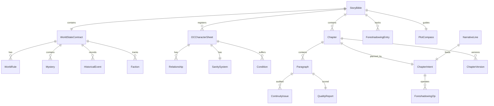

> 上图展示新增数据实体之间的关系。StoryBible 是所有真源的根节点；WorldStateContract 与 OCCharacterSheet 被 StoryBible 统一管理；Chapter 由 ChapterIntent 规划，包含 Paragraph 与版本；Paragraph 接受审计与评分。

### 8.2 兼容现有序列化

`dataclass_to_dict` / `reconstruct_dataclass` 机制保持不变。新增模型需要实现 `to_dict()` / `from_dict()` 或依赖 dataclass 泛型序列化。

### 8.3 存储策略

- `agent_state.json`：保留核心模块状态。
- `story_bible/{novel_id}.json`：Story Bible 真源。
- `world_state/{novel_id}/v{N}.json`：世界版本快照。
- `chapters/{novel_id}/{volume_id}/{chapter_id}/`：章节段落与版本。
- `oc_registry/{novel_id}.json`：OC 角色注册表。

---

## 9. 技术实现路径

### 9.0 分阶段实施路线图

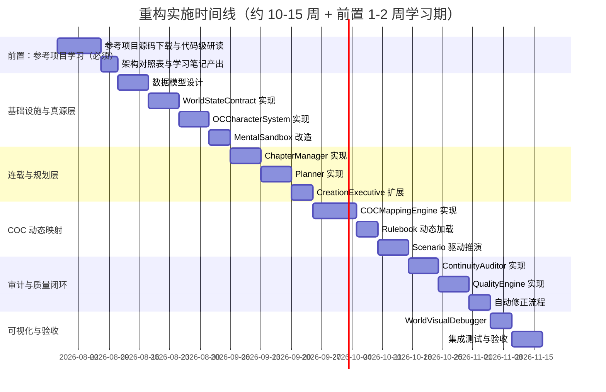

> 实施分为五个阶段，**前 1-2 周为强制性的参考项目学习理解阶段**。在所有正式重构工作开始前，必须完成对所有参考项目的源码级分析（详见 9.0.1）。阶段间存在依赖关系，建议每个阶段结束后进行一次设计评审与回归测试。

### 9.0.1 前置：参考项目学习理解阶段（强制，1-2 周）

> **硬性要求**：所有参与重构实施的工程师，在开始任何代码改动前，必须完整下载本方案第 14 章列出的全部参考项目源码，逐一进行代码级阅读与分析，并将学习成果沉淀到 `docs/refs/` 目录下。未完成本阶段任务的人员不得进入正式重构阶段。

#### 9.0.1.1 必做项

1. **完整下载源码**：将第 14 章列出的 7 个参考项目完整克隆至 `docs/refs/` 子目录，禁止只看 README 摘要。
2. **核心代码通读**：至少完成以下模块的逐行阅读，并记录关键设计：
   - 主入口、整体目录结构、构建/运行脚本。
   - Agent / 模块拆分、提示词模板、数据流。
   - 状态持久化、版本控制、迁移机制。
   - 审计、质量评估、连续性检测相关实现。
3. **架构对照表**：产出 `docs/refs/architecture_compare.md`，对比本项目与每个参考项目在以下维度的异同：模块拆分、事件/数据流、状态管理、提示词组织、错误处理、性能优化、扩展机制。
4. **关键技术笔记**：产出 `docs/refs/tech_notes/<project>.md`，每个项目一份，包含：核心创新点、可直接复用的设计、需要改造才能借鉴的部分、潜在风险。
5. **学习评审会议**：在学习阶段结束前组织一次跨人评审，确认所有参与者对参考项目的理解一致。

#### 9.0.1.2 学习产出物清单

| 产出物 | 路径 | 验收标准 |
|--------|------|----------|
| 参考项目源码 | `docs/refs/<project>/` | 完整可运行，包含 README 与许可证 |
| 架构对照表 | `docs/refs/architecture_compare.md` | 至少 7 行对比，覆盖 7 个维度 |
| 项目技术笔记 | `docs/refs/tech_notes/<project>.md` | 每份 ≥ 800 字，含可借鉴/需改造/风险三段 |
| 学习评审纪要 | `docs/refs/review_notes.md` | 列出所有参与者的确认签字或电子确认 |
| 借鉴清单映射 | `docs/refs/borrow_matrix.md` | 把本方案中的每个借鉴点与具体参考项目/文件/行号一一对应 |

#### 9.0.1.3 学习阶段验收标准

- 全部 7 个参考项目源码已下载且目录结构完整。
- 架构对照表已通过至少一位主程评审。
- 借鉴清单矩阵覆盖本方案第 14 章的 100% 借鉴点。
- 至少一次跨人评审会议纪要存档。
- 任何未完成上述要求的工程师，不得进入 9.1 阶段。

### 9.1 阶段一：基础设施与真源层（2-3 周）

1. 新增 `StoryBible`、`WorldStateContract`、`OCCharacterSheet` 数据模型。
2. 实现 `WorldStateContract` 的初始化、版本化、持久化。
3. 实现 `OCCharacterSystem` 基础 CRUD。
4. 改造 `MentalSandbox.init()` 接收 Story Bible 与世界契约，移除硬编码 default world。
5. 新增事件 topic 与模块注册接口。

**验收标准**：

- 启动时不再创建 `WorldModel(name="default")`。
- 可以从上下文加载自定义世界观。
- OC 角色可创建并持久化。

### 9.2 阶段二：连载与规划层（2-3 周）

1. 实现 `ChapterManager`，替换 `NovelOutput` 的扁平 paragraph 列表。
2. 实现 `Planner`：NarrativeLine → ChapterIntent。
3. 扩展 `CreationExecutive` 接收 ChapterIntent。
4. 新增网文节奏提示词模板。
5. 实现章节版本控制与回溯。

**验收标准**：

- 支持“卷 → 章 → 段”结构。
- 每章有明确的 intent。
- 可回退到任意章节版本。

### 9.3 阶段三：COC 动态映射与推演（3-4 周）

1. 实现 `COCMappingEngine`：Story Bible → 定制 Rulebook + Campaign Arc。
2. 改造 `Rulebook` 支持动态加载技能/动作/规则。
3. 实现章节级 Scenario 加载。
4. 扩展 `_DEPTH_THRESHOLDS`，增强 narrative ready 判断。
5. 改造 `_narrate()` 与 `CreationExecutive` 的提示词，将骰子结果文学化。

**验收标准**：

- 不同题材的小说使用不同的 Rulebook。
- COC 推演基于当前章节 scenario。
- 推演结果能转化为自然的小说段落。

### 9.4 阶段四：审计与质量闭环（2-3 周）

1. 实现 `ContinuityAuditor`。
2. 实现 `QualityEngine`。
3. 集成自动修正与人工标记流程。
4. 将审计结果反馈到 Story Bible 与 OC 注册表。

**验收标准**：

- 能检测人物 OOC、设定冲突、伏笔断裂。
- 自动生成质量报告。
- 低风险问题可自动触发重写。

### 9.5 阶段五：可视化与调试（1-2 周）

1. 实现 `WorldVisualDebugger` 数据接口。
2. 扩展前端 SocialView 为世界图谱视图。
3. 增加时间线、状态对比、推演回放。

**验收标准**：

- Web 端可查看世界地点/势力/角色关系图。
- 可回放最近一轮 COC 推演。

---

## 10. 数据迁移策略

### 10.1 存量状态兼容

- 旧 `agent_state.json` 中的 `MentalSandbox` 状态包含 `world_model`、`characters`、`narrative_lines`。
- 迁移脚本 `tools/migrate_state_v1_to_v2.py`：
  1. 读取旧 state。
  2. 从旧 `world_model` 提取 `ontology` 和 `rules`，生成 `WorldStateContract`。
  3. 从旧 `characters` 生成 `OCCharacterSheet`，`projection_ratio` 设为 0。
  4. 将旧 `paragraphs` 整理为 `Chapter` 结构（默认单卷单章）。
  5. 生成新的 `StoryBible` 并保存到 `story_bible/`。
  6. 写回新的 `agent_state.json`。

### 10.1.1 数据迁移流程图

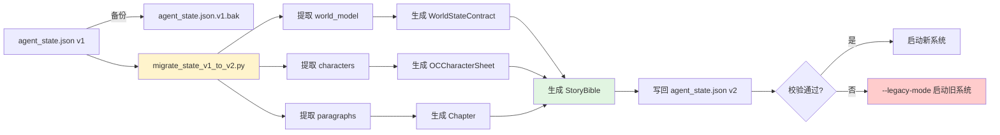

> 迁移脚本优先保留旧状态备份，再提取关键数据生成新的 StoryBible 与真源层。校验失败时可降级到 legacy mode。

### 10.2 配置迁移

- `default.config.json` 和 `novelist.config.json` 中新增：
  - `story_bible_dir`
  - `world_state_dir`
  - `chapter_dir`
  - `oc_registry_dir`
  - `novel_id`

### 10.3 降级策略

- 若迁移失败，保留旧 state 备份为 `agent_state.json.v1.bak`。
- 系统支持 `--legacy-mode` 启动旧路径，直到新路径稳定。

---

## 11. 测试计划

### 11.0 测试分层与闭环

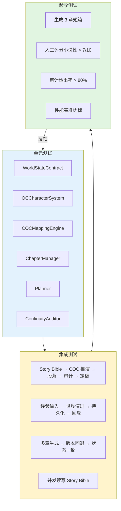

> 测试分为三层：单元测试保证模块正确性，集成测试验证模块间协作，验收测试验证最终小说质量与性能。验收结果反馈回单元测试用例持续改进。

### 11.1 单元测试

| 模块 | 测试内容 |
|------|----------|
| `WorldStateContract` | 初始化、规则校验、版本快照、差异计算 |
| `OCCharacterSystem` | 创建、更新、immutable 锁定、COC 属性生成 |
| `COCMappingEngine` | 不同题材映射到不同 Rulebook |
| `ChapterManager` | 段落归属、版本回溯、状态流转 |
| `Planner` | NarrativeLine → ChapterIntent 转换 |
| `ContinuityAuditor` | OOC、设定冲突、伏笔断裂检测 |

### 11.2 集成测试

1. **端到端小说生成**：从 Story Bible → COC 推演 → 段落生成 → 审计 → 定稿。
2. **世界演进**：经验输入触发世界规则变化，验证持久化与回放。
3. **版本回退**：完成多章后回退到旧版本，验证状态一致性。
4. **并发安全**：多模块同时读写 Story Bible 的竞态条件。

### 11.3 验收测试

- 生成一篇 3 章短篇，检查：
  - 人物行为是否符合 OC 设定。
  - 是否有明显设定冲突。
  - 节奏是否符合 intent。
  - 伏笔是否有回收计划。

### 11.4 性能基准

- 单章生成（含审计）< 60s（当前 MiniMax-M3 环境下）。
- 世界状态序列化 < 500ms。
- 启动加载 < 10s。

---

## 12. 风险评估与应对

| 风险 | 可能性 | 影响 | 应对措施 |
|------|--------|------|----------|
| LLM 输出不稳定导致 world contract 被污染 | 中 | 高 | immutable 字段 + 人工审核 + 版本快照 |
| 新数据模型与旧 state 不兼容 | 中 | 高 | 迁移脚本 + 备份 + legacy mode |
| COC 规则映射过复杂难以维护 | 中 | 中 | 模板化映射 + 配置驱动 |
| 节奏控制提示词导致输出套路化 | 中 | 中 | 声音签名优先 + 风格指纹去 AI 味 |
| 性能下降（审计增加 LLM 调用） | 高 | 中 | 异步审计 + 缓存 + 可配置开关 |
| 前端可视化改造超出预期 | 低 | 中 | 先实现数据接口，前端分阶段迭代 |

---

## 13. 预期成果与验收标准

### 13.1 预期成果

1. **一部可配置世界观的小说**：每部小说有独立的 Story Bible、WorldStateContract、OCRegistry。
2. **动态世界**：世界观随林逸经验和小说进程演化，不再写死。
3. **OC 角色库**：所有角色为原创角色，有完整 COC 规则卡和不可变设定。
4. **章节化连载**：支持卷、章、段三级结构，版本可控，可回溯。
5. **COC 小说化联动**：COC 推演为小说提供血肉，小说结构指导 COC 推演。
6. **质量闭环**：连续性审计与自动修正减少幻觉和崩坏。
7. **可视化调试**：世界状态、角色关系、推演过程可观测。

### 13.2 验收标准

| 标准 | 度量 |
|------|------|
| 核心引擎无回归 | 所有现有单元测试通过 |
| 世界观可配置 | 至少 2 部不同题材小说的 Story Bible 可切换 |
| OC 完整性 | 每个主要角色有 COC 卡 + immutable facts |
| 章节管理 | 支持至少 10 章的版本控制与回溯 |
| 审计有效性 | 对人为注入的 OOC/设定冲突检出率 > 80% |
| 生成质量 | 人工评分：小说性 > 7/10（相比当前提升） |
| 性能 | 单章生成（含审计）< 60s |

---

## 14. 参考项目详细清单

> 本章列出本方案选定的全部参考项目，包括项目名称、源代码链接、所属方向，以及**选择该项目作为参考的具体原因**。所有列出的项目都已经在重构前完成克隆，存放在 `.trae/references/` 与 `docs/refs/` 下，重构实施人员必须按 9.0.1 的要求对每一个项目进行代码级研读。

### 14.1 选型原则

选择参考项目时遵循以下原则：

1. **方向契合**：项目核心目标与 LinYi 至少一个重构方向高度相关（连载、世界观构建、OC、COC、质量评估等）。
2. **网文优先**：优先选择面向网络小说/长篇连载的项目，因为其节奏、钩子、追读力等机制最接近 LinYi 的最终目标。
3. **可工程化**：项目有清晰的模块拆分、状态管理与可运行代码，能直接被借鉴而非停留在概念层面。
4. **维护活跃或方法论成熟**：项目近一年内仍被使用，或其方法论已被多项目验证（如雪花写作法）。
5. **技术栈差异覆盖**：兼顾 Go、TypeScript、Python 等不同语言实现，便于交叉对比。

### 14.2 参考项目总览

| # | 项目名称 | 项目链接 | 主要语言 | 方向 | 在本方案中的角色 |
|---|----------|----------|----------|------|------------------|
| 1 | ainovel-cli | https://github.com/voocel/ainovel-cli | Go | 长篇网文自动生成 | 引擎架构与审计的工程化样本 |
| 2 | InkOS | https://github.com/Narcooo/inkos | TypeScript | 通用/剧本/影游创作智能体 | 状态真源与多 Agent 流水线样本 |
| 3 | NovelPilot | https://github.com/dorakingx/novelpilot | TypeScript/Next.js | 9 Agent 短篇流水线 | 故事圣经与连续性侦探样本 |
| 4 | Webnovel Writer | https://github.com/lingfengQAQ/webnovel-writer | Python | Claude Code 网文插件 | 网文节奏与 Story System 真源样本 |
| 5 | AI Novel Factory | https://github.com/tianxia--/ai-novel-factory | TypeScript | 生产级小说工作流 | Director/Worker 协作与 SQLite 真源样本 |
| 6 | NovelDreamer | https://github.com/arian-emami/NovelDreamer | Python | 研究型长篇故事生成 | 显式叙事结构与风格迁移样本 |
| 7 | AI_NovelGenerator (YILING) | https://github.com/YILING0013/AI_NovelGenerator | Python | 雪花写作法 GUI 工具 | 雪花写作法工程实现样本 |

### 14.3 各项目选择原因与可借鉴点

#### 14.3.1 ainovel-cli

- **项目链接**：https://github.com/voocel/ainovel-cli
- **方向**：长篇网文自动生成引擎
- **选择原因**：
  1. 项目目标是“确定性引擎 + LLM”混合驱动，与 LinYi 把 LLM 嵌入事件总线的思路完全同构，是 LinYi 最直接的工程参考。
  2. 项目把写作流程拆成“指南针 + 滚动视野 + 七维评审 + 去 AI 味规则”，对“避免越写越崩”有成熟方案。
  3. Go 语言实现让模块边界非常清晰，便于 LinYi 在 Python 中做对照实现。
- **可借鉴的核心设计**：
  - `internal/flow/` 中的有限状态机推进章节。
  - `internal/eval/` 中的七维评审（含审美分项）。
  - `internal/rules/` 中的去 AI 味规则黑名单 + 语义判据。
  - `internal/agents/ctxpack/` 中的上下文压缩与打包。
- **需要改造才能借鉴的部分**：
  - 编译为单一二进制的工作流与 LinYi 的多模块热加载不完全兼容。
  - 仿写画像（`stylestat/`）依赖大量样本，本项目可只取其统计指标。
- **潜在风险**：Go 生态工具与 Python 不可直接共享，需要做接口层转译。

#### 14.3.2 InkOS

- **项目链接**：https://github.com/Narcooo/inkos
- **方向**：通用 / 剧本 / 互动影游创作智能体
- **选择原因**：
  1. 项目有完整的 37 维连续性审计与去 AI 味检测，覆盖 LinYi 第 7 章 QualityEngine 的全部审计维度。
  2. 项目的“结构化 JSON 真源 + Markdown 投影 + SQLite 时序记忆”三层记忆体系，正是 LinYi `WorldStateContract` 设计的雏形。
  3. 支持短篇、长篇、剧本、互动影游多种形态，可帮助 LinYi 评估不同形态的兼容方案。
- **可借鉴的核心设计**：
  - `author_intent.md` + `current_focus.md` 的意图/上下文双文件输入治理。
  - 每章 `intent.md` / `context.json` / `rule-stack.yaml` 的运行时合同。
  - 基于正史生成 2-5 条隔离候选未来的剧情多线推演。
  - `inkos style analyze` 提取文风指纹并注入后续创作。
- **需要改造才能借鉴的部分**：
  - InkOS 的剧本模式与网文节奏模型差异较大，需要在 QualityEngine 中按题材分支。
  - TypeScript 实现的审计引擎需要重写为 Python。
- **潜在风险**：互动影游分支的复杂度可能拖累主线，需明确“仅借鉴审计与真源设计”。

#### 14.3.3 NovelPilot

- **项目链接**：https://github.com/dorakingx/novelpilot
- **方向**：9 Agent 短篇流水线（Next.js）
- **选择原因**：
  1. 9 个 Agent 顺序执行的流水线（Premise Architect → Character Director → … → Publisher）与 LinYi 的“事件总线 + 模块”模型高度同构，可直接对应。
  2. Foreshadowing Tracker 与 Continuity Detective 的结构化输出（`category / severity / evidence / suggestedFix`）是 LinYi `ContinuityAuditor` 的接口原型。
  3. 短篇流水线有助于先实现最小闭环，再迁移到长篇。
- **可借鉴的核心设计**：
  - Story Bible 容器：概念、角色、世界、情节、章纲的统一结构。
  - Foreshadowing Tracker：`introducedIn / status / suggestedPayoff / payoffChapter / emotionalPurpose`。
  - Continuity Detective 的结构化 issue 输出格式。
  - Agent 失败回退与重试（`agent-retry.ts` / `agent-fallbacks.ts`）。
- **需要改造才能借鉴的部分**：
  - Next.js 的前端状态管理需要剥离开，LinYi 只需其核心 lib。
  - TypeScript 的强类型迁移到 Python dataclass 时要注意可空性处理。
- **潜在风险**：短篇模型直接套用到长篇可能“规划不够”，需在长篇模式下加滚动规划。

#### 14.3.4 Webnovel Writer

- **项目链接**：https://github.com/lingfengQAQ/webnovel-writer
- **方向**：Claude Code 网文写作插件（Python）
- **选择原因**：
  1. 项目专门面向中文网文，是 LinYi 唯一题材完全一致的开源参考，其 Story System 合同链、RAG 记忆、追读力系统都直接对应 LinYi 第 4 章需求。
  2. 37 个题材模板（玄幻、都市、言情、规则怪谈等）几乎覆盖国内主流网文赛道，LinYi 可直接复用其模板分类。
  3. 防幻觉三定律（大纲即法律、设定即物理、发明需识别）可作为 ContinuityAuditor 的核心规则来源。
- **可借鉴的核心设计**：
  - `.story-system/MASTER_SETTING.json` + 卷合同 + 审查合同 + 运行时合同的真源分层。
  - Strand Weave（Quest/Fire/Constellation 60/20/20）节奏系统。
  - Hook / Cool-point / 微兑现 / 债务追踪的追读力系统。
  - 题材模板与禁忌词表。
- **需要改造才能借鉴的部分**：
  - 作为 Claude Code 插件深度绑定 Claude，本项目需要剥离为 Python 通用库。
  - 题材模板需结合林逸的人物画像做轻量化定制。
- **潜在风险**：合同链过深可能导致写作节奏被打断，需要为创作流畅度保留“快速生成模式”。

#### 14.3.5 AI Novel Factory

- **项目链接**：https://github.com/tianxia--/ai-novel-factory
- **方向**：生产级小说工作流（TypeScript + SQLite）
- **选择原因**：
  1. 项目以 `factory.sqlite` 为唯一真源，把“工作流 + 持久化 + 多项目”做成工业级实现，是 LinYi 状态层最直接的对照。
  2. Director + Worker 模式适合 LinYi 后续扩展为多作家/多小说并发场景。
  3. 项目文档齐全（PRODUCTION_ARCHITECTURE.md、PRIORITY_ISSUE_SOLUTION.md），便于按其“问题→方案”结构做参考。
- **可借鉴的核心设计**：
  - SQLite 作为工作流真源，避免 JSON 文件膨胀。
  - Director/Worker 角色划分与任务调度。
  - 优先级与冲突解决机制（`PRIORITY_ISSUE_SOLUTION.md`）。
  - TUI/Studio 多端复用同一真源。
- **需要改造才能借鉴的部分**：
  - TypeScript 强类型需要迁移到 Python 类型注解。
  - OpenCode/AI 适配层需替换为 LinYi 的 `LLMService`。
- **潜在风险**：把 SQLite 引入 LinYi 会增加部署复杂度，建议初期仅借鉴其“单一真源”思想，仍使用 JSON。

#### 14.3.6 NovelDreamer

- **项目链接**：https://github.com/arian-emami/NovelDreamer
- **方向**：研究型长篇故事生成（Python + 学术论文）
- **选择原因**：
  1. 项目配套学术论文（NovelDreamer: Harnessing LLMs for Coherent and Engaging Long-Form Storytelling）提供了可引用的方法论。
  2. 显式故事结构选择（Hero's Journey / Freytag / Three-Act / Story Circle / Fichtean Curve / Save the Cat / Seven-Point）是 LinYi Planner 选择节拍曲线时的依据。
  3. 使用 Wikiquote 做风格迁移的做法为去 AI 味提供了低成本方案。
- **可借鉴的核心设计**：
  - 故事结构选择器与节拍注入。
  - 每章三幕（Act 1 / Act 2 / Act 3）的结构化生成。
  - 风格迁移与名句检索。
- **需要改造才能借鉴的部分**：
  - 学术原型代码较粗糙，需要工程化封装。
  - Wikiquote 仅覆盖英文经典，需要本地化或替换为中文语料。
- **潜在风险**：结构选择器是显式 LLM 调用，会显著增加 token 成本，需要谨慎设计触发频率。

#### 14.3.7 AI_NovelGenerator (YILING)

- **项目链接**：https://github.com/YILING0013/AI_NovelGenerator
- **方向**：雪花写作法 GUI 工具（Python + PyQt）
- **选择原因**：
  1. 完整实现雪花写作法（核心种子 → 角色动力学 → 三幕悬念 → 章纲 → 正文），其提示词模板可直接被 LinYi `Planner` 借鉴。
  2. GUI 中对“章纲节奏曲线”的可视化（每 3-5 章一个悬念单元，标注悬念密度/情感迁移/伏笔操作/认知颠覆强度）正是 LinYi PlanCompass 的目标产物。
  3. 项目面向中文长篇，提示词与林逸的中文创作语境完全契合。
- **可借鉴的核心设计**：
  - 雪花写作法全流程提示词（`prompt_definitions.py`）。
  - 章纲悬念密度、伏笔操作、认知颠覆强度的标注体系。
  - 场景类型模板（对话/动作/心理/环境/过渡）。
  - consistency_checker 的实现思路。
- **需要改造才能借鉴的部分**：
  - PyQt GUI 不需要借鉴，只用其 lib。
  - 部分提示词偏向通俗网文，与林逸“严肃文学”自我叙事存在张力，需要混合使用。
- **潜在风险**：雪花写作法结构化程度高，过度依赖可能让小说过于工整，需要在 `IdentityCore` 中保留自由发挥空间。

### 14.4 借鉴矩阵：方案借鉴点 → 参考项目

| 本方案借鉴点 | 主参考 | 辅助参考 | 关键文件/章节 |
|--------------|--------|----------|---------------|
| Story Bible 真源 | Webnovel Writer | NovelPilot / AI Novel Factory | `.story-system/` / `lib/agents.ts` |
| Strand Weave 节奏 | Webnovel Writer | ainovel-cli | `docs/guides/...` / `internal/flow/` |
| ContinuityAuditor 六维 | InkOS | ainovel-cli / NovelPilot | `internal/eval/` / `lib/agents.ts` |
| 去 AI 味规则 | ainovel-cli | Webnovel Writer | `internal/rules/` / 题材模板 |
| 滚动规划 | ainovel-cli | AI Novel Factory | `README.md` 长期规划章节 |
| 雪花写作法提示词 | AI_NovelGenerator | NovelPilot | `prompt_definitions.py` |
| 显式叙事结构 | NovelDreamer | AI_NovelGenerator | `story_generator.py` |
| 单一真源（SQLite/JSON） | AI Novel Factory | Webnovel Writer | `PRODUCTION_ARCHITECTURE.md` |
| 多 Agent 流水线 | NovelPilot | InkOS | `lib/agents.ts` |
| 文风指纹 | ainovel-cli | InkOS | `internal/stylestat/` |
| 题材模板 | Webnovel Writer | AI_NovelGenerator | `docs/guides/genres.md` |
| Foreshadowing Tracker | NovelPilot | Webnovel Writer | `lib/agents.ts` |
| Director/Worker 协作 | AI Novel Factory | — | `docs/plans/...` |
| 风格迁移（外部语料） | NovelDreamer | — | `story_generator.py` |

### 14.5 来源溯源

- 拉取时间：2026-07-21。
- 拉取方式：`git clone --depth 1` 至 `LinYi/.trae/references/`。
- 已克隆的 7 个目录（与本表一一对应）：
  - `.trae/references/ainovel-cli/`
  - `.trae/references/inkos/`
  - `.trae/references/novelpilot/`
  - `.trae/references/webnovel-writer/`
  - `.trae/references/ai-novel-factory/`
  - `.trae/references/NovelDreamer/`
  - `.trae/references/AI_NovelGenerator_YILING/`
- 后续在 9.0.1 学习阶段会再次克隆至 `docs/refs/`，保留完整历史（`--depth 0`），用于追溯具体 commit。
- 如后续发现某个项目已停止维护或被新项目替代，需在 `docs/refs/borrow_matrix.md` 中更新替代关系并提交评审。

---

## 15. 下一步行动

> **强制门槛**：未完成 9.0.1 学习理解阶段（完整下载 14.2 列出的 7 个参考项目源码、产出 5 类学习产出物并通过评审）的人员，不得进入以下任何实施步骤。设计评审、阶段切换、合并请求都需先验证学习产出物是否齐全。

建议按以下顺序启动实施：

1. **本周**：召开设计评审，确认 Story Bible 与 WorldStateContract 的字段；同时启动 9.0.1 学习理解阶段。
2. **第 1-2 周（学习期）**：完成 9.0.1 全部要求（源码下载、代码级研读、架构对照表、技术笔记、评审会议）。
3. **第 3-4 周**：实现阶段一基础设施，完成数据模型与迁移脚本。
4. **第 5-6 周**：实现阶段二连载与规划层，跑通单章生成。
5. **第 7-10 周**：实现阶段三 COC 动态映射，完成 3 章 demo。
6. **第 11-13 周**：实现阶段四审计与质量闭环。
7. **第 14-15 周**：实现阶段五可视化调试，完成整体验收。

---

## 附录 A：参考项目学习理解阶段（强制）— 详细要求

> 本附录是 9.0.1 的细化版，用于在团队上手时作为 checklist 单独打印。

### A.1 源码下载 checklist

| # | 项目 | 链接 | 目标目录 | 完成 □ |
|---|------|------|----------|--------|
| 1 | ainovel-cli | https://github.com/voocel/ainovel-cli | `docs/refs/ainovel-cli/` | ☐ |
| 2 | InkOS | https://github.com/Narcooo/inkos | `docs/refs/inkos/` | ☐ |
| 3 | NovelPilot | https://github.com/dorakingx/novelpilot | `docs/refs/novelpilot/` | ☐ |
| 4 | Webnovel Writer | https://github.com/lingfengQAQ/webnovel-writer | `docs/refs/webnovel-writer/` | ☐ |
| 5 | AI Novel Factory | https://github.com/tianxia--/ai-novel-factory | `docs/refs/ai-novel-factory/` | ☐ |
| 6 | NovelDreamer | https://github.com/arian-emami/NovelDreamer | `docs/refs/NovelDreamer/` | ☐ |
| 7 | AI_NovelGenerator (YILING) | https://github.com/YILING0013/AI_NovelGenerator | `docs/refs/AI_NovelGenerator_YILING/` | ☐ |

建议使用 `git clone --depth 0 <url> docs/refs/<name>/` 保留完整历史，便于追溯具体 commit。

### A.2 必读核心模块

每个项目至少需要完成以下层级的阅读：

1. **入口与构建脚本**：主入口文件、构建/运行命令、依赖管理。
2. **模块拆分与目录结构**：所有子目录的核心职责（参考各项目的 `README.md` / `AGENTS.md`）。
3. **数据模型**：项目对小说、章节、角色、世界、伏笔等的抽象。
4. **提示词模板**：所有 LLM prompt 文件或字符串常量。
5. **状态持久化**：快照、版本、回溯的实现。
6. **审计/质量模块**：连续性检测、规则校验、去 AI 味等的实现。
7. **事件/消息流**：模块间通信机制（事件总线、回调、消息队列等）。

### A.3 学习产出物验收模板

每位重构实施人员需在 PR 中提交以下文件：

- `docs/refs/architecture_compare.md`（团队合稿）
- `docs/refs/tech_notes/<project>.md`（个人稿，每人每项目一份）
- `docs/refs/borrow_matrix.md`（团队合稿，与本方案第 14 章对齐）
- `docs/refs/review_notes.md`（含学习评审会议纪要）

### A.4 学习阶段的硬性截止时间

- 学习阶段（9.0.1）必须在正式重构（9.1）开始前 **至少 2 周** 完成。
- 任何未通过学习阶段验收的工程师，不可被指派到 9.1-9.5 任一阶段的任务。
- 阶段切换评审需在 PR 中附上学习产出物清单与负责人签字。

---

*文档版本：v1.0*  
*作者：AI Assistant*  
*日期：2026-07-21*
